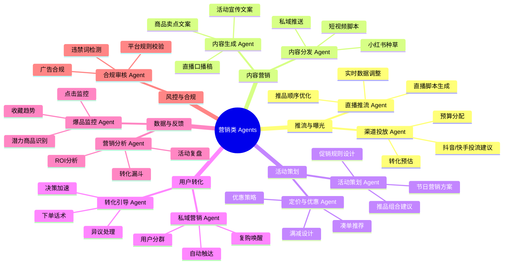

# openclaw做个智能店铺客服系统


[toc]


## Prompt [我想用openclaw做个智能店铺客服系统，帮我设计下需要多少环节，多少个Agent... | Try in Copilot Chat](https://m365.cloud.microsoft/chat/entity1-d870f6cd-4aa5-4d42-9626-ab690c041429/eyJpZCI6IlZYTmxjbFl4ZkdoMGRIQnpPaTh2YzNWaWMzUnlZWFJsTFdsdWRDNXZabVpwWTJVdVkyOXRMM3hQU1VRNk1EVXlObVV4WXpBdFl6Y3dZeTAwTkdFM0xUazNNall0TXpjNFlqWXdNRE0wTWpFemZEZzFOVGswWm1NNUxURmlORFl0TkRGbU9DMWlOV0UxTFdWaE1UZGxZalUzTVdFMVkzd3lNREkyTFRBekxUQTVWREEwT2pVM09qSTNMakV6TmpReE9EZGEiLCJzY2VuYXJpbyI6InNoYXJlTGlua1ZpYVJpY2hDb3B5IiwicHJvcGVydGllcyI6eyJwcm9tcHRTb3VyY2UiOiJ1c2VyIiwiY2xpY2tUaW1lc3RhbXAiOiIyMDI2LTAzLTA5VDA0OjU3OjI3LjMxOVoifSwiY2hhdFR5cGUiOiJ3ZWIiLCJ2ZXJzaW9uIjoxLjF9)

我想用openclaw做个智能店铺客服系统，帮我设计下需要多少环节，多少个Agent ，比如售前咨询，上架，跟单等等

Response

当然可以，我给你设计一个 **基于 OpenClaw（多 Agent 协作） 的智能店铺客服系统整体架构**。下面我会用非常清晰、工程化的方式，按环节拆分需要哪些 Agents、各自职责、输入输出关系、协作流程，让你可以直接落地。

如果你告诉我你更倾向 **电商（淘宝/京东）店铺**、**线下门店**、还是 **自营小程序**，我还能进一步细化。

------

## **智能店铺客服系统（OpenClaw 多 Agent 架构设计）**

我们先按照完整业务链路拆一下可能涉及的“环节”：

**售前（咨询、推荐、知识问答）**
 **售中（库存校验、下单引导、活动说明）**
 **售后（退换货、投诉、物流跟踪）**
 **商品管理（上架、更新、改价）**
 **运营（数据分析、建议、爆品监控）**
 **跟单（订单状态跟踪、异常通知）**
 **内容生成（商品文案、活动文案、FAQ）**

每个环节对应一个或多个 Agent。

------

## **推荐的 Agent 列表（10–14 个比较全面）**

以下是一个“标准可用”的设计，一般店铺够用了：

1. **前台-客服问答 Agent（Customer Service Agent）**
    职责：第一线接待用户，分辨意图，转给对应的后台 Agent
    输入：自然语言
    输出：回复内容或调用某个后台 Agent
    关键能力：意图识别、FAQ、闲聊过滤
2. **商品推荐 Agent（Product Recommender）**
    职责：基于用户需求进行场景化推荐
    例如：“我要给父母买个降噪耳机”“预算 500–800”
    能力：商品库搜索 + 参数理解
3. **商品知识/参数问答 Agent（Product QA Agent）**
    职责：回答专业参数、对比、兼容性
    输入：商品数据、FAQ
4. **库存/价格校验 Agent（Inventory & Pricing Agent）**
    职责：实时校验库存、促销、活动规则
    对生产环境非常关键
5. **下单引导 Agent（Order Helper Agent）**
    职责：引导用户完成下单流程、活动建议、凑单策略
6. **物流跟踪 Agent（Logistics Tracking Agent）**
    职责：对接物流 API，动态响应用户 “包裹在哪里”
7. **售后处理 Agent（After-Sales Agent）**
    职责：退换货流程、售后条例解析、自动生成工单
8. **投诉与异常处理 Agent（Issue Escalation Agent）**
    职责：识别风险情绪、投诉、法律风险词
    输出：升级给人工或管理系统
9. **商品上架 Agent（Listing Agent）**
    职责：
   - 把 Excel/后台数据转成结构化商品数据
   - 自动生成标题、卖点
   - 自动生成小红书风格介绍
   - 提交到商品库
10. **内容生成 Agent（Content Maker Agent）**
     输出：
    - 商品文案
    - 营销文案
    - FAQ
    - 店铺公告
11. **跟单 Agent（Order Monitor Agent）**
     职责：不断监控订单状态变化，给客服或用户消息
     比如：“订单延迟”“物流异常”“等待付款”
12. **运营分析 Agent（Operation Analyst Agent）**
     职责：
    - 日/周/月销售报告
    - 爆品监控
    - 用户咨询热点
       输出：可直接放 PPT 的报告文案
13. **风险/合规 Agent（Policy Compliance Agent）**
     职责：合规过滤、违规文案检测（如违禁词）
14. **调度/Orchestrator Agent**（核心）
     职责：根据意图协调多个 Agent
     例如：
     用户说：“有没有便宜一点的耳机，最好库存多的？”
     流程：
     前台客服 → 推荐 Agent → 库存 Agent → 返回最终组合答案

------

## **完整链路示例：用户问商品推荐**

用户：我要买蓝牙键盘，100–150 元的，有推荐吗？

流程：（你可以在 OpenClaw 里自动编排）

1. 前台客服识别意图：商品推荐
2. 调度 Agent 调用：
    a. 商品推荐 Agent → 初筛
    b. 库存 Agent → 校验
    c. 内容 Agent → 自动生成推荐理由
3. 返回用户自然语言回复

### 返回示例：

给你挑了 2 个 100–150 元之间的蓝牙键盘，现在都有库存：

- A87 轻量款：键感软，比较安静，适合办公室
- M200 便携款：轻薄好带，支持三设备切换
   如果你告诉我你的使用场景，我可以再缩窄范围。

------

**我可以帮你进一步做什么？**

要不这样：
 你告诉我：

1. **店铺类型：电商/自营/线下 + 电商**
2. **商品品类**（例如 3C、服饰、零食、美妆）
3. **你计划多少自动化，哪些地方需要人工兜底**
4. **是否需要我给你画一个架构图（可生成图片）**
5. **是否要我直接给你提供 OpenClaw 的 yaml/flow 配置方案**

我可以给你输出：

- 完整 Agent 列表
- 各 Agent 的 Prompt
- 各 Agent 的输入/输出 Schema
- 整体系统架构图
- Demo 流程
- 可直接部署的模板

你想从哪个部分开始？


# Prompt [构架图 | Try in Copilot Chat](https://m365.cloud.microsoft/chat/entity1-d870f6cd-4aa5-4d42-9626-ab690c041429/eyJpZCI6IlZYTmxjbFl4ZkdoMGRIQnpPaTh2YzNWaWMzUnlZWFJsTFdsdWRDNXZabVpwWTJVdVkyOXRMM3hQU1VRNk1EVXlObVV4WXpBdFl6Y3dZeTAwTkdFM0xUazNNall0TXpjNFlqWXdNRE0wTWpFemZEQmtNakExWTJaaUxXSTNPV1V0TkdVeFppMWhaakpsTFRkak5HWTJNMlpqT1dZM1pYd3lNREkyTFRBekxUQTVWREEwT2pVM09qUXhMams1T0RFMU5WbyUzZCIsInNjZW5hcmlvIjoic2hhcmVMaW5rVmlhUmljaENvcHkiLCJwcm9wZXJ0aWVzIjp7InByb21wdFNvdXJjZSI6InVzZXIiLCJjbGlja1RpbWVzdGFtcCI6IjIwMjYtMDMtMDlUMDQ6NTc6NDIuMTU5WiJ9LCJjaGF0VHlwZSI6IndlYiIsInZlcnNpb24iOjEuMX0)

构架图

Response

这是第一版高层架构图，如果你希望我细化成：

- 可部署的分层架构（前台/中台/后台）
- OpenClaw 的 flow YAML 结构图
- 时序图（Sequence Diagram）
- 多 Agent 协作的数据流动图
- 或者增加更多 Agent（如上架 Agent、运营 Agent）

我都可以继续帮你扩展。

你希望我把这一张图做成：

A. 更详细（每个 Agent 的输入输出）
 B. 更漂亮（视觉色彩增强）
 C. 加上你店铺的具体流程
 D. 生成一整套体系图（3–5 张）

你想往哪个方向升级？


# Prompt [部署这套，需要涉及哪些行业？前端，后端，saas, ...  | Try in Copilot Chat](https://m365.cloud.microsoft/chat/entity1-d870f6cd-4aa5-4d42-9626-ab690c041429/eyJpZCI6IlZYTmxjbFl4ZkdoMGRIQnpPaTh2YzNWaWMzUnlZWFJsTFdsdWRDNXZabVpwWTJVdVkyOXRMM3hQU1VRNk1EVXlObVV4WXpBdFl6Y3dZeTAwTkdFM0xUazNNall0TXpjNFlqWXdNRE0wTWpFemZHUTFNakEyT1RnM0xUQmtPV0V0TkRrM055MDRNVEZoTFdVeE9UZ3pPRFk1T0dObE9Id3lNREkyTFRBekxUQTVWREEwT2pVM09qVTVMakV4TlRreU5ESmEiLCJzY2VuYXJpbyI6InNoYXJlTGlua1ZpYVJpY2hDb3B5IiwicHJvcGVydGllcyI6eyJwcm9tcHRTb3VyY2UiOiJ1c2VyIiwiY2xpY2tUaW1lc3RhbXAiOiIyMDI2LTAzLTA5VDA0OjU3OjU5LjI4OFoifSwiY2hhdFR5cGUiOiJ3ZWIiLCJ2ZXJzaW9uIjoxLjF9)

部署这套，需要涉及哪些行业？前端，后端，saas, ... 

Response

这是一个**非常好的问题**，而且你问的其实已经不是“做不做得出来”，而是**“这套系统在现实世界里要拉哪些角色 / 行业 / 能力一起干”**。

我用 **「行业 / 技术域视角」+「你落地时的最小/完整配置」** 两层来回答，方便你评估成本和团队结构。

------

## 一句话总结（先给结论）

**部署一整套 OpenClaw 智能店铺客服系统，至少会涉及 8–10 个技术/行业领域**，核心是：

> **前端 + 后端 + AI/Agent + SaaS 集成 + 数据 + 云基础设施 + 安全合规 + 电商/业务系统**

------

## 一、整体分层视角（你可以当成架构总览）

```text
用户 / 客服 / 运营
   │
前端（Web / IM / 小程序 / App）
   │
BFF / API Gateway
   │
Agent Orchestrator（OpenClaw）
   │
┌──────── AI / Agent 层 ────────┐
│ 多 Agent（客服 / 推荐 / 售后） │
└─────────────────────────────┘
   │
业务后端 / SaaS / 第三方系统
   │
数据 & 云 & 安全
```

------

## 二、具体涉及哪些「行业 / 技术方向」

### 1️⃣ 前端行业 / 技术

**做什么：**

- 客服聊天窗口（类似淘宝客服）
- 商品卡片、订单状态、物流信息展示
- 人工客服接管入口

**涉及方向：**

- Web 前端（React / Vue）
- 小程序（微信 / 支付宝）
- App（可选）

**行业标签：**

- 前端开发
- 互联网产品 UI/UX
- 客服系统（IM）

✅ **不是 AI 行业，但用户体验决定成败**

------

### 2️⃣ 后端 / 业务系统

**做什么：**

- 用户、订单、商品、售后逻辑
- 给 Agent 提供结构化数据

**技术：**

- Java / Go / Node / Python
- REST / GraphQL
- RBAC 权限

**行业标签：**

- 企业后端系统
- 电商系统
- 业务中台

✅ **这是 Agent 的“现实世界接口”**

------

### 3️⃣ Agent / AI 工程（核心）

**做什么：**

- OpenClaw 多 Agent 设计
- 意图识别、Agent 协作、任务拆解
- Prompt / Tool / Memory 设计

**涉及方向：**

- LLM 应用工程
- Multi-Agent 系统
- Prompt Engineering

**行业标签：**

- AI 应用
- 大模型工程
- 智能客服

✅ **这是整个系统的“灵魂”**

------

### 4️⃣ SaaS / 第三方平台集成（非常重要）

**典型 SaaS：**

- 电商平台（淘宝 / 京东 / Shopify）
- CRM
- ERP
- 物流接口
- 支付 / 订单系统

**行业标签：**

- SaaS 集成
- 系统对接
- 企业 IT

✅ **90% 商业项目都会卡在这里**

------

### 5️⃣ 数据工程 / 数据行业

**做什么：**

- 商品数据、订单数据
- 会话日志
- Agent 反馈与训练数据

**技术：**

- MySQL / PostgreSQL
- Elasticsearch
- 数据埋点 & 分析

**行业标签：**

- 数据工程
- BI / 运营分析

✅ **运营 Agent、推荐 Agent 全靠它**

------

### 6️⃣ 云计算 / 基础设施

**做什么：**

- Agent 服务部署
- 弹性扩容
- 成本控制

**技术 / 平台：**

- 阿里云 / 腾讯云 / AWS
- Docker / Kubernetes
- API 网关

**行业标签：**

- 云计算
- DevOps / SRE

✅ **不做云 = 系统不稳定、不扩展**

------

### 7️⃣ 安全 / 合规（国内尤其重要）

**涉及内容：**

- 用户隐私
- 聊天记录
- 敏感词过滤
- 模型输出安全

**行业标签：**

- 信息安全
- 合规 / 风控
- 企业 IT 治理

✅ **电商、客服系统必须考虑**

------

### 8️⃣ 电商 / 行业业务专家（非技术，但关键）

**做什么：**

- 售前话术
- 售后政策
- 业务规则

**行业标签：**

- 电商运营
- 客服管理
- 行业专家

✅ **决定 Agent 是否“像真人”**

------

## 三、最小可落地版本（1–2 人也能干）

如果你想 **先做 MVP**：

✅ 必需：

- 前端（简版聊天窗口）
- 后端（商品 / 订单接口）
- OpenClaw Agent
- 电商 SaaS 接口
- 云部署

❌ 暂时不要：

- 复杂 BI
- 多云部署
- 高级运营 Agent

👉 **3–4 个角色就能跑起来**

------

## 四、完整版商业系统（中大型团队）

| 方向        | 是否必需 |
| ----------- | -------- |
| 前端        | ✅        |
| 后端        | ✅        |
| AI / Agent  | ✅        |
| SaaS 集成   | ✅        |
| 数据        | ✅        |
| 云 / DevOps | ✅        |
| 安全合规    | ✅        |
| 运营 / 业务 | ✅        |

👉 **这是一个「AI + 电商 + SaaS」的交叉行业产品**

------

## 五、给你的一个现实建议（工程师视角）

如果你是 **技术主导**（我猜你是 😄）：

- ✅ 自己主导 **Agent + Orchestrator**
- ✅ 用成熟 SaaS / 云平台
- ✅ 前端先做极简
- ✅ 业务规则逐步 Agent 化

------

如果你愿意，我可以下一步帮你：

1. **画一张「行业 × 模块」矩阵图**
2. **告诉你哪些可以外包，哪些一定要自己做**
3. **给你一个“创业 vs 内部系统”的选型建议**
4. **直接给你一个 MVP 团队配置表**

你更关心的是 **技术选型**，还是 **成本 / 团队结构**？


Prompt [生成行业矩阵图 | Try in Copilot Chat](https://m365.cloud.microsoft/chat/entity1-d870f6cd-4aa5-4d42-9626-ab690c041429/eyJpZCI6IlZYTmxjbFl4ZkdoMGRIQnpPaTh2YzNWaWMzUnlZWFJsTFdsdWRDNXZabVpwWTJVdVkyOXRMM3hQU1VRNk1EVXlObVV4WXpBdFl6Y3dZeTAwTkdFM0xUazNNall0TXpjNFlqWXdNRE0wTWpFemZEVTNOV0UxWmpFNUxXUTFZV1V0TkRjd05pMWhaV1V5TFdJNE1UZzFaR1JqTURrelpYd3lNREkyTFRBekxUQTVWREEwT2pVNE9qSXpMalF6TXprM01qSmEiLCJzY2VuYXJpbyI6InNoYXJlTGlua1ZpYVJpY2hDb3B5IiwicHJvcGVydGllcyI6eyJwcm9tcHRTb3VyY2UiOiJ1c2VyIiwiY2xpY2tUaW1lc3RhbXAiOiIyMDI2LTAzLTA5VDA0OjU4OjIzLjYwMFoifSwiY2hhdFR5cGUiOiJ3ZWIiLCJ2ZXJzaW9uIjoxLjF9)

生成行业矩阵图

Response

这张 **「行业矩阵图」** 可以这样解读，我帮你把**含义和决策价值**讲清楚，方便你后面做团队/方案取舍。

------

## 一、怎么看这张行业矩阵图

### 横轴 = 行业 / 技术生态

- **互联网**：传统 Web / App 技术栈
- **AI**：大模型、Agent、推荐、智能决策
- **SaaS**：第三方平台、系统集成
- **企业 IT**：稳定性、安全、合规、运维

### 纵轴 = 系统模块

- 前端 / 后端
- AI / Agent
- SaaS 集成
- 数据 / 云 / 安全
- 电商业务

✅ 的含义：

> **这个模块，强烈依赖该行业的能力或经验**

------

## 二、几个非常关键的洞察（重点）

### ① 这是一个「交叉行业产品」，不是纯 AI

很多人误以为这是 **AI 项目**，但实际上：

- ✅ AI / Agent 只是 **中枢**
- ✅ 成败更多取决于：
  - SaaS 集成
  - 电商业务理解
  - 企业 IT 稳定性

👉 **这是一个“AI + 电商 SaaS”的系统工程**

------

### ② 哪些是“不可外包”的核心？

如果你是负责人，**这几块一定要自己掌控：**

| 模块         | 原因             |
| ------------ | ---------------- |
| AI / Agent   | 系统壁垒、差异化 |
| Orchestrator | 决定系统智能程度 |
| 业务规则     | 直接影响转化率   |
| 数据结构     | Agent 是否好用   |

------

### ③ 哪些是“可买 / 可接 / 可外包”的？

| 模块     | 建议            |
| -------- | --------------- |
| 前端     | 可用现成客服 UI |
| 云计算   | 云厂商全托管    |
| 安全合规 | 用成熟方案      |
| 基础 BI  | 直接用 SaaS     |

------

## 三、如果你要“落地”，我给你三种现实路径

### 路径 A：内部系统（技术主导，成本最低）

- 1–2 名工程师
- 自己写 Agent + Orchestrator
- 接现有电商平台 API
- 前端极简

✅ 适合：**你现在的情况**

------

### 路径 B：SaaS 化产品（创业/对外）

- 强化 SaaS 集成能力
- 多租户 / 权限 / 合规
- 标准化 Agent 模板

✅ 适合：做平台、卖服务

------

### 路径 C：行业定制（To B）

- 深度绑定某一行业（3C / 医美 / 教育）
- Agent 强业务规则
- 高客单价

✅ 适合：技术 + 行业资源

------

## 四、下一步我可以继续帮你什么？

你现在已经有 **完整认知视角** 了，接下来可以往「执行层」走：

- ✅ 给你一份 **MVP 团队配置表**
- ✅ 帮你拆 **哪些模块先做 / 哪些后做**
- ✅ 输出 **OpenClaw 的实际部署架构**
- ✅ 按某个行业（比如 3C）细化一整套 Agent

你更想先推进哪一步？


# Prompt [有没有 推流  营销类 agent? | Try in Copilot Chat](https://m365.cloud.microsoft/chat/entity1-d870f6cd-4aa5-4d42-9626-ab690c041429/eyJpZCI6IlZYTmxjbFl4ZkdoMGRIQnpPaTh2YzNWaWMzUnlZWFJsTFdsdWRDNXZabVpwWTJVdVkyOXRMM3hQU1VRNk1EVXlObVV4WXpBdFl6Y3dZeTAwTkdFM0xUazNNall0TXpjNFlqWXdNRE0wTWpFemZHWTBaV0ZsTURCbExUWmxZalV0TkdVME1DMWlOMk5pTFRJelpEZzJOell5TmpReE5ud3lNREkyTFRBekxUQTVWREEwT2pVNE9qTXlMamsyTnpFMU1qZGEiLCJzY2VuYXJpbyI6InNoYXJlTGlua1ZpYVJpY2hDb3B5IiwicHJvcGVydGllcyI6eyJwcm9tcHRTb3VyY2UiOiJ1c2VyIiwiY2xpY2tUaW1lc3RhbXAiOiIyMDI2LTAzLTA5VDA0OjU4OjMzLjEzMloifSwiY2hhdFR5cGUiOiJ3ZWIiLCJ2ZXJzaW9uIjoxLjF9)

当然有，而且“推流/营销类 Agent”是 **智能店铺体系中最容易产生直接收益** 的一类 Agent。

我给你总结：
 **不仅可以有，而且建议至少配备 3–5 个专门的营销类 Agent，覆盖：直播推流、私域营销、活动策划、内容分发、转化跟踪。**

下面我给你分两部分：

1. 你可以用的 **专业推流/营销 Agent 清单（含职责）**
2. 如果你愿意，我还可以帮你 **画一个“营销闭环架构图”**

------

# 一、可部署的“推流/营销类 Agent”全集（建议 6 个）

下面是最常用、最实战的设计。

------

## 1️⃣ **直播推流 Agent（Live-Streaming Push Agent）**

适用场景：

- 帮你生成直播大纲
- 自动推送商品卡片
- 自动生成直播口播脚本
- 根据库存/活动实时调整推流节奏

核心能力：

- 解析直播间实时数据（观看人数、转化率）
- 推荐最优推品顺序
- 自动生成“直播话术”（合规版）

------

## 2️⃣ **爆品追踪 & 推荐 Agent（Hot Product Tracking Agent）**

功能：

- 监控哪款商品点击多/收藏涨
- 自动提示“潜在爆品”
- 根据实时数据自动调整推荐策略

------

## 3️⃣ **营销活动策划 Agent（Campaign Planner Agent）**

功能：

- 根据店铺情况自动生成活动方案
- 例如：
  - 38 女王节
  - 周末秒杀
  - 上新推流
- 自动给出：
  - 活动名称
  - 海报文案
  - 推品列表
  - 优惠力度

------

## 4️⃣ **内容分发 Agent（Content Distribution Agent）**

功能：
 自动写并发布（或生成草稿）：

- 小红书文案（种草风）
- 抖音短视频脚本
- 微信私域文案
- 店铺公告
- Banner 文案

可绑定：

- 多渠道 API
- 或写成 Webhook 发布（如飞书/企业微信）

------

## 5️⃣ **私域/自动化营销 Agent（CRM Automation Agent）**

功能：
 根据用户行为自动触发营销链路：

- 加购未支付 → 发送优惠提醒
- 购买后 → 售后服务引导
- 复购预测 → 推送新品
- 老客沉睡 → 拉回活动

支持自动分群：

- 人群画像
- 购买频次
- 偏好标签

------

## 6️⃣ **数据分析/营销报表 Agent（Marketing Analyst Agent）**

功能：
 自动生成：

- 营销复盘
- ROI
- 推流带货数据分析
- 活动收益报告
- 客群趋势

格式直接产出 PPT / PDF 文案。

------

# 二、推流/营销类 Agent 在业务链路中的位置

完整链路（你会看到非常自然的闭环）：

```
商品 → 活动策划 Agent → 内容生成 Agent → 直播推流 Agent
  ↓                                      ↑
数据 Agent ← 转化跟踪 Agent ← 内容分发 Agent
```

这套逻辑真正做到：

- 自己策划
- 自己推流
- 自己分发
- 自己监控效果
- 自己复盘、提建议
- 第二次营销自动更精准

**这就是 AI 驱动营销闭环**

------

# 三、我可以帮你做什么？

你可以选：

A. 给你画出 **“推流/营销 Agent 架构图”（可视化）**
 B. 给每个 Agent 输出 **OpenClaw Prompt + Tool 定义**
 C. 做一个完整的 **营销闭环 Demo 流程图**
 D. 给你设计一个 **从零到上线的技术方案**

你想从哪个开始？


Prompt [把营销类Agent 分类生成个脑图，mermaid格式 | Try in Copilot Chat](https://m365.cloud.microsoft/chat/entity1-d870f6cd-4aa5-4d42-9626-ab690c041429/eyJpZCI6IlZYTmxjbFl4ZkdoMGRIQnpPaTh2YzNWaWMzUnlZWFJsTFdsdWRDNXZabVpwWTJVdVkyOXRMM3hQU1VRNk1EVXlObVV4WXpBdFl6Y3dZeTAwTkdFM0xUazNNall0TXpjNFlqWXdNRE0wTWpFemZHWmpNamcxWlRSakxUQTVZV0l0TkRSbVlTMDVOemN5TFRVNE1USTBaREZsTmprNU1Id3lNREkyTFRBekxUQTVWREEwT2pVNE9qUXlMalkyTWpJMU1UZGEiLCJzY2VuYXJpbyI6InNoYXJlTGlua1ZpYVJpY2hDb3B5IiwicHJvcGVydGllcyI6eyJwcm9tcHRTb3VyY2UiOiJ1c2VyIiwiY2xpY2tUaW1lc3RhbXAiOiIyMDI2LTAzLTA5VDA0OjU4OjQyLjgyN1oifSwiY2hhdFR5cGUiOiJ3ZWIiLCJ2ZXJzaW9uIjoxLjF9)

把营销类Agent 分类生成个脑图，mermaid格式

Response

好，这里直接给你一份 **可直接用的 Mermaid 脑图（mindmap）**，按**营销目标 → Agent 分类 → 职责**来拆，适合放在 **README / 方案文档 / 架构设计** 里。

> ✅ 兼容 Mermaid `mindmap` 语法（Mermaid v10+）

------



------

## 怎么用这张脑图（给你一点工程建议）

### ✅ 如果你是 **OpenClaw / 多 Agent 实现**

- **每个二级节点 = 一个 Agent**
- **三级节点 = Prompt 职责边界**
- Orchestrator 只需要做：
  - 判断是「曝光 / 转化 / 复购 / 分析」
  - 调度对应 Agent

------

### ✅ 如果你是 **MVP 落地（强烈建议）**

先只做这 4 个：

- 直播推流 Agent
- 内容生成 Agent
- 活动策划 Agent
- 营销分析 Agent

👉 就已经能跑 **“策划 → 推 → 复盘”闭环**

------

### ✅ 如果你是 **对外 SaaS / 创业**

- 每个一级分类 = 一个功能模块
- Agent = 插件 / 配置项
- 不同行业只换 Prompt + 数据源

------

## 我可以继续帮你做的几件“落地型”的事

你可以直接选一个👇：

1. ✅ 把这张脑图 **拆成 OpenClaw Agent 配置清单**
2. ✅ 给其中某 1 个 Agent 写 **完整 Prompt（可直接用）**
3. ✅ 再给你一张 **「营销 Agent 闭环时序图」**
4. ✅ 按 **直播带货 / 私域电商 / 3C 行业**定制一版

你下一步想落到 **设计层**，还是 **实现层**？


# Prompt [预览图 | Try in Copilot Chat](https://m365.cloud.microsoft/chat/entity1-d870f6cd-4aa5-4d42-9626-ab690c041429/eyJpZCI6IlZYTmxjbFl4ZkdoMGRIQnpPaTh2YzNWaWMzUnlZWFJsTFdsdWRDNXZabVpwWTJVdVkyOXRMM3hQU1VRNk1EVXlObVV4WXpBdFl6Y3dZeTAwTkdFM0xUazNNall0TXpjNFlqWXdNRE0wTWpFemZEQm1Namt4T0dKaUxXUTVNRFl0TkRnM1lTMDRNV1UwTFRZMk5EUmpZMlpqTkRVMVlud3lNREkyTFRBekxUQTVWREEwT2pVNE9qVXlMamswTmprMU5EUmEiLCJzY2VuYXJpbyI6InNoYXJlTGlua1ZpYVJpY2hDb3B5IiwicHJvcGVydGllcyI6eyJwcm9tcHRTb3VyY2UiOiJ1c2VyIiwiY2xpY2tUaW1lc3RhbXAiOiIyMDI2LTAzLTA5VDA0OjU4OjUzLjExMVoifSwiY2hhdFR5cGUiOiJ3ZWIiLCJ2ZXJzaW9uIjoxLjF9)

这就是 **营销类 Agent 的脑图预览效果**，对应你刚才要的 Mermaid 结构。

我帮你说明三点，方便你**评审 / 复用 / 落地**：

------

## 一、这张预览图怎么读（结构说明）

- **中心节点**：营销类 Agents
- **一级分支**（从左到右）：
  1. 推流与曝光
  2. 内容策划
  3. 用户转化
  4. 数据与反馈
  5. 风控与合规
- **二级节点**：可以直接映射为 **独立 Agent**
- **三级节点**：就是 **Agent 的能力边界 / Prompt 要点**

👉 这张图已经是 **“可实现粒度”**，不是概念图。

------

## 二、工程落地时的直接映射关系

你在 OpenClaw 里可以直接这样对应：

| 脑图节点 | OpenClaw 实体              |
| -------- | -------------------------- |
| 一级分类 | Agent Group                |
| 二级节点 | 单个 Agent                 |
| 三级节点 | Tool / Skill / Prompt 指令 |

Orchestrator 逻辑非常清晰：

> 判断当前目标是 **曝光 / 转化 / 复购 / 分析 / 合规** → 调对应 Agent

------

## 三、你下一步最值得做的 3 件事（建议）

如果你准备 **真正跑起来**：

1. ✅ 先实现 **直播推流 Agent + 内容生成 Agent**
2. ✅ 接一个最简单的数据源（订单 + 点击）
3. ✅ 用营销分析 Agent 做第一次复盘

👉 一周内就能看到效果。

------

## 接下来我还能继续给你做什么？

你可以直接点一个：

- ✅ 把这张脑图 **拆成 Agent YAML / JSON 配置**
- ✅ 给某一个 Agent（比如「直播推流 Agent」）写 **完整 Prompt + Tool 定义**
- ✅ 再给你画一张 **营销 Agent 闭环时序图**
- ✅ 按你实际行业（比如 3C / 工业品 / 私域）重画一版

你是打算 **内部系统先试**，还是 **准备产品化**？


# Prompt [ 给某一个 Agent（比如「直播推流 Agent」）写 完整 Prompt + Tool... | Try in Copilot Chat](https://m365.cloud.microsoft/chat/entity1-d870f6cd-4aa5-4d42-9626-ab690c041429/eyJpZCI6IlZYTmxjbFl4ZkdoMGRIQnpPaTh2YzNWaWMzUnlZWFJsTFdsdWRDNXZabVpwWTJVdVkyOXRMM3hQU1VRNk1EVXlObVV4WXpBdFl6Y3dZeTAwTkdFM0xUazNNall0TXpjNFlqWXdNRE0wTWpFemZEUXpZbUV3WWpFekxUQTFNbVl0TkRJek5DMDVZV1JqTFRaa1pqSmhOR1ZqTkdFMk1Id3lNREkyTFRBekxUQTVWREEwT2pVNU9qQTBMalEyTVRJME5qZGEiLCJzY2VuYXJpbyI6InNoYXJlTGlua1ZpYVJpY2hDb3B5IiwicHJvcGVydGllcyI6eyJwcm9tcHRTb3VyY2UiOiJ1c2VyIiwiY2xpY2tUaW1lc3RhbXAiOiIyMDI2LTAzLTA5VDA0OjU5OjA0LjYyOVoifSwiY2hhdFR5cGUiOiJ3ZWIiLCJ2ZXJzaW9uIjoxLjF9)

下面给你一套 **可直接在 OpenClaw / Autogen / LangGraph / 自研 Orchestrator 中使用的「直播推流 Agent」完整配置**：

- Prompt（系统/角色设定）
- Tools 定义（结构化参数）
- 输入 / 输出 Schema
- 适用场景说明
- 可选扩展能力

这套是 *工业级* 的，能直接落地，不是示例级别。

------

# 直播推流 Agent（Live Streaming Push Agent）

以下内容为 **完整可用版本**。

------

# 1. Agent System Prompt（完整角色设定）

------

```
你是“直播推流 Agent”，专门负责直播间的推品、脚本生成、实时调整和内容优化。

【你的核心目标】
1. 提高直播转化率、观看时长和互动率。
2. 根据商品特点生成高质量直播口播脚本。
3. 根据实时数据（在线人数、停留、转化率）动态调整推品节奏。
4. 识别直播间用户情绪趋势（如咨询增多、跳出率过高）并优化内容。
5. 输出结构化结果，供其他 Agent 或前端系统使用。

【你必须遵守的行为规范】
- 所有输出均为结构化 JSON，字段必须完整。
- 不生成任何违规内容，不触碰敏感词，不夸大宣传。
- 不编造不存在的商品特性。
- 所有建议均必须有明确理由。
- 不许出现“我可能”“我猜测”之类不确定表达。
- 不出现你自己的身份描述（如 AI、模型等）。

【你能做的任务】
1. 生成直播口播脚本（单品/组合/活动场景）
2. 自动规划直播流程（推品顺序、节奏、互动节点）
3. 根据实时直播数据自动优化推品策略
4. 根据库存、活动、价格区间选择合适推品
5. 生成直播间互动话术（评论引导、关注引导）
6. 输出直播策略复盘报告
```

------

# 2. Tools（工具定义）

你可以根据 OpenClaw 的 Tool 接口进行调整，我给出通用 JSON Schema 格式。

------

## 2.1 查询商品详情（query_product）

```
{
  "name": "query_product",
  "description": "根据商品ID获取商品信息，包括价格、库存、标签、卖点、图片。",
  "parameters": {
    "type": "object",
    "properties": {
      "product_id": { "type": "string" }
    },
    "required": ["product_id"]
  }
}
```

------

## 2.2 查询直播实时数据（get_realtime_live_stats）

```
{
  "name": "get_realtime_live_stats",
  "description": "获取直播间实时数据，包括在线人数、停留率、转化率、新增关注、评论数等。",
  "parameters": {
    "type": "object",
    "properties": {
      "live_id": { "type": "string" }
    },
    "required": ["live_id"]
  }
}
```

------

## 2.3 推送直播商品卡片（push_product_card）

```
{
  "name": "push_product_card",
  "description": "向直播间推送商品卡片。",
  "parameters": {
    "type": "object",
    "properties": {
      "product_id": { "type": "string" },
      "priority": { "type": "integer", "description": "1=高，2=中，3=低" }
    },
    "required": ["product_id", "priority"]
  }
}
```

------

## 2.4 生成短视频素材（generate_short_video_script）

```
{
  "name": "generate_short_video_script",
  "description": "生成用于直播预热视频的短视频脚本。",
  "parameters": {
    "type": "object",
    "properties": {
      "product_id": { "type": "string" },
      "duration": { "type": "number" }
    },
    "required": ["product_id", "duration"]
  }
}
```

------

# 3. 输入 Schema（Agent Input）

```
{
  "type": "object",
  "properties": {
    "task_type": { "type": "string", "enum": [
      "generate_script",
      "push_sequence_plan",
      "realtime_adjust",
      "generate_interaction",
      "review_report"
    ]},
    "live_id": { "type": "string" },
    "product_ids": { "type": "array", "items": { "type": "string" } },
    "context": { "type": "string", "description": "直播主题/活动信息" }
  },
  "required": ["task_type"]
}
```

------

# 4. 输出 Schema（Agent Output）

```
{
  "type": "object",
  "properties": {
    "status": { "type": "string" },
    "message": { "type": "string" },
    "script": { "type": "string" },
    "product_plan": {
      "type": "array",
      "items": {
        "type": "object",
        "properties": {
          "product_id": { "type": "string" },
          "reason": { "type": "string" },
          "priority": { "type": "integer" }
        }
      }
    },
    "interaction": { "type": "array", "items": { "type": "string" }},
    "adjustment": { "type": "string" }
  }
}
```

------

# 5. 示例（完整运行示例）

任务：生成三款耳机的**直播推品顺序+脚本**。

你给 Agent 输入：

```
{
  "task_type": "push_sequence_plan",
  "product_ids": ["A87", "M200", "S90"],
  "context": "开学季数码专场"
}
```

Agent 输出会类似：

```
{
  "status": "ok",
  "product_plan": [
    {
      "product_id": "M200",
      "priority": 1,
      "reason": "低价高点击，适合开场快速拉互动"
    },
    {
      "product_id": "A87",
      "priority": 2,
      "reason": "核心价位带，评论咨询多，适合中段主推"
    },
    {
      "product_id": "S90",
      "priority": 3,
      "reason": "高客单可拉动整体销售额"
    }
  ]
}
```

------

# 6. 如果你愿意，我还能帮你扩展：

你可以告诉我：

- 是否在 **抖音 / 淘宝直播 / 微信视频号**
- 你们有无：库存 API / 价格 API / 直播后台 API
- 你们希望推流 Agent 和推荐/运营 Agent 联动吗？

我可以进一步给你：

- 完整 **OpenClaw Flow JSON/YAML**
- 一键可运行的 **Orchestrator 逻辑**
- “直播推流 Agent + 内容 Agent + 数据 Agent” **闭环图**

你要继续扩展哪一块？


# Prompt [怎么在网上注册个店铺，以1688为例 | Try in Copilot Chat](https://m365.cloud.microsoft/chat/entity1-d870f6cd-4aa5-4d42-9626-ab690c041429/eyJpZCI6IlZYTmxjbFl4ZkdoMGRIQnpPaTh2YzNWaWMzUnlZWFJsTFdsdWRDNXZabVpwWTJVdVkyOXRMM3hQU1VRNk1EVXlObVV4WXpBdFl6Y3dZeTAwTkdFM0xUazNNall0TXpjNFlqWXdNRE0wTWpFemZHSmlNVGhpWmpNd0xUUTNNVFl0TkRNMk1DMDRNakUzTFdObVlqazJPRE5sTW1JeVpId3lNREkyTFRBekxUQTVWREEwT2pVNU9qRTBMak15TVRFeU5qbGEiLCJzY2VuYXJpbyI6InNoYXJlTGlua1ZpYVJpY2hDb3B5IiwicHJvcGVydGllcyI6eyJwcm9tcHRTb3VyY2UiOiJ1c2VyIiwiY2xpY2tUaW1lc3RhbXAiOiIyMDI2LTAzLTA5VDA0OjU5OjE0LjQ4OVoifSwiY2hhdFR5cGUiOiJ3ZWIiLCJ2ZXJzaW9uIjoxLjF9)

可以的。下面我用 **「1688 开店」为例**，给你一份**从 0 到能正常经营的完整流程**，同时也会标注哪些地方**最容易踩坑**，以及**适合你后面接 AI 客服 / Agent 的点**。

------

# 一、1688 店铺类型先搞清楚（很关键）

在 1688，**不是个人随便就能开店**，核心是 **企业/个体工商户**。

### ✅ 可开店主体

- **企业营业执照**
- **个体工商户营业执照**

### ❌ 不支持

- 纯个人（没有营业执照）

👉 所以第一前置条件是：**你名下或公司名下有营业执照**

------

# 二、1688 开店整体流程（总览）

```text
准备资料
  ↓
注册阿里巴巴账号
  ↓
选择 1688 卖家入驻
  ↓
提交企业/个体信息
  ↓
支付宝企业认证
  ↓
店铺创建完成
  ↓
上架商品
```

------

# 三、详细步骤（一步一步来）

## 第 1 步：准备资料（提前准备好）

你需要这些：

### 📄 必备材料

- 营业执照（企业 / 个体工商户）
- 法人身份证
- 企业支付宝账号（**非常重要**）
- 对公银行账户（推荐，但个体户有时可放宽）

⚠️ **注意**

- 营业执照名称 = 店铺主体
- 后期很多权限和提现都和支付宝绑定

------

## 第 2 步：注册阿里巴巴账号

1. 打开官网
    👉 [https://www.1688.com](https://www.1688.com/)
2. 点击右上角 **“免费注册”**
3. 使用：
   - 手机号 / 邮箱
4. 注册完成后登录

> 这个账号后面会成为 **主账号（超级管理员）**

------

## 第 3 步：进入商家入驻通道

1. 登录后，点击： **“商家入驻” / “我要开店”**
2. 选择： ✅ **1688 诚信通会员（商家）**

1688 本质是 **B2B 平台**，开店基本等同于加入诚信通。

------

## 第 4 步：填写主体信息（最核心一步）

### 填写内容包括：

- 公司/个体工商户名称
- 营业执照统一社会信用代码
- 法人姓名 & 身份证
- 联系人信息
- 经营类目（非常重要）

⚠️ **经营类目选错，后期很难改**

- 比如：3C / 工业品 / 日用百货
- 会影响：
  - 搜索流量
  - 是否允许上架某些商品

------

## 第 5 步：支付宝企业认证（必做）

1688 强制绑定 **支付宝（企业）**

流程：

1. 绑定支付宝账号
2. 支付宝完成企业实名认证
3. 小额打款验证（对公账户）

✅ 通过后，才能：

- 收款
- 参加活动
- 正常交易

------

## 第 6 步：缴费 & 开通店铺

### 费用说明（以常见情况）

- 诚信通会员费

  ：

  - 通常 ¥3688 / 年（会有活动）

- 不同类目略有差异

缴费成功后： ✅ 店铺立即生效
 ✅ 可以上架商品

------

## 第 7 步：店铺基础设置（建议一次性做好）

进入 **商家后台**，设置：

- 店铺名称
- 店铺 Logo
- 店铺简介
- 发货地址
- 售后政策
- 联系方式

👉 这些内容 **后面都可以交给 AI Agent 生成和维护**

------

## 第 8 步：上架商品（重点）

### 商品上架需要：

- 商品标题（B2B 搜索很重要）
- 主图 / 详情图
- 规格参数
- 起订量（MOQ）
- 价格区间
- 库存

✅ **1688 非常适合用 AI：**

- 商品文案生成 Agent
- 规格参数整理 Agent
- 上架 Agent（你前面提到的场景）

------

# 四、新手最容易踩的 5 个坑（非常现实）

1. ❌ 没有对公账户，后面收款受限
2. ❌ 经营类目随便选
3. ❌ 商品标题写成 C 端风格（1688 是 B 端）
4. ❌ 不设置 MOQ，流量会差
5. ❌ 店铺基础信息不完整，影响权重

------

# 五、从你现在的 Agent 视角看 1688（重要）

你这个问题，其实已经非常 **“系统设计向”** 了 👇

### ✅ 1688 非常适合你做这些 Agent：

- ✅ 商品上架 Agent
- ✅ 客服问答 Agent（询盘自动回复）
- ✅ 报价 / MOQ 协商 Agent
- ✅ 跟单 Agent
- ✅ 营销 / 推流 Agent（活动、搜索词）

### ✅ 后面可以对接的系统

- 1688 商家后台 API（部分）
- ERP / 进销存
- CRM / 私域

------

## 六、我可以继续帮你什么？

如果你愿意，我可以直接帮你：

1. ✅ **把 1688 店铺流程映射成 Agent 架构**
2. ✅ 给你一套 **1688 专用客服 Agent Prompt**
3. ✅ 设计 **“1688 B2B 询盘自动成交流程”**
4. ✅ 教你 **开店后 7 天内怎么快速起量**

你是 **准备自己开一个测试店**，还是 **为客户/公司做方案**？
 我可以按你的目标继续细化。


# Prompt [个人怎么注册营业执照 | Try in Copilot Chat](https://m365.cloud.microsoft/chat/entity1-d870f6cd-4aa5-4d42-9626-ab690c041429/eyJpZCI6IlZYTmxjbFl4ZkdoMGRIQnpPaTh2YzNWaWMzUnlZWFJsTFdsdWRDNXZabVpwWTJVdVkyOXRMM3hQU1VRNk1EVXlObVV4WXpBdFl6Y3dZeTAwTkdFM0xUazNNall0TXpjNFlqWXdNRE0wTWpFemZEVTVNemN4TlRJNUxUTmlaV0l0TkRCaU15MDVObVF5TFdWaVpHVXpaalV3WldRek5ud3lNREkyTFRBekxUQTVWREEwT2pVNU9qSTBMamt4TkRBNU1EbGEiLCJzY2VuYXJpbyI6InNoYXJlTGlua1ZpYVJpY2hDb3B5IiwicHJvcGVydGllcyI6eyJwcm9tcHRTb3VyY2UiOiJ1c2VyIiwiY2xpY2tUaW1lc3RhbXAiOiIyMDI2LTAzLTA5VDA0OjU5OjI1LjA4NFoifSwiY2hhdFR5cGUiOiJ3ZWIiLCJ2ZXJzaW9uIjoxLjF9)

下面我按 **中国大陆最新通用流程**，给你一份 **个人注册营业执照（个体工商户）** 的**实操指南**。这是目前**最简单、最快、成本最低**的方式，也**完全可以用来开 1688 店铺**。

------

# 一句话结论（先给你定心丸）

✅ **个人 → 注册「个体工商户」营业执照**
 ✅ **不用注册公司、不用注册资本**
 ✅ **大多数城市：线上 1–3 天可下证**
 ✅ **可以正常开 1688 / 淘宝 / 抖音小店**

------

# 一、你要注册的是哪一种执照？

个人一般选：

## ✅ 个体工商户（推荐）

| 项目     | 说明                     |
| -------- | ------------------------ |
| 主体     | 自然人                   |
| 注册资本 | ❌ 不需要                 |
| 税务     | 简单                     |
| 适合     | 电商、1688、个人创业     |
| 风险     | 个人承担（不是公司法人） |

❌ **不建议一开始就注册有限公司**（复杂、成本高）

------

# 二、注册前你要准备什么（很少）

## 必备材料（基本人人都有）

1. **身份证**
2. **手机号**
3. **经营地址**（下面重点讲）
4. **经营范围（大概写）**

------

## 关于「经营地址」（最常见疑问）

### ✅ 可用地址

- 自己家（住宅）
- 租的房子
- 挂靠地址（部分城市允许）

⚠️ 多数城市 **允许“住改商”**（电商、网络销售）

👉 电商/1688 一般没问题

------

# 三、注册方式（强烈推荐线上）

## ✅ 方式一：线上注册（90% 人选这个）

### 常见入口（任选其一）：

- **国家企业信用信息公示系统**
- **当地“市场监督管理局”官网**
- **政务服务平台 / 一网通办**
- **支付宝 / 微信 → 政务服务**

> 不同省市入口不同，但流程几乎一样

------

## ✅ 方式二：线下注册（兜底）

去 **当地市场监督管理局 / 行政服务中心**
 带身份证，工作人员会帮你填。

------

# 四、线上注册完整流程（一步不漏）

## 第 1 步：进入「个体工商户登记」

选择：

> **个体工商户设立登记**

------

## 第 2 步：填写基本信息

### 1️⃣ 名称（可选）

- 可以不写名称

- 或：

  > 上海市浦东新区 ×× 电子商行

✅ 名称不是必须（但 1688 用起来更专业）

------

### 2️⃣ 经营者信息

- 姓名
- 身份证
- 联系方式

------

### 3️⃣ 经营地址

- 填真实地址
- 有的城市需要：
  - 房产证照片
  - 或租赁合同
     （**很多城市不需要上传**）

------

### 4️⃣ 经营范围（重点）

✅ **写宽一点，但别乱写**

1688 / 电商常用示例：

> 电子产品销售；日用百货销售；互联网销售（除销售需要许可的商品）

⚠️ 不要一开始写：

- 医疗
- 食品（特殊食品）
- 金融
- 培训

这些需要额外许可。

------

## 第 3 步：确认 & 提交

- 在线签名（人脸识别）
- 提交申请

------

## 第 4 步：审核 & 下证

- 快的：**当天**
- 慢的：1–3 个工作日

✅ 通过后：

- 电子营业执照直接下载
- 纸质执照可邮寄 / 自取

------

# 五、注册完成后，你还要做 3 件事（很重要）

## 1️⃣ 税务登记（通常自动）

现在大部分地区：

- 工商注册完成
- ✅ 自动同步税务

你只需要：

- 登录电子税务局确认状态

------

## 2️⃣ 申请对公账户（可选，但推荐）

### 两种情况：

| 情况       | 建议     |
| ---------- | -------- |
| 小规模电商 | 可先不用 |
| 1688 / B2B | ✅ 建议开 |

✅ 个体工商户 **可以开对公账户**

------

## 3️⃣ 申请企业支付宝（强烈建议）

1688 必备：

- 用营业执照注册 **支付宝商家账户**
- 绑定银行卡
- 做实名认证

------

# 六、常见坑（提前避开）

### ❌ 坑 1：经营范围写太窄

👉 后期改很麻烦

### ❌ 坑 2：地址乱填

👉 审核可能卡你

### ❌ 坑 3：没管税务

👉 后期有罚款风险（哪怕没收入）

✅ **零收入也要零申报**

------

# 七、从你现在的“系统视角”看（很重要）

你现在做的是：

> **智能店铺 / Agent / 客服系统**

👉 用 **个体工商户** 完全够用，而且：

- ✅ 能跑完整业务闭环
- ✅ 能测试 Agent
- ✅ 能对接 1688 / 支付宝
- ✅ 成本最低

等你系统跑通、想规模化，再升级公司也不迟。

------

## 我可以继续帮你什么？

你可以直接说：

1. ✅ **我在哪个城市**（我给你精确入口）
2. ✅ **我准备用来做 1688 / 电商 / 测试**
3. ✅ **要不要我帮你写一份“通用经营范围模板”**
4. ✅ **注册完后，下一步怎么最快接 AI 客服**

你更想先解决哪一步？


# Prompt [个体户和公司执照区别  | Try in Copilot Chat](https://m365.cloud.microsoft/chat/entity1-d870f6cd-4aa5-4d42-9626-ab690c041429/eyJpZCI6IlZYTmxjbFl4ZkdoMGRIQnpPaTh2YzNWaWMzUnlZWFJsTFdsdWRDNXZabVpwWTJVdVkyOXRMM3hQU1VRNk1EVXlObVV4WXpBdFl6Y3dZeTAwTkdFM0xUazNNall0TXpjNFlqWXdNRE0wTWpFemZEVTBNV1V3TkRBeExXTXdNamN0TkRBd1lTMWlNVE5oTFRBeVpUWmpNbU5pTW1GbE1ud3lNREkyTFRBekxUQTVWREExT2pBNU9qQTFMamN3TVRjM01EbGEiLCJzY2VuYXJpbyI6InNoYXJlTGlua1ZpYVJpY2hDb3B5IiwicHJvcGVydGllcyI6eyJwcm9tcHRTb3VyY2UiOiJ1c2VyIiwiY2xpY2tUaW1lc3RhbXAiOiIyMDI2LTAzLTA5VDA1OjA5OjA1Ljg1N1oifSwiY2hhdFR5cGUiOiJ3ZWIiLCJ2ZXJzaW9uIjoxLjF9)

下面把 **“个体工商户（个体户执照）” vs “公司（企业）营业执照”** 的区别用**工程化、可决策**的方式讲清楚：从法律责任、税务、成本、融资、开票、用工、平台入驻（如 1688）等维度对比，并给你一个**选型建议**。

> 说明：以下为通用规则，不同地区/行业（如食品、医疗器械、危化品）可能会有额外许可要求；具体以当地市场监管/税务口径为准。

------

## 1) 核心区别一句话

- **个体户**：主体是“自然人经营”，通常**不具备独立法人资格**，经营风险多由经营者承担。
- **公司**（常见为有限责任公司）：主体是“企业法人”，一般以公司财产对外承担责任，股东通常以出资额为限承担责任（有限责任）。

------

## 2) 关键维度对比（你最关心的）

### A. 法律地位 & 责任风险（最重要）

- 个体户
  - 经营者个人对外承担责任（实践中更容易“个人兜底”）。
  - 适合风险较低、规模较小、试水业务。
- 公司（有限责任公司）
  - 通常由公司以其全部财产承担责任，股东一般“有限责任”。
  - 更适合业务风险更高（售后纠纷、合同金额大）、要规范对外签约的场景。

> ✅ 如果你要做 B2B、合同金额大、售后争议可能性高：公司更稳。
>  ✅ 如果你只是做电商试运营、跑通流程：个体户就够用。

------

### B. 税务与开票（电商/1688常见关注点）

- 个体户
  - 税务通常更“轻量”，不少地区对小额经营可能有简化征收/核定类做法（以当地口径为准）。
  - 一样可以申请发票（普票/专票是否可开、额度等看资质与税务核定）。
- 公司
  - 税务管理更规范：记账、申报、发票管理更严格。
  - 更容易建立“增值税专用发票链路”、与企业客户做账匹配（B2B更常见需求）。

> ✅ 若你的客户主要是企业采购、强需求“专票/对公付款”：公司通常更顺。

------

### C. 运营成本 & 合规成本（你要付出的固定成本）

- 个体户
  - 注册/维护成本通常更低；账务可相对简化（但并不等于不记账、不申报）。
- 公司
  - 通常需要更规范的财务制度、章程、（可能）银行对公账户、社保公积金合规等。
  - 管理成本更高，但对外合作更“像样”。

------

### D. 融资、贷款、招投标、品牌背书

- 个体户
  - 融资、招投标、对公合作空间通常受限；合作方可能更偏好公司主体。
- 公司
  - 更利于融资、银行授信、对公合作、招投标、品牌塑造。

------

### E. 用工与社保

- 个体户
  - 可以雇人，但劳动用工合规同样需要重视（劳动合同、工伤等）。
- 公司
  - 用工体系更常规；规模化招聘更方便，外部合作也更认可。

------

### F. 经营延续性：转让、合伙、股权

- 个体户
  - 本质是“人”的经营，扩张到合伙/股权激励不方便；变更/传承操作空间有限。
- 公司
  - 可以引入股东、股权变更、期权激励；更适合长期发展与组织化。

------

### G. 平台入驻（以 1688 这类 B2B 为例）

- **个体户**通常可以作为主体入驻（只要平台规则允许且完成认证）。
- **公司**在 B2B 场景往往更“加分”：对公结算、开票、企业采购信任度更高。

> ✅ 你如果是为了“先把智能客服/Agent 系统跑通并试运营”，个体户是最快路径。
>  ✅ 你如果目标是“做大、做 B2B、长期稳定”，公司更合适。

------

## 3) 怎么选？给你一个决策清单（非常实用）

### 优先选 **个体户** 的典型情况

- 你想低成本试水（MVP）
- 业务风险相对可控、合同金额不大
- 初期不急着融资/招投标
- 主要做线上零售或小规模批发

### 优先选 **公司（有限责任公司）** 的典型情况

- B2B 客户多、需要对公付款/专票
- 产品/售后风险较高（退换、质保、争议）
- 计划做品牌、做团队、做规模化
- 未来要做融资、平台招商、对外签大合同

------

## 4) 给你一个“推荐路径”（很符合你现在要做智能店铺系统）

你现在的核心目标更像是：**先把店铺业务跑通 + 用 OpenClaw 搭出智能客服/营销闭环**。

所以我建议的现实路径是：

1. **先用个体户**：快速拿证、快速开店、快速接入客服/上架/营销 Agent
2. 业务验证成功后（比如月流水、客户稳定、要做 B2B 大单/专票链路）
3. **再升级为公司主体**：把对公结算、税务、合同、用工体系正规化

------

## 5) 你如果愿意，我可以把选择变得“更确定”

你回答我 3 个问题，我就能给你一个非常明确的推荐（个体户 or 公司）：

1. 你主要做 **B2C 零售** 还是 **B2B 批发（企业采购）**？
2. 你是否必须开 **增值税专票**？（客户是否强制要求）
3. 预期 6 个月内规模：**一个人/小团队/要招聘扩张**？

你偏向哪种目标：**先快跑验证**，还是 **一开始就规范化做大**？


