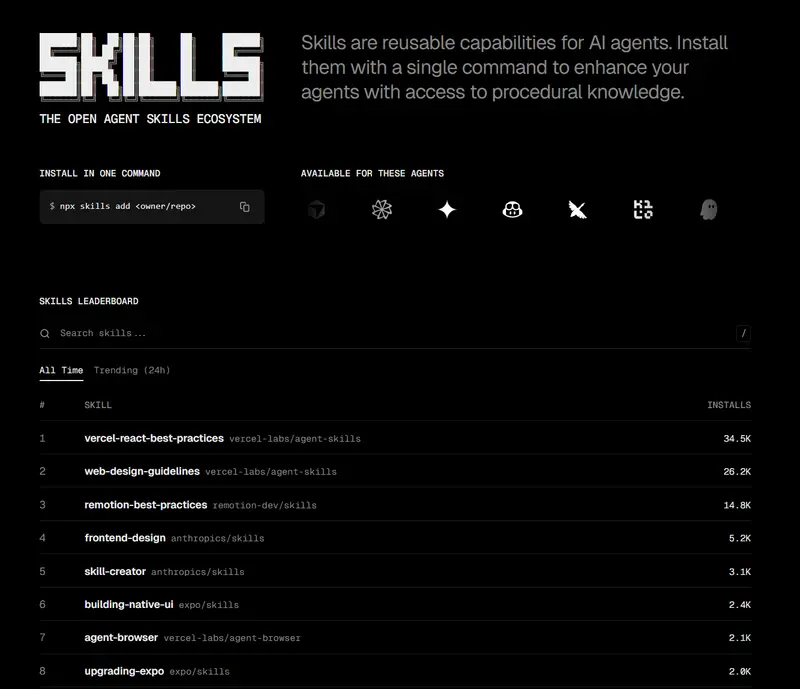
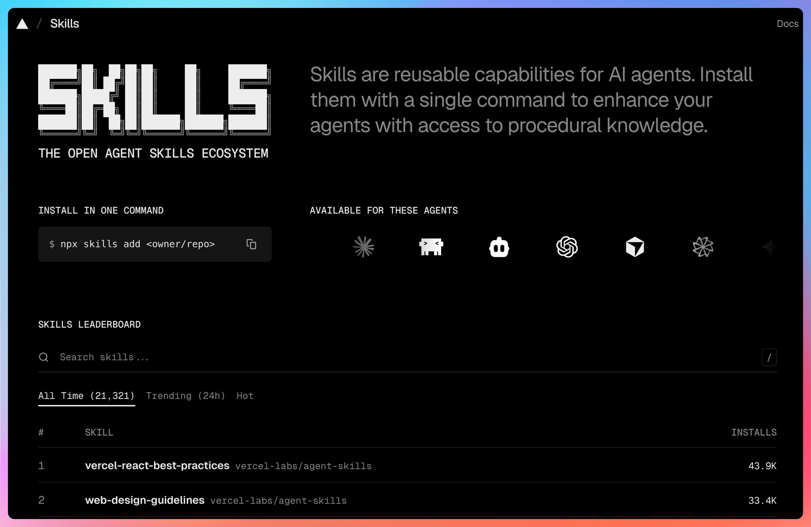
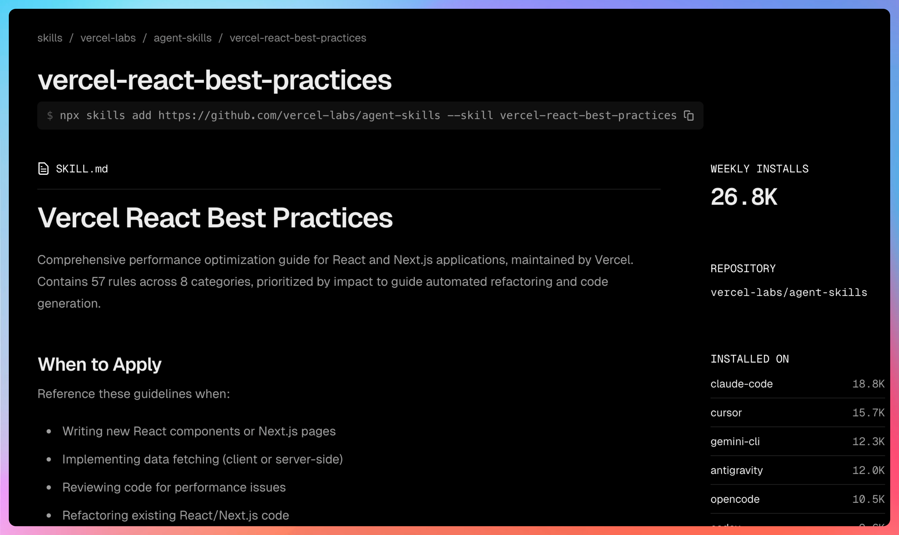
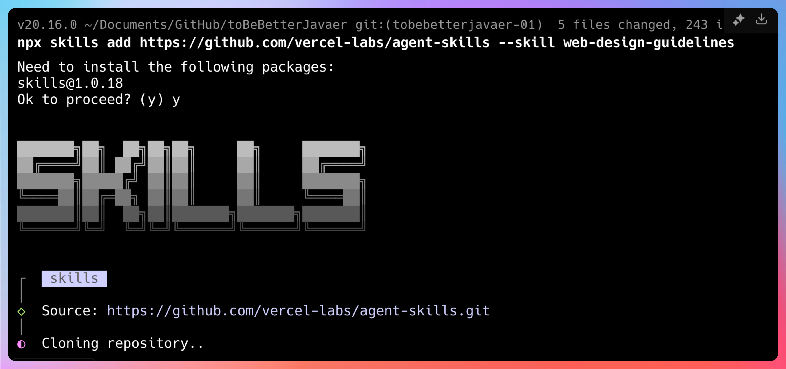
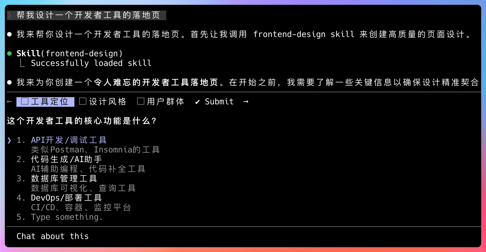
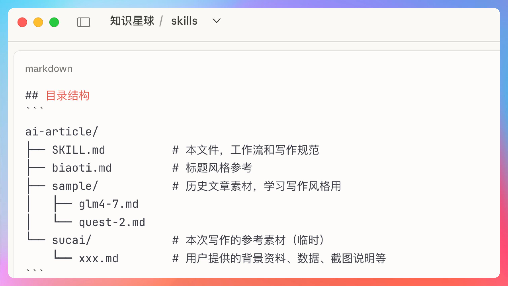

# Agent skill指南


## 一、 一句话讲透：什么是 Skill，以及你为什么需要它？

**Skill 是 AI Agent  的“外挂”工具箱，让它能完成单靠模型本身无法做到的事。**
它将“提示词（Prompt）”与“可执行代码（Code）”封装成一个标准化的安装包。
Skill 最大的价值在于**知识的资产化**：
它能将垂直领域的专家经验固化为可复用的代码技能，
不仅实现了**知识复利**，
更能让 Agent 能够像行业专家一样，精准解决复杂的实际问题，且越用越强。


## 二、 skill下载安装：skill.sh —— 全球最大、最知名的skill仓库

在介绍具体的神级skill之前，必须先谈谈 **skill.sh**。
它是由 Vercel（Next.js 及其生态的缔造者）官方推出的 Skill 仓库，存放了超过45000个skill，还能根据skill的下载量和最新热度排名。
它解决了**“重复造轮子”**的问题。
你不需要在本地仓库里存几百个 Prompt或者skill，
你只需要 像安装软件一样 
就能把全球开发者的智慧装进你的 Agent 里。
[Vercel](https://sd114.wiki/sitetag/vercel) 近日上线了一个名为 **[skills.sh](https://sd114.wiki/sitetag/skills-sh)** 的新站点，专门用于**发现、浏览和安装 AI 智能体的“技能”**（[Skills](https://sd114.wiki/sitetag/skills)）。
你可以把它理解为 **AI 智能体的“插件市场”**——每个 Skill 是一段可复用的程序性能力，比如“调用 GitHub API”、“生成图表”或“解析 PDF”，让智能体在特定任务上更高效、更专业。
[](https://pic.sd114.wiki/wp-content/uploads/2026/01/1769169941-1769169941-skills.sh_.webp)

### 为什么值得关注？

#### 直观的发现体验

- 首页按 **24 小时安装热度** 排名，快速识别热门技能
- 支持关键词搜索，精准定位所需能力
- 每个 Skill 有独立详情页，包含：
    - 功能介绍
    - 一行安装命令
    - 实时安装统计（总量 + 分布到哪些应用）

> 设计极简，无广告、无干扰，信息一目了然。

#### 极简安装流程

只需一行命令即可为你的 AI 智能体添加新能力：

```bash
npx skills add vercel-labs/agent-skills
```

安装后，智能体即可在对话中自动调用该技能。

### 什么是 Skills？

Skills 不是模型，而是**赋予模型执行特定任务的能力模块**。
例如：

- 一个 “send-email” Skill 让 AI 能发送邮件
- 一个 “query-database” Skill 让 AI 能安全查询内部数据

它们通过标准化接口与智能体集成，实现“能力即服务”。

### 隐私与数据透明

排行榜数据来自 **Skills CLI 的匿名遥测**：

- 仅统计“哪个 Skill 被安装了”
- **不收集用户身份、IP、对话内容或使用细节**
- 数据完全聚合，无法追溯到个体

Vercel 强调：此举仅为帮助社区发现高质量技能，而非监控用户行为。

### 适合谁使用？

- **AI 应用开发者**：快速为智能体扩展功能

- **开源贡献者**：发布自己的 Skill，供他人复用

- **技术探索者**：了解当前 AI 智能体生态中的主流能力

    

## 三、 必须要安装的skill推荐

### 元 Skill（Meta Skills）

**`1、skill-creator` ：anthropic官方出品，创建skill的skill，当你想把自己的知识、技能、特有的工作流程写成一个自己的skill，你就可以用这个skill。
使用方法也很简单：比如，我想创建一个某某skill，它的工作流程是1、2、3，你只需要跟他描述大概的想法，它就会自动帮你把零散的知识写出一个符合agent标准的skill。

**2、`find-skills` ：Vercel官方出品，寻找skill的skill

**痛点**：skill.sh 上有上万个技能，你不知道哪个好用，还得去浏览器一个个去找，然后下载，非常麻烦

**价值**：有了find-skills，它就能根据你的需求描述，精准匹配并自动安装最合适的 Skill。

**使用方法：**  -你可以说：   ”帮我找一个写ppt的skill“    ”帮我找一个爬取视频的skill“  然后它就会自动在skill.sh里找到最符合你要求的skill，并提供选择让你去安装


## 四、可选skill

### 垂直领域 Skill：聚焦垂直领域

下面我列出了全球下载量最高的前十个skill，
涵盖**前端工程化、设计美学、浏览器自动化和垂直领域开发**。
大家可以根据自己的业务需求去下载

### **1.** `vercel-react-best-practices`

- **来源**：Vercel 官方（当前榜单 Top 2，仅次于 find-skills）
- **痛点**：React 代码能跑，但性能极差。新手容易写出导致“瀑布流请求（Waterfalls）”的慢代码，或者由 `useEffect` 引发的无限渲染，后期重构成本极高。
- **价值**：它不是简单的代码补全，而是内置了 Vercel 团队总结的 **45+ 条性能黄金法则**。它能像资深架构师一样，强制 Agent 遵循服务端组件（RSC）、数据预加载、Web Vitals 优化等最佳实践，直接生成“生产级”代码。
- **使用方法**：“帮我 Review 一下这个组件，看看有没有性能瓶颈。” “用 Next.js 最佳实践重构这段数据获取逻辑，消除瀑布流请求。”


### **2.** `web-design-guidelines`

- **来源**：Vercel 官方

- **痛点**：程序员开发的 UI 往往“由于缺乏设计感而显得廉价”。间距不统一、阴影生硬、忽略深色模式适配，导致产品看起来像半成品。

- **价值**：将**光学对齐、视觉层级、交互反馈**等设计系统原则硬编码进 Agent。它能让 Agent 像 UI 设计师一样思考，自动处理 `hover` 态对比度、阴影分层（Layered Shadows）和安全区域适配。

- **使用方法**：“优化一下这个登录页的 CSS，让它看起来更精致、更符合现代审美。” “检查当前页面的可访问性（Accessibility）和移动端适配问题。”

    

### **3.** `remotion-best-practices`

- **来源**：Remotion 官方

- **痛点**：用代码写视频（Programmatic Video）非常抽象，很难凭空想象帧率换算、弹簧动画（Spring）参数和音频同步逻辑，AI 经常写出画面卡顿或时序混乱的代码。

- **价值**：注入了 Remotion 的核心领域知识。Agent 瞬间学会如何使用 `AbsoluteFill` 布局、如何计算动态时长、如何调用 `interpolate` 做流畅动画，是做视频自动化的必备神器。

- **使用方法**：“生成一个 10 秒的倒计时视频组件，数字要有弹跳效果，背景随时间变暗。”  “帮我写一个自动把 GitHub 提交记录转成视频战报的脚本。”

    

### **4.** `frontend-design`

- **来源**：Anthropic 官方

- **痛点**：AI 生成的网页往往有一股浓浓的“AI 味”（Generic/Slop），甚至直接套用老旧的 Bootstrap 风格，缺乏品牌个性和视觉冲击力。

- **价值**：该 Skill 的核心目标是**“拒绝平庸”**。它指导 Agent 使用独特的字体排版、大胆的配色、非对称布局和复杂的微交互（Micro-interactions），生成具有**Awwwards 获奖级别**审美的前端代码。

- **使用方法**：“设计一个充满未来感的落地页，要用大胆的排版和流体渐变背景。” “把这个按钮改成那种‘高级感’的磁吸效果，不要普通的 CSS 阴影。”

    

### **5.** `vercel-composition-patterns`

- **来源**：Vercel 官方
- **痛点**：项目一大，组件就变成了“屎山”。Props 层层传递（Prop Drilling）、组件逻辑耦合严重，想改一个按钮牵动全身。
- **价值**：专注于**组件架构设计**。教 Agent 如何使用“复合组件（Compound Components）”模式、状态提升（Lifting State Up）和 Render Props 等高级模式，让代码像乐高一样解耦且易于维护。
- **使用方法**：“这个表单组件逻辑太乱了，用复合组件模式重构一下，把 Header 和 Body 拆开。” “设计一个灵活的弹窗组件 API，允许外部自定义渲染内容。”


### **6.** `agent-browser`

- **来源**：Vercel 官方
- **痛点**：Agent “看不见”网页。你让它改网页，它只能瞎猜；你让它测试，它无法模拟真实用户的点击和滚动行为。
- **价值**：给 Agent 装上了**“眼睛”和“手”**。通过标准化的 CLI 指令，Agent 可以打开真实浏览器、截图（Snapshot）、提取页面元素坐标并进行点击。这是实现端到端测试（E2E Testing）的基础。
- **使用方法**：“打开 `localhost:3000`，截图给我看看现在的布局对不对。” “模拟用户点击‘购买’按钮，看看会不会报错。”


### **7.** `browser-use`

- **来源**：Browser-use 社区（目前非常火爆）
- **痛点**：需要处理复杂的网页任务，比如“登录后保持 Session”、“抓取动态加载的数据”或者“多标签页切换”，简单的 HTTP 请求搞不定。
- **价值**：一个强大的**浏览器自动化 OS**。它支持 Cookie 持久化、多标签管理、智能元素定位。它让 Agent 能像真人一样去“操作”互联网，而不仅仅是“浏览”。
- **使用方法**：

- “登录我的亚马逊后台（我会给你 Cookie），把最近的订单数据抓下来存成 CSV。”
- “每天早上自动打开 DataDog 仪表盘，截图发给我。”


### **8.** `vercel-react-native-skills`

- **来源**：Vercel 官方
- **痛点**：React Native 开发全是坑——列表卡顿、原生模块报错、样式在 iOS 和 Android 上表现不一致。通用 AI 很难处理这些平台差异。
- **价值**：包含 16+ 条针对移动端的优化规则，特别是 `FlashList` 的高性能渲染、手势系统（Gesture Handler）的正确用法以及 Expo 的配置细节。
- **使用方法**：

- “优化这个长列表的滚动性能，感觉在安卓上很卡。”
- “帮我写一个原生感很强的手势拖拽组件。”


### **9.** `ui-ux-pro-max`

- **来源**：NextLevelBuilder
- **痛点**：开发者懂代码但不懂用户体验。做出来的产品功能都有，但交互反人类，找不到按钮，或者流程别扭。
- **价值**：聚合了 **Apple HIG (人机交互指南)**、Material Design 和 WCAG 标准等 300+ 条设计铁律。它像一个坐在你旁边的 UX 专家，时刻纠正你的反人类设计。
- **使用方法**：

- “基于 Apple 的设计规范，重新设计这个设置页面的交互流程。”
- “分析一下当前的用户路径，指出哪里可能会让用户感到困惑。”


### **10.** `seo-audit`

- **来源**：Corey Haines / Squirrelscan
- **痛点**：网站上线了没人看。排查发现是 Meta 标签写错、图片没 Alt、或者是 URL 结构对搜索引擎不友好，但人工检查太费时。
- **价值**：内置 **55+ 条 SEO 审计规则**。Agent 可以扫描你的页面，自动检查 H1 标签层级、结构化数据（Schema markup）、死链和加载速度指标，输出专业的 SEO 诊断报告。
- **使用方法**：

- “审计一下我的博客主页，列出所有影响 SEO 的技术问题。”
- “帮我生成一套完美的 Meta Tags 和 OpenGraph 数据，针对这篇文章。”

Skill 机制虽好，除了claude code还有哪些工具支持skill呢？
下面我列出了主流的支持skill的厂商：

- **Anthropic Claude Code (T0 梯队)**：目前对 Skill 支持**最好、最原生**的工具。它不仅能理解 Skill 的定义，还能完美处理 Skill 的动态加载和工具调用（Tool Use），体验最丝滑。
- **Codex**
- **Gemini/Antigravity**
- **Cursor** 
- **Trae**
- **Windsurf**
- **OpenCode**

接下来我们聊聊skill的实现原理


为什么 Skill 比单纯的 Prompt 强？核心在于“动态加载” 与 “渐进式披露”。
当你安装 Skill 时，Agent 并没有把几万字的说明书塞进上下文，它只记录了 Skill 的 **名称** 和简介
当你问“帮我查一下数据库”时，Claude Code 的路由器发现这匹配了** `database-skill` **的简介。
此时，系统才 **动态读取** 该 Skill 的详细操作手册和脚本。
执行脚本，获取真实反馈。
最后将 **执行结果** 返回给你。
这套机制让 Agent 拥有了**无限的技能树**，但平时又保持**轻量级运行**，是实现AGI在工程领域落地的重要一步。


# 10 个热门Skill，帮你搞定日常开发 + 进阶突破

面向实际研发全流程，本文整理了10个可直接嵌入日常开发工作的 Agent Skills，覆盖前端设计、前后端开发、代码审查、自动化测试、CI/CD 操作、问题修复及文档维护等核心环节。每个 Skill 均明确了能力边界、使用场景及核心资源，可帮助研发人员在不同开发阶段快速匹配合适的工具能力，高效解决实际问题，提升整体研发效能。

在前端设计环节，由 Anthropic 开发的 [frontend-design Skill](https://github.com/vercel/next.js/tree/canary/.claude-plugin/plugins/cache-components/skills/cache-components)（仓库地址：https://github.com/anthropics/skills/tree/main/skills/frontend-design）可助力打造生产级别的高品质、有独特风格的前端界面。不同于常见的“AI 模板化”界面，该 Skill 会聚焦极简、复古等明确美学方向，兼顾排版、色彩、动效等细节，无论是从零构建 React 组件、HTML/CSS 布局，还是开发完整 Web 应用界面，亦或是美化现有平庸界面，都能保证视觉辨识度与艺术感，其资源仅包含一份 SKILL.md 说明文档。

前端开发场景中，vercel 推出的 [cache-components Skill](https://github.com/vercel/next.js/tree/canary/.claude-plugin/plugins/cache-components/skills/cache-components)（仓库地址：https://github.com/vercel/next.js/tree/canary/.claude-plugin/plugins/cache-components/skills/cache-components），专为 Next.js 项目的 Partial Prerendering (PPR) 和缓存组件优化而生，当项目开启 cacheComponents: true 配置时即可激活。除基础的 SKILL.md 外，该 Skill 还配套了 PATTERNS.md（代码示例与使用指南）、REFERENCE.md（API 参考手册）和 TROUBLESHOOTING.md（故障排查指南），能自动生成缓存优化的数据组件、实现数据变更后的缓存失效，同时在页面构建和代码审查中强制遵循 PPR 规范，助力代码现代化改造。

全栈开发需求可借助 Shubhamsaboo 开发的 [fullstack-developer Skill]仓库地址：https://github.com/Shubhamsaboo/awesome-llm-apps/tree/main/awesome_agent_skills/fullstack-developer）高效落地。该 Skill 模拟精通 JavaScript/TypeScript 技术栈的全栈专家，可提供端到端解决方案，涵盖 React (Next.js) 前端界面开发、Node.js 后端 API 搭建（RESTful/GraphQL）、PostgreSQL/MongoDB 数据库设计与建模、JWT/OAuth 用户认证授权、Vercel/Netlify 平台部署指导，以及第三方服务集成等，资源仅包含 SKILL.md 文件，适配各类 Web 应用全流程开发。

代码审查环节有两个针对性 Skill 可供选择。其中，langgenius 开发的 frontend-code-review Skill（仓库地址：https://github.com/langgenius/dify/tree/main/.agents/skills/frontend-code-review）专注于前端代码（.tsx、.ts、.js 等文件）审查，依托业务逻辑、代码质量、性能三个维度的预定义规则（分别对应 references 目录下的三份说明文档），可审查待提交的代码变更或指定文件，生成结构化报告，将问题分为“紧急待修复”和“改进建议”两类，标注具体代码位置并提供可落地修复方案，助力提升前端代码质量。

另一款是 google-gemini 推出的 code-reviewer Skill（仓库地址：https://github.com/google-gemini/gemini-cli/tree/main/.gemini/skills/code-reviewer），属于通用型代码审查工具，既支持本地代码变更（已暂存/未暂存）审查，也可对接远程 Pull Request（PR）审查。它会通过 git 命令获取代码变更，结合项目预检脚本和 PR 描述开展深度分析，从正确性、可维护性、可读性、安全性等多维度输出结构化反馈，明确审查结论（批准合并/要求修改），资源仅包含 SKILL.md 文件，适配全技术栈代码审查需求。

网页应用测试可使用 Anthropic 开发的 webapp-testing Skill（仓库地址：https://github.com/anthropics/skills/tree/main/skills/webapp-testing），该 Skill 基于 Playwright 构建，是一套完整的本地 Web 应用测试工具集，支持前端功能验证、UI 行为调试、页面截图及控制台日志采集。除 SKILL.md 外，还包含多个示例脚本（控制台日志捕获、页面元素发现、静态 HTML 自动化）和辅助脚本（with_server.py，可统一管理多服务生命周期），适配静态 HTML 文件测试、前后端分离应用测试等场景，能自动生成测试脚本、辅助定位 UI 异常，确保测试在完整环境中执行。

CI/CD 流程中的 PR 创建环节，可借助 google-gemini 开发的 pr-creator Skill（仓库地址：https://github.com/google-gemini/gemini-cli/tree/main/.gemini/skills/pr-creator）实现自动化、规范化。该 Skill 可引导开发者一键创建符合项目规范的 PR，自动完成分支检查、PR 模板匹配、预检脚本运行等操作，同时为新贡献者提供流程引导，降低代码提交门槛，在 PR 创建前自动执行质量检查，避免不合格代码进入审查环节，资源仅包含 SKILL.md 文件，大幅提升团队协作效率。

代码格式与规范问题可通过 facebook 开发的 fix Skill（仓库地址：https://github.com/facebook/react/tree/main/.claude/skills/fix）快速解决。其核心功能是自动化修复代码格式和 linting 错误，通过执行 yarn prettier（统一代码格式）和 yarn linc（检查 linting 错误）两个关键命令，可在代码提交前进行预防性检查、修复已知的格式与规范问题，同时助力解决 CI 流水线因格式/linting 错误导致的失败问题，资源仅包含 SKILL.md 文件，确保代码符合项目规范，顺利通过 CI/CD 流程。

技术文档维护方面，vercel 推出的 update-docs Skill（仓库地址：https://github.com/vercel/next.js/tree/canary/.claude/skills/update-docs）提供了标准化工作流，专为 Next.js 项目设计，可根据源代码变更同步更新文档，适配 PR 审查时的文档完整性检查。除 SKILL.md 外，还包含 CODE-TO-DOCS-MAPPING.md（源代码与文档映射关系）和 DOC-CONVENTIONS.md（文档规范），可分析代码变更对文档的影响、更新现有文档，还能为新功能快速创建符合规范的脚手架文档。

若需探索或查找更多 Agent Skill，可使用 vercel 开发的 find-skills Skill（仓库地址：https://github.com/vercel-labs/skills/tree/main/skills/find-skills）。该 Skill 依托 skills 命令行工具，可从开放生态中搜索、安装、管理各类模块化 Skill，无论是不确定 Agent 是否具备某类能力而进行探索，还是明确需求后精准查找特定 Skill（如 React 性能优化相关），都能快速匹配结果，并输出包含一键安装指令和官方链接的标准化推荐，资源仅包含 SKILL.md 文件，助力开发者快速扩展 Agent 能力。

以上10个 Agent Skills 覆盖研发全流程，无需额外配置即可快速嵌入日常开发工作，建议大家按需安装尝试，从熟练运用 Skills 开始，高效提升研发效率。


# Top 10热门Agent Skills，我试了个遍，发现真的能让生产力翻倍

​            [itwanger](https://www.paicoding.com/user/1711)       2026年01月29日 21:34      阅读 1782                             

大家好，我是二哥呀。

如果这几个月你有关注 AI 编程圈子，应该会明显感觉到一个变化：大家不再只讨论哪个模型更强，而是开始讨论「怎么让 AI 更好地干活」。

这背后其实有一个很朴素的需求，我们需要的不是一个会聊天的 AI，而是一个能真正理解项目、能写完整代码、能解决问题的工程助手。

这种转变下，**Agent Skills** 这个概念就开始频繁出现在视野里了。

简单来说，Skills 就是给 AI Agent 装上的「技能插件」，让它掌握特定领域能力。就好比你玩游戏给角色学技能一样，AI 也可以通过安装 Skills 变得更厉害。



前两天我刷到一个叫 skills.sh 的网站，上面列出了各种热门 Skills，总安装量已经突破 **20 万+**。

我花了两天时间，把这些 Top 10 热门 Skills 一个个试了一遍，今天就把我的实测体验和思考分享给大家。

## 01、Agent Skills 到底是什么

这个我们之前的文章分享过，这里再次强调下。

**Prompt 更像是一次性指令**。你在某个对话里写了一段很详细的提示词，AI 按照你的要求去执行。但这个提示词很难复用，下次换个项目、换个场景，你又得重新写一遍。

**Skills 则是可复用的能力模块**。它把某个领域的最佳实践、工作流程、技术规范都封装好，AI 可以直接调用。

就好比你是一个 Java 开发，你熟悉 Spring Boot、MyBatis、Redis 这些技术栈，这些就是你的「Skills」。当 AI 也掌握这些 Skills 时，它就能像你一样思考和编码。

举个例子，`vercel-react-best-practices` 这个 Skill 目前安装量 **43.3K**，排在整个榜单的第一名。



它里面封装了 React 开发的一系列最佳实践：组件怎么拆分、状态怎么管理、性能怎么优化。当 AI 装上这个 Skill 后，它写出的 React 代码就会自然遵循这些规范，而不是像普通 prompt 那样需要你一遍遍强调。

从技术实现上看，Skills 就是一个个 Git 仓库，里面有 SKILL.md 文件描述能力，还有一些配套的代码和配置。安装的时候，只需要一条命令：

```bash
npx skills add <owner/repo>
```

这个命令会把 Skill 的配置信息写入你的项目，AI 编程工具（比如 Claude Code、Cursor、Windsurf 等）就能识别并调用这些能力了。

## 02、Top 10 热门 Skills 横评

好了，我们来看实战。我把 Top 10 Skills 分了类，方便大家按需选择。

### 前端类

排在前三的 `vercel-react-best-practices`、`web-design-guidelines`、`frontend-design` 都是前端方向的。这三个我都试了，体验确实不错。

`vercel-react-best-practices` 我用它重构了一个 React 组件。之前的代码是直接用 AI 写的，能用但不够规范。

装上这个 Skill 后，AI 主动帮我做了几件事：把大组件拆成了小组件、把状态提升到合适的位置、加了必要的性能优化。整个过程我没怎么干预，AI 就按照 Vercel 的规范把代码改得更好了。



`web-design-guidelines` 这个 Skill 更有意思。它不是教你写代码，而是教你怎么做设计。

我问它「帮我设计一个开发者工具的落地页」，它不是直接给我代码，而是先问我的目标用户是什么、核心卖点有哪些、希望用户有什么样的情绪体验。这些问题问得还挺专业的，明显有产品思维在里面。



`frontend-design` 是 Anthropic 官方的 Skill，安装量 **11K**。

它和 `web-design-guidelines` 的区别在于，它更偏向「把设计变成代码」。我给了一个 Figma 设计稿，它直接生成了对应的前端代码，而且用的还是 Tailwind CSS，刚好符合我的技术栈。

### 框架最佳实践类

`remotion-best-practices` 是关于 Remotion 框架的，安装量 **26.4K**。

Remotion 是一个用 React 写视频的工具，挺小众但很酷。我之前用 Remotion 做过动画视频，当时踩了不少坑。这个 Skill 把 Remotion 的最佳实践都总结好了：怎么组织 timeline、怎么做性能优化、怎么导出不同格式的视频。

试了一下，我用它重新写了一个 Remotion 项目，代码结构清晰了很多，而且 AI 还主动提醒我几个容易踩的坑，比如视频渲染时的内存管理问题。

### 工具能力类

`skill-creator` 这个 Skill 安装量 **5.2K**，它的作用是「教你如何创建自己的 Skill」。这个思路挺好的，就像授人以渔。

我用它尝试写了一个「Spring Boot 最佳实践」的 Skill，它会一步步引导你：这个 Skill 的定位是什么、能解决什么问题、需要包含哪些知识模块。

不过我平常更喜欢使用Claude直接来写Skills。这俩其实是一个东西。



`agent-browser` 是给 AI 装上浏览器能力的，安装量 **4.3K**。之前 AI 只能处理代码和文本，装上这个后，它可以直接访问网页、抓取数据。我试了一下让它抓取某个网站的公开 API 文档，然后生成对应的调用代码，确实省了不少事。

### 专业领域类

`building-native-ui` 是 Expo 团队出的，专门针对原生 UI 开发，安装量 **3.3K**。

如果你用 React Native 做移动开发，这个 Skill 会很有用。它里面封装了很多原生组件的使用规范，比如导航怎么搭、状态栏怎么适配、动画怎么做。

`seo-audit` 和 `audit-website` 是关于网站优化的，安装量都是 **3K+**。

前者偏向 SEO，会分析你的网站在搜索引擎上的表现；后者偏向性能和安全，会检查加载速度、代码质量、安全漏洞。我拿自己的博客试了一下，确实发现了一些可以优化的地方。

### 数据库类

`supabase-postgres-best-practices` 是 Supabase 团队出的，安装量 **3.1K**。Supabase 是一个开源的 Firebase 替代方案，底层用的是 PostgreSQL。

这个 Skill 封装了 PostgreSQL 的最佳实践，比如表怎么设计、索引怎么优化、查询怎么写。我试了一下让它帮我优化一个慢查询，它给出的建议还挺专业的。

## 03、如何安装和使用

体验了一圈，我发现 Skills 的安装和使用其实挺简单的。

### 第一步，选择合适的 Skill

你可以去 skills.sh 这个网站上浏览，上面有所有 Skills 的介绍、安装量、最后更新时间。

安装量高的说明经过了很多人的验证，一般比较靠谱。最后更新时间也很重要，有些 Skill 可能已经半年没更新了，这种就要谨慎选择。

**第二步，使用命令安装**

假设你想装 `vercel-react-best-practices`，只需要在终端执行：

```bash
npx skills add vercel-labs/agent-skills
复制代码
```

这个命令会做几件事：克隆对应的 Git 仓库、把 Skill 配置写入你的项目、如果有依赖的话会自动安装。

**第三步，在 AI 编程工具中调用**

装好之后，你就可以在 Claude Code、Cursor、Windsurf 这些工具里直接使用了。你不需要显式地「启动」某个 Skill，AI 会根据你的需求自动判断应该调用哪个能力。

比如我在 Claude Code 里说「帮我重构这个 React 组件」，它就会自动调用 `vercel-react-best-practices` 里的规范。你可以在输出日志里看到 AI 引用了哪些 Skills，这个过程是透明的。

## 04、我的使用建议

试了这么多 Skills，我有几个实用的建议想分享给大家。

**不要贪多，按需安装**

我看到有些开发者一口气装了十几个 Skills，其实没必要。Skills 装多了会有两个问题：一是 AI 在调用时要遍历更多能力，响应会变慢；二是不同 Skills 之间可能有冲突，反而影响效果。

我建议是「按需安装」，你当前项目需要什么能力就装什么。比如你最近在写 React，就装 `vercel-react-best-practices`；如果你要做 SEO 优化，再装 `seo-audit`。

**优先选择官方或知名团队的 Skills**

从榜单上看，排名靠前的 Skills 基本都是官方或者知名团队出的。比如 Anthropic 官方的 `frontend-design`、Expo 团队的 `building-native-ui`、Supabase 的 `supabase-postgres-best-practices`。这些 Skills 的质量有保证，而且更新也比较频繁。

对于个人开发的 Skills，我会看几个指标：安装量、最后更新时间、GitHub 上的 star 数、issues 的处理情况。如果这些数据都不错，说明这个 Skill 比较活跃且可靠。

**把 Skills 当成辅助，不要完全依赖**

这一点特别重要。Skills 确实能提升 AI 的能力，但它不是银弹。我在使用过程中就遇到过，AI 按照 Skill 的规范写代码，但没考虑到我项目的特殊情况，反而需要我去调整。

所以我的做法是，把 AI 生成的代码当成「参考」，我会仔细审查每一段代码，确认它是否符合项目需求、有没有潜在问题。Skills 能帮我节省时间，但不能替代我的判断。

**尝试创建自己的 Skill**

如果你在某个领域有丰富的经验，可以考虑把自己的最佳实践封装成 Skill。一方面可以帮助其他开发者，另一方面也能加深自己的理解。

`skill-creator` 这个 Skill 就是专门教你做这件事的。它会一步步引导你：Skill 的定位、解决的问题、包含的知识模块、如何测试和验证。

**关注 2026 年的新动态**

2026 年被称为「Skills 元年」，这个领域发展得非常快。谷歌的 Antigravity 已经支持 Agent Skills，越来越多的 AI 编程工具也在接入这个生态。

我建议大家可以多关注 skills.sh 这个网站，或者订阅相关的技术博客，及时了解最新动态。

## 06、ending

花了两天时间测试这些 Skills，我的整体感受是：Agent Skills 确实是 2026 年的一个技术趋势，它让 AI 从「通用助手」变成了「领域专家」。

以前我们用 AI 写代码，可能只是一次性对话。现在有了 Skills，AI 可以持续学习、积累经验，甚至在不同项目之间复用能力。这种转变对于提升工程效率是有实际价值的。

但我也要提醒一句，Skills 再强，也只是工具。真正决定项目质量的，还是开发者自己的判断和经验。AI 能帮你写代码，但不能替你做决策；AI 能帮你优化性能，但不能替你理解业务。

从职业发展的角度看，我建议大家可以把 Agent Skills 当成一个技能点去学习。一方面，它能提升你的开发效率；另一方面，懂得如何使用和创建 Skills，本身也是 2026 年开发者的一项核心竞争力。

还没有体验过的同学，可以选一个自己感兴趣的 Skill 试一试。相信我，你会打开新世界的大门。

参考资料：

- [The Agent Skills Directory - skills.sh](https://skills.sh)
- [2026年AI编程的分水岭:为什么懂Agent Skills的人已经赢了?](https://aicoding.csdn.net/6971c0167c1d88441d8eb8d9.html)
- [2026年Skills元年正式开启！谷歌Antigravity支持Agent Skills](https://juejin.cn/post/7595425302968647721)
- [awesome-agent-skills GitHub 仓库](https://github.com/skillmatic-ai/awesome-agent-skills)
- [Claude Code Skills 国内实践全指南](https://www.53ai.com/news/LargeLanguageModel/2026010976504.html)
- [Claude Code 又推出了Skills！！（保姆级安装和使用教程分享）](https://www.cnblogs.com/javastack/p/19176207)


# 2026年Skills元年正式开启！谷歌Antigravity支持Agent Skills，彻底改写传统AI编程！保姆级教程从安装到创建到调用！UI UX Pro Max Skills实测效果超预期             

   

## 一、什么是 Agent Skills？

Agent Skills 是一种由 Anthropic 最初开发并作为**开放标准**发布的智能体能力扩展格式。它的核心理念是：智能体虽然越来越强大，但往往缺乏完成实际工作所需的**领域上下文和程序化知识**。Skills 通过让智能体按需加载特定于公司、团队、用户的知识来解决这个问题。

🔥🔥🔥本篇笔记所对应的视频：[www.bilibili.com/video/BV1FQ…](https://link.juejin.cn?target=https%3A%2F%2Fwww.bilibili.com%2Fvideo%2FBV1FQkwByEAY%2F)

从技术角度看，一个 Skill 就是一个包含 `SKILL.md` 文件的文件夹，内含元数据（名称、描述）和 Markdown 格式的指令，告诉智能体如何执行特定任务。Skills 还可以捆绑脚本、模板和参考材料。

------

## 二、如何在 Antigravity IDE 中使用 Skills

### 1. Skills 的存放位置

根据 Antigravity 官方文档，支持两种类型的 Skills：

```javascript
  位置作用范围适用场景<workspace-root>/.agent/skills/<skill-folder>/工作区级别项目特定的工作流，如团队部署流程、测试规范~/.gemini/antigravity/skills/<skill-folder>/全局级别跨项目的个人工具或通用工具
```

### 2. 创建一个 Skill

创建 Skill 的基本步骤：

```bash
  .agent/skills/
└─── my-skill/
     └─── SKILL.md
```

每个 Skill 必须有一个带 YAML frontmatter 的 `SKILL.md` 文件：

```yaml
---
name: my-skill
description: Helps with a specific task. Use when you need to do X or Y.
---
# My Skill

Detailed instructions for the agent go here.

## When to use this skill
- Use this when...
- This is helpful for...

## How to use it
Step-by-step guidance, conventions, and patterns the agent should follow.
```

### 3. Frontmatter 字段规范

**注意**：Agent Skills 开放标准与 Antigravity 实现在 `name` 字段上存在差异：

| 字段            | Agent Skills 标准 | Antigravity 实现 | 说明                                                         |
| --------------- | ----------------- | ---------------- | ------------------------------------------------------------ |
| `name`          | **必需**          | 可选             | 1-64字符，小写字母、数字和连字符。Antigravity 允许省略，默认使用文件夹名 |
| `description`   | **必需**          | **必需**         | 描述技能功能和触发场景，最多1024字符                         |
| `license`       | 可选              | 可选             | 许可证信息                                                   |
| `compatibility` | 可选              | 可选             | 环境要求说明，最多500字符                                    |
| `metadata`      | 可选              | 可选             | 自定义键值对，用于存储额外属性                               |
| `allowed-tools` | 可选（实验性）    | 可选（实验性）   | 预授权工具列表，各平台支持程度不同                           |

**关于 description 的撰写建议**：

- 使用第三人称描述
- 包含帮助智能体识别任务的关键词
- 好的示例：`"Generates unit tests for Python code using pytest conventions."`
- 差的示例：`"Helps with tests."`

### 4. Skill 文件夹结构

虽然 `SKILL.md` 是唯一必需的文件，但可以包含额外资源：

```bash
  .agent/skills/my-skill/
├─── SKILL.md          # 主指令文件（必需）
├─── scripts/          # 辅助脚本（可选）
├─── examples/         # 参考实现（可选）
└─── resources/        # 模板和其他资源（可选）
```

根据 Agent Skills 规范，推荐的目录结构是 `scripts/`、`references/`、`assets/`，但 Antigravity 文档中使用的是 `scripts/`、`examples/`、`resources/`，两者兼容。

### 5. 智能体如何使用 Skills —— 渐进式披露模式

Skills 采用**渐进式披露**（Progressive Disclosure）模式来高效管理上下文窗口：

```objectivec
  阶段动作上下文消耗发现对话开始时，智能体加载所有可用 Skills 的名称和描述约100 tokens激活如果某个 Skill 与任务相关，智能体读取完整的 SKILL.md 内容建议<5000 tokens执行智能体按照指令执行，按需加载引用的文件或执行捆绑的代码按需加载
```

**关于自动触发与显式调用**：

- 在 Antigravity 中，智能体会根据任务描述和 Skill 的 description 自动判断是否激活相关 Skill
- 如果你想确保使用某个 Skill，可以在对话中提及它的名称
- 部分其他平台（如 OpenAI Codex）也提供通过界面或命令显式选择 Skill 的方式

### 6. 最佳实践

```bash
  原则说明保持专注每个 Skill 只做一件事，避免"万能型" Skill清晰描述description 是智能体判断是否使用 Skill 的关键，要具体说明功能和适用场景脚本作为黑盒如果 Skill 包含脚本，建议智能体先用 --help 运行而非阅读全部源码包含决策树对于复杂 Skill，添加帮助智能体根据情况选择正确方法的章节控制大小主 SKILL.md 建议控制在 500 行以内，详细参考材料放入单独文件
```

### 7. 实战示例：代码审查 Skill

```yaml
  ---
name: code-review
description: Reviews code changes for bugs, style issues, and best practices. Use when reviewing PRs or checking code quality.
---
# Code Review Skill

When reviewing code, follow these steps:

## Review checklist
1. **Correctness**: Does the code do what it's supposed to?
2. **Edge cases**: Are error conditions handled?
3. **Style**: Does it follow project conventions?
4. **Performance**: Are there obvious inefficiencies?

## How to provide feedback
- Be specific about what needs to change
- Explain why, not just what
- Suggest alternatives when possible
```

------

## 三、Agent Skills 的生态采纳

Agent Skills 已被众多主流 AI 开发工具采纳，包括：

```css
  平台说明GitHub Copilot包含 VS Code 指南OpenAI Codex支持显式选择 SkillCursorIDE 集成支持VS Code通过扩展支持Claude CodeAnthropic 官方产品Gemini CLIGoogle 命令行工具OpenCode、Amp、Goose、Factory、Letta各有文档提及兼容结构
```

这意味着：**一次编写，多处部署**。为一个平台创建的 Skill 可以在所有兼容平台上运行。

------

## 四、Antigravity IDE 支持 Agent Skills 的重大意义

### 1. 从"通用智能"到"专业能力"的跨越

传统 AI 助手依赖预训练知识，而 Skills 允许智能体**按需获取领域专业知识**：

- 法律审查流程、数据分析管道、财务审计规范等专业知识可以被封装为 Skill
- 智能体从"什么都知道一点"变成"需要时成为专家"

### 2. 知识的可管理性与可审计性

Skills 以文件形式存在，带来了传统提示词无法实现的优势：

- **版本控制**：可以用 Git 追踪知识的演变
- **可审计**：团队可以审查智能体遵循的具体指令
- **可复现**：相同的 Skill 产生一致的行为模式

### 3. 组织知识的标准化捕获

对于企业而言，Skills 提供了一种**将隐性知识转化为显性资产**的方式：

- 资深员工的经验可以编码为 Skills
- 新员工通过智能体即可访问组织最佳实践
- 知识不再随人员流动而流失

------

## 五、Agent Skills 的重大技术进步

### 1. 开放标准带来的互操作性

Agent Skills 格式由 Anthropic 开发并作为开放标准发布，被广泛采纳。这实现了：

- **一次编写，多处部署**：为一个平台创建的 Skill 可以跨平台使用
- **生态协作**：不同厂商的工具可以共享同一套 Skills
- **避免锁定**：用户投资的知识资产不会被绑定在单一平台

### 2. 上下文效率的革命性提升

渐进式披露模式是对上下文窗口的**智能管理**，解决了 AI 开发工具面临的核心挑战——如何在有限的上下文窗口中塞入足够的信息：

- 启动时只加载约 100 tokens 的元数据
- 激活时加载完整指令（建议 < 5000 tokens）
- 资源文件按需加载

### 3. 从"工具调用"到"能力扩展"的范式转换

与 MCP（Model Context Protocol）等工具协议相比，Skills 提供的是更高层次的抽象：

- **MCP** 告诉智能体"你可以执行这个操作"（提供工具）
- **Skills** 告诉智能体"在这种情况下，按照这个流程，使用这些工具"（提供使用工具的流程化知识）

两者是**互补而非替代**的关系：MCP 扩展智能体能做什么，Skills 指导智能体如何做。

### 4. 代理自主性的新水平

Skills 的设计让智能体能够**自主判断何时需要额外能力**：

- 无需用户显式指定使用哪个 Skill（但可以显式指定以提高确定性）
- 智能体根据任务描述自动匹配最相关的 Skill
- 实现了能力的动态发现与应用

------

## 六、总结

Antigravity IDE 对 Agent Skills 的支持标志着 AI 辅助开发从"对话式助手"向"可定制专业代理"的重要演进。

Skills 的核心价值在于三点：

1. **知识外置化**：将领域知识从模型权重中解耦，变成可编辑、可版本控制的文件
2. **上下文高效化**：通过渐进式披露，在有限窗口中最大化有效信息密度
3. **能力生态化**：通过开放标准，实现跨平台的知识共享与复用

这种架构的深远意义在于：它将 AI 的能力边界从模型本身的训练数据，扩展到了人类可以随时注入的任何领域知识。这是迈向真正"可编程智能"的关键一步。

------

**信息来源**：

- Antigravity 官方文档：`antigravity.google/docs/skills`
- Agent Skills 开放标准：`agentskills.io`

## 七、高级用法

### 基础

1. 专注单一任务 + 清晰触发描述（最佳实践核心）
    - 避免“万能技能”，每个技能只解决一类问题（如“代码审查”或“议事录清书”）。
    - Description 写明“何时用”：例如 “当用户要求代码审查时，使用此技能检查安全规则和命名规范”。
    - 优势：Agent 自动判断加载，减少上下文污染。
2. 包含决策树 + 脚本自动化（处理复杂场景）
    - 在 [SKILL.md](https://link.juejin.cn?target=http%3A%2F%2FSKILL.md) 添加决策分支：如“如果代码涉及数据库，先检查 SQL 注入风险”。
    - 嵌入脚本（Python/Bash）：处理确定性任务（如数据验证、Git 操作）。
    - 示例：代码审查技能 → Agent 先运行 --help 检查脚本，再执行。用户 称“这终于不用像原始人一样重复造轮子”。
3. 团队知识资产化 + 暗黙知固化（企业级高级用法）
    - 将“贝特兰经验”（调查技巧、发布流程）写成技能，Git 管理共享。
    - 全局技能：公司规范（如安全规则）放全局路径，所有 Agent 自动继承。
    - 非工程师场景：内容创作（自定义文体）、竞品研究（固定调查项）、日报/周报（社内模板）。
4. 与 Antigravity 原生功能组合（发挥平台优势）
    - 结合 Browser Subagent：技能中嵌入浏览器操作（如自动测试网页）。
    - 多 Agent 并行（Agent Manager）：一个技能管代码，一个管测试，Inbox 统一审批。
    - Artifacts 验证：技能输出带截图/录屏，便于审核。
5. 跨工具迁移 + 开源技能市场（生态高级玩法）
    - 开放标准：技能可迁移到 Claude、Cursor、VS Code 等。
    - 开源资源：Anthropic 官方技能库、Skillsmp 市场。
    - 用户建议：AI 直接生成技能（如“按文档创建代码审查技能”）。

### 高级

1. 链式技能调用（Skill Chaining）在一个技能的 [SKILL.md](https://link.juejin.cn?target=http%3A%2F%2FSKILL.md) 末尾明确写出“下一步推荐技能”，Agent 会自动建议或直接调用后续技能。例如代码生成技能结束后自动触发“代码审查技能” + “单元测试技能”。用这种方式把一个复杂项目拆成 5-6 个技能链，整体完成时间缩短 60%，避免一次性提示过长。
2. 条件触发 + 动态参数注入在 description 中使用占位符（如 {language}、{project_type}），Agent 会根据上下文动态填充触发条件。技巧：结合 YAML 元数据写多条 description  变体。这让同一个技能能适配前端/后端/数据管道等多种场景，无需复制多份。
3. 嵌入外部工具调用脚本（Tool Use Integration）技能里直接写 Python 脚本调用 Google Cloud  API、GitHub API 或第三方服务（如 SerpAPI 搜索）。Agent 会自动请求权限执行。经验：  警告，必须在技能开头声明所需权限，否则 Agent 会拒绝执行；实战中用于自动化竞品监控，省去手动复制粘贴。
4. 技能版本管理 + Git 集成把整个 .agent/skills 目录放入 Git 仓库，用分支管理不同版本。技巧：[SKILL.md](https://link.juejin.cn?target=http%3A%2F%2FSKILL.md) 顶部加 version 字段，Agent 会提示“检测到新版本，是否升级？”。团队协作神器，避免“每个人技能不一致”导致输出偏差。
5. 多语言/多模态技能一个技能文件夹里同时放 [SKILL.zh.md](https://link.juejin.cn?target=http%3A%2F%2FSKILL.zh.md) 和 [SKILL.en.md](https://link.juejin.cn?target=http%3A%2F%2FSKILL.en.md)，Agent 根据用户语言自动加载对应版本。进阶：加入图像/音频示例（Artifacts），用于视觉设计或语音转写场景。非英语用户福利巨大， 用此打造“中文专属写作技能”，风格一致性极高。
6. 懒加载 + 分层设计（Progressive Loading）把技能拆成 [core.md](https://link.juejin.cn?target=http%3A%2F%2Fcore.md)（始终加载，轻量描述）和 advanced/ 子文件夹（按需加载详细脚本）。技巧：核心部分只放触发条件和简要步骤，复杂逻辑放子文件。经验：有效防止上下文窗口爆炸，大型项目（>10k tokens）也能流畅运行。
7. 安全审计技能（Self-Audit Pattern）创建一个专用“安全审查”技能，所有其他技能输出前强制经过它检查（通过链式调用）。包含常见漏洞清单和自动化扫描脚本。在生产环境必备，曾发现多个潜在数据泄露风险，“宁可慢一点，也不要出事”。
8. 多 Agent 协作技能编排使用 Agent Manager 时，为每个子 Agent 分配专属技能集（不同全局子目录）。技巧：主  Agent 的技能里写“分配任务给 Tester Agent / Writer Agent”。并行处理复杂任务（如同时写代码 + 写文档 +  画图），效率翻倍，但需要精心设计 Inbox 审批流。
9. 自适应/自我优化技能（Meta-Skills）创建一个“技能优化师”技能：输入现有技能 + 项目反馈，Agent 自动生成改进版 [SKILL.md](https://link.juejin.cn?target=http%3A%2F%2FSKILL.md)。技巧：让 Agent 先分析过去 10 次对话日志，再重写 description。用了一周后，技能触发准确率从 70% 提升到 95%，堪称“技能的技能”。
10. 技能市场化与社区复用把优秀技能打包上传到 Skillsmp 或 GitHub 开源市场，加上详细 README  和演示视频。技巧：用标准化模板（name、tags、preview  示例），便于他人一键导入。一些用户已开始小范围变现（付费技能包），社区反馈“最好的技能往往来自真实项目痛点”。

### 总结

- 调试第一原则：任何技能不理想时，先让 Agent “解释你为什么没触发这个技能”，然后针对性优化 description。
- 从简单开始：新手别急着写复杂脚本，先用纯 Markdown 固化最佳实践，逐步加脚本。
- 性能监控：开启 Antigravity 的日志模式，观察技能加载次数和 token 消耗，定期精简低频技能。
- 风险控制：所有含脚本技能，先在沙箱项目测试 3-5 次，再推到生产。
- 未来趋势：估计 2026 下半年会出“技能商店”官方支持，建议现在就开始积累个人技能库。

## **🚀UI UX Pro Max** 官方 CLI 工具一键安装：

```css
  npm install -g uipro-cli
cd /path/to/your/project
uipro init --ai claude    # 或 cursor、windsurf、copilot、all 等
```

### ⚡️prompt

```css
  /ui-ux-pro-max Build a React Native e-commerce app UI with product listings, cart, and checkout flow
  /ui-ux-pro-max Build a complete Todo List app using SwiftUI with:

- Add new tasks with title and optional due date
- Mark tasks as complete/incomplete  
- Swipe to delete tasks
- Filter by: All, Active, Completed
- Persist data locally using SwiftData
- Dark mode support
- Clean minimalist aesthetic

Target: iOS 17+
  /ui-ux-pro-max Design and build a productivity-focused Todo List app in SwiftUI:

Features:
- Task creation with title, notes, priority (low/medium/high), and due date
- Categories/tags for organizing tasks
- Mark complete with satisfying animation
- Swipe actions: delete, edit, move to category
- Today view showing due tasks
- Search and filter functionality
- Local notifications for due dates

Design:
- Modern iOS aesthetic
- Soft color palette for productivity
- Smooth micro-interactions
- Support both light and dark mode

Stack: SwiftUI + SwiftData for iOS 17+
  /ui-ux-pro-max Build a SwiftUI Todo app with a Neumorphism design style. 
Include add task, complete task, and delete. Use soft shadows and subtle depth.
```