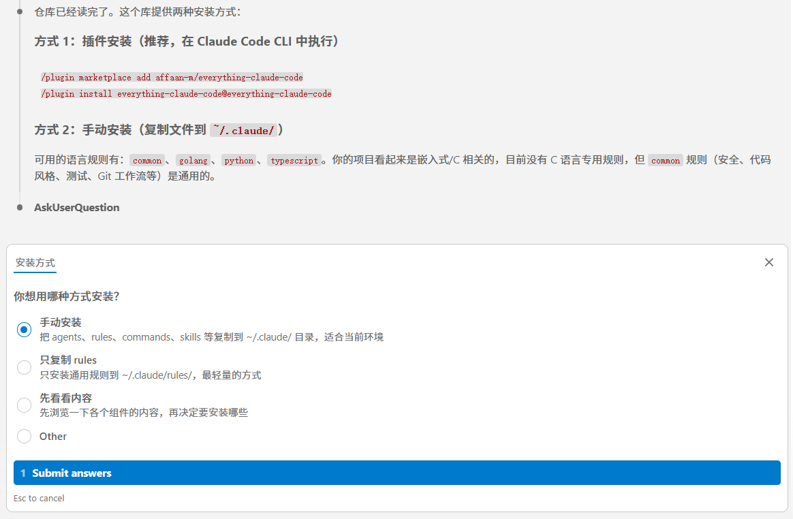
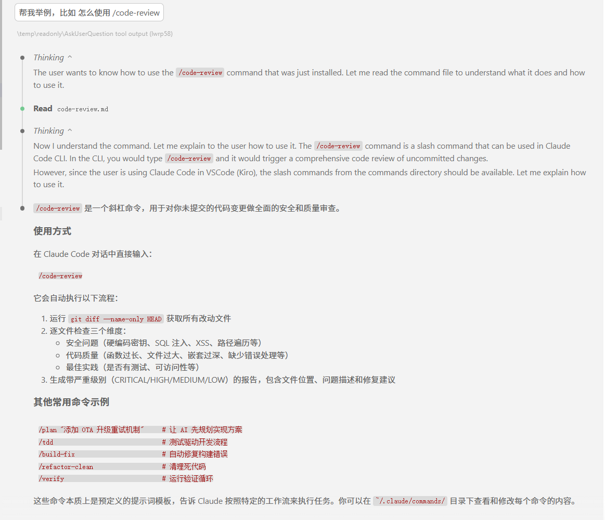
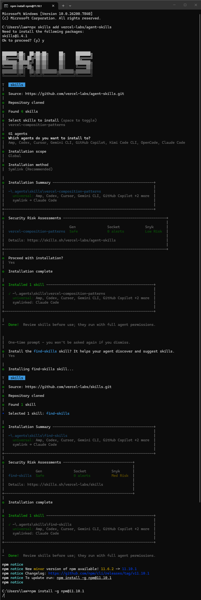

## 1. 项目概述

**Everything Claude Code** 是一个针对 Anthropic 官方命令行工具 `Claude Code` 的全面配置和增强套件。它的目标是将一个简单的 AI 聊天编程助手，转变为一个能够处理复杂工程任务、具有长期记忆且遵循严格开发标准的**高级开发智能体**。

### 核心价值

该项目主要解决了直接使用 LLM 编程时的三大痛点：

1. **上下文遗忘 (Context Amnesia)**：LLM 通常“用完即忘”。本项目通过持久化钩子（Hooks）保存项目特定的知识（如“这个项目使用 Tab 缩进”），实现越用越顺手。
2. **Token 浪费 (Token Economics)**：为了避免每次都读取所有文件，引入了专门的子代理（Sub-agents）和智能检索（Iterative Retrieval），只在需要时获取必要信息。
3. **质量失控 (Quality Control)**：强制执行工程标准（如 TDD 测试驱动开发、安全审查），防止 AI 生成“能跑但难以维护”的代码。

## 2. 核心架构深度解析

### A. 代理 (Agents) —— 你的虚拟团队

该项目目前包含约 **13 个** 预定义的专业代理文件（位于 `agents/` 目录），它们各司其职。我们可以将它们分为三类：核心角色、通用工具人和领域专家。

#### 1. 核心指挥层

- **Planner (规划师)** (`planner.md`): 项目的大脑。在编写任何代码之前，它负责分析需求、制定步骤、识别风险并生成 `PLAN.md`。
- **Architect (架构师)** (`architect.md`): 负责高层系统设计，决定目录结构，选择技术栈，并生成 Mermaid 架构图。

#### 2. 通用工具人 (Utility Agents)

- **Code Reviewer (审查员)** (`code-reviewer.md`): 对暂存区的代码进行通用质量审查（逻辑、风格、最佳实践）。
- **TDD Guide (测试向导)** (`tdd-guide.md`): 专门负责引导测试驱动开发的流程（红-绿-重构）。
- **Build Error Resolver (构建修复师)** (`build-error-resolver.md`): 专门分析编译器报错或运行时错误，并提出修复方案。
- **Refactor Cleaner (重构清理师)** (`refactor-cleaner.md`): 负责识别并删除死代码、优化冗余逻辑。
- **Doc Updater (文档更新员)** (`doc-updater.md`): 确保 README、API 文档与代码变更保持同步。
- **E2E Runner (端到端测试员)** (`e2e-runner.md`): 负责生成和运行 Playwright/Cypress 等 E2E 测试脚本。

#### 3. 领域专家 (Specialists)

这些是按需调用的特定技术栈专家：

- **Security Reviewer (安全审计师)** (`security-reviewer.md`): 专注于 OWASP Top 10、密钥泄漏、注入攻击等安全漏洞的审查。
- **Database Reviewer (数据库专家)** (`database-reviewer.md`): 审查 SQL 查询性能、Schema 设计和索引优化。
- **Go Reviewer** (`go-reviewer.md`): 专精于 Go 语言特性（Goroutines, Channels, Error handling）的代码审查。
- **Go Build Resolver** (`go-build-resolver.md`): 专门解决 Go 语言特有的构建和依赖问题。
- **Python Reviewer** (`python-reviewer.md`): 专精于 Python 风格（PEP8）和性能优化的审查。

### B. 持续学习 (Continuous Learning) —— 实现原理

这是该项目让 Claude 拥有“记忆”的核心机制，分为 V1 和 V2 两个版本。

**具体实现原理：**

1. **触发 (Trigger)**: 利用 `hooks` 机制，在每次会话结束（Session End）时自动触发脚本。
2. **观察 (Observe)**:

- **V1**: 运行 `evaluate-session.js` 脚本，将本次会话的全部 Prompt 和 Response 发送给一个轻量级模型（如 Haiku）。
- **V2**: 引入了 **"Observer Agent"**，它不仅看内容，还计算“置信度”。

1. **提取 (Extract)**: 脚本会要求模型回答：“用户在这个项目中有什么偏好？我们学到了什么新的错误修复模式？”

- *例如：用户总是要求在 SQL 字段名上加反引号。*

1. **存储 (Store)**:

- 提取出的知识被保存为结构化的 JSON 数据（`instincts.json`）或 Markdown 文件。
- 包含：`pattern` (模式内容), `confidence` (置信度分数), `context` (适用场景)。

1. **应用 (Apply)**: 在下一次会话开始时（Session Start Hook），系统会自动读取这些“直觉”文件，并将其注入到 Claude 的 System Prompt 中。

### C. 命令 (Commands) —— 完整清单

项目包含 **20+** 个自定义命令（位于 `commands/` 目录），按功能分类如下：

#### 核心工作流

- `/plan "任务"`: 调用 Planner 代理生成开发计划。
- `/tdd`: 启动 TDD 模式，强制先写测试。
- `/code-review`: 调用 Code Reviewer 审查当前修改。
- `/verify`: 运行验证循环，确保当前代码通过所有测试。
- `/checkpoint`: 保存当前状态快照，用于回滚。

#### 修复与维护

- `/build-fix`: 调用构建修复代理解决报错。
- `/refactor-clean`: 调用重构代理清理代码。
- `/update-docs`: 根据代码变更自动更新文档。
- `/update-codemaps`: 更新代码库的映射文件（用于辅助 AI 理解结构）。

#### 语言特定

- `/go-test`: Go 语言专用的 TDD 工作流。
- `/go-build`: 修复 Go 构建错误。
- `/go-review`: 调用 Go 专家进行审查。
- `/python-review`: 调用 Python 专家进行审查。

#### 学习与进化 (V2 特性)

- `/learn`: 手动触发一次从当前会话提取知识的过程。
- `/evolve`: **进化**。将零散的高置信度“直觉”聚类并固化为永久的“技能”文件。
- `/instinct-status`: 查看当前积累了哪些直觉及其置信度。
- `/instinct-import`: 导入其他人的直觉数据。
- `/instinct-export`: 导出我的直觉数据以分享给团队。
- `/skill-create`: 分析 Git 历史或当前目录，自动生成一个新的 Skill 文件。

#### 设置与工具

- `/setup-pm`: 设置项目的包管理器（npm/pnpm/yarn等）。
- `/e2e`: 生成 E2E 测试。
- `/test-coverage`: 检查测试覆盖率。

### D. 钩子 (Hooks) —— 自动化触发器

钩子定义在 `hooks/hooks.json` 和 `scripts/hooks/` 中，主要有 **5 类** 关键钩子：

1. **Session Start (会话开始)** (`session-start.js`):

- **作用**: 会话启动时，自动读取 `.claude/memory/` 或 `instincts.json` 中的数据，将过往的经验注入到当前上下文中。

1. **Session End (会话结束)** (`session-end.js` / `evaluate-session.js`):

- **作用**: 会话关闭时，自动分析本次交互，提取新的模式和偏好，保存到本地。

1. **Pre-Tool Use (工具使用前)** (`check-console-log.js` 等):

- **作用**: 在 Claude 尝试执行某些操作前进行拦截检查。
- **例子**: 当 Claude 尝试编辑 `.ts` 或 `.js` 文件时，脚本会扫描内容，如果发现包含 `console.log` 且不是在测试文件中，会发出警告或阻止提交。

1. **Pre-Compact (压缩前)** (`pre-compact.js`):

- **作用**: 当 Claude 的上下文窗口快满（需要压缩历史记录）时触发。它会先把当前的关键状态（如“正在调试的错误信息”）保存到临时文件，防止在压缩过程中丢失重要信息。

1. **Suggest Compact (建议压缩)** (`suggest-compact.js`):

- **作用**: 监控 Token 使用量，当达到阈值时，主动建议用户运行压缩命令或总结当前进度。

### E. 规则 (Rules) —— 宪法

规则文件位于 `rules/` 目录，共有 **8 个** 核心规则文件。它们是 Prompt 的一部分，具有最高优先级：

1. **Security (**`**security.md**`**)**:

- **作用**: 严禁硬编码密钥、密码和 Token；要求对用户输入进行验证；防止 SQL 注入和 XSS。

1. **Coding Style (**`**coding-style.md**`**)**:

- **作用**: 强制代码风格。例如：优先使用不可变数据结构；函数长度限制；命名规范；文件组织结构要求。

1. **Testing (**`**testing.md**`**)**:

- **作用**: 规定测试标准。例如：必须包含单元测试；测试覆盖率需达到 80% 以上；新功能必须有对应的测试用例。

1. **Git Workflow (**`**git-workflow.md**`**)**:

- **作用**: 规范 Git 操作。例如：Commit 信息格式（Conventional Commits）；分支命名规范；PR 描述模板。

1. **Agents (**`**agents.md**`**)**:

- **作用**: 定义何时该调用哪个代理。例如：“遇到构建错误不要自己瞎猜，必须调用 `build-error-resolver`”。

1. **Performance (**`**performance.md**`**)**:

- **作用**: 指导 AI 关注代码性能（时间复杂度/空间复杂度）以及自身的 Token 使用效率。

1. **Hooks (**`**hooks.md**`**)**:

- **作用**: 向 Claude 解释钩子的存在和工作方式，以便它能理解为什么有时候操作会被拦截。

1. **Patterns (**`**patterns.md**`**)**:

- **作用**: 存储通用的设计模式（如单例、工厂、观察者）的实现规范，确保设计模式的正确应用。


## 3. 安装与配置

### 方式一：插件安装（推荐）

在 Claude Code 的终端交互界面中输入：

```plain
/plugin marketplace add affaan-m/everything-claude-code
/plugin install everything-claude-code@everything-claude-code
```

### 方式二：手动安装

如果您想深度定制，可以克隆仓库并手动复制文件：

1. 克隆仓库：`git clone https://github.com/affaan-m/everything-claude-code.git`
2. 将 `rules/`, `agents/`, `commands/`, `skills/`, `hooks/` 目录下的内容复制到您本地的 `~/.claude/` 目录下。

### 方式三：让  claude code 自行帮你安装

我怎么使用 https://github.com/affaan-m/everything-claude-code 这个库？








### 初始化配置

安装完成后，您需要告诉插件您使用的是哪种包管理器（npm, pnpm, yarn 等）：

/setup-pm

跟随提示选择即可。这一步对于 TDD 和自动化测试功能至关重要。

## 4. 实战工作流 (Workflow)

以下是一个典型的“从需求到落地”的最佳实践流程：

### 第一阶段：规划 (Planning)

不要直接让 AI 写代码。先让它想清楚。

/plan "重构用户认证模块，从 Session 切换到 JWT"

**输出**：Claude 会生成一份详细的 Markdown 文档，列出涉及的文件、步骤、风险点和测试策略。

### 第二阶段：开发 (Development - TDD)

进入测试驱动模式，确保代码健壮性。

/tdd

**行为**：

1. Claude 会先创建一个失败的测试用例（Red）。
2. 编写最小代码让测试通过（Green）。
3. 优化代码结构（Refactor）。

### 第三阶段：调试与修复 (Debugging)

如果遇到报错，利用内置的构建修复代理。

/build-fix

**行为**：自动分析错误日志，定位问题代码，并尝试修复。

### 第四阶段：审查 (Review)

在提交代码前，进行模拟代码审查。

/code-review

**输出**：类似于 GitHub PR 的评论，指出潜在的安全问题、性能瓶颈或命名不规范。

### 第五阶段：进化 (Evolution)

结束一天的工作前，让 Claude 总结今天的经验。

/evolve

**效果**：Claude 会分析今天的对话，发现如“这个项目不喜欢用 try-catch，更喜欢 Go 风格的错误处理”这样的模式，并将其存入长期记忆。

## 5. 常见问题 (FAQ)

**Q: 这会消耗更多的 Token 吗？**

A: 短期看会（因为加载了更多 Prompt），但长期看会**节省**。因为规划和精准检索减少了反复试错和无效的大文件读取。

**Q: 它可以用于任何语言吗？**

A: 是的。核心架构是语言无关的。但目前针对 TypeScript, Python, Go 和 Java 有专门优化的专家代理。

**Q: 如何禁用某些规则？**

A: 直接删除 `~/.claude/rules/` 下对应的 `.md` 文件即可。