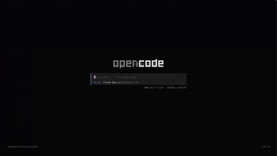
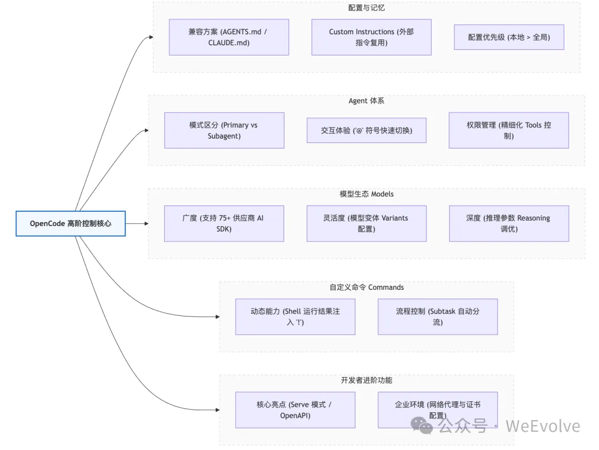
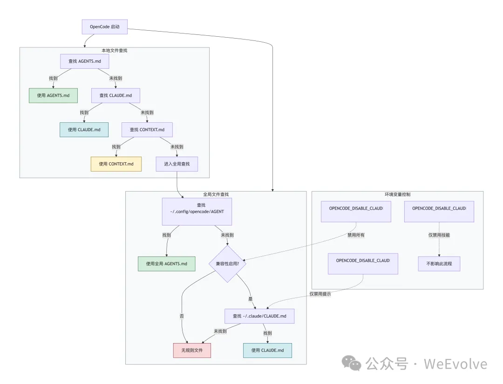
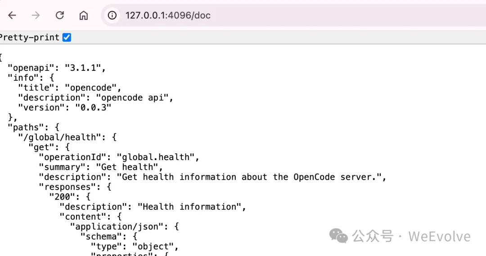

# OpenCode 替代 Claude Code 全指南，附部署本地模型配置教程

最近 GitHub 开源圈被一个项目炸翻了——OpenCode ，现在星标数狂飙至 8.7万，被无数程序员奉为「Claude Code 平替天花板」。对于习惯用 Claude Code 写代码，又追求开源自由、隐私安全的开发者来说，这无疑是一剂强心针。

有人说它是「闭源工具的破壁者」，也有人纠结「该不该从 Claude Code 迁移」。今天这篇文章，不仅帮你理清 OpenCode 与 Claude Code 的核心差异，还会手把手教你部署配置本地模型，实现「开源工具 + 本地部署」的双重自由。

## **一、先搞懂：OpenCode 到底比 Claude Code 强在哪？**

在决定迁移前，先问自己三个问题，快速判断 OpenCode 是否适合你。这三个问题，直接戳中两款工具的核心差异。

### **1. 模型自由：告别「单模型绑定」**

Claude Code 本质是为 Claude 模型深度优化的工具，虽能接入 GLM 等少数外部模型，但体验始终打折扣。而 OpenCode 原生支持  75+ 模型提供商，无论是 Claude、GPT、Gemini 等在线模型，还是本地部署的开源模型，都能无缝切换。

比如你上午用 Claude 3.5 写复杂算法，下午用本地模型处理敏感代码（避免数据上传），晚上用 GPT 优化文档注释，OpenCode 能一站式搞定，无需在多个工具间来回切换。

### **2. 隐私安全：开源透明的「本地掌控权」**

这是 OpenCode 最戳中企业和隐私敏感型开发者的点。Claude Code 是闭源工具，代码默认发送至 Anthropic 服务器处理，即便接入外部模型，数据流转也存在黑箱。

而 OpenCode 采用 MIT 开源协议，代码完全透明，支持本地部署，所有处理过程均在本地完成，不存储任何代码和上下文。目前已有 642 名贡献者维护，遇到问题可直接查阅源码甚至自主修改，对数据安全要求高的团队堪称刚需。

### **3. 体验权衡：开箱即用 vs 定制化自由**

Claude Code 的优势是「零门槛」，装好就能用，Anthropic 已调好所有参数，适合不想折腾、追求高效落地的开发者。OpenCode  安装简单（一行命令搞定），其中内置了不少闭源的模型，可以开箱即用，如果你适合喜欢折腾，追求定制化体验的极客，也可以使用自己部署的大语言模型、手动调参数和提示词等。

总结：若你是 Claude 重度用户、满足于现状，可继续使用 Claude Code；若需多模型切换、重视隐私，或想参与开源生态，OpenCode 值得果断尝试。



### **4. 安装openCode**
开源地址：https://github.com/anomalyco/opencode
#### **curl安装**
```bash
curl -fsSL https://opencode.ai/install | bash
```
#### **npm安装**
```bash
npm i -g opencode-ai
```
#### **brew安装**
```bash
brew install anomalyco/tap/opencode
```
#### **windiws 桌面版安装**
地址：https://opencode.ai/download

## **二、关键一步：用 vLLM 配置本地模型，解锁 OpenCode 全潜力**
OpenCode 的核心优势之一是支持本地模型，而 vLLM 作为当前最流行的高效推理框架，能让本地模型的吞吐量提升 14-24 倍，显存利用率提高  30%-70%，是搭配 OpenCode 的最佳搭档。下面分「GPU 环境」和「CPU 环境」，手把手教你配置。

### **前置准备：硬件与软件要求**
- **GPU 环境（推荐）**：NVIDIA GPU（显存 ≥80GB，推荐 H100/A100/A800），CUDA ≥12.2，Python 3.9-3.12，PyTorch ≥2.9.0 。

### **步骤 1：安装vLLM**
```bash
pip install vllm
```

### **步骤 2：下载模型**
国内建议使用`modelscope` 进行下载模型。
```bash
# 安装 modelscope
pip install modelscope
# 下载模型
modelscope download --model Qwen/Qwen3-30B-A3B-Instruct-2507 --local_dir ./Qwen/Qwen3-30B-A3B-Instruct-2507
```

### **步骤 3：启动 OpenAI 兼容服务器（对接 OpenCode）**
vLLM 可启动兼容 OpenAI API 协议的服务器，让 OpenCode 像调用 OpenAI 接口一样调用本地模型，步骤如下：
```bash
# 启动 vLLM 服务器（指定模型路径）
vllm serve ./Qwen/Qwen3-30B-A3B-Instruct-2507 --host 0.0.0.0 --port 8000
```
启动后，在 OpenCode 中配置本地 API 地址（http://localhost:8000/v1），即可无缝调用本地模型，实现「零数据上传」的代码辅助。

## **三、总结：工具选择的核心逻辑**
OpenCode 并非要完全取代 Claude Code，而是为开发者提供了另一种选择——在「开箱即用的便捷」和「开源自由的掌控」之间，找到平衡。搭配 vLLM 部署本地模型后，既能享受 OpenCode 的多场景适配能力，又能保障数据隐私，还能通过优化推理效率降低硬件成本。
如果你是开源爱好者、需要处理敏感项目，或想摆脱单一模型绑定，不妨从今天开始尝试：用一行命令安装 OpenCode，跟着教程配置 vLLM，解锁属于开发者的「工具自由」。
最后提醒：工具是为需求服务的，无论是 OpenCode 还是 Claude Code，适合自己的才是最好的。但不可否认，开源工具的崛起，正在让开发者拥有更多掌控权——这或许就是技术进步的意义。
 

# OpenCode 对比 Claude Code 一些更细致的控制
本文主要讲解 opencode 对标 Claude Code 时一些更灵活、更开放的配置和使用方法。

 
智能体记忆，Rules，`CLAUDE.md`，`AGENTS.md`
OpenCode为 Claude Code 用户准备了兼容方案。当项目里没有AGENTS.md时，OpenCode会自动找`CLAUDE.md`作为配置文件；全局配置也一样，会去`~/.claude/目录下找CLAUDE.md`。如果不需要这个兼容功能，可以用下面三个环境变量来关闭，分别是完全禁用、只禁用提示配置和只禁用技能配置。

 
opencode启动时读取规则文件的顺序：先从当前目录往上找本地规则文件，包括`AGENTS.md`、`CLAUDE.md`或`CONTEXT.md`；然后读全局配置文件`~/.config/opencode/AGENTS.md`；最后才是兼容的Claude Code配置文件。优先级是本地高于全局，新的AGENTS.md格式优先于旧的CLAUDE.md格式。

“Custom Instructions”是自定义指令，意思是你可以在项目里的`opencode.json`或者全局配置文件里指定自定义指令文件路径，这样团队就能复用已有的规则，不用重复写在AGENTS.md里，还支持用远程URL加载指令，示例里展示了怎么在`opencode.json`里配置schema和指令文件路径。

```json
{    
	"$schema":"https://opencode.ai/config.json",    
	"instructions":["docs/development-standards.md","test/testing-guidelines.md","packages/*/AGENTS.md"]
}
```

**opencode不会自动解析`AGENTS.md`里的外部文件引用**，但可以用两种方式实现类似功能，推荐的做法是在`opencode.json`的“`instructions`”字段里指定外部文件路径，比如示例里的开发规范和测试指南文档，这样就能把外部规则整合进来。否则，opencode 会在需要的时候读取特定文件，这点与 Claude Code 自动（最大5层）的递归引用不同。

具体参考： **https://opencode.ai/docs/rules/**

## Agents

“Agents”这部分讲的是可以配置和使用专门的AI助手，这些助手能针对特定任务和工作流定制，还能设置提示词、模型和工具权限。紫色提示框建议用“plan agent”来分析代码、评审建议，而且不会改动代码本身。另外，会话过程中可以切换不同的agent，用“@”符号就能调用它们。

opencode里agent的两种类型：主代理和子代理。主代理是你直接交互的主要助手，按Tab键或设置的切换快捷键就能在不同主代理间切换，它们负责处理主要对话，工具权限也可以配置，比如Build代理能使用所有工具，而Plan代理的工具使用会受到限制。

你有两种方式来设置主子 Agent，一种是 `opencode.json` 一种是`Markdown`（Global: `~/.config/opencode/agents/` Per-project: `.opencode/agents/`）

区分他们的主子关系也很简单，使用 `mode` 参数（`primary`， `subagent`）即可。

```markdown
---
description:Reviews code for quality and best practices
mode: subagent
model: anthropic/claude-sonnet-4-20250514
temperature:0.1
tools:
  write:false
  edit:false
  bash:false
---

You are in code review mode.Focus on:

...
```

## 模型 Models

OpenCode通过`AI SDK`和`Models.dev`这两个工具，支持75家以上的大语言模型供应商，还能运行本地模型，常用的供应商默认会预加载，只要通过“/connect”命令配置好密钥，启动软件时就能直接用这些模型服务。

> `AI SDK`是Vercel团队开发的开源工具库，专门为`TypeScript`设计的。它提供了统一的API接口，能把不同大语言模型提供商的底层差异给封装起来，这样开发者在调用`OpenAI`、`Anthropic`、`Gemini`等不同模型时，就不用去适配各自的接口，直接用一套代码就能搞定，能大幅降低开发AI应用的复杂度。

OpenCode官方筛选出了、能在代码生成和工具调用两方面都表现出色的模型。像列表里的`GPT 5.2`、`Claude Opus 4.5`这些，都是经过测试适配性好的，能帮开发者更高效地完成编程任务，而且官方也提醒了这个列表不是 exhaustive 也可能不是最新的，实际使用时可以根据需求调整。

如果区域设置默认模型，只要在opencode.json配置文件里，给“model”字段赋值成模型的完整ID就行。完整ID是“提供商ID/模型ID”的格式，比如用GPT 5.1  Codex，就写成“opencode/gpt-5.1-codex”。如果自定义了提供商，就从配置里的“provider”部分找对应的ID来填。例如：

```json
{
    "$schema":"https://opencode.ai/config.json",
    "model":"lmstudio/google/gemma-3n-e4b"
}
```

更灵活的全局配置模型参数，比如

```json
{
  "$schema": "https://opencode.ai/config.json",
  "provider": {
    "openai": {
      "models": {
        "gpt-5": {
          "options": {
            "reasoningEffort": "high",
            "textVerbosity": "low",
            "reasoningSummary": "auto",
            "include": ["reasoning.encrypted_content"],
          },
        },
      },
    },
    "anthropic": {
      "models": {
        "claude-sonnet-4-5-20250929": {
          "options": {
            "thinking": {
              "type": "enabled",
              "budgetTokens": 16000,
            },
          },
        },
      },
    },
  },
}
```

这一段时给OpenAI的GPT-5模型设置推理强度、文本冗余度，还有给Anthropic的Claude模型配置思考过程的token预算。这些全局设置会应用到所有会话里，不过如果给特定agent单独配置了参数，agent的设置会覆盖全局配置。另外还支持创建模型变体，不用重复配置就能给同一个模型定义多套不同参数。

不同模型提供商的参数体系不一样，像OpenAI的“reasoningEffort”和Anthropic的“thinking”字段，就是各自特有的推理配置参数。你可以在`Models.dev`网站查到每个内置模型支持的具体参数列表，这样配置的时候就不会出错。

opencode 同时提供了给模型定义“变体”的方法，比如

```css
{
  "$schema": "https://opencode.ai/config.json",
  "provider": {
    "opencode": {
      "models": {
        "gpt-5": {
          "variants": {
            "high": {
              "reasoningEffort": "high",
              "textVerbosity": "low",
              "reasoningSummary": "auto",
            },
            "low": {
              "reasoningEffort": "low",
              "textVerbosity": "low",
              "reasoningSummary": "auto",
            },
          },
        },
      },
    },
  },
}
```

给GPT-5模型同时创建“high”和“low”两种配置：“high”模式推理强度高，适合复杂任务；“low”模式推理强度低，适合简单场景。通过变体功能，可以为同一个模型设置多套不同参数，不用重复写配置，既能灵活应对不同任务需求，又能让配置文件更简洁易维护。

## Commands

关于自定义命令的，你可以为重复执行的任务创建专属命令，比如输入`/my-command`就能触发预设好的提示词。这些自定义命令会和内置命令共存，比如`/init`、`/undo`这些，还可以通过在`.opencode/commands/`目录下创建Markdown文件来定义更复杂的命令逻辑。这部分与 Claude Code 一样。

自定义命令里的Shell输出功能，用`!command`语法可以把bash命令的执行结果插入到提示词里。比如

```
---description:Analyze test coverage---
Here are the current test results:!`npm test`
Based on these results, suggest improvements to increase coverage.
```

示例里做了个分析测试覆盖率的命令，先用`!npm test`获取测试结果，再让模型根据结果给出提升覆盖率的建议。这样就能把外部工具的实时数据和AI分析结合起来，自动化完成像代码分析、变更评审这类需要外部信息的任务。

agent配置是用来指定由哪个代理执行当前命令。比如

```json
{"command":{ "review":{"agent":"plan"},"analyze":{ "subtask":true } }}
```

示例里给review命令指定了plan代理，这样执行代码评审时就会用专门负责规划和分析的代理来处理。如果不指定，就默认用当前会话的主代理。另外，如果指定的是子代理，默认会触发子代理调用，要是想禁用这个行为，把subtask设为false就行。subtask是个可选的布尔配置，把它设为true就能强制命令调用子代理执行，这样主会话的上下文不会被任务内容干扰，能保持整洁。就算代理本身的模式设为primary，只要subtask为true，就会强制以子代理身份运行，像示例里的analyze命令就是这么配置的。

这一点类似 Claude Code 中的 `context: fork` 功能。

## Agent as a server

**这个功能是我认为最重要的功能了，相比于 Claude Code 只能命令行， opencode 可以独立的作为一个后端服务运行，大大扩展了其他智能体应用借用 opencode 成熟框架落地的可能性。**

“opencode  serve”命令会启动一个无界面的HTTP后台服务，对外提供OpenAPI接口，让客户端可以通过网络来调用它的功能。默认情况下服务会在本地4096端口运行，你也可以通过参数来修改端口、绑定的主机名，或者配置跨域访问规则，这样不同的前端工具就能连接到这个服务上了。

> OpenAPI是一个用于描述RESTful API的规范协议，它提供了一套标准的格式和规则，让开发者能清晰地定义API的端点、请求参数、响应结构、认证方式等信息。它能让不同的系统和工具之间，对API的理解和使用达成一致，实现更好的互操作性。

你可以在浏览器里访问“**http://localhost:4096/doc”，**



这是OpenCode自带的API文档页面，里面列出了所有可用的接口，每个接口的输入参数、返回格式、示例请求都有详细说明。比如你可以查看Messages接口怎么发提示、Files接口怎么操作文件，还能直接在页面上测试接口调用。


## 代理 -- 大厂必备配置

OpenCode的网络代理配置可以让我们用环境变量来设置HTTP或HTTPS代理，让工具能在企业网络里正常工作。这里还特别提醒要把本地服务器“localhost”和“127.0.0.1”加入到NO_PROXY列表，这样TUI界面才能和本地HTTP服务器正常通信，避免代理设置影响本地服务。

```
# HTTPS proxy (recommended)export HTTPS_PROXY=https://proxy.example.com:8080
# HTTP proxy (if HTTPS not available)export HTTP_PROXY=http://proxy.example.com:8080
# Bypass proxy for local server (required)export NO_PROXY=localhost,127.0.0.1
```

自定义证书配置，很多企业会用自己的证书颁发机构（CA）来管理HTTPS连接的安全认证。通过设置`NODE_EXTRA_CA_CERTS`环境变量，把企业的CA证书路径告诉OpenCode，工具就能信任这些自定义证书，不管是通过代理连接，还是直接访问API，都能建立安全的HTTPS连接，避免出现证书不信任的错误。

# 小结

opencode 是把 claude code 那些遗憾都补上了，而且充分的考虑了 Coding Agent 到其他 产业 Agent 落地的兼容性，这无疑会让AI应用变得更快。