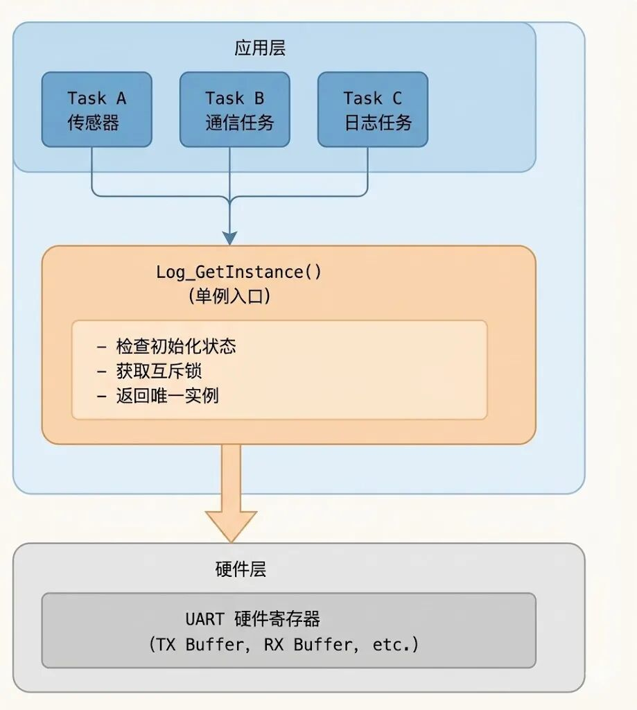
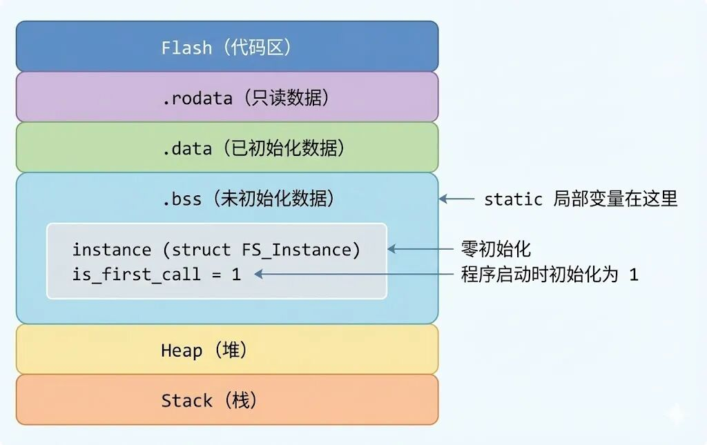
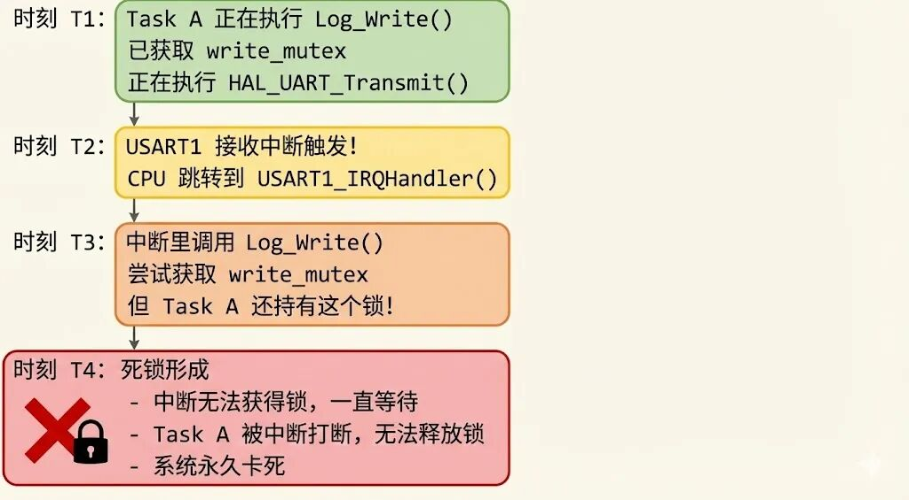
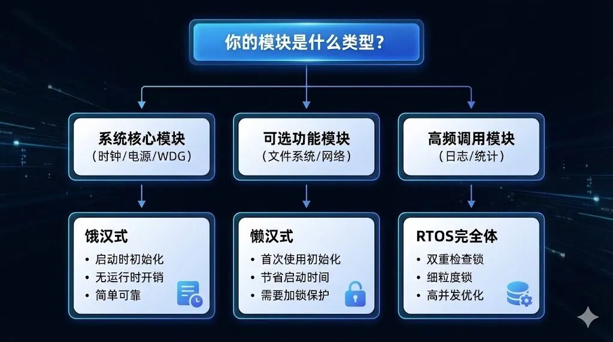

# 串口打印乱码？多任务冲突？C 语言单例模式是你的"硬件管家"已付费


**核心卖点***：解决"资源抢占"和"重复初始化"问题，给硬件装上"防盗门"。*

**导语**

你有没有遇到过这样的诡异场景：明明代码逻辑没问题，串口终端却打印出一串"外星文"？或者，系统莫名其妙地 HardFault，查了半天发现是某个硬件被重复初始化？

如果你点头了，恭喜你，你正在经历每个嵌入式工程师的"成人礼"——**资源竞争（Race Condition）**。

很多人会说：「我用全局变量不就完了吗？」

不好意思，全局变量不是解药，而是**慢性毒药**。

今天这篇文章，我们就来聊聊嵌入式软件中的**单例模式（Singleton Pattern）**——一种看似简单，却能让你的代码从「能跑」进化到「稳如老狗」的设计模式。

我会带你从"乱码现场"出发，一步步拆解问题，最后手把手教你写出**工业级的 C 语言单例模板**。

准备好了吗？Let's go!


## 第一部分：免费试读区

------

## 一、场景导入：诡异的"幽灵数据"

### 1.1 一个真实的"翻车现场"

让我先给你讲一个故事。

小王是某公司的嵌入式工程师，负责开发一款工业传感器。项目用的是 FreeRTOS，有两个主要任务：

- • **Task A**：每秒采集一次传感器数据，通过串口打印到上位机
- • **Task B**：负责监控系统状态，遇到异常时打印错误信息

小王写了一个简单的日志打印函数：

```c
// log.c
void Log_Print(const char* msg) {
    HAL_UART_Transmit(&huart1, (uint8_t*)msg, strlen(msg), 1000);
}
```

看起来很正常对吧？

然后，诡异的事情发生了。

某天，上位机收到了这样一串数据：

```c
SensoErrror: Timea: 25.5out
```

小王盯着屏幕看了半天，心想：「这他妈是什么外星文？」

### 1.2 现场还原：数据是如何"撞车"的

让我们来还原一下犯罪现场：

**时刻 T1**：Task A 正在打印 `"Sensor Data: 25.5"`

```
正在发送: S-e-n-s-o-r- -D-a-t-...
                       ↑ 发到这里
```

**时刻 T2**：Task B 检测到超时错误，优先级更高，抢占了 CPU

```
Task B: "我要打印 Error: Timeout！"
```

**时刻 T3**：Task B 开始发送它的数据

```
正在发送: E-r-r-o-r-:- -T-i-m-e-o-u-t
```

**时刻 T4**：Task B 发送完毕，Task A 恢复执行，继续发送剩余数据

```
继续发送: a-:- -2-5-.-5
```

**最终结果**：

```
S-e-n-s-o + E-r-r-o-r-:- -T-i-m-e + a-:- -2-5-.-5 + o-u-t
= "SensoErrror: Timea: 25.5out"
```

恭喜，你成功制造了一条"幽灵数据"。

### 1.3 这就是传说中的"资源竞争"

上面的现象，有一个专业名词叫做 **资源竞争（Race Condition）**。

**定义**：当两个或多个执行单元（任务、中断等）同时访问共享资源，且至少有一个是写操作时，如果没有适当的同步机制，结果将取决于执行的时序，产生不可预测的行为。

在嵌入式系统中，资源竞争简直是家常便饭：

| 共享资源  | 竞争场景               | 后果       |
| --------- | ---------------------- | ---------- |
| 串口 UART | 多任务同时打印         | 数据乱码   |
| SPI 总线  | Flash 和传感器同时通信 | 数据错乱   |
| 全局变量  | 读写不同步             | 状态不一致 |
| GPIO      | 多任务控制同一引脚     | 电平抖动   |

小王的问题就出在：**UART 是共享资源，却没有任何保护机制**。

### 1.4 新手的第一反应：加个全局标志位？

很多新手遇到这个问题，第一反应是：「我加个全局变量做标志位不就行了？」

```c
// 新手方案（错误示范）
uint8_t g_uart_busy = 0;  // 全局忙标志

void Log_Print(const char* msg) {
    while (g_uart_busy);   // 等待空闲
    g_uart_busy = 1;       // 标记为忙
    HAL_UART_Transmit(&huart1, (uint8_t*)msg, strlen(msg), 1000);
    g_uart_busy = 0;       // 标记为空闲
}
```

看起来很美好对吧？但我告诉你，这段代码**依然有 Bug**。

**为什么？**

假设 Task A 和 Task B 同时执行到 `while (g_uart_busy);` 这一行：

1. 1. Task A 检查 `g_uart_busy == 0`，准备进入
2. 2. **恰好此时发生任务切换**
3. 3. Task B 检查 `g_uart_busy == 0`，也准备进入
4. 4. 两个任务都认为自己可以进入，依然撞车

这就是经典的 **检查-设置竞争（Check-Then-Act Race）**。

问题的根源在于：**"检查"和"设置"不是原子操作**。

------

## 二、误区粉碎：全局变量 ≠ 单例模式

### 2.1 全局变量：嵌入式工程师的"毒品"

我知道，全局变量是嵌入式开发中最"爽"的东西。

为什么？因为它**太方便了**：

```c
// global.h
extern UART_HandleTypeDef huart1;
extern SPI_HandleTypeDef hspi1;
extern TIM_HandleTypeDef htim1;
extern uint32_t g_system_tick;
extern uint8_t g_sensor_data[100];
// ... 还有一百个 extern
```

任何地方 `#include "global.h"`，你就能随心所欲地访问任何东西。

**爽吗？爽。**

**然后呢？**

### 2.2 全局变量的"七宗罪"

让我来列举一下全局变量在嵌入式项目中的罪状：

**罪一：无法控制访问权限**

```c
// 某实习生写的代码
void Some_Function(void) {
    // 不知道为什么，总觉得重新初始化一下比较安心
    HAL_UART_Init(&huart1);  // 波特率被重置！
}
```

结果：串口通信突然中断，排查了三天才找到原因。

**罪二：无法追踪调用链**

当 `huart1` 出问题时，你怎么知道是谁改了它？

全局搜索 `huart1`，得到 200 个结果。祝你好运。

**罪三：没有"守门人"**

你无法在访问前强制检查：

- • 硬件是否已初始化？
- • 当前是否处于忙状态？
- • 调用者是否有权限？

**罪四：单元测试噩梦**

全局变量让函数有了"隐藏的依赖"，你根本无法孤立地测试某个模块。

**罪五：重复初始化风险**

```c
// main.c
HAL_UART_Init(&huart1);

// 某个模块初始化函数
void Module_Init(void) {
    HAL_UART_Init(&huart1);  // 啊，再初始化一次应该没问题吧？
}
```

结果：某些 HAL 库的 Init 函数会重置状态机，导致正在进行的通信直接 GG。

**罪六：命名空间污染**

当项目变大，全局变量名字开始"打架"：

```c
uint8_t flag;      // A 模块的 flag
uint8_t flag;      // B 模块也想叫 flag，编译报错
uint8_t flag_a;    // 好吧，改名
uint8_t flag_b;    // 越来越丑
```

**罪七：并发安全完全不可控**

这个我们在第一节已经讲过了，就是串口乱码的根本原因。

### 2.3 全局变量 vs 单例模式：本质区别

| 特性           | 全局变量               | 单例模式                   |
| -------------- | ---------------------- | -------------------------- |
| 访问控制       | 无，任何人都能直接访问 | 有，必须通过 GetInstance() |
| 初始化时机     | 程序启动时，或手动调用 | 可控（饿汉/懒汉）          |
| 重复初始化保护 | 无                     | 有，只初始化一次           |
| 状态检查       | 无                     | 可在 GetInstance() 中添加  |
| 线程安全       | 完全不安全             | 可设计为线程安全           |
| 可测试性       | 差，依赖隐藏           | 好，依赖显式               |

**一句话总结**：全局变量是"裸奔"，单例模式是穿上"防弹衣"。

### 2.4 单例模式的核心：不是"唯一"，而是"受控"

很多教程在讲单例模式时，总是强调"保证全局只有一个实例"。

这话没错，但它只说对了一半。

**单例模式的真正价值在于**：

1. **受控的创建**：实例由模块内部创建，外部无法 `new` 或 `malloc`
2. **受控的访问**：所有访问都通过统一入口，可以添加各种检查
3. **受控的生命周期**：明确知道何时创建、何时销毁

用大白话说：单例模式把"对硬件的直接操作"变成了"对服务的请求"。

就像你去银行取钱：

- • **全局变量方式**：自己拿钥匙打开金库，想拿多少拿多少
- • **单例模式方式**：到柜台排队，告诉工作人员你要取多少，她帮你办理

哪种更安全，不用我说了吧？

------

## 三、理想状态：给硬件请个"保安"

### 3.1 架构图：单例模式的工作原理

让我画一张图，展示单例模式是如何保护硬件资源的：



**关键点**：

1. 1. **所有任务**都不能直接访问 UART 硬件
2. 2. 必须通过 `Log_GetInstance()` 这个**唯一入口**
3. 3. 入口处可以做任何检查：初始化、锁、权限……
4. 4. 硬件资源被严密保护，就像有了一个"保安"

### 3.2 单例模式在嵌入式中的典型应用

| 应用场景 | 为什么用单例                 |
| ---- | ---------------------- |
| 日志系统 | 所有模块共用一个日志输出通道         |
| 配置管理 | 系统配置只需要一份，避免数据不一致      |
| 硬件驱动 | 串口、SPI、I2C 等外设通常只有一个实例 |
| 状态机  | 系统状态全局唯一，不能有多个         |
| 内存池  | 统一管理内存分配，避免碎片化         |
| 看门狗  | 只需要一个喂狗入口              |

### 3.3 你可能会问的问题

**Q：我直接加个互斥锁不就行了吗？为什么还要单例模式？**

A：互斥锁只解决了"并发访问"的问题，但没解决：

- • 重复初始化
- • 访问控制
- • 状态管理

单例模式是一个**完整的解决方案**，互斥锁只是其中一个组件。

**Q：单例模式会不会增加很多代码量？**

A：恰恰相反。规范的单例模式会**减少**重复代码。因为所有的检查逻辑都集中在一个地方，而不是散落在各个调用点。

------

## 四、关键钩子：三个大坑等着你

> **以下内容是付费区的预告**

你可能会说：「单例模式嘛，我会啊！不就是加个 `static` 变量吗？」

**Too Young, Too Simple.**

在嵌入式 C 语言中，实现单例模式有**三个大坑**，踩中任何一个，你的系统都会出问题：

### 坑一：初始化地狱

如果两个任务**同时**请求初始化，怎么防止硬件被复位两次？

```c
// 危险！
if (!is_initialized) {
    // Task A 执行到这里，发生任务切换
    // Task B 也进入这里
    // 结果：初始化了两次！
    Hardware_Init();
    is_initialized = 1;
}
```

### 坑二：懒汉 vs 饿汉

- • **饿汉式**：程序启动就创建实例
- • **懒汉式**：第一次使用时才创建

在 Flash 只有 64KB 的单片机上，哪种模式既省内存又启动快？

这不是一个简单的选择题，而是需要根据具体场景权衡。

### 坑三：死锁风险

如果在**中断服务函数（ISR）**里调用带锁的单例，会发生什么？

```c
void USART1_IRQHandler(void) {
    Log_GetInstance()->Write("IRQ!");  // 死锁！
}
```

任务正持有锁 → 中断触发 → 中断里也想获取锁 → 永远等不到 → **系统卡死**。

------

> **【付费内容预告】**
>
> 全局变量是野蛮人的做法，单例模式是架构师的修养。
>
> 接下来的付费内容，你将学到：
>
> - • **C 语言版 GetInstance**：利用 static 局部变量特性，实现"按需创建"
> - • **线程安全装饰器**：如何把 RTOS 的互斥量无缝融入单例，让 API 自动具备原子性
> - • **防呆设计**：就算新人写了 `Singleton_Init()` 一百次，硬件也只会被初始化一次
> - • **中断安全守卫**：自动检测调用上下文，在 ISR 中优雅降级而不是卡死
>
> **点击阅读，给你的硬件资源装上一把"智能锁" ↓**

------

## 第二部分：付费核心区

------

## 五、实战 Level 1：最基础的"饿汉式"（Eager Initialization）

### 5.1 什么是饿汉式？

**饿汉式**，顾名思义，就是"饿得不行，迫不及待"——在程序启动时就立即创建单例实例，不管你用不用得到。

**核心特点**：

- • 实例在编译期或启动期就创建好
- • 不存在运行时创建的开销
- • 天生线程安全（因为创建发生在多任务启动之前）

### 5.2 适用场景

| 场景           | 说明                 |
| -------------- | -------------------- |
| 系统时钟管理   | 启动必须就绪，不能等 |
| 电源管理模块   | 第一时间控制功耗     |
| 看门狗管理     | 启动就要开始喂狗     |
| 核心外设初始化 | UART、SPI 等基础通信 |

**一句话**：如果这个模块是系统运行的**基石**，用饿汉式。

### 5.3 代码实现

让我们以日志模块为例，实现一个饿汉式单例：

**log_singleton.h**

```c
/**
 * @file log_singleton.h
 * @brief 饿汉式单例 - 日志模块头文件
 */

#ifndef __LOG_SINGLETON_H
#define __LOG_SINGLETON_H

#include <stdint.h>
#include <stddef.h>

/* 日志级别定义 */
typedef enum {
    LOG_LEVEL_DEBUG = 0,
    LOG_LEVEL_INFO,
    LOG_LEVEL_WARN,
    LOG_LEVEL_ERROR
} LogLevel_t;

/* 日志模块结构体（对外不透明） */
typedef struct Log_Instance Log_t;

/* ========== 公开 API ========== */

/**
 * @brief 获取日志单例实例
 * @return 日志实例指针（永远不会返回 NULL）
 */
Log_t* Log_GetInstance(void);

/**
 * @brief 写入日志
 * @param level 日志级别
 * @param format 格式化字符串
 * @param ... 可变参数
 */
void Log_Write(Log_t* log, LogLevel_t level, const char* format, ...);

/**
 * @brief 设置日志级别过滤
 * @param level 最低输出级别
 */
void Log_SetLevel(Log_t* log, LogLevel_t level);

#endif /* __LOG_SINGLETON_H */
```

**log_singleton.c**

```c
/**
 * @file log_singleton.c
 * @brief 饿汉式单例 - 日志模块实现
 */

#include "log_singleton.h"
#include "stm32f4xx_hal.h"  // 根据你的平台修改
#include <stdio.h>
#include <stdarg.h>
#include <string.h>

/* ========== 私有定义 ========== */

#define LOG_BUFFER_SIZE  256

/* 日志实例结构体（内部定义） */
struct Log_Instance {
    UART_HandleTypeDef* uart;       /* 串口句柄 */
    LogLevel_t          min_level;  /* 最低输出级别 */
    char                buffer[LOG_BUFFER_SIZE];  /* 格式化缓冲区 */
    uint8_t             is_ready;   /* 就绪标志 */
};

/* ========== 饿汉式核心：静态实例 ========== */

/*
 * 关键点 1：使用 static 限制作用域，外部无法直接访问
 * 关键点 2：在文件作用域定义，程序启动时自动初始化
 */
staticstruct Log_Instance s_log_instance = {
    .uart      = NULL,
    .min_level = LOG_LEVEL_DEBUG,
    .buffer    = {0},
    .is_ready  = 0
};

/* ========== 私有函数 ========== */

/**
 * @brief 内部初始化函数（只会被调用一次）
 */
static void Log_InitInternal(struct Log_Instance* inst) {
    extern UART_HandleTypeDef huart1;  // 假设使用 UART1

    inst->uart = &huart1;
    inst->min_level = LOG_LEVEL_INFO;
    inst->is_ready = 1;
}

/* ========== 公开 API 实现 ========== */

/**
 * @brief 获取单例实例
 *
 * 饿汉式的 GetInstance 非常简单：
 * - 检查是否初始化
 * - 如果没有，执行初始化
 * - 返回实例指针
 *
 * 由于实例在编译期就存在，这里只需要做一次性的硬件初始化。
 */
Log_t* Log_GetInstance(void) {
    /* 防呆设计：支持多次调用，但只初始化一次 */
    if (!s_log_instance.is_ready) {
        Log_InitInternal(&s_log_instance);
    }

    return &s_log_instance;
}

/**
 * @brief 写入日志
 */
void Log_Write(Log_t* log, LogLevel_t level, const char* format, ...) {
    /* 参数检查 */
    if (log == NULL || !log->is_ready) {
        return;
    }

    /* 级别过滤 */
    if (level < log->min_level) {
        return;
    }

    /* 格式化日志内容 */
    va_list args;
    va_start(args, format);
    vsnprintf(log->buffer, LOG_BUFFER_SIZE, format, args);
    va_end(args);

    /* 添加换行符 */
    size_t len = strlen(log->buffer);
    if (len < LOG_BUFFER_SIZE - 2) {
        log->buffer[len] = '\r';
        log->buffer[len + 1] = '\n';
        len += 2;
    }

    /* 发送到串口 */
    HAL_UART_Transmit(log->uart, (uint8_t*)log->buffer, len, 1000);
}

/**
 * @brief 设置日志级别
 */
void Log_SetLevel(Log_t* log, LogLevel_t level) {
    if (log != NULL) {
        log->min_level = level;
    }
}
```

### 5.4 使用示例

```c
// main.c
#include "log_singleton.h"

int main(void) {
    HAL_Init();
    SystemClock_Config();
    MX_USART1_UART_Init();

    // 获取日志实例（第一次调用会触发初始化）
    Log_t* logger = Log_GetInstance();

    // 设置日志级别
    Log_SetLevel(logger, LOG_LEVEL_DEBUG);

    // 使用日志
    Log_Write(logger, LOG_LEVEL_INFO, "System started!");
    Log_Write(logger, LOG_LEVEL_DEBUG, "Debug value: %d", 42);

    while (1) {
        // 在任何地方都可以这样使用
        Log_Write(Log_GetInstance(), LOG_LEVEL_INFO, "Tick: %lu", HAL_GetTick());
        HAL_Delay(1000);
    }
}
```

### 5.5 饿汉式的优缺点

| 优点               | 缺点                   |
| ------------------ | ---------------------- |
| 实现简单，代码量少 | 不管用不用，都占用内存 |
| 天生线程安全       | 启动时间可能变长       |
| 执行时间可预测     | 无法延迟初始化         |
| 没有运行时判断开销 | 模块间依赖需要注意顺序 |

### 5.6 饿汉式的隐患

虽然饿汉式简单好用，但有一个**致命问题**我必须提醒你：

```c
// log_singleton.c
static struct Log_Instance s_log_instance = {
    .uart = &huart1,  // 危险！huart1 可能还没初始化！
    // ...
};
```

**静态初始化的顺序是不确定的！**

如果 `huart1` 定义在另一个 `.c` 文件中，它可能在 `s_log_instance` 之后才被初始化，导致 `s_log_instance.uart` 指向一个未初始化的结构体。

**解决方案**：

1. 1. 把硬件句柄的赋值放到 `Log_InitInternal()` 中（如上面代码所示）
2. 2. 或者在 `main()` 开头显式调用一次 `Log_GetInstance()` 来确保正确的初始化顺序

------

## 六、实战 Level 2：优雅的"懒汉式"（Lazy Initialization）

### 6.1 什么是懒汉式？

**懒汉式**，顾名思义，就是"懒得动"——只有在第一次真正需要使用时，才创建实例。

这就是所谓的 **延迟加载（Lazy Load）**。

**核心特点**：

- • 实例在首次调用 `GetInstance()` 时创建
- • 节省启动时间和初始内存占用
- • 需要额外处理线程安全问题

### 6.2 适用场景

| 场景         | 说明                               |
| ------------ | ---------------------------------- |
| 文件系统模块 | 可能根本用不到，没必要启动就初始化 |
| SD 卡驱动    | 大型模块，初始化耗时，按需加载     |
| 网络协议栈   | 启动时可能还没配置好网络           |
| 高级功能模块 | 用户可能永远不会用到               |

**一句话**：如果这个模块**可能用不到**，或者**初始化成本很高**，用懒汉式。

### 6.3 基础版代码实现（非线程安全）

先来看一个**最简单**的懒汉式实现：

```c
/**
 * @file filesystem_singleton.c
 * @brief 懒汉式单例 - 文件系统模块（非线程安全版）
 */

#include "filesystem_singleton.h"
#include "ff.h"  // FatFs 文件系统库

/* ========== 私有定义 ========== */

/* 文件系统实例结构体 */
struct FS_Instance {
    FATFS   fatfs;          /* FatFs 工作区 */
    uint8_t is_mounted;     /* 挂载状态 */
    uint8_t is_initialized; /* 初始化标志 */
};

/* ========== 懒汉式核心：静态局部变量 ========== */

/**
 * @brief 获取文件系统单例实例
 *
 * 这里利用了 C 语言的一个特性：
 * static 局部变量只会被初始化一次，且存放在 .bss 段
 */
FS_t* FS_GetInstance(void) {
    /* 关键技巧：static 局部变量 */
    static struct FS_Instance instance;
    static uint8_t is_first_call = 1;

    if (is_first_call) {
        /* 首次调用，执行初始化 */
        memset(&instance, 0, sizeof(instance));

        /* 尝试挂载文件系统 */
        FRESULT res = f_mount(&instance.fatfs, "0:", 1);
        if (res == FR_OK) {
            instance.is_mounted = 1;
        }

        instance.is_initialized = 1;
        is_first_call = 0;
    }

    return &instance;
}
```

### 6.4 这个版本的致命问题

上面的代码看起来很美好，但它有一个**致命缺陷**：**非线程安全**。

让我们模拟一下多任务场景：

```
时刻 T1: Task A 调用 FS_GetInstance()
         检查 is_first_call == 1，准备进入初始化
         ↓
时刻 T2: 任务切换！Task B 抢占
         Task B 也调用 FS_GetInstance()
         检查 is_first_call == 1，也进入初始化
         Task B 完成初始化，设置 is_first_call = 0
         ↓
时刻 T3: Task A 恢复执行
         继续执行初始化代码
         f_mount() 被调用了第二次！
         ↓
结果: 文件系统被重复挂载，数据结构被破坏
```

这就是经典的 **竞态条件（Race Condition）**。

### 6.5 问题的本质：检查与设置不是原子操作

```c
if (is_first_call) {      // ← 检查
    // ...
    is_first_call = 0;    // ← 设置
}
```

在"检查"和"设置"之间，可能发生任务切换，导致多个任务同时进入初始化代码。

**解决方案有两种**：

1. 1. **饿汉式**：在多任务启动前就完成初始化
2. 2. **加锁**：使用互斥量保护临界区

接下来，我们来实现**线程安全**的懒汉式。

### 6.6 C 语言懒汉式的内存布局

在深入线程安全版本之前，先理解一下 `static` 局部变量的内存布局：



**关键点**：

- • `static` 局部变量**不在栈上**，而是在 `.bss` 或 `.data` 段
- • 它的生命周期是**整个程序运行期间**
- • 初始化只发生一次（程序启动时或首次执行时）

这就是为什么我们可以用 `static` 局部变量来实现单例——它天然具备"唯一性"和"持久性"。

------

## 七、实战 Level 3：带 RTOS 锁的"完全体"

### 7.1 线程安全的核心：互斥量

要解决懒汉式的竞态条件，我们需要引入 RTOS 的**互斥量（Mutex）**。

**互斥量的特点**：

- • 同一时刻只有一个任务能持有
- • 其他任务必须等待
- • 支持优先级继承，避免优先级反转

### 7.2 朴素的加锁方案

最直接的想法是：在 `GetInstance()` 里加锁。

```c
// 朴素方案（有性能问题）
Log_t* Log_GetInstance(void) {
    static struct Log_Instance instance;
    static uint8_t is_initialized = 0;
    static osMutexId_t mutex = NULL;

    // 创建互斥量（只执行一次）
    if (mutex == NULL) {
        mutex = osMutexNew(NULL);
    }

    // 获取锁
    osMutexAcquire(mutex, osWaitForever);

    if (!is_initialized) {
        Log_InitInternal(&instance);
        is_initialized = 1;
    }

    // 释放锁
    osMutexRelease(mutex);

    return &instance;
}
```

**问题**：每次调用 `GetInstance()` 都要获取/释放锁，即使实例已经初始化好了。

在一个高频调用日志的系统中，这会造成**严重的性能瓶颈**。

### 7.3 双重检查锁（Double-Checked Locking）

**双重检查锁**是一种经典的优化技巧，核心思想是：

1. 1. **第一次检查**（无锁）：快速判断是否已初始化
2. 2. **加锁**：只有在未初始化时才加锁
3. 3. **第二次检查**：进入临界区后再检查一次（防止竞争）
4. 4. **初始化**：真正执行初始化
5. 5. **释放锁**

```c
/**
 * @brief 线程安全的懒汉式单例 - 使用双重检查锁
 */
Log_t* Log_GetInstance(void) {
    static struct Log_Instance instance;
    static volatile uint8_t is_initialized = 0;  // volatile 很重要！
    static osMutexId_t init_mutex = NULL;

    /* 第一次检查：无锁快速路径 */
    if (is_initialized) {
        return &instance;  // 已初始化，直接返回
    }

    /* 需要初始化，先创建互斥量 */
    if (init_mutex == NULL) {
        // 注意：这里也有竞争，但只在系统启动初期
        // 实际项目中，建议在 main() 开头统一创建
        const osMutexAttr_t mutex_attr = {
            .name = "log_init_mutex",
            .attr_bits = osMutexRecursive | osMutexPrioInherit
        };
        init_mutex = osMutexNew(&mutex_attr);
    }

    /* 获取锁 */
    osMutexAcquire(init_mutex, osWaitForever);

    /* 第二次检查：进入临界区后再确认 */
    if (!is_initialized) {
        Log_InitInternal(&instance);
        is_initialized = 1;  // 设置标志
    }

    /* 释放锁 */
    osMutexRelease(init_mutex);

    return &instance;
}
```

**为什么需要 `volatile`？**

```c
static volatile uint8_t is_initialized = 0;c
```

在没有 `volatile` 的情况下，编译器可能会做出"聪明"的优化：

- • 把 `is_initialized` 缓存到寄存器中
- • 在循环中不重新读取内存中的值
- • 导致一个任务的修改对另一个任务"不可见"

`volatile` 告诉编译器："每次都要从内存读取这个变量，不要优化！"

### 7.4 完整的线程安全单例模板

下面是一个**工业级**的日志单例实现，包含了我们讨论的所有要点：

**log_threadsafe.h**

```c
/**
 * @file log_threadsafe.h
 * @brief 线程安全单例 - 日志模块
 */

#ifndef __LOG_THREADSAFE_H
#define __LOG_THREADSAFE_H

#include <stdint.h>

typedefenum {
    LOG_LEVEL_DEBUG = 0,
    LOG_LEVEL_INFO,
    LOG_LEVEL_WARN,
    LOG_LEVEL_ERROR
} LogLevel_t;

typedefenum {
    LOG_OK = 0,
    LOG_ERR_NOT_INIT,
    LOG_ERR_BUSY,
    LOG_ERR_ISR_CONTEXT,
    LOG_ERR_PARAM
} LogStatus_t;

/* 不透明类型 */
typedefstruct Log_Instance Log_t;

/* ========== API ========== */

/* 获取实例（线程安全） */
Log_t* Log_GetInstance(void);

/* 写入日志（线程安全） */
LogStatus_t Log_Write(Log_t* log, LogLevel_t level, const char* format, ...);

/* 设置级别 */
void Log_SetLevel(Log_t* log, LogLevel_t level);

/* 获取统计信息 */
uint32_t Log_GetWriteCount(Log_t* log);

#endif
```

**log_threadsafe.c**

```c
/**
 * @file log_threadsafe.c
 * @brief 线程安全单例 - 日志模块实现
 */

#include "log_threadsafe.h"
#include "cmsis_os2.h"
#include "stm32f4xx_hal.h"
#include <stdio.h>
#include <stdarg.h>
#include <string.h>

/* ========== 配置 ========== */

#define LOG_BUFFER_SIZE     256
#define LOG_MUTEX_TIMEOUT   1000  /* 毫秒 */

/* ========== 私有结构体 ========== */

struct Log_Instance {
    /* 硬件资源 */
    UART_HandleTypeDef* uart;

    /* 配置 */
    LogLevel_t min_level;

    /* 缓冲区 */
    char buffer[LOG_BUFFER_SIZE];

    /* 状态 */
    volatile uint8_t is_initialized;

    /* 同步原语 */
    osMutexId_t write_mutex;    /* 写操作互斥量 */

    /* 统计信息 */
    uint32_t write_count;
    uint32_t error_count;
};

/* ========== 静态实例 ========== */

staticstruct Log_Instance s_instance = {0};
static volatile uint8_t s_is_created = 0;
static osMutexId_t s_init_mutex = NULL;

/* ========== 私有函数 ========== */

static void Log_InitInternal(struct Log_Instance* inst) {
    extern UART_HandleTypeDef huart1;

    inst->uart = &huart1;
    inst->min_level = LOG_LEVEL_INFO;
    inst->write_count = 0;
    inst->error_count = 0;

    /* 创建写操作互斥量 */
    const osMutexAttr_t mutex_attr = {
        .name = "log_write_mutex",
        .attr_bits = osMutexRecursive | osMutexPrioInherit
    };
    inst->write_mutex = osMutexNew(&mutex_attr);

    inst->is_initialized = 1;
}

/* ========== 公开 API ========== */

/**
 * @brief 获取单例实例（双重检查锁）
 */
Log_t* Log_GetInstance(void) {
    /* 快速路径：已初始化直接返回 */
    if (s_is_created) {
        return &s_instance;
    }

    /* 创建初始化互斥量（启动时只执行一次） */
    if (s_init_mutex == NULL) {
        const osMutexAttr_t attr = {
            .name = "log_init_mutex",
            .attr_bits = osMutexPrioInherit
        };
        s_init_mutex = osMutexNew(&attr);
    }

    /* 获取初始化锁 */
    osMutexAcquire(s_init_mutex, osWaitForever);

    /* 二次检查 */
    if (!s_is_created) {
        Log_InitInternal(&s_instance);
        s_is_created = 1;
    }

    osMutexRelease(s_init_mutex);

    return &s_instance;
}

/**
 * @brief 写入日志（线程安全）
 */
LogStatus_t Log_Write(Log_t* log, LogLevel_t level, const char* format, ...) {
    /* 参数检查 */
    if (log == NULL || format == NULL) {
        return LOG_ERR_PARAM;
    }

    if (!log->is_initialized) {
        return LOG_ERR_NOT_INIT;
    }

    /* 级别过滤 */
    if (level < log->min_level) {
        return LOG_OK;
    }

    /* 获取写锁（带超时） */
    osStatus_t status = osMutexAcquire(log->write_mutex, LOG_MUTEX_TIMEOUT);
    if (status != osOK) {
        log->error_count++;
        return LOG_ERR_BUSY;
    }

    /* ===== 临界区开始 ===== */

    /* 添加日志级别前缀 */
    const char* level_str[] = {"[DBG]", "[INF]", "[WRN]", "[ERR]"};
    int prefix_len = snprintf(log->buffer, LOG_BUFFER_SIZE, "%s ", level_str[level]);

    /* 格式化用户内容 */
    va_list args;
    va_start(args, format);
    vsnprintf(log->buffer + prefix_len, LOG_BUFFER_SIZE - prefix_len, format, args);
    va_end(args);

    /* 添加换行 */
    size_t len = strlen(log->buffer);
    if (len < LOG_BUFFER_SIZE - 2) {
        log->buffer[len++] = '\r';
        log->buffer[len++] = '\n';
    }

    /* 发送数据 */
    HAL_UART_Transmit(log->uart, (uint8_t*)log->buffer, len, 1000);

    log->write_count++;

    /* ===== 临界区结束 ===== */

    osMutexRelease(log->write_mutex);

    return LOG_OK;
}

/**
 * @brief 设置日志级别
 */
void Log_SetLevel(Log_t* log, LogLevel_t level) {
    if (log != NULL && log->is_initialized) {
        log->min_level = level;
    }
}

/**
 * @brief 获取写入计数
 */
uint32_t Log_GetWriteCount(Log_t* log) {
    return (log != NULL) ? log->write_count : 0;
}
```

### 7.5 使用示例

```c
// task_sensor.c - 传感器任务
void Task_Sensor(void *argument) {
    Log_t* logger = Log_GetInstance();

    for (;;) {
        float temp = Read_Temperature();
        Log_Write(logger, LOG_LEVEL_INFO, "Temperature: %.1f C", temp);
        osDelay(1000);
    }
}

// task_comm.c - 通信任务
void Task_Communication(void *argument) {
    Log_t* logger = Log_GetInstance();

    for (;;) {
        if (Comm_HasError()) {
            Log_Write(logger, LOG_LEVEL_ERROR, "Communication error: %d", Comm_GetErrorCode());
        }
        osDelay(100);
    }
}

// main.c
int main(void) {
    HAL_Init();
    SystemClock_Config();
    MX_USART1_UART_Init();

    osKernelInitialize();

    // 在调度器启动前初始化单例（可选，但推荐）
    Log_GetInstance();

    osThreadNew(Task_Sensor, NULL, NULL);
    osThreadNew(Task_Communication, NULL, NULL);

    osKernelStart();

    while (1) {}
}
```

### 7.6 锁的粒度选择

在上面的实现中，我们用了**两个锁**：

| 锁             | 保护对象   | 使用频率           |
| -------------- | ---------- | ------------------ |
| `s_init_mutex` | 初始化过程 | 仅初始化时使用一次 |
| `write_mutex`  | 写操作     | 每次写日志都使用   |

**为什么要分开？**

如果只用一个锁保护整个单例，那么 `GetInstance()` 和 `Log_Write()` 会互相阻塞，降低并发性能。

分开后：

- • `GetInstance()` 在初始化完成后不再需要锁
- • `Log_Write()` 的锁只保护写操作本身

这就是**锁粒度优化**的典型应用。

------

## 八、嵌入式特供：禁止中断调用（Context Check）

### 8.1 致命场景：中断里调用单例

这是一个**真实的血泪教训**。

某天，系统莫名其妙地卡死了。经过几个小时的排查，最终定位到问题：

```c
void USART1_IRQHandler(void) {
    if (__HAL_UART_GET_FLAG(&huart1, UART_FLAG_RXNE)) {
        char ch = huart1.Instance->DR;
        // 想打印一下收到的字符，方便调试
        Log_Write(Log_GetInstance(), LOG_LEVEL_DEBUG, "RX: %c", ch);  // 💀
    }
}
```

看起来很正常对吧？

**但系统直接 HardFault 了。**

### 8.2 死锁的形成过程

让我们分析一下发生了什么：



**更糟糕的是**：如果使用 `osMutexAcquire(mutex, osWaitForever)`，系统会直接 HardFault，因为在中断里不允许阻塞等待。

### 8.3 解决方案：上下文检测

**经验丰富的工程师**会在单例中加入上下文检测：

```c
/**
 * @brief 检测是否在中断上下文
 * @return 1: 在中断中, 0: 在任务中
 *
 * 对于 ARM Cortex-M 系列：
 * - IPSR 寄存器保存当前异常号
 * - 如果 IPSR != 0，说明在中断/异常中
 */
static inline uint8_t IsInISR(void) {
    return (__get_IPSR() != 0);
}
```

**`__get_IPSR()` 是什么？**

它是 CMSIS 提供的内联函数，用于读取 **IPSR（Interrupt Program Status Register）** 寄存器。

- • 当 CPU 在正常线程模式时，IPSR = 0
- • 当 CPU 在处理中断/异常时，IPSR = 异常号（非零）

### 8.4 加入上下文保护的 Log_Write

```c
/**
 * @brief 写入日志（带中断保护）
 */
LogStatus_t Log_Write(Log_t* log, LogLevel_t level, const char* format, ...) {
    /* 参数检查 */
    if (log == NULL || format == NULL) {
        return LOG_ERR_PARAM;
    }

    if (!log->is_initialized) {
        return LOG_ERR_NOT_INIT;
    }

    /* ===== 关键：上下文检测 ===== */
    if (IsInISR()) {
        /*
         * 选项 1：直接返回错误（简单安全）
         * 选项 2：使用无锁方式快速输出（高级）
         * 选项 3：放入队列，稍后由任务处理（推荐）
         */
        log->error_count++;
        return LOG_ERR_ISR_CONTEXT;
    }

    /* 级别过滤 */
    if (level < log->min_level) {
        return LOG_OK;
    }

    /* 获取写锁 */
    osStatus_t status = osMutexAcquire(log->write_mutex, LOG_MUTEX_TIMEOUT);
    if (status != osOK) {
        log->error_count++;
        return LOG_ERR_BUSY;
    }

    /* ... 后续代码不变 ... */
}
```

### 8.5 更优雅的方案：中断安全队列

如果你真的需要在中断里记录日志，可以使用**异步队列**：

```c
/* 日志消息结构 */
typedef struct {
    LogLevel_t level;
    uint32_t   timestamp;
    char       message[64];
} LogMessage_t;

/* 日志队列（中断安全） */
static osMessageQueueId_t s_log_queue = NULL;

/**
 * @brief 中断安全的日志写入
 */
LogStatus_t Log_WriteFromISR(Log_t* log, LogLevel_t level, const char* msg) {
    if (log == NULL || msg == NULL) {
        return LOG_ERR_PARAM;
    }

    /* 构造消息 */
    LogMessage_t log_msg = {
        .level = level,
        .timestamp = HAL_GetTick()
    };
    strncpy(log_msg.message, msg, sizeof(log_msg.message) - 1);

    /* 放入队列（不阻塞） */
    osStatus_t status = osMessageQueuePut(s_log_queue, &log_msg, 0, 0);

    return (status == osOK) ? LOG_OK : LOG_ERR_BUSY;
}

/**
 * @brief 日志处理任务
 */
void Task_LogProcessor(void *argument) {
    Log_t* logger = Log_GetInstance();
    LogMessage_t msg;

    for (;;) {
        /* 等待队列消息 */
        if (osMessageQueueGet(s_log_queue, &msg, NULL, osWaitForever) == osOK) {
            /* 在任务上下文安全地写入 */
            Log_Write(logger, msg.level, "[%lu] %s", msg.timestamp, msg.message);
        }
    }
}
```

**架构图**：


### 8.6 防御性编程的艺术

上下文检测只是**防御性编程**的一个例子。在工业级代码中，你应该对每个可能出错的地方做检查：

```c
LogStatus_t Log_Write(Log_t* log, LogLevel_t level, const char* format, ...) {
    /* 1. 空指针检查 */
    if (log == NULL || format == NULL) {
        return LOG_ERR_PARAM;
    }

    /* 2. 初始化状态检查 */
    if (!log->is_initialized) {
        return LOG_ERR_NOT_INIT;
    }

    /* 3. 上下文检查 */
    if (IsInISR()) {
        return LOG_ERR_ISR_CONTEXT;
    }

    /* 4. 级别检查（这个不算错误，只是过滤） */
    if (level < log->min_level) {
        return LOG_OK;
    }

    /* 5. 资源可用性检查 */
    if (log->uart == NULL) {
        return LOG_ERR_NOT_INIT;
    }

    /* 6. 锁获取超时检查 */
    if (osMutexAcquire(log->write_mutex, LOG_MUTEX_TIMEOUT) != osOK) {
        return LOG_ERR_BUSY;
    }

    /* ... 正式业务逻辑 ... */

    return LOG_OK;
}
```

**原则**：

> **宁可多检查一百次，不要漏检查一次。**
>
> 嵌入式系统出了 Bug，你可能要坐飞机去现场调试。

------

## 九、总结与作业

### 9.1 本文核心要点回顾

让我们用一张表格来总结本文的核心内容：

| 章节        | 核心知识点                                |
| ----------- | ----------------------------------------- |
| 场景导入    | 资源竞争导致的串口乱码问题                |
| 误区粉碎    | 全局变量的七宗罪，单例模式的真正价值      |
| 理想状态    | 单例模式 = "受控访问"，而非仅仅"唯一实例" |
| 饿汉式      | 启动即创建，天生线程安全，适合核心模块    |
| 懒汉式      | 按需创建，需处理竞态条件                  |
| RTOS 完全体 | 双重检查锁、volatile、锁粒度优化          |
| 中断保护    | 上下文检测、异步队列、防御性编程          |

### 9.2 单例模式设计清单

当你要在嵌入式项目中实现单例模式时，请对照这个清单：

**基础要求**：

- •实例用 `static` 修饰，限制作用域
- •提供统一的 `GetInstance()` 入口
- •外部无法直接访问实例
- •支持多次调用 `GetInstance()` 而不重复初始化

**线程安全**（如果使用 RTOS）：

- •初始化过程有互斥保护
- •使用 `volatile` 修饰状态标志
- •考虑双重检查锁优化性能
- •操作函数有独立的互斥量

**中断安全**：

- •添加上下文检测（`IsInISR()`）
- •在中断中调用时返回错误或降级处理
- •如需中断支持，使用异步队列

**防御性编程**：

- •所有公开函数检查空指针
- •检查初始化状态
- •锁操作带超时
- •返回有意义的错误码

### 9.3 三种实现方式的选择指南



### 9.4 单例模式的本质

经过今天的学习，我希望你能记住这句话：

> **单例模式的核心不是"只有一个实例"，而是"对资源的受控访问"。**

它把"对硬件的直接操作"变成了"对服务的请求"。

就像银行的柜台、医院的挂号窗口、火车站的检票口——所有人都必须排队，通过统一的入口，遵守统一的规则。

这就是架构设计的意义：**把混乱变成秩序，把风险变成可控**。

### 9.5 课后作业

**作业一：动手实践**

尝试把你项目中的 **LCD 显示模块** 重构成单例模式：

1. 1. 创建 `LCD_GetInstance()` 函数
2. 2. 所有 LCD 操作都通过单例进行
3. 3. 添加必要的线程安全保护

**作业二：思考题**

如果你的系统有**两块 LCD 屏幕**（主屏和副屏），单例模式还适用吗？

提示：

- • 单例模式保证"某一类"资源只有一个实例
- • 如果有多个同类资源，可能需要其他模式
- • 想想"工厂模式"或"多例模式"

**作业三：代码审查**

检查你现有项目中的全局变量，思考：

- • 哪些可以用单例模式重构？
- • 重构后能解决什么问题？
- • 有哪些潜在的风险？

------

##  

如果本文对你有帮助，欢迎**点赞、收藏、转发**，你的支持是我持续创作的动力！

有问题欢迎在评论区留言，我会一一回复。