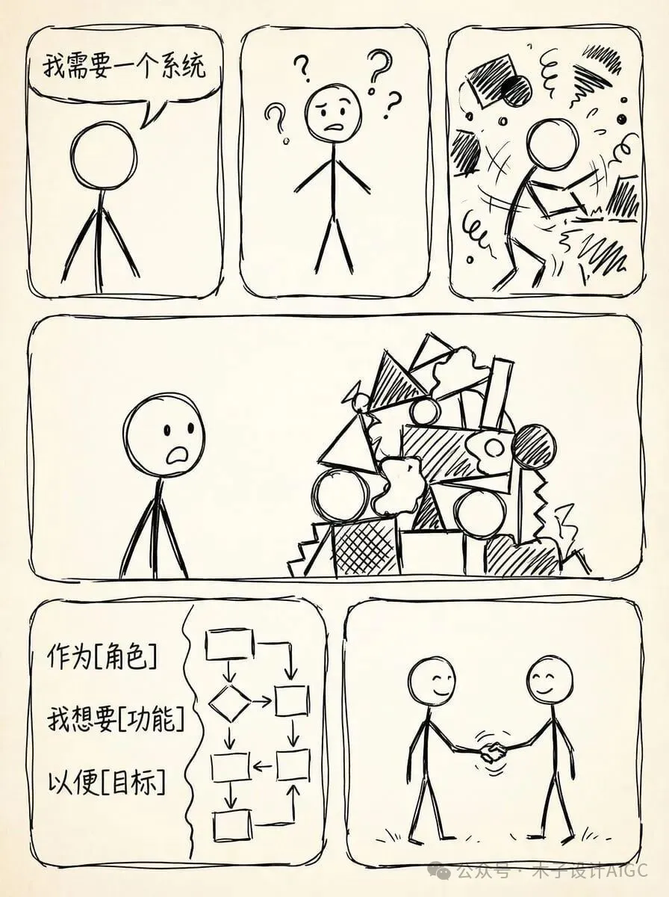
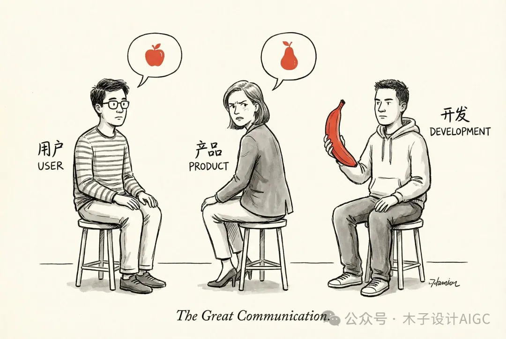
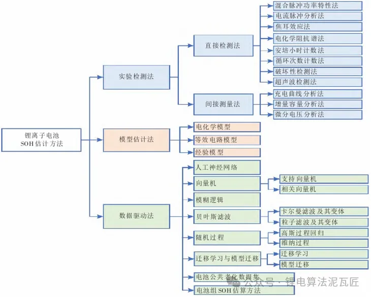

# 从识别到表达：写清楚需求的完整方法论

​     

## 为什么需求表达如此重要

在软件开发、AI应用、产品设计等各个领域，一个现象反复出现：大部分失败的软件开发项目、无所适从的困惑与问题、无从下手的AI提示词背后，映射了同一个核心问题——**当事人其实自己也不知道自己的需求究竟是什么。**

有位朋友在创业过程中，给2B企业做信息化调研与软件开发，给2C用户做职业咨询时发现，仅仅通过发挥需求识别与梳理方法，通过沟通的方式帮助他们找到"真需求"，就能很大程度上解决问题。


## 第一步：识别你的真需求

### 需求不清晰的两种表现

当我们说"需求不清晰"时，实际上包含两种截然不同的情况：

**1. 压根不知道自己要什么**

- 只有模糊的想法，没有具体的目标
- 无法描述期望的结果
- 不清楚解决方案的边界

**2. 以为自己知道，但实际上是伪需求**

- 混淆了表面问题和真实需求
- 被解决方案思维束缚
- 没有深入挖掘背后的真实动机

### 为什么需要识别真需求

真需求识别是一切工作的起点：

- **避免资源浪费**：不清晰的需求会导致返工、重做，浪费时间和金钱
- **提高沟通效率**：清晰的需求减少反复确认，降低沟通成本
- **确保结果符合预期**：明确知道要什么，才能得到想要的
- **为后续工作建立基础**：无论是开发、设计还是AI对话，清晰需求是前提

### 如何找到真需求

真需求的识别是一个沟通和梳理的过程：

1. **多问"为什么"**：深入挖掘需求背后的动机和目标
2. **描述具体场景**：用实际使用场景替代抽象描述
3. **明确成功标准**：定义什么是"做好了"
4. **识别约束条件**：时间、预算、技术限制等
5. **区分必须和想要**：分清哪些是核心需求，哪些是锦上添花

## 第二步：通过用户故事清晰表达需求

找到真需求后，下一个挑战是：如何把需求清晰地表达出来？



### 传统需求表达的问题

让我们看一个典型案例。假设你需要一个公众号爆文数据监控系统，如果你的需求描述可能是这样的：

“需要一个公众号爆文数据监控系统，能自动抓取爆文标题及内容信息，然后按热度排序，再然后用AI大模型针对这些爆文进行火热原因分析，输出结构化的分析报告。”

看起来挺清楚的？但开发人员看到后，还是会有一大堆疑问：

- 用户每天啥时候抓爆文啊？
- 一天抓几次啊？
- 容错机制是什么？
- 分析报告的具体内容是什么？
- 按什么维度排序？
- 什么叫"爆文"？阅读量多少算爆？



为了做对事情，负责的开发会反复提问，增加沟通成本。而有些开发可能直接按自己的理解去做，最终交付一个完全不符合用户期望的产品。

### 用户故事让需求更清晰

**用户故事（User Story）**是敏捷开发中的一种需求表达方法，它用一种结构化的方式来描述需求：

**基本格式：**

>作为<某种角色>， 我想要<某个功能>， 以便<达成某个目标>。  


**核心要素：**

- **角色（Who）**：谁会使用这个功能？
- **功能（What）**：需要什么具体功能？
- **价值（Why）**：为什么需要这个功能？要解决什么问题？

**验收标准：**

- 明确定义"完成"的标准
- 可测试、可验证的具体条件

### 用户故事的实际效果

还是刚才的案例，用用户故事表达后：

**用户故事1：自动抓取爆文**
>
>作为内容运营人员， 我希望系统能在每天早上9点自动抓取昨日公众号爆文（阅读量>10万）， 以>便我能及时了解热门内容趋势。  验收标准： - 每天早上9点自动执行抓取 - 抓取阅读量超过10万的>文章 - 包含标题、作者、发布时间、阅读量、点赞数 - 抓取失败时发送通知  


**用户故事2：热度排序展示**


>作为内容运营人员， 我希望爆文能按综合热度排序（阅读量×0.7 + 点赞数×0.3）， 以便我优先关
>注最有影响力的内容。  验收标准： - 使用综合热度公式排序 - 支持按时间、阅读量单独排序 - 显示>热度分数  


**用户故事3：AI分析报告**
>作为内容策划者， 我希望系统能用AI分析每篇爆文的火热原因， 以便我能学习成功经验用于内容 
>创作。  验收标准： - 分析维度：标题、选题、结构、情感、传播点 - 输出结构化报告（JSON格
>式） - 每篇文章生成200-300字分析 - 支持导出PDF报告  


对比之下，用户故事的表达方式：

- **有条理**：每个故事聚焦一个功能点
- **有逻辑**：清楚说明角色-功能-目标的关系
- **有重点**：通过验收标准明确具体要求

这样，产品经理知道了业务流程，开发明确了功能需求，测试清楚了测试场景，项目经理理解了验收标准。

## 第三步：判断何时使用用户故事

用户故事虽然强大，但并非适用所有场景。

### ✅ 适合使用用户故事的场景

**1. 产品探索、创新类项目**

- 需求快速变化，需要灵活调整
- 需要快速验证想法
- 用户反馈会持续影响产品方向

**2. 用户端应用、注重用户体验的产品**

- 直接面向最终用户
- 用户体验是核心竞争力
- 需要从用户视角思考功能

**3. 团队具备成熟的产品负责人和敏捷协作文化**

- 团队理解敏捷理念
- 有经验的产品负责人主导
- 团队成员能够积极参与讨论

**4. 需要快速验证假设、持续交付价值**

- 希望小步快跑，快速迭代
- 需要频繁发布新版本
- 重视持续改进

### ⚠️ 不适合或需谨慎使用的场景

**1. 强合规、高安全领域**

- 如航空控制、医疗设备系统
- 需要完整可追溯的需求链
- 文档要求严格，不能简化

**2. 底层平台/基础设施开发**

- 用户价值链条长且间接
- 技术复杂度高于用户体验
- 更注重架构和性能

## 第四步：用户故事实践指南

一个完整的用户故事通常包含：

**1. 标题**

- 简短、描述性
- 一眼就能看出要做什么

**2. 故事描述**

```
作为<角色>， 我想要<功能>， 以便<目标/价值>。  
```

**3. 验收标准（AC）**

- 使用"Given-When-Then"格式
- Given：前置条件
- When：执行动作
- Then：预期结果

**4. 优先级**

- 必须有（Must have）
- 应该有（Should have）
- 可以有（Could have）
- 暂不需要（Won’t have this time）

**5. 估算**

- 故事点数或工时
- 帮助规划迭代

### 写好用户故事的技巧

**INVEST原则：**

- **Independent（独立）**：故事之间尽量独立，可以单独开发
- **Negotiable（可协商）**：细节可以讨论调整
- **Valuable（有价值）**：对用户有明确价值
- **Estimable（可估算）**：团队能够估算工作量
- **Small（小）**：足够小，能在一个迭代内完成
- **Testable（可测试）**：有明确的验收标准

❌ **过于技术化: 作为系统，需要实现Redis缓存机制，以便提高性能。**

❌ **过大过复杂：作为用户，我想要一个完整的电商系统，以便在线购物。**

**✅** **从用户价值出发: 作为普通用户，我希望常用功能的响应时间在1秒内，以便获得流畅的使用体验。**

**✅** **拆分成小故事：作为购物者，我想要浏览商品分类，以便快速找到想要的商品。**

### 用AI辅助编写用户故事

**提示词模板：**

> 
> 我需要为[项目/功能]编写用户故事。  
> 背景信息： 
> - 目标用户：[描述用户群体] 
> - 核心需求：[简述要解决的问题] 
> - 预期目标：[希望达成的效果]  请帮我生成用户故事，包括： 
> 1. 采用"作为...我想要...以便..."的格式 
> 2. 为每个故事添加3-5条验收标准 
> 3. 按优先级排序 
> 4. 确保故事符合INVEST原则  
> 请生成[数量]个用户故事。  
>

**AI协助的场景：**

- 头脑风暴：生成多个角度的用户故事
- 优化表达：改进故事的清晰度
- 补充验收标准：完善测试要点
- 拆分大故事：将复杂需求分解


**注意事项：**

- AI生成的故事需要人工审核
- 确保故事真实反映用户需求
- 结合团队实际情况调整
- 不要完全依赖AI，要理解背后逻辑

### 总结：从识别需求到清晰表达的完整路径

需求工作是一个完整的链条，从识别到表达，每个环节都很重要：

**第一步：识别真需求**

- 通过"为什么"深入挖掘
- 区分表面问题和真实需求
- 用具体场景验证需求


**第二步：选择合适的表达方式**

- 评估项目特点
- 判断是否适合用户故事
- 也可以结合其他方法（用例、流程图等）


**第三步：用用户故事结构化表达**

- 使用角色-功能-价值框架
- 添加清晰的验收标准
- 遵循INVEST原则


**第四步：持续迭代改进**

- 根据反馈调整故事
- 补充遗漏的细节
- 优化表达的清晰度
- 
**关键要点：**

1. **用户视角至上**：始终从用户价值出发思考
2. **具体胜于抽象**：用例子和场景说明需求
3. **可测试性**：需求要能被验证和测试
4. **持续沟通**：需求不是一次性工作，需要持续澄清
5. **灵活应用**：方法服务于目标，不要教条主义


**很多问题的根源在于不知道自己真正要什么。**当你能够清晰地识别和表达需求时，你已经解决了大部分问题。

用户故事不只是一个工具，更是一种思维方式——它提醒我们始终站在用户的角度，清晰地表达"谁、要什么、为什么"。掌握这个方法，无论是做产品、写代码，还是和AI对话，都会事半功倍。


# 我是如何失去团队掌控的？

[漫步coding](javascript:void(0);)

> 摘自: https://www.v2ex.com/t/882400

我是一个不合格的技术总监，在过去的快三个月里。我带着从 40 多个人的研发团队（包含需求、开发、测试）里抽调出 20 多个人去为公司开疆拓土。在这快三个月中，我们一起奋战奋斗拼搏。在过程中，我通宵时间超过半个月，干到凌晨 4/5 点的日子数不胜数，干到凌晨 1/2 点日子更是习以为常。整个团队绝大多数人近乎两个月没有周末，辛苦异常，是实实在在的高峰体验。但是三个月后，我带着失败和一身的惨痛教训回到公司。

我在这次的经历中感受到了我是怎么失去团队掌控力的。我所谓的团队掌控，不是说兄弟们不听安排，不按计划行事。而是我对整个开发团队、测试团队、需求团队都有了新的认识，重新认识了团队，重新认识了这二十多个人。因为对个人和团队的能力判断误差和对项目难度的判断失误，导致了这次惨痛的教训。

我把我所面临的的困境和遇到的问题分享给大家，也将把我所做的决策分享给大家，并把我所意识到的错误分享给大家。希望能给每个面临此种局面的同行进行提醒。

------

## 项目和团队背景

1. 共计三个月内有四个项目，没有正式的项目经理，只有三个实习项目经理
2. 三个实习项目经理中，一个带过一个小型持续性项目（前后端共 3 人）接近一年；一个带过小项目（ 4 人）一个月；一个带过两个中小项目（ 7 人），共计半年时间
3. 开发同事都相对年轻，工作年限最长的也就三年。朝气蓬勃但的确经验不足
4. 团队中老同事新同事各占一半吧，超过半数的同事来公司不到一年
5. 四个项目都基于同一个客户提供基础版本（或者说框架）进行开发
6. 客户方使用的基础框架过于老旧，十多年前的前后端框架，前端使用技术特别偏门，学习成本巨大
7. 框架混乱不堪，表就有快 2000 张，说是框架但杂含着各种各样的业务代码，且又必须使用
8. 开发调试的环境配置困难，项目必须跑在 linux 上，只能远程调试。项目由于过大，启动缓慢，编译一次大概 10 多分钟。我们团队不熟悉此种模式，摸索浪费了一段时间
9. 客户公司较大，研发部门较多。开发过程中部门协调工作占比超过一半，需要和各种各样的设备做对接，都是别的部门开发的。部门之间互相踢皮球，找人协助困难

## 错误一：高估团队水平

1. 自以为很了解同事，其实了解的太片面。在过去一年中，由于做的项目比较稳定。持续产出在可控范围内，客户也比较认可。导致我产生了觉得我们团队还不错的错觉
2. 整个团队在面对全新环境的情况下，适应能力偏弱。难以快速稳定的产出，项目开始了两个星期，基本都处于熟悉环境、熟悉项目的状态，一直没有有效产出。导致时间被浪费
3. 比如某 A 刚入职 3 个多月，在其他项目中，项目负责人给出的评价还不错，导致我把他放在了重要的开发位置上。但项目一开始，我就发现某 A 技术水平差的有点厉害，多表联查的 sql 都写不溜。此时已无人可替他，只能我上去协助他 比如某 B 一年多来，带的项目一直稳定未出大问题。但到了新项目中，理解能力较弱无法快速全面理解需求。同时也暴露出了某 B 没有风险意识的致命缺陷，不能识别风险，识别出了风险也不反馈不作为，导致项目多次跳票

***反思：***

1. 考核很重要，全面的考核反馈更重要
   - 在人员和团队方面，产生最要命的问题，我想就是考核机制的问题了。由于种种原因，对同事的了解都太片面。在用人方面把人放错了位置。狙击手放到了主攻手的位置上，主攻手放到了指挥员的位置上。这样战斗不失败才怪呢
   - 站在一个较高的位置，很容易对下面同事的能力判断失误。就我认为，在人数不多的情况下，最好的了解大家的方式，是一起战斗。在一场战斗里，观察每个人每天的态度表现、效率产出、代码质量、协调能力、对外沟通能力等。经过一个项目下来，就能对这个项目组中的成员有个较全面的了解。但这种方式不能只是站在项目外看，而要和大家一起就同一个项目开展工作
   - 从多方去了解一个人，不只听某一人之言。对如上的某 A 来说，就是因为只听了一人之言产生了较大的误判（某 A 在另一个项目中，只做了导出功能，未接触数据库）
2. 不用静止的眼光看人，人都是在不断变化的
   - 人都是在不断变化的，而我用了以往的经验去评判大家。有的高估了，有的低估了。没有把最合适的人安排给最合适的项目
   - 不应把过去的错误或者功能记在今天的账上，要持续的跟进大家的变化，持续的保持对大家的新认识。不以固有的眼光看人
   - 也应通过积极的引导，帮助同事改掉自己的不足。而不是听之任之，由其自生自灭。只有这样，团队才能进步，这也是一个 leader 最应该做好的事情，我在这方面差的还太远
3. 因事定人不可取
   - 某 D 之前由于某次技术预研的工作，让我认定他一般。但在这次的项目中，他却成了最稳定输出的一环
   - 由此可见，不能因为某人一时做的好或者不好，就给这个人定了型，先入为主的下定论。要客观的评价一下个人，需要了解他的全部历史和全部工作。也就是第一条说的，要有全面的考核反馈机制

## 错误二：低估项目难度

1. 项目共计 4 个，每个项目（只支持 IE ）都需要和额外的客户自研中间件、插件（ ActiveX ）、多种硬件设备对接。此前未做过和硬件对接的设备，低估了对接的难度
2. 中间件、插件、硬件设备的对接我万万没想到，什么文档都没有。只能去搜历史代码学习测试，或者到相关部门去问问。而此前沟通过程中，我心中默认对接是有文档或专人指导的，没有问清楚
3. 前端使用框架（ 2006 年的框架和版本）过于老旧，由于对前端了解不足，错误的估计了学习曲线，团队前端同事开发前期非常吃力，进度在这块也拖延了一大段
4. 跨部门沟通的难度远超我的想象，此前沟通过程中，明确好跨部门沟通有专人负责，但到了实际工作中，都变成了我们自己去对接。各个部门互相踢皮球，一个摄像头到底是什么型号的问题（测试需要特定型号的摄像头，对接人不清楚借来的是什么型号），我能花 3 个小时跑遍五层楼才得到答案。更不用说代码层面的指导了
5. 没有了解到客户方框架的真实情况，心中以为是在 spring 上封装的脚手架。没想到框架中包含了快 2000 张表，数百万的历史代码。光用户模块就有不同的三套（该框架会在各个定制的基础上，定期的把定制内容合到框架主干上，导致了各种没有用的历史遗留代码），找想要使用的功能搜索难度大增

***反思：***

1. 经验很重要，但经验也很致命
   - 在此次前期沟通中，很多我以为，我认为都是经验主义所害。比如对接文档的问题，多问一句，可能情况就很不一样
   - 经验也可能成为风险之一，需要警惕
2. 想法设法获取更多信息
   - 四个项目的对接人了解的信息都不全面，到我这的信息就缺失更多，而我当时以为这就是全部的情况。信息的缺失是会让判断失去方向
   - 在现有信息中，要去挖掘出更多的问题和信息，并找对接人确认。越多的信息越能为判断提供更准确的方向
   - 对接人也不清晰的情况，需要推动对接人去找相应人员获取，得到相对准确和完善的信息
3. 锁定项目核心重难点
   - 在这几个项目中，有的项目没有在一开始就抓住项目核心重难点。比如甲项目中核心功能是存储，且需要使用客户自研存储设备，项目初期未锁定该重点问题，导致后期项目核心功能全部返工
   - 一般采取排除法来锁定核心重难点。把所有的页面可见功能点和隐含功能点列上，以排除法排除独立的关联少的模块。留下的就是重难点的核心要素
   - 针对每个核心要素搞清楚联系关系，得到最终的功能关系图（业务架构图）

## 错误三：战术错误，同时面对过多的项目

1. 回过头来看，人手不足的情况同时接了过多的项目是错误的。但这的确是一个两难的问题，不能简单的用错或者对来概述
2. 接或者不接，这本就是一个博弈的过程。综合分析项目是否确定会交由我们来做，再分析是否有能力完成，考虑清楚后再下结论

***反思：***

1. 项目中总是会面临资源不足的情况，永远不要想着项目中拥有最适合的资源、人员。毕竟最适合的人员不可能一直等着你的项目
2. 带项目就像打牌，一手好牌做好了项目是应该。而一手烂牌打赢了才是你的能力

## 错误四：管理不是轻松的事

1. 最后一个错误，是在项目无人可带的时候，迫不得已我去带了项目。陷入了某个项目的具体细节后，没有了统一对所有项目进行管理协调的人
2. 管理是很耗费精力的，需要专人专职的去处理。管理者一大职责就是沟通协调，尤其在这种需要强沟通的项目中
3. 一旦陷入了具体的某个项目中，就很难有精力去维持其他项目了
4. 授权很重要，但检查更重要。交付出去的工作，要定期检查，保证交付物是完成的、完整的、不返工的

## 我所吸取的教训总结

1. 建立更全面的考核反馈体系对认识团队至关重要
2. 不要局限于经验，沟通胜于一切
3. 反思每一次战术失误，保证下一次的精确打击
4. 专人专事，专职管理的人，就不要陷入开发细节中，一旦大量精力投入了开发。这将是致命的风险


# 20天，一个人，一台电脑：我肝出了这个 46 项全能的 AI 超级终端

## 01. 一个人的 480 小时：极客精神的极限冲刺

很多人不相信，一个人、一台电脑，能在**20天**内完成从底层架构到**46 项智能技能**的全场景覆盖。
但这正是**EchoMindBot**诞生的真相：

凌晨6点还没睡觉的人，当时脑子里想了很多，摸摸的在代码仓库开辟了一个新的项目。
**20 天的孤军奋战**：没有团队，没有外援，只有代码与深夜的咖啡。
**每天 17 小时以上的极致专注**：在 Rust 的严谨与 Tauri 的灵动间反复横跳，亲手敲下每一行自动化逻辑。
为什么要这么拼？可能是因为我受够了在几十个 App 间机械切换。也可能是受够了抖音里面浮躁的氛围。又或者是为了兑现十年前给自己的承诺，做一个极客该做的事情，为自己的爱好做事情。

### 02. 开启“飞轮”：AI 正在让 AI 进化得更快

在这次 v1.1.0 版本的更新中，最令我兴奋的不是那 46 项开箱即用的技能 ，而是我加入的一个**实验性功能**：**AI 自学习技能测试**。
这就是我眼中的“飞轮效应”：
**自驱动进化**：AI 不再是被动等待指令的工具，它开始通过观察和学习，尝试自己构建新的技能逻辑。
**指数级增长**：当 AI 开始学习如何学习，新技能的诞生将不再依赖于我的 17 小时肝进度，而是进入自我迭代的快车道。
获取这就是碳基生命与硅基生命的协作，我可能只是它启动的助燃剂，后续它可以自我学习自我迭代，再不同的人手下可以学会越来越多的知识与技能，不再依赖电脑前的我。

### 03. 46 项神技：你的 AI 超级终端

谈谈现在已经实现的技能表吧，可能每个技能都还很初级，但是我觉得作为一个雏形它已经很优秀了，相信在很多专注某几个技能的人手里会越来越聪明。
**EchoMindBot**现已覆盖 8 大场景，支持自然语言驱动，本地运行保障隐私 ：
**🛒 购物物流**：京东价格监控、淘宝订单管理、快递一键查询 。
**💼 办公效率**：飞书、钉钉、企微全自动化协作，语雀/有道云笔记管理 。
**📱 社交媒体**：抖音、小红书、知乎、微博等 17+ 平台一键内容分发 。
**💹 金融理财**：从 A 股行情到币安实时动态，甚至 Polymarket 预测市场 。
**🔧 开发者工具**：Git 操作、Jenkins 流水线、阿里云/腾讯云/火山云远程管理 。

### 04. 结语：用自然语言驾驭一切

这只是个开始。随着“自学习飞轮”的转动，**EchoMindBot**的边界将无限延伸。
它是我的 20 天极限挑战，也将成为你的**最强数字资产**。

------

**注：**不要再说我是套壳、博眼球了，作为一名极客确实有点点伤心，如果想要跟我一起研究，可以免费共享成果，如果您的行业和工作需要用到AI，且有对国产化、私有化、定制化有严格的要求，可以联系我们。如果您需要claude、gemini、gpt等模型，也可以跟我们联系。我们还是有大量的不同模型测试多Agent协作的实验场景，感兴趣的也可以联系。

这里统一回复下“为什么不开源？”，如果是要一起研究AI场景的我绝对是持开放态度的，但是如果想用我的东西套壳卖的，对不起，作者没这么大度。


# 10件随手可做，却能让生活质量大幅提升的小事

哈喽，我是K叔。
如果你想做个人IP，但是不知道从哪里开始；如果你想做公众号和短视频，但是毫无头绪，一定要**点击上方的“预约按钮”。**
我会把我60天涨粉35万+的经验放在这场直播里，并且我还预留了提问时间，希望可以针对性的帮你解决你在打造个人IP过程中遇到的问题。
咱们2月20日中午11点30分，不见不散。

今天的文章，我想跟你分享一些生活中的小技巧。
它们足够简单，不需要很大的力气就能做好；但同时又足够有用，能够显著地提升你的生活质量，让你的生活更上一个台阶。
希望这些方法，能够为你的 2026 年，打开一个好的起点。
也希望这篇文章，能够给你一点启发、思考和会心一笑。


**将特定的日子设为新习惯的起点**
心理学上有一个很有趣的现象：把特定的日子设置为起点，能够显著提升我们在其后一段时间的动力，让我们更容易把这个习惯坚持下去。 
什么叫「特定的日子」呢？只要是一切你觉得有意义的日子都可以。比如：春节，元旦，生日，国庆节，等等。
原因在于，当我们以这些日期为起点制定目标时，我们的内心会将过去的怠惰和不完美归入上一个时期，认为它们已经结束了；从而，我们人为地划分出一个全新的、从零开始的新时期。在这个新时期，我们可以忘掉过去的失败，踌躇满志地重新开始。
因此，这种效应被称为「重新开始效应」（Fresh start effect），它是提高我们行动力的一个非常有效的技巧。
不过，这种效应的时间是有限的，不足以支撑太久。
因此，一个更好的运用技巧是：把你想实现的目标分拆成多个小目标，均匀地分摊到一年里的不同时期，并为它们设计一个特定的日子作为起点。
这可以神奇地改善你的拖延症，让你更容易行动下去。

 

**随时随地只要想到，就起来活动一下**
我们的身体并不是设计用来久坐的。
从漫长的进化史来看，我们在上百万年的生活中，一直是在保持活动，行走、奔跑、跳跃、劳作……这种需要长时间坐着的生活模式，只不过短短一两百年。
因此，「坐着」其实不是一个最佳的状态，对身体来说，最好的状态是什么？是不断改变它的活动，不断地切换各种姿势，不要让某一部位的肌肉持久地紧张，承受负荷。
2021 年的一篇论文提出了一条计算公式：1:3:12 左右的比例是比较合适的。也就是：每久坐1小时，最好搭配进行3分钟的中等或剧烈运动，或者12分钟的轻度运动。 
不过，我们可以不用计算得这么精确，而是试着去养成这么一个习惯：任何时刻，只要你觉得「我是不是坐得有点太久了？」就马上站起来，活动一下、走动一下，简单地活动一下身体。
不论做点什么都好，重点在于让自己改变姿势、改变状态，避免长时间处于一种姿势里面。
这会让你的身体变得更灵活、更强韧，更能够抵抗长时间工作的压力和劳损。


**用简单的一两句话记录当下的想法**
我有一个践行了许多年的习惯：当我产生一个有意思的想法或感受时，只要有条件，我都会立刻把它记录下来。
比如：在外面散步，感受着和煦的阳光，看着周围的人来来去去，骤然产生一种温暖而充盈的满足感，我就会立刻打开笔记软件，随意写上几句现在的心情。
再比如：读一篇文章时，因为某几句话勾起共鸣，让我联想到其他的知识点，从一个节点跳跃到另一个节点，我也会立刻打开笔记，将这种灵机一动记下来。
它们既是一个丰富的素材库，方便我在需要的时候从里面寻找有用的素材；同时，也让我在翻看和回顾的时候，能够通过这些只言片语回忆起当时的情境和心情，重新想起当时自己在做什么、感受到什么、想到了什么，从而，让生命变得更加连贯又清晰可辨。
它们就像一个又一个的锚点，串联起了整个生命的体验之流。
试一试，利用好手机自带的备忘录（或其他软件），当你产生某个有趣的念头、问题或感受时，随手把它记下来，不需要很复杂，一两句话就好 —— 甚至用几个关键词都行。待后面闲暇时，再慢慢去回顾、咀嚼。
假以时日，你一定会发现它的美妙之处。


**帮别人一个举手之劳的小忙**
经常有人问我：有什么简单又有效的方法，可以立刻获得幸福感？这个问题看上去有点不现实，但是，真的有。
这个方法是什么呢？就是为别人提供一个举手之劳的帮助，帮别人一个简单的小忙。
对别人提供帮助，你会感受到一种来自他人的强有力的反馈，这种反馈可以成为你的一个「锚点」，帮助你跟外在世界联系起来。就像在漫无目的地飘浮在空荡荡的世界中时，踩到一块坚实的木板。
而我们的意义感和价值感，就可以构建在这么一块块木板上面，来坚定地支撑住我们的自我认同。
所以，我一直很提倡一个做法，叫作「5分钟给予」：每天抽出一点时间，帮别人一个小忙，跟别人建立联系。

- 可以是解答一个问题，分享自己的见解；

- 可以是参与讨论和交流，给别人一个响应；

- 又或是为别人提供一个建议和指导，解决别人的困惑……
  人是社交动物。从社交中获得养分和力量，是我们大脑的「出厂设置」。而要获取这种养分，其实非常简单，你只需要「日行一善」就可以了。
  试一试，这可以让你的生活幸福感稳步地、不断地提升。

  

**维护一份记录生活点滴的相册**
当你感到无聊的时候，沮丧的时候，情绪低落的时候，最好的排遣和消解方法是什么？就是让自己沉浸在美好的情感和回忆里面。
比如：打开你的相册，选择一张照片，问问自己：这张照片是在什么场景下拍摄的？它带给你的美好回忆是什么？你还能不能回忆起当时的情景，感受到当时的画面、声音、气味和心情？
或者，翻出自己的日记，找到让你开心或感恩的记录，问问自己：这件事情的来龙去脉是什么？是哪些地方令你感到开心？你还能否回想起当时那种开心的感觉？
这可以非常有效地舒缓你的精神，激活你的副交感神经，让你感到放松，从而更好地面对当下的压力和挑战。
因此，在平时有空的时候，去维护和完善一份「生活记录相册」，就特别重要。这样在你需要的时候，才能及时拿出来。
很多人总是拍了照片就让它堆积在相册里，很少去整理，这其实是一种浪费。试一试把它们整理一下，按照不同的经历和项目去归类、汇总，这样，才能在需要的时候，随时随地去翻阅。
可以用相册管理软件或日记软件来建档，也可以导入到电脑里之后，用文件夹来分类。把它们罗列成一个个小的项目，用这些项目填充生命的间隙。
这会是你对抗无聊、枯燥和负面情绪的最好武器。


**读一点小说，沉浸到小说世界里**
我们的大脑被塑造的方向，很大程度上就是不断去适应新环境、新情景，去接触和适应不同的人，使得我们能够更好地生存下去。
但是，现实世界中，我们能够接触的人和环境依然是比较有限的。我们不可能真的跟许许多多人交流，时间精力和条件都不允许。
所以，替代这一点的，就是小说了。
小说的作用，就是模拟一个真实的世界。这个世界虽然是虚拟的，但其中的规则、环境和人物是高度真实的。
阅读小说时，我们其实就是把自己代入进去，无意识地思考：假如我在这个环境里，我会说什么、做什么；假如我碰到了这个人，我会有什么感受、如何反应，等等。
它相当于为大脑提供了一个训练场，让大脑沉浸在里面，训练自己对不同性格和类型的人的熟悉程度，以及对不同环境的适应能力。
当然，不局限于小说，角色扮演游戏和影视剧也能起到类似效果。不过，游戏和影视剧由于其多媒体形式，比较容易吸引我们的注意力，让我们沉浸其中。
要么被成长和奖励所吸引，要么变得被动接收信息而懒得动脑，那就不太好了。


**试试和陌生人聊聊天**
2021 年一项研究发现：跟陌生人进行轻度的聊天，可以有效地提升主观幸福感。原因可能是因为：
跟陌生人聊天时，我们更加无拘无束、没有包袱，因此更能够真实地展现自我，全身心沉浸在这种交流之中。 
如果你觉得日常生活中没什么朋友、没什么跟人交流的机会，不妨试试这种方式。
可以趁节假日出门散步时，随意走进一家小店，跟店员或客人聊聊天。不用过于拘谨和害羞，试试冒充一下「社牛」。
或者参与一些线下的活动，通过这些活动主题自然地聚拢有相同爱好和兴趣的人，这样聊天起来也会更加有的放矢，不容易遭遇冷落和尴尬。
一个注意点是：线下的见面聊天效果比线上的更好。所以不要太拘泥于线上了。
很多时候，你更主动地打开自己，往往能收获超过预期的良好回应。


**听一些律动感强的音乐**
2022 年的一项研究发现：音乐能够刺激大脑前额叶皮质，让它变得更活跃，从而让我们的头脑变得更清醒，思维变得更高效。 
什么样的音乐效果更好呢？最好需要满足两个条件：一是这些音乐是你所喜爱的，能够唤起你的兴奋与愉悦感；二是最好有一定的律动感和节奏感，能够让你产生想要随之摇摆的冲动。
不仅如此，大脑会将律动感强的音乐跟快乐、兴奋等感受联系起来。因此，听这些音乐还能改善情绪、振奋精神，让心情变得更愉悦。
所以，一个建议是：不妨培养日常听音乐的习惯，尤其是一些较为欢快、律动感较强的音乐，可以一边听一边学着哼唱，这样效果更好。
不过，建议是在工作的间隙或休息的时候听，不要一边听一边工作，否则可能会抢占认知资源，导致做事情出错喔。


**在夜晚使用暖光和点光源**
有一个让你感到幸福的最简单技巧：在夜晚不要打开太亮的大灯，而是开几盏暖光的台灯和射灯，让自己沐浴在小范围的暖光里。
原因在于：暖光加点光源，可以模拟出「火堆」的感觉，这是刻在我们基因深处的安全感，它提供了一种庇护、温暖、远离寒冷和猛兽的暗示，可以让我们立刻安下心来。
另一方面，过亮的光照会刺激我们的警觉系统，让大脑保持警觉和兴奋，不容易安定下来。
因此，在睡前更多地采用点光源照明，会更有助于睡眠。
同样，如果你在晚上用电脑和手机，那么不妨试试把色温调低，尽量偏向暖光。一方面可以提供温暖、舒适的氛围，另一方面也能减少蓝光的照射，刺激褪黑素的分泌。
一个小小的建议是：睡前半小时到一小时（按自己的实际情况而定），关掉大灯，开暖光台灯，要么跟家人坐在一起聊一会天，要么安静地看一本书，要么翻阅和回顾一下自己的笔记，让自己的心静下来。
这既能够为你提供安全感和幸福感，又能让你拥有更好的睡眠。

 

**试试什么也不做，单纯发呆 15 分钟**
我们总是在追赶着时间，一切为了「快速」和「高效」，追求在更短的时间内做更多的事情；如果停下来，就会觉得空虚、无聊，觉得自己在浪费时间。从而，一直活在一种对时间的高度焦虑和追赶之中。
这其实是不必要的，它只会让我们变得更忙碌、更麻木，久而久之，慢慢失去对生活的感受和知觉。
所以，一个简单的小建议是：试一试什么也不做，什么也不想，静静地坐着，待15分钟。
在这15分钟里，你的大脑里面一定会充斥着大量的念头和想法，可能还有一阵阵催促你赶紧站起来去行动的声音，试着不要在意它们，让它们起起落落，来来去去。
如果有条件，不妨到外面去，找一个环境比较好的角落，暂且关闭掉大脑的思考，而是打开自己的感官，专注地去听、看、闻，去感受周围的一切。
这可以让你慢下来，让全身放松下来，让紧绷的神经变得舒展，身心就像洗了一个热水澡一样舒服、自由。
你会发现，当你稍微放慢脚步，生活也会变得更加立体和多彩。


# 2026第05期--储能锂电池SOH算法技术路线汇总+电池数据集分享！！

*\**\*本篇将主要讲电池寿命（SOH）的预测算法，汇总主要的方案，并且汇总公开数据集。学生可以参考用做毕设，工程师可以参考开发工程。\*\**\*

## **概述**

基于模型的估计方法是间接检测方法的一种扩展，它通过对电池观测数据的分析模型来识别和估计电池SOH。该方法通过建立电池的物理或电化学模型，观察电池内部的物理和电化学性能，同时获得电池系统内部状态与外部特性的关系及其老化演变规律。基于模型的估计方法一般可分为电化学模型法、等效电路模型法和经验模型法。

锂离子电池SOH估计的主要算法如下：



### 02 基于模型的估计方法

基于模型的估计方法在处理复杂电池行为和实现更高的精度方面仍然面临挑战。研究人员正不断尝试通过引入机器学习和其他数据驱动技术，进一步增强模型的自适应性和在线应用能力。

#### 2.1 电化学模型法

电化学模型法是利用多孔电极理论研究电池内部的电化学过程，包括开路电压、液相扩散、反应极化和欧姆极化等因素。基于这一理论，该方法建立了一套非线性耦合偏微分方程来描述电池的电化学行为。通过构建的电化学模型，与实际测量的电池数据相比较，可以对电池SOH进行有效评估。这种模型源于电池的工作原理，能够详尽描述电池的内部电化学动力学，通过该方法可以确定电池的老化过程机制与固体电解质界面的生长、活性物质的损失和锂库存损失的相关性。但该法存在求解微分方程难度大、计算过程繁琐复杂、建立标准模型困难及模型参数辨识困难等问题，从而限制了此方法的实际应用。

#### 2.2 等效电路模型法

等效电路模型法（Equivalent Circuit  Model，ECM）使用电子元件（通常由恒压源、电阻、电感、电容等基本元件组成）来模拟电池的充放电过程。利用电路模型，可以描述电池的动态特性和容量衰减特性，从而对锂电池的SOH进行估计。ECM参数辨识的框架主要分为以下几个方面：

1）电池的开路电压（Open Circuit Voltage，OCV）可以用于充电状态相关的电压源来表示。通过测量电池在静态状态下的开路电压，结合电池的容量变化规律来估算SOH。

2）电池的逐渐扩散过程可以用一系列串联的并联RC网络来描述。

3）电池的欧姆电阻或其直流激励响应可以通过电压源串联来表示。通过监测电池的内阻变化，推断电池健康状况。电池的内阻随着老化而增加，因此内阻变化可以作为SOH估算的参考。

通过整合这些组件，电池的运行模式可以通过一个包含电压源及各种电阻和电容的电路来模拟。同样可以利用卡尔曼滤波和粒子滤波算法，通过对电池的实时数据进行建模和优化估算，得到SOH的估算值。

#### 2.3 经验模型法

经验模型法是使用电池老化过程数据（如温度、电流速率与放电深度等）来预测LIB的SOH，而不需要详细了解电化学电池设计和材料特性。在该方法中，通常使用多项式、指数和幂律等作为拟合模型，以实现快速计算过程。根据电池老化方式的不同，经验模型方法可分为日历模型和循环模型。一般优先考虑日历模型，因为它包含了电池的主要老化过程。

经验模型方法也存在其局限性。首先，这些方法的准确性高度依赖于基础经验模型的精度。其次，这类模型通常忽视了对电池内部参数的内在物理意义的深入探讨。然后，构建一个经验模型需要大量的时间投入，同时收集数据集的成本也相当高昂。此外，这些模型往往受限于实验条件的规定。


### 03  数据驱动法

数据驱动法通过机器学习或统计算法，直接挖掘一段时间内观察到的电池电量数据与电池SOH之间的关系，探索电池健康状态或老化特性的隐含信息。该方法避免了模型估计方法中使用的电池模型和额外的滤波器，因而更加灵活和适用。本节将数据驱动方法大致分为基于人工神经网络的方法、基于向量机的方法、基于模糊逻辑的方法、基于贝叶斯滤波的方法、基于随机过程的方法和基于迁移学习与模型迁移的方法。

#### 3.1 人工神经网络

基于人工神经网络（Artificial Neural  Network，ANN）的方法旨在解决电池健康状态参数的非线性特性，这些方法只需大量特征参数数据集，而无需掌握电池老化的内部原理。ANN包括多种类型，如前馈神经网络（FNN）、递归神经网络（RNN）、长短期记忆网络（LSTM）、反向传播神经网络（BPNN）等。

#### 3.2 基于向量机的方法

3.2.1 支持向量机

支持向量机（Support Vector Machine，SVM）是一种广泛应用于非线性系统的机器学习方法，擅长使用惩罚函数和核函数技术处理样本数据的线性不可分性，通过在高维空间中构建最优分离超平面来构建分类预测模型。

3.2.2 相关向量机

相关向量机（Relevance Vector  Machine，RVM）与SVM类似，同样是使用核函数和相关函数在高维特征空间中对数据进行非线性变换。不同之处在于，RVM比SVM使用核函数的频率更低，其高度稀疏的特性使得方程中的大量权重为零，从而提高了计算效率并避免了使用自由参数集。常用的核函数包括Sig⁃ moid核函数、多项式核函数、线性核函数、径向基核函数和复合核函数。

#### 3.3 模糊逻辑法

模糊逻辑（Fuzzy Logic，FL）提供了一种独特的方法来理解输入和输出变量之间的复杂关系。与传统的二值逻辑（即真或假）不同，模糊逻辑引入了多值逻辑，通过隶属函数来区分模糊集，并处理模糊关系。

3.4 基于贝叶斯滤波的方法

基于贝叶斯滤波的方法源自隐马尔可夫模型，其主要内容是利用观测数据构建概率密度函数（Probability Density  Function，PDF）的形式参数估计模型。其关键问题是如何将置信度转换为可计算的PDF或可观测的分布特征，因此贝叶斯滤波算法通常分为参数滤波（如卡尔曼滤波器及其变体）和非参数滤波（如粒子滤波器及其变体）。

3.4.1卡尔曼滤波及其变体

经典的卡尔曼滤波（Kalman  Filter，KF）算法是一种可靠且成熟的高斯线性动态估计方法，它由一组递归方程组成，在系统运行时进行重复运算。但由于锂电池的老化过程是宏观时间下的非线性衰退过程，因此需保留传统KF优势的前提下进行非线性动态改造。应用比较广泛的KF变体包括扩展卡尔曼滤波器EKF、双扩展卡尔曼滤波D-EKF、无迹卡尔曼滤波器UKF等。

3.4.2 粒子滤波及其变体

经典的粒子滤波（Particle  Filter，PF）算法将蒙特卡洛采样原理和递归贝叶斯推断相结合，其算法核心是找到一组具有相关重要性权重的随机粒子样本表示后验概率密度。此类方法适用于处理非高斯非线性的在线动态问题，且不需要大量历史研究数据作为基础，是KF算法的发展和延伸。然而，关于经典PF算法存在粒子多样性退化的问题，此类问题源于算法本身的规则，由于无法获得最新的观测数据，导致只有极个别参数作为重要权重，而其他参数权重则趋近于零。根据此类情况，可以采取两种策略解决问题。一是采用重复采样，二是选择合理的后验分布建议。但重复采样这一举措会影响粒子分布，导致粒子失去多样性。因此选择合理的后部分布建议是改进PF算法的有效途径。该类型下应用较为广泛的是无迹粒子滤波（Unscented Particle  Filter，UPF），应用UPF可以有效地适应电池在充放电下具有非线性和非高斯性质的OCV。同时，UPF能够结合最新的测量信息，提供比PF更接近真实后验分布的建议分布。

#### 3.5 随机过程的方法

基于随机过程的方法主要通过建立随机老化模型来估计SOH，该模型可以描述锂电池老化过程中的不确定性。

3.5.1 高斯过程回归

高斯过程回归（Gaussian Process  Regression，GPR）是一种概率预测工具，可以通过高斯过程的适当组合对任何系统的行为进行建模，并结合先验知识实现基于贝叶斯框架的预测。该方法由于其灵活性、非参数性和概率性，已成为电池SOH估计领域最流行的工具之一。例如，基于GPR的数据驱动诊断技术被用于锂电池的在线容量评估，该技术可以在短时间内估计出锂电池在恒流下的容量。此外，GPR还可以对电压和IC曲线中提取的特征进行回归跟踪。

3.5.2 维纳过程

维纳过程（Wiener  Process，WP）是一种带有漂移系数的独立增量过程，也称为布朗运动过程。因其具有强马尔可夫性质，适用于描述LIB老化模型的不连续增减趋势的非单调特征。总之，维纳过程的适应性和多功能性使其成为退化建模和剩余寿命预测的有力工具。随着技术进步及产品和环境复杂性的增加，预计这种建模技术将进一步发展，提供更加准确的预测。

#### 3.6 迁移学习与模型迁移

在电池管理系统中，由于不同电池化学成分的独特性，创建一个能够在各种电池类型中泛化的强大模型是一项挑战。迁移学习和模型迁移是克服这一挑战的两个关键方法，可使为一种电池类型开发的模型应用于其他电池类型。

3.6.1 迁移学习

迁移学习（Transfer  Learning，TL）在机器学习领域，尤其是SOH监测这一领域中产生了显著影响。TL的核心优势在于它能够将在大型和多样化数据集上训练的模型适应于特定或较小的数据集，无论电池类型或条件如何，这种适应能力在数据可用性不一致、但对精确和高效的SOH估计有迫切需求的领域中非常宝贵。

3.6.2模型迁移

模型迁移（Model Migration，MM）是将知识从一个领域转移到另一个领域，利用已有的模型来节省时间和资源，其目的是减少模拟类似过程的实验工作量。MM方法尤其适用于在不同条件或变量下研究类似过程或系统的领域。

### 04  公共老化数据集

数据驱动的方法虽然提供了对电池行为和退化的重要见解，但它们往往受到观察数据的不确定性和不完整性的限制。这种限制可能导致使用这些方法开发模型的鲁棒性和适应性方面存在问题。解决这些问题，对于开发更准确、更稳健的模型至关重要。这些数据集通常包括各种参数，如充放电周期、温度、电压、电流和容量随时间的衰减，提供了各种条件下电池老化的详细情况。

#### 4.1 LiFePO4（LFP）/石墨电池综合数据集

Severson建立了一个来自商用LFP/石墨电池的综合数据集，该数据集涵盖了72种不同快速充电条件下的124个电池，显示循环寿命在150~2300次之间。该数据集的关键元素包括高倍率放电电压曲线，及详细的充电和放电电压和电流。该数据集在数据驱动的方法中提供了显著的预测精度，特别是前100个周期的测试误差为9.1%，而使用最初的5个周期进行分类的误差仅为4.9%。这种精度主要是通过从高倍率放电电压曲线中提取关键信息来实现的，有效地避免了延长诊断周期和复杂的细胞化学知识的必要性。

然而，该数据集也有其局限性。它主要关注的是快速充电条件，这可能不够全面，无法捕捉到锂电池所有可能的老化轨迹。此外，在某些数据方面可能存在不一致或空白，特别是在充电电压和电流，及放电电压和电流方面。

#### 4.2 电动汽车电池老化数据集

Tang提出了一种通过融合电动汽车现场数据和加速老化测试生成稳健电池老化数据集的新策略。该数据集包含了15种操作模式下进行的8947个老化循环。该方法的核心在于对电压和电流数据的实时监控，并通过TL方法进一步增强。该方法能够以高精度恢复高质量的电池老化数据集。事实上，该方法可以将老化数据的误差控制在不到1%的微小范围内。此外，数据收集所需的实验时间大幅缩短。该方法将实验时间大幅缩短了90%，提供了一条快速高效的数据获取途径。

尽管其具有上述优势，潜在挑战仍然存在。由于数据集主要基于实验室测试的加速老化数据之上，外推到实际操作场景时可能会出现差异。尽管基于插值的迁移方法具有创新性，但它依赖于现场操作中的有限容量参考点，这可能是一个争论点。

#### 4.3 NASA数据集

NASA艾姆斯卓越预测中心设计了一系列锂电池加速老化实验，在不同的环境参数和使用条件下对锂电池进行测试。在不同的实验中，锂电池的工作环境温度和放电速率各不相同。在每个充放电循环后，测量电池的阻抗并获得表征电池老化的内部参数。反复的充放电循环实验加速了锂电池的老化速率，当电池的容量降至其额定容量的70%以下（例如，从2 Ah降至1.4 Ah）时，实验终止该中心共提供了6个数据集，这些数据集常用于剩余使用寿命（RUL）预测。

美国NASA，数据链接：https://www.nasa.gov/intelligent-systems-division/discovery-and-systems-health/pcoe/pcoe-data-set-repository/

#### 4.4 CS2数据集

CS2是由马里兰大学高级生命周期工程中心（CALCE）提供的电池数据集。该数据集已在许多研究中用于验证所提出的SOH估计算法和寿命预测算法。

美国马里兰大学CALCE，数据链接：https://calce.umd.edu/battery-data

#### 4.5 牛津电池退化数据集

牛津大学提供的电池退化数据集包含8个小型锂离子软包电池的电池老化数据测量值。所有电池均在40℃的热室中进行测试。LIB采用CCCV充电模式，这是LIB充电的常用方法，其中电流保持恒定，直到电压达到某个阈值，然后切换到恒定电压，直到电池充满电。测试中使用的放电曲线是从“Urban Artemis  Curve”获得的。电池的放电方式模拟了真实的城市驾驶条件。在测试期间，每100次循环进行一次表征测量。表5总结了每个数据集的详细信息。

牛津Oxford实验室，数据链接：https://ora.ox.ac.uk/objects/uuid:03ba4b01-cfed-46d3-9b1a-7d4a7bdf6fac

#### 4.6 电池组SOH估算方法

上述研究主要针对单个电池SOH的评估，但电池组SOH的评估对实际应用更为重要，尤其是电池组的健康状况对于电动汽车等应用。

### 05 **总结**

目前，SOH的应用多基于等效电路模型的方法进行开发。基于大数据的SOH估计，可以先把重点放在神经网络模式上。