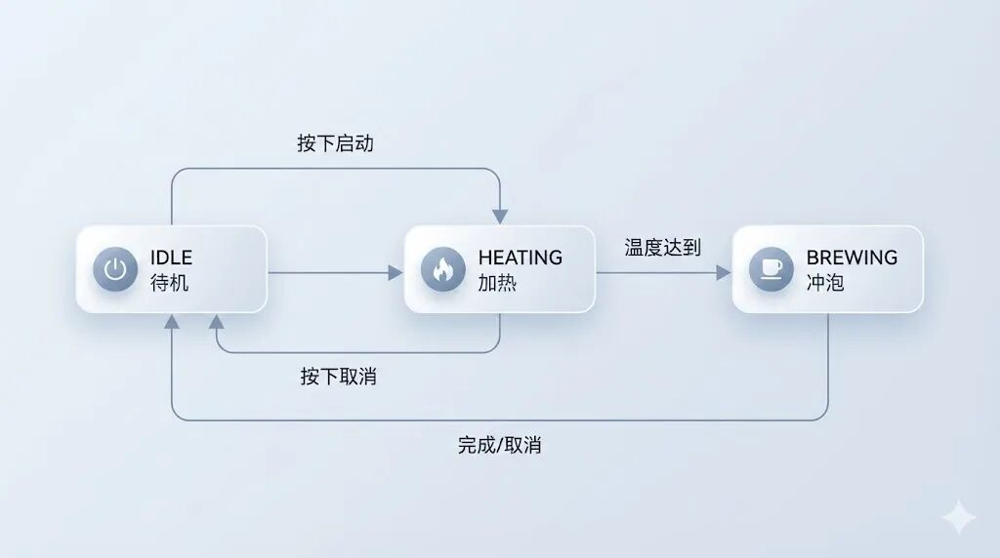
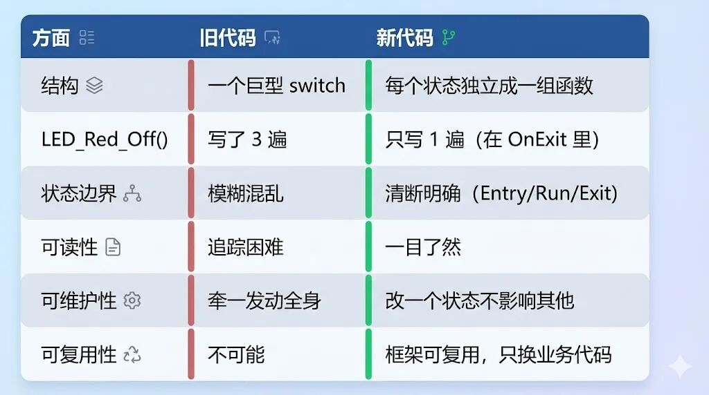
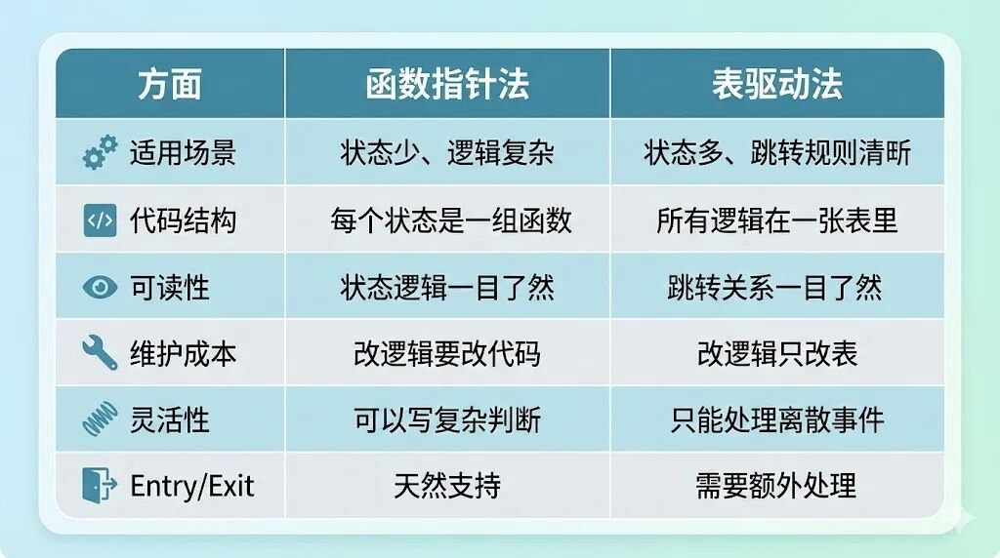
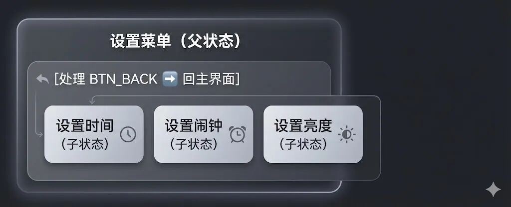
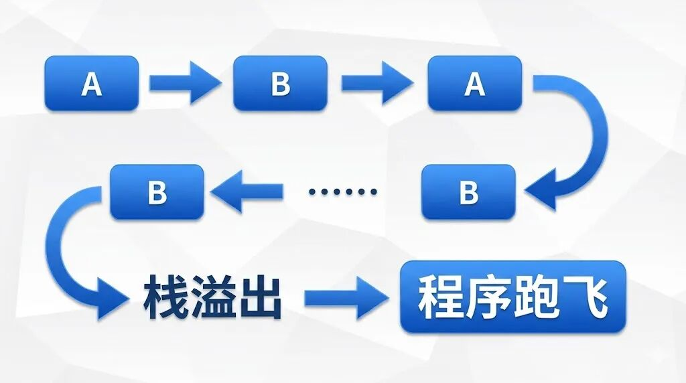
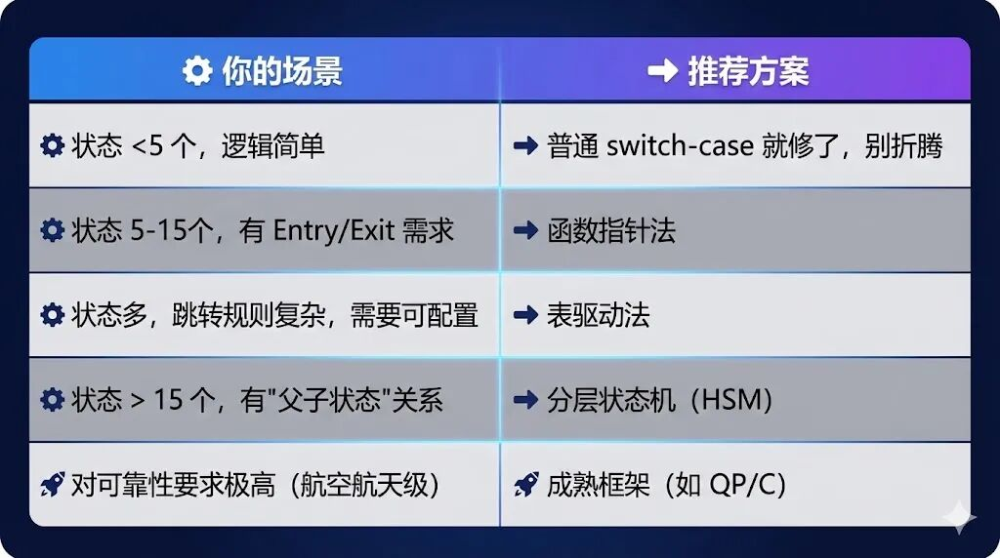

# 别再写几千行的 Switch-Case 了：用 C 语言实现"面向对象"的状态机已付费

原创 一枚嵌入式码农 

[一枚嵌入式码农](javascript:void(0);)

 *2026年1月14日 07:31* *广东* 听全文

> 你有没有接手过那种让人崩溃的代码？打开文件，2000 行的 switch-case 扑面而来，里面各种 flag、timer 满天飞。老板说"加个功能"，你改了一行，结果整个流程全乱套了……

如果你经历过这种场景，那这篇文章就是写给你的。

------

## 1. 场景导入：维护者的噩梦

### 老鸟回忆录

前几年我接手了一个"智能咖啡机"的项目。前任同事离职了，留下一堆代码让我维护。

当我第一次打开 `Coffee_Task.c` 的时候，整个人都傻了。

一个 `switch (state)` 语句，足足写了 **2000 多行**。

这还不算完，里面嵌套着各种：

```c
if (timer > 500) {
    flag1 = 1;
    if (mode == 2 && water_level > 30) {
        // 天知道这段逻辑是干嘛的
    }
}
```

变量命名也很"朴实"：`flag1`、`flag2`、`temp_flag`、`state_backup`……

我花了整整两天时间，才勉强搞清楚这个咖啡机有几个状态、状态之间怎么跳转。

然后老板来了："小王啊，加个'缺水暂停'的功能，应该很简单吧？"

**简单个鬼。**

我尝试在 `HEATING` 状态里加一个判断：如果水位低于某个值，就跳转到 `WATER_EMPTY` 状态。

改完之后，一跑——"加热"功能废了。

再改——"待机"状态出不来了。

又改——程序跑飞了。

那一刻我深刻体会到了什么叫"牵一发而动全身"。

### 问题到底出在哪？

后来我反思了很久，发现这种"巨型 Switch-Case"有三个致命问题：

**第一，逻辑分散。**

一个完整的业务流程（比如"煮咖啡"），被打散在十几个 case 里。你要追踪一个 bug，得在文件里反复跳来跳去，累得跟做阅读理解似的。

**第二，边界模糊。**

看一个 case 里的代码，你根本分不清哪些是"进入这个状态时该做的"，哪些是"这个状态运行中该做的"，哪些是"离开这个状态前该做的"。全部混在一起，像一锅粥。

**第三，复制粘贴埋雷。**

比如从 A 状态跳到 B 状态要关灯，从 A 状态跳到 C 状态也要关灯。你得写两遍一模一样的代码。哪天漏写一处，Bug 就来了。

更可怕的是，这种 Bug 往往是"偶发"的——只有特定路径才会触发，测试的时候测不出来，到了客户手里才暴露。

------

## 2. 烂代码赏析：The Spaghetti Code

既然说到这儿了，我干脆把这种"意大利面条式"代码的典型特征给你展示一下。

下面这段代码，是我根据真实项目"提纯"出来的。为了保护原作者（虽然他已经离职了），我做了简化处理，但"神韵"绝对原汁原味：

```c
// 典型的"大杂烩"状态机 —— 真实项目简化版
void Coffee_Task(void)
{
    switch (sys_state) {
        case IDLE:
            LED_GREEN_ON();
            if (btn_start_press) {
                sys_state = HEATING;
                LED_GREEN_OFF();
                LED_RED_ON();
                heat_timer = 0;
            }
            if (btn_setting_press) {
                sys_state = SETTING;
                LED_GREEN_OFF();
                // 这里忘记开设置界面的灯了，后来补了个 patch
            }
            break;

        case HEATING:
            heat_timer++;
            if (temp_sensor > 95) {
                sys_state = BREWING;
                LED_RED_OFF();  // 这行很重要，但很容易忘
                Motor_Start();
                brew_timer = 0;
            }
            if (water_level < 10) {
                // V2.3 版本新增：缺水检测
                sys_state = ERROR;
                LED_RED_OFF();  // 又写了一遍
                LED_ALL_BLINK();
                Error_Code = ERR_NO_WATER;
            }
            if (btn_cancel_press) {
                sys_state = IDLE;
                LED_RED_OFF();  // 第三遍
                Heater_Off();
            }
            break;

        case BREWING:
            brew_timer++;
            if (brew_timer > BREW_TIME) {
                sys_state = DONE;
                Motor_Stop();
                Beep_Play(BEEP_DONE);
            }
            if (water_level < 5) {
                // 复制粘贴自 HEATING，但这里漏改了一个变量
                sys_state = ERROR;
                LED_RED_OFF();  // 但是 BREWING 状态压根没开红灯啊！
                LED_ALL_BLINK();
                Error_Code = ERR_NO_WATER;
            }
            break;

        // ... 后面还有 SETTING, CLEANING, ERROR, DONE 等一堆状态
        // 每个状态里都是类似的 if-else 嵌套
        // 整个函数超过 800 行
    }
}
```

### 这段代码有什么问题？

我来给你逐条分析：

**问题一：LED_RED_OFF() 写了无数遍**

从 `HEATING` 跳到 `BREWING` 要关红灯，从 `HEATING` 跳到 `ERROR` 要关红灯，从 `HEATING` 跳到 `IDLE` 也要关红灯。

同样的代码，写了三遍。

如果哪天需求变了，"加热状态改成蓝灯"，你得把这三个地方全找出来改掉。漏一个就是 Bug。

**问题二：状态职责不清晰**

你看 `HEATING` 那个 case，里面干了多少事儿？

- • 计时器累加（运行时逻辑）
- • 温度判断跳转（状态切换逻辑）
- • 缺水判断跳转（异常处理逻辑）
- • 取消按钮处理（用户交互逻辑）

四种完全不同的逻辑，全部挤在一个 case 里。

**问题三：隐藏的 Bug**

注意看 `BREWING` 状态里的缺水处理，有一行 `LED_RED_OFF()`。

但问题是——`BREWING` 状态根本就没开过红灯！

这行代码是从 `HEATING` 复制过来的时候带过来的，属于"复制粘贴遗产"。虽然执行了不会出错（关一个没开的灯），但这说明写代码的人已经完全搞不清楚每个状态的"边界"了。

**问题四：无法复用**

假设你现在要做一个"智能烧水壶"项目，业务流程和咖啡机很像。

你能把这个状态机的代码复用过去吗？

不能。因为状态逻辑和硬件操作（LED、Motor、Heater）完全耦合在一起，根本拆不开。

------

## 3. 救星登场：状态即对象

说了这么多问题，该聊聊解决方案了。

其实早在几十年前，软件工程界就已经总结出了一套成熟的方法论——**状态模式（State Pattern）**。

这玩意儿在《设计模式》那本经典书里就有，Java、C++ 程序员可能早就用烂了。但在嵌入式 C 语言的圈子里，很多人还是习惯性地写 switch-case。

原因也简单：C 语言没有"类"的概念，大家觉得"设计模式是面向对象的东西，C 语言用不了"。

**这是一个误解。**

C 语言虽然没有 class 关键字，但它有**函数指针**和**结构体**，这两样东西组合起来，完全可以实现"面向对象"的思想。

### 核心思想：把状态当成"人"

状态模式的核心思想，一句话就能说清楚：

> **把每个状态看作一个独立的"人"（或者说"对象"），让这个"人"自己管理自己的事情。**

什么意思呢？

以前的写法是：主循环像个"独裁者"，它要知道所有状态的所有细节，亲自判断该做什么。

```
主循环：我来看看，现在是什么状态？哦，是加热状态。
        那我得检查温度……温度到了，该切换了。
        切换之前要关灯……好，现在进入冲泡状态。
        冲泡状态要开电机……
```

新的写法是：主循环变成一个"甩手掌柜"，它只问当前状态一个问题——"你现在想干嘛？"

```
主循环：当前状态，请执行你的工作。
加热状态：好的，我自己检查温度，自己决定什么时候切换。
主循环：行，我不管了，下次循环再问你。
```

### 状态流转图：代码该长的样子

如果你学过 UML，可能见过"状态图"（Statechart）这种东西。

一个设计良好的状态机，它的代码结构应该和状态图**一一对应**。

看图你就知道有几个状态、状态之间怎么跳转。看代码也一样——每个状态是一个独立的"模块"，跳转关系清清楚楚。

这就是我们追求的目标：**代码即文档，文档即代码**。



好的代码，应该让人看一眼就知道：

- • 系统有哪些状态
- • 状态之间如何转换
- • 每个状态负责什么

这不是空中楼阁，接下来我会手把手带你实现。

------

## 4. 等等，还有一个关键问题

看到这里，你可能会想：

> **"我懂了，不就是把每个 case 里的代码提取成独立的函数吗？这个我会啊！"**

如果你这么想，说明你已经领悟了第一层。

但真正的高级状态机，要解决一个 switch-case **根本解决不了**的难题：

### Entry（进入）和 Exit（退出）动作

还记得前面那个咖啡机代码吗？`LED_RED_OFF()` 写了三遍。

为什么会写三遍？因为只要**离开**加热状态，就必须关红灯。而离开的"出口"有三个：

- • 温度到了 → 去冲泡
- • 缺水了 → 去报错
- • 用户取消 → 回待机

每个出口都得写一遍"关灯"。

反过来也一样。比如**进入**加热状态时，无论你是从哪个状态过来的（待机、清洗、错误恢复），都需要做同样的事情：

- • 打开加热管
- • 亮红灯
- • 重置计时器

如果用传统的 switch-case，你得在每个"入口"都写一遍这些代码。

**这就是状态模式的核心价值所在。**

在状态模式里，每个状态可以定义三个"钩子函数"：


有了这三个钩子，"关红灯"这件事只需要写在加热状态的 `OnExit()` 里，**一遍就够了**。

不管你从加热状态跳到哪里，框架会自动帮你调用 `OnExit()`。

这就是状态模式的杀手锏：**把"什么时候做"的问题交给框架，你只需要关心"做什么"**。

------

### 【试读结束】

好了，免费内容就到这里。

如果你觉得"原来如此，我想继续看"，那说明你和当年的我一样，被这些痛点折磨过。

接下来的付费内容，我会分享一些通用状态机框架的经验。

你将学到：

**▸ 函数指针法**
如何用 C 语言的结构体和函数指针，把状态封装成"对象"，让代码结构与 UML 图一一对应。

**▸ 表驱动法（Table-Driven）**
更高级的玩法——甚至连函数调用都省了。通过查一张二维表（当前状态 + 事件 = 下一状态 + 动作），实现逻辑的"零代码"配置。想改流程？改表就行，代码不用动。

**▸ 原子动作设计**
如何优雅地实现 `OnEntry`、`OnRun`、`OnExit` 三段式架构，彻底杜绝"忘记关灯"这类 Bug。

**▸ 分层状态机入门**
当你的状态多到几十个的时候，如何用"父状态"的概念进一步简化代码。

**▸ 老鸟避坑指南**
我踩过的坑、掉过的头发，全部分享给你，让你少走弯路。

------

## 5. 实战 Level 1：函数指针版状态机

好，进入干货环节。

我们先从最基础的"函数指针法"开始。这是状态模式在 C 语言中最常见的实现方式，理解了这个，后面的高级玩法就水到渠成了。

### 第一步：定义状态的"骨架"

首先，我们需要一个结构体来描述"状态应该长什么样"：

```c
// fsm.h - 状态机框架头文件

#ifndef __FSM_H__
#define __FSM_H__

// 状态结构体：每个状态都是这个"模板"的实例
typedef struct {
    const char *name;       // 状态名称（调试用）
    void (*OnEntry)(void);  // 进入状态时执行
    void (*OnRun)(void);    // 状态运行时执行（每次循环调用）
    void (*OnExit)(void);   // 离开状态时执行
} State_t;

// 状态机结构体
typedef struct {
    State_t *current;       // 当前状态
    State_t *next;          // 下一个状态（用于延迟切换）
} FSM_t;

// 框架函数声明
void FSM_Init(FSM_t *fsm, State_t *init_state);
void FSM_Run(FSM_t *fsm);
void FSM_TransitionTo(FSM_t *fsm, State_t *next_state);

#endif
```

这里有几个设计要点：

**1. 函数指针可以为空**

`OnEntry`、`OnRun`、`OnExit` 都是函数指针。如果某个状态不需要"进入动作"，把它设成 `NULL` 就行，框架会做空指针检查。

**2. name 字段是给人看的**

加个 `name` 字段，方便调试的时候打印日志："当前进入 HEATING 状态"。生产环境可以用宏开关去掉。

**3. 分离"当前"和"下一个"**

为什么要有 `current` 和 `next` 两个指针？这是为了避免"递归切换"导致的栈溢出，后面避坑指南会详细讲。

### 第二步：实现框架核心逻辑

```c
// fsm.c - 状态机框架实现

#include "fsm.h"
#include <stddef.h>  // for NULL

// 初始化状态机
void FSM_Init(FSM_t *fsm, State_t *init_state)
{
    fsm->current = init_state;
    fsm->next = NULL;

    // 执行初始状态的进入动作
    if (fsm->current && fsm->current->OnEntry) {
        fsm->current->OnEntry();
    }
}

// 状态机主循环（每次调用执行一轮）
void FSM_Run(FSM_t *fsm)
{
    // 1. 检查是否有待切换的状态
    if (fsm->next != NULL) {
        // 执行当前状态的退出动作
        if (fsm->current && fsm->current->OnExit) {
            fsm->current->OnExit();
        }

        // 切换到新状态
        fsm->current = fsm->next;
        fsm->next = NULL;

        // 执行新状态的进入动作
        if (fsm->current && fsm->current->OnEntry) {
            fsm->current->OnEntry();
        }
    }

    // 2. 执行当前状态的运行逻辑
    if (fsm->current && fsm->current->OnRun) {
        fsm->current->OnRun();
    }
}

// 请求切换到新状态（不会立即切换，而是标记）
void FSM_TransitionTo(FSM_t *fsm, State_t *next_state)
{
    if (next_state != fsm->current) {  // 避免切换到自己
        fsm->next = next_state;
    }
}
```

**看到没有？核心逻辑就这么点。**

整个框架不到 50 行代码，却解决了我们前面说的所有问题：

- • `OnEntry` 和 `OnExit` 自动调用，再也不会忘记"关灯"
- • 状态切换是"延迟"的，在 `FSM_Run` 的下一轮才真正执行
- • 每个状态职责分明，代码结构清晰

### 第三步：用框架重写咖啡机

现在我们用这个框架来重写之前那个"灾难级"的咖啡机代码。

```c
// coffee_machine.c - 使用状态机框架的咖啡机实现

#include "fsm.h"
#include "hardware.h"  // LED、电机、传感器等硬件接口

// 声明状态机实例和各个状态
static FSM_t coffee_fsm;

// 前向声明所有状态（因为状态之间会互相引用）
extern State_t state_idle;
extern State_t state_heating;
extern State_t state_brewing;
extern State_t state_done;
extern State_t state_error;

/*========== 待机状态 ==========*/
static void Idle_OnEntry(void)
{
    LED_Green_On();
    Display_Show("Ready");
}

static void Idle_OnRun(void)
{
    if (Button_IsPressed(BTN_START)) {
        FSM_TransitionTo(&coffee_fsm, &state_heating);
    }
}

static void Idle_OnExit(void)
{
    LED_Green_Off();
}

State_t state_idle = {
    .name = "IDLE",
    .OnEntry = Idle_OnEntry,
    .OnRun = Idle_OnRun,
    .OnExit = Idle_OnExit
};

/*========== 加热状态 ==========*/
static uint32_t heat_timer;

static void Heating_OnEntry(void)
{
    LED_Red_On();
    Heater_On();
    heat_timer = 0;
    Display_Show("Heating...");
}

static void Heating_OnRun(void)
{
    heat_timer++;

    // 检查温度
    if (Sensor_GetTemp() >= 95) {
        FSM_TransitionTo(&coffee_fsm, &state_brewing);
        return;
    }

    // 检查缺水
    if (Sensor_GetWaterLevel() < 10) {
        FSM_TransitionTo(&coffee_fsm, &state_error);
        return;
    }

    // 检查取消
    if (Button_IsPressed(BTN_CANCEL)) {
        FSM_TransitionTo(&coffee_fsm, &state_idle);
        return;
    }
}

static void Heating_OnExit(void)
{
    LED_Red_Off();   // 无论跳到哪里，都会执行这行
    Heater_Off();    // 离开加热状态，必须关加热管
}

State_t state_heating = {
    .name = "HEATING",
    .OnEntry = Heating_OnEntry,
    .OnRun = Heating_OnRun,
    .OnExit = Heating_OnExit
};

/*========== 冲泡状态 ==========*/
static uint32_t brew_timer;

static void Brewing_OnEntry(void)
{
    LED_Blue_On();
    Motor_Start();
    brew_timer = 0;
    Display_Show("Brewing...");
}

static void Brewing_OnRun(void)
{
    brew_timer++;

    if (brew_timer >= BREW_DURATION) {
        FSM_TransitionTo(&coffee_fsm, &state_done);
        return;
    }

    // 冲泡过程中也检查缺水
    if (Sensor_GetWaterLevel() < 5) {
        FSM_TransitionTo(&coffee_fsm, &state_error);
    }
}

static void Brewing_OnExit(void)
{
    LED_Blue_Off();
    Motor_Stop();
}

State_t state_brewing = {
    .name = "BREWING",
    .OnEntry = Brewing_OnEntry,
    .OnRun = Brewing_OnRun,
    .OnExit = Brewing_OnExit
};

/*========== 完成状态 ==========*/
static void Done_OnEntry(void)
{
    LED_Green_Blink();
    Buzzer_Beep(3);
    Display_Show("Done!");
}

static void Done_OnRun(void)
{
    if (Button_IsPressed(BTN_ANY)) {
        FSM_TransitionTo(&coffee_fsm, &state_idle);
    }
}

State_t state_done = {
    .name = "DONE",
    .OnEntry = Done_OnEntry,
    .OnRun = Done_OnRun,
    .OnExit = NULL  // 离开时不需要做什么
};

/*========== 错误状态 ==========*/
static void Error_OnEntry(void)
{
    LED_All_Blink();
    Buzzer_Alarm();
    Display_Show("ERROR!");
}

static void Error_OnRun(void)
{
    // 等待用户处理后复位
    if (Button_IsPressed(BTN_RESET) && Sensor_GetWaterLevel() > 50) {
        FSM_TransitionTo(&coffee_fsm, &state_idle);
    }
}

static void Error_OnExit(void)
{
    LED_All_Off();
    Buzzer_Off();
}

State_t state_error = {
    .name = "ERROR",
    .OnEntry = Error_OnEntry,
    .OnRun = Error_OnRun,
    .OnExit = Error_OnExit
};

/*========== 主函数 ==========*/
void CoffeeMachine_Init(void)
{
    FSM_Init(&coffee_fsm, &state_idle);
}

void CoffeeMachine_Task(void)
{
    FSM_Run(&coffee_fsm);
}
```

### 对比一下：代码变化了什么？



最重要的是：**新代码的结构和状态流转图完全对应**。

你看代码，就知道系统有哪些状态；你看状态，就知道它什么时候进入、干什么、什么时候离开。

这才是工程师该写的代码。

------

## 6. 实战 Level 2：表驱动法（数据驱动逻辑）

函数指针法已经很好用了，但有些场景下还可以更进一步。

### 什么时候需要表驱动？

当你的状态机有这些特点时，表驱动法会更合适：

- • **状态特别多**：比如通信协议解析（TCP 状态机有十几个状态）
- • **跳转规则复杂**：同一个状态收到不同事件，要跳到不同的地方
- • **需要频繁修改**：产品经理天天改需求，你不想每次都改代码逻辑
- • **需要可配置**：客户 A 要流程 1，客户 B 要流程 2，用同一套代码

表驱动的核心思想是：**把"状态跳转逻辑"从代码里抽出来，放到一张表里**。

代码只负责"查表"和"执行"，不负责"决策"。

想改流程？改表就行，代码不用动。

### 表长什么样？

我们定义一个"状态转移表"，每一行描述一条规则：

```
当前状态 + 触发事件 = 下一状态 + 执行动作
```

用结构体表示就是：

```c
// 状态转移表的一行
typedef struct {
    uint8_t current_state;   // 当前状态
    uint8_t event;           // 触发事件
    uint8_t next_state;      // 下一个状态
    void (*action)(void);    // 转移时执行的动作（可为空）
} Transition_t;
```

### 一个完整的例子：AT 指令解析器

假设我们要实现一个简单的 AT 指令状态机，用于和 4G 模块通信。流程如下：

1. 1. **IDLE**：空闲，等待发送指令
2. 2. **WAIT_OK**：等待模块回复 "OK"
3. 3. **WAIT_DATA**：等待模块回复数据
4. 4. **ERROR**：出错，需要重试

```c
// at_parser.c - 表驱动状态机示例

#include <stdint.h>
#include <stddef.h>

/*========== 状态和事件定义 ==========*/
typedefenum {
    ST_IDLE,
    ST_WAIT_OK,
    ST_WAIT_DATA,
    ST_ERROR,
    ST_MAX
} ATState_e;

typedefenum {
    EVT_SEND_CMD,       // 发送了指令
    EVT_RECV_OK,        // 收到 "OK"
    EVT_RECV_ERROR,     // 收到 "ERROR"
    EVT_RECV_DATA,      // 收到数据
    EVT_TIMEOUT,        // 超时
    EVT_RETRY,          // 重试
    EVT_MAX
} ATEvent_e;

/*========== 动作函数 ==========*/
static void Action_SendCmd(void)
{
    printf("[Action] Sending AT command...\n");
    // 实际发送指令到串口
}

static void Action_ProcessData(void)
{
    printf("[Action] Processing received data...\n");
    // 处理收到的数据
}

static void Action_HandleError(void)
{
    printf("[Action] Error occurred, preparing retry...\n");
    // 错误处理
}

static void Action_Reset(void)
{
    printf("[Action] Resetting state machine...\n");
    // 复位操作
}

/*========== 状态转移表 ==========*/
// 核心！整个状态机的逻辑都在这张表里
static const Transition_t transition_table[] = {
    // 当前状态      触发事件          下一状态        执行动作
    { ST_IDLE,      EVT_SEND_CMD,     ST_WAIT_OK,     Action_SendCmd     },

    { ST_WAIT_OK,   EVT_RECV_OK,      ST_WAIT_DATA,   NULL               },
    { ST_WAIT_OK,   EVT_RECV_ERROR,   ST_ERROR,       Action_HandleError },
    { ST_WAIT_OK,   EVT_TIMEOUT,      ST_ERROR,       Action_HandleError },

    { ST_WAIT_DATA, EVT_RECV_DATA,    ST_IDLE,        Action_ProcessData },
    { ST_WAIT_DATA, EVT_RECV_ERROR,   ST_ERROR,       Action_HandleError },
    { ST_WAIT_DATA, EVT_TIMEOUT,      ST_ERROR,       Action_HandleError },

    { ST_ERROR,     EVT_RETRY,        ST_IDLE,        Action_Reset       },
};

#define TRANSITION_COUNT (sizeof(transition_table) / sizeof(transition_table[0]))

/*========== 状态机引擎 ==========*/
static ATState_e current_state = ST_IDLE;

// 查表并执行状态转移
void AT_FSM_HandleEvent(ATEvent_e event)
{
    for (int i = 0; i < TRANSITION_COUNT; i++) {
        // 查找匹配的转移规则
        if (transition_table[i].current_state == current_state &&
            transition_table[i].event == event) {

            // 执行动作（如果有）
            if (transition_table[i].action != NULL) {
                transition_table[i].action();
            }

            // 切换状态
            printf("[FSM] %d -> %d (event: %d)\n",
                   current_state,
                   transition_table[i].next_state,
                   event);

            current_state = transition_table[i].next_state;
            return;
        }
    }

    // 没找到匹配的规则，说明这个事件在当前状态下被忽略
    printf("[FSM] Event %d ignored in state %d\n", event, current_state);
}

// 获取当前状态
ATState_e AT_FSM_GetState(void)
{
    return current_state;
}
```

### 表驱动的威力

看到上面那张 `transition_table` 了吗？

**整个状态机的逻辑，就在这十几行配置里。**

如果产品经理说："超时之后不要进错误状态，直接重试"。

你怎么改？

只需要把表里的这行：

```c
{ ST_WAIT_OK,   EVT_TIMEOUT,      ST_ERROR,       Action_HandleError },
```

改成：

```c
{ ST_WAIT_OK,   EVT_TIMEOUT,      ST_IDLE,        Action_SendCmd     },
```

**搞定。代码逻辑一个字都不用动。**

这就是"数据驱动"的魅力——业务逻辑和执行引擎分离。

### 进阶：用二维数组实现 O(1) 查表

上面的实现用的是线性查找，复杂度是 O(n)。对于状态和事件很多的场景，可以用二维数组做到 O(1)：

```c
// 状态转移二维表：table[当前状态][事件] = 下一状态
static const uint8_t state_table[ST_MAX][EVT_MAX] = {
    //              SEND_CMD    RECV_OK     RECV_ERROR  RECV_DATA   TIMEOUT     RETRY
    [ST_IDLE]     = {ST_WAIT_OK, ST_IDLE,    ST_IDLE,    ST_IDLE,    ST_IDLE,    ST_IDLE    },
    [ST_WAIT_OK]  = {ST_WAIT_OK, ST_WAIT_DATA, ST_ERROR, ST_WAIT_OK, ST_ERROR,   ST_WAIT_OK },
    [ST_WAIT_DATA]= {ST_WAIT_DATA, ST_WAIT_DATA, ST_ERROR, ST_IDLE, ST_ERROR,   ST_WAIT_DATA},
    [ST_ERROR]    = {ST_ERROR,   ST_ERROR,   ST_ERROR,   ST_ERROR,   ST_ERROR,   ST_IDLE    },
};

// 动作表：action_table[当前状态][事件] = 执行的动作
static void (*const action_table[ST_MAX][EVT_MAX])(void) = {
    [ST_IDLE]     = {Action_SendCmd, NULL, NULL, NULL, NULL, NULL},
    [ST_WAIT_OK]  = {NULL, NULL, Action_HandleError, NULL, Action_HandleError, NULL},
    [ST_WAIT_DATA]= {NULL, NULL, Action_HandleError, Action_ProcessData, Action_HandleError, NULL},
    [ST_ERROR]    = {NULL, NULL, NULL, NULL, NULL, Action_Reset},
};

// O(1) 复杂度的状态机引擎
void AT_FSM_HandleEvent_Fast(ATEvent_e event)
{
    if (event >= EVT_MAX) return;

    // 执行动作
    if (action_table[current_state][event] != NULL) {
        action_table[current_state][event]();
    }

    // 查表获取下一状态
    current_state = state_table[current_state][event];
}
```

这种写法更适合状态和事件都比较多、对性能有要求的场景。

### 函数指针法 vs 表驱动法



**我的建议是：两种方法可以结合使用。**

用表驱动管理"状态跳转"，用函数指针管理"状态行为"（Entry/Run/Exit）。

------

## 7. 嵌入式特供：分层状态机（HSM）简介

当你的状态机越做越大，状态数量从 5 个变成 15 个、30 个，你会发现一个新的问题：

**很多状态有共同的行为。**

### 一个典型场景

假设你在做一个带菜单的设备，有这些状态：

- • **主界面**
- • **设置菜单**
    - • 设置时间
    - • 设置闹钟
    - • 设置亮度
- • **运行状态**
    - • 正在倒计时
    - • 暂停中

需求是：在任何"设置"子菜单里，按"返回键"都要回到设置菜单主页。

如果用普通的状态机，你得这样写：

```c
// 设置时间状态
static void SetTime_OnRun(void)
{
    if (Button_IsPressed(BTN_BACK)) {
        FSM_TransitionTo(&fsm, &state_setting_menu);  // 复制粘贴 1
        return;
    }
    // ... 其他逻辑
}

// 设置闹钟状态
static void SetAlarm_OnRun(void)
{
    if (Button_IsPressed(BTN_BACK)) {
        FSM_TransitionTo(&fsm, &state_setting_menu);  // 复制粘贴 2
        return;
    }
    // ... 其他逻辑
}

// 设置亮度状态
static void SetBrightness_OnRun(void)
{
    if (Button_IsPressed(BTN_BACK)) {
        FSM_TransitionTo(&fsm, &state_setting_menu);  // 复制粘贴 3
        return;
    }
    // ... 其他逻辑
}
```

**又是复制粘贴！**

每个子状态都要写一遍"按返回键回主菜单"的逻辑。如果以后要改成"长按返回键才回去"，你又得改好几个地方。

### 分层状态机的思想

分层状态机（Hierarchical State Machine，HSM）引入了一个概念：**父状态**。

子状态可以"继承"父状态的行为。如果子状态不处理某个事件，就把事件"上抛"给父状态处理。

用图来表示就是：



当你在"设置时间"状态按下返回键：

1. "设置时间"状态先检查：我处理这个事件吗？不处理。
2. 事件上抛给父状态"设置菜单"。
3. "设置菜单"处理这个事件：跳转到主界面。

这样，"按返回键回主菜单"这个逻辑，只需要在父状态写一遍。

### 简化版实现思路

完整的 HSM 实现比较复杂（可以参考 QP 框架），这里给一个简化版的思路：

```c
// 带父状态的状态结构体
typedef struct State_t {
    const char *name;
    struct State_t *parent;     // 父状态（没有父状态则为 NULL）
    void (*OnEntry)(void);
    void (*OnRun)(void);
    void (*OnExit)(void);
    bool (*OnEvent)(Event_t e); // 返回 true 表示已处理，false 表示上抛
} State_t;

// 事件分发函数（支持向上传递）
void FSM_DispatchEvent(FSM_t *fsm, Event_t event)
{
    State_t *state = fsm->current;

    // 从当前状态开始，向上查找能处理此事件的状态
    while (state != NULL) {
        if (state->OnEvent != NULL && state->OnEvent(event)) {
            // 事件已被处理
            return;
        }
        // 当前状态不处理，上抛给父状态
        state = state->parent;
    }

    // 没有任何状态处理此事件，忽略
}
```

这只是一个简化的示意。实际的 HSM 还要处理状态进入/退出时的层级关系（比如从子状态 A 跳到子状态 B，如果它们有共同的父状态，父状态不应该退出再进入）。

### 什么时候需要 HSM？

- • 状态数量超过 10 个
- • 很多状态有共同的事件处理逻辑
- • 需要"模式"的概念（比如"设置模式"下的多个子状态）

如果你的状态机只有 5-6 个状态，用普通的函数指针法就够了，不需要上 HSM。

**不要过度设计。**

------

## 8. 避坑指南：我踩过的那些雷

用状态机这么多年，有些坑我是真的踩过的。分享出来，希望你能少走弯路。

### 坑 1：状态切换死循环（栈溢出）

**场景复现：**

有一次我写了一个状态机，在 `OnEntry` 里判断某个条件，如果不满足就直接切换到另一个状态：

```c
static void StateA_OnEntry(void)
{
    if (!some_condition) {
        // 直接在 Entry 里切换状态
        FSM_TransitionTo(&fsm, &state_b);  // 危险！
    }
}

static void StateB_OnEntry(void)
{
    if (!another_condition) {
        FSM_TransitionTo(&fsm, &state_a);  // 更危险！
    }
}
```

如果 `some_condition` 和 `another_condition` 同时不满足，会发生什么？



**根本原因：**

如果 `FSM_TransitionTo` 是"立即切换"的实现（在函数里直接调用新状态的 OnEntry），那就会形成递归调用。嵌入式系统的栈空间本来就小，几十次递归就爆了。

**解决方案：**

这就是为什么我在前面的框架设计里，用了 `next` 指针做"延迟切换"：

```c
void FSM_TransitionTo(FSM_t *fsm, State_t *next_state)
{
    fsm->next = next_state;  // 只是标记，不立即切换
}

void FSM_Run(FSM_t *fsm)
{
    // 在主循环里统一处理切换
    if (fsm->next != NULL) {
        // 这里才真正切换
    }
    // ...
}
```

这样即使在 OnEntry 里调用了 TransitionTo，也只是设置一个标记，真正的切换要等到下一轮 FSM_Run 才执行。

**经验法则：永远不要在 OnEntry/OnExit 里立即切换状态，只能"请求"切换。**

### 坑 2：中断与状态机的竞争

**场景复现：**

假设你的状态机是在主循环里跑的，但事件来源是中断（比如串口收到数据）：

```c
// 中断服务函数
void UART_IRQHandler(void)
{
    if (received_data == 'A') {
        event_flag = EVT_RECV_A;  // 设置事件标志
    }
}

// 主循环
void main(void)
{
    while (1) {
        if (event_flag != EVT_NONE) {
            FSM_HandleEvent(&fsm, event_flag);
            event_flag = EVT_NONE;
        }
        FSM_Run(&fsm);
    }
}
```

问题来了：如果在 `FSM_HandleEvent` 执行过程中，又来了一个中断，把 `event_flag` 改了怎么办？

第一个事件可能还没处理完，就被第二个事件覆盖了。

**解决方案：使用事件队列**

不要用单个变量存事件，而是用一个队列。中断往队列里塞事件，主循环从队列里取事件：

```c
#define EVENT_QUEUE_SIZE 16

typedef struct {
    Event_t buffer[EVENT_QUEUE_SIZE];
    volatile uint8_t head;
    volatile uint8_t tail;
} EventQueue_t;

static EventQueue_t event_queue;

// 中断里调用：入队（注意：简化版，未处理队列满的情况）
void EventQueue_Push(Event_t event)
{
    uint8_t next = (event_queue.head + 1) % EVENT_QUEUE_SIZE;
    if (next != event_queue.tail) {
        event_queue.buffer[event_queue.head] = event;
        event_queue.head = next;
    }
}

// 主循环里调用：出队
bool EventQueue_Pop(Event_t *event)
{
    if (event_queue.head == event_queue.tail) {
        return false;  // 队列空
    }
    *event = event_queue.buffer[event_queue.tail];
    event_queue.tail = (event_queue.tail + 1) % EVENT_QUEUE_SIZE;
    return true;
}

// 主循环
void main(void)
{
    Event_t event;
    while (1) {
        // 把队列里的事件全部处理完
        while (EventQueue_Pop(&event)) {
            FSM_HandleEvent(&fsm, event);
        }
        FSM_Run(&fsm);
    }
}
```

这样就能保证事件不丢失，而且状态机的处理是串行的、可预测的。

### 坑 3：状态爆炸

**场景复现：**

刚开始设计的时候，状态机只有 5 个状态，清清爽爽。

后来需求加着加着，变成了 20 个状态。再后来，同一个状态在不同"模式"下有不同行为，状态数又翻倍了……

最后变成了一个有 50 个状态的怪物，比原来的 switch-case 还难维护。

**解决方案：**

1. **拆分状态机**：不要把所有逻辑塞到一个状态机里。一个模块一个状态机，各管各的。
2. **用子状态机**：大状态里面可以嵌套小状态机（这也是 HSM 的思想）。
3. **区分"状态"和"标志"**：不是所有变化都需要变成状态。有些东西用布尔变量就够了。

比如"静音模式"不需要变成一个状态，用一个 `is_muted` 变量就行。

### 坑 4：调试困难

状态机出 Bug 的时候，最头疼的是：不知道它是怎么跑到这个状态的。

**解决方案：加日志**

在框架里加打印，记录每次状态切换：

```c
void FSM_Run(FSM_t *fsm)
{
    if (fsm->next != NULL) {
        printf("[FSM] %s ---> %s\n",
               fsm->current->name,
               fsm->next->name);
        // ... 执行切换
    }
}
```

如果是资源受限的环境（没有串口、内存小），可以用环形缓冲区记录最近 N 次状态切换，出问题的时候 dump 出来看。

### 坑 5：测试困难

状态机的测试比普通函数复杂，因为它有"历史"——同样的输入，不同的当前状态，输出不同。

**解决方案：**

1. **让状态机可注入**：把硬件操作抽象成函数指针，测试时可以替换成 mock 函数。
2. **写状态覆盖测试**：确保每个状态的每条转移路径都被测试到。
3. **用状态图辅助**：画出状态图，对着图写测试用例，保证覆盖率。

------

## 9. 总结：给你的系统装上一个清晰的"大脑"

写了这么多，最后总结一下。

### 核心观点

**状态模式是将"变化"关进笼子的艺术。**

传统的 switch-case 写法，看起来简单直接，但随着状态增多，它会变成一个"牵一发动全身"的泥潭。

状态模式的价值在于：

1.**边界清晰**：每个状态是什么、干什么、什么时候进入、什么时候离开，一目了然。
2.**职责单一**：Entry 负责初始化，Run 负责业务，Exit 负责清理。各司其职，互不干扰。
3.**易于维护**：改一个状态不影响其他状态。加一个状态只需要加一组函数，不用动框架。
4.**代码即文档**：代码结构和状态流转图一一对应。新人看代码就能理解系统行为。

### 实战选型建议



### 我的建议

如果你现在手里有一坨"屎山级"的 switch-case 代码，不要一上来就大刀阔斧地重构。

先：

1.**画出状态图**。搞清楚到底有几个状态、状态之间怎么跳转。
2.**找出痛点**。是"忘记关灯"类的问题多，还是"状态太多理不清"？
3.**选择合适的方案**。针对痛点下药，不要过度设计。

重构是个风险活儿。先在一个小模块上试水，验证可行后再推广到整个系统。

### 最后的话

十年前我第一次接触状态机的时候，也是从一个 2000 行的 switch-case 开始的。

那时候我不懂什么设计模式，只知道"这代码太乱了，我要整理一下"。

后来看了《设计模式》，看了 UML，看了各种状态机框架的实现，才慢慢理解：

**好的架构不是让代码变复杂，而是让复杂的东西变得可管理。**

状态机就是一个典型的例子。

你的系统可能有几十个状态、几百条跳转路径。如果用 switch-case 硬写，那就是一坨无法维护的"意大利面条"。

但如果用状态模式来组织，它就变成了一张清晰的"地铁线路图"。

每个站点是什么、怎么从 A 到 B、中间经过哪些站——一目了然。

希望这篇文章能帮你给自己的嵌入式系统装上一个清晰的"大脑"。

**别再写几千行的 switch-case 了。**


设计模式写的很好，有推荐的相关嵌入式设计模式的书籍么，想系统的学习一下，改善代码质量，单片机代码写了这么多年，我发现我还是菜鸟。