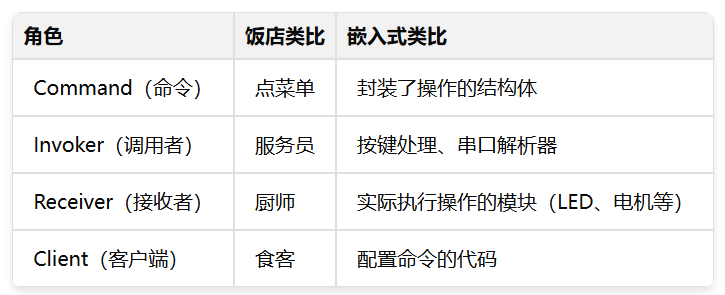
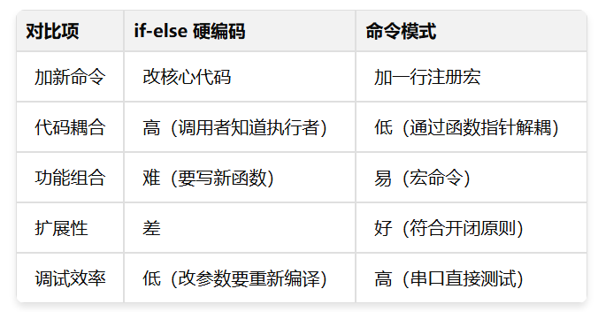

# 别再用 if-else 解析串口指令了：手撸一个嵌入式 CLI（命令模式实战）已付费

 

**将"请求"封装成对象，实现功能的热插拔、宏命令（一键多操）以及高大上的 CLI 调试接口。**

## 一、被"硬编码"绑架的工程师

老张最近有点烦。

他正在做一个智能家居面板项目，板子上有 4 个物理按键。产品经理最开始说得很简单：Key1 开灯，Key2 关灯，Key3 控制风扇，Key4 切换模式。

老张心想，这还不简单？撸起袖子就在按键中断里写死了：

```c
void KEY_IRQHandler(void)
{
    if (key_pressed == KEY1) {
        Led_On();
    } else if (key_pressed == KEY2) {
        Led_Off();
    } else if (key_pressed == KEY3) {
        Fan_Toggle();
    } else if (key_pressed == KEY4) {
        Mode_Switch();
    }
}
```

代码提交，测试通过，老张美滋滋地去喝了杯咖啡。

然而好景不长。第二天早上，产品经理笑眯眯地走过来："张工啊，客户反馈说长按 Key1 能不能同时把空调和窗帘也打开？还有，短按和长按能不能分开处理？"

老张眉头一皱，这事没那么简单。

他不得不在中断里加上长按检测逻辑，然后把空调控制和窗帘控制的代码也塞进来。本来清爽的中断函数，开始变得臃肿：

```c
void KEY_IRQHandler(void)
{
    static uint32_t press_time = 0;

    if (key_pressed == KEY1) {
        if (is_long_press()) {
            Led_On();
            AirCon_On();
            Curtain_Open();
        } else {
            Led_On();
        }
    } else if (key_pressed == KEY2) {
        // 又是一堆逻辑...
    }
    // 后面还有...
}
```

一周后，产品经理又来了："客户说能不能自定义按键功能？比如把 Key1 改成控制窗帘？"

老张沉默了。

他意识到，每次需求变更都要改底层驱动代码。而且，这些业务逻辑和按键扫描逻辑搅在一起，耦合度高得吓人。

更让老张头疼的是串口调试。为了方便现场调试，他需要支持一些串口指令，比如输入 `LED_ON` 就开灯，输入 `MOTOR_RUN` 就启动电机。

结果写出来的代码是这样的：

```c
void UART_Handle(char *rx_buf)
{
    if (strcmp(rx_buf, "LED_ON") == 0) {
        Led_On();
    } else if (strcmp(rx_buf, "LED_OFF") == 0) {
        Led_Off();
    } else if (strcmp(rx_buf, "MOTOR_RUN") == 0) {
        Motor_Run();
    } else if (strcmp(rx_buf, "MOTOR_STOP") == 0) {
        Motor_Stop();
    } else if (strcmp(rx_buf, "FAN_ON") == 0) {
        Fan_On();
    } else if (strcmp(rx_buf, "FAN_OFF") == 0) {
        Fan_Off();
    } else if (strcmp(rx_buf, "GET_TEMP") == 0) {
        printf("Temp: %d\n", Get_Temperature());
    } else if (strcmp(rx_buf, "GET_HUMIDITY") == 0) {
        printf("Humidity: %d\n", Get_Humidity());
    }
    // ... 后面还有几十个
}
```

看着这坨代码，老张陷入了沉思。

每次加新指令，都要来改这个函数。字符串比较是从头到尾遍历的，效率低不说，万一哪天指令多了，这函数怕是要写到几百行。

"有没有一种方法，能让我加新功能的时候不用改老代码？"老张心想。

------

## 二、烂代码赏析：这些坑你踩过几个？

在继续之前，让我们先来"欣赏"一下上面这种写法的问题。毕竟，知道问题在哪里，才能理解解决方案的价值。

### 问题一：违反开闭原则

所谓开闭原则，就是"对扩展开放，对修改关闭"。

看看上面的 `UART_Handle` 函数，每次想加一个新指令，都得打开这个函数，在那一堆 `else if` 里再加一条。这就是典型的"对修改开放"。

你可能觉得这没什么大不了的，不就加一行代码吗？但问题是：

1. 1. **改老代码意味着风险**。你以为你只是加了一行，结果手抖多删了个括号，编译报错还好，万一是逻辑错误呢？原本跑得好好的功能也跟着出问题。
2. 2. **多人协作的噩梦**。如果你和同事同时要加新指令，你俩都去改这个函数，代码冲突是必然的。
3. 3. **代码评审的负担**。每次评审都要 review 整个大函数，而不是只看新增的那部分。

### 问题二：查找效率低下

```c
if (strcmp(rx_buf, "LED_ON") == 0) {
    // ...
} else if (strcmp(rx_buf, "LED_OFF") == 0) {
    // ...
} else if (strcmp(rx_buf, "MOTOR_RUN") == 0) {
    // ...
}
```

这种写法是典型的 O(N) 复杂度。假设你有 50 个指令，最坏情况下要比较 50 次字符串。

你可能会说，50 次比较也很快啊，MCU 又不是跑不动。

话是这么说，但架不住串口数据来得频繁啊。如果是高波特率通信，每秒几百条指令的情况下，这种线性查找就会成为瓶颈。

更优雅的做法是用哈希表或者二分查找，把复杂度降到 O(1) 或 O(logN)。但在嵌入式环境下，哈希表太重了，我们后面会讲一个轻量级的折中方案。

### 问题三：调用者与执行者强耦合

回头看按键中断的代码：

```c
void KEY_IRQHandler(void)
{
    if (key_pressed == KEY1) {
        Led_On();      // 中断直接调用业务函数
        AirCon_On();
        Curtain_Open();
    }
}
```

中断处理函数（调用者）直接调用了 `Led_On()`、`AirCon_On()` 这些业务函数（执行者）。这意味着：

1. 1. **中断函数知道得太多了**。它不仅要知道按键被按下，还要知道按下后该调用哪些函数。一旦业务逻辑变了，中断函数就要跟着改。
2. 2. **无法复用**。如果另一个触发源（比如定时器、网络指令）也想执行同样的操作，就得把这段代码复制一遍。
3. 3. **中断里执行时间不可控**。`Curtain_Open()` 如果里面有延时操作，直接在中断里调用就会卡死系统。

### 问题四：功能难以组合

假设客户说："我想一键执行以下操作：开灯、开空调、关窗帘、把温度设到 26 度。"

用现在这种写法，你只能这么干：

```c
void OneKey_Action(void)
{
    Led_On();
    AirCon_On();
    Curtain_Close();
    AirCon_SetTemp(26);
}
```

然后在某个 `else if` 里调用这个函数。

但如果客户下次说："我想改成开灯、开风扇、开窗帘"呢？你又得改代码、编译、烧录。

更高级的需求是：让用户自己通过串口"录制"一系列操作，然后一键回放。这在工业自动化领域叫"示教模式"，操作员操作一遍，机器记住了，以后就能自动重复。

用 `if-else` 硬编码，根本实现不了这种动态配置。

------

**问题讲清楚了，接下来该请救兵了。**

------

## 三、救星登场：命令模式（把"动作"变成"数据"）

### 3.1 从点菜说起

理解命令模式，有个特别接地气的类比：去饭店吃饭。

你饿了，想吃一碗红烧牛肉面。你会怎么做？

**普通青年的做法**（也就是我们之前的 `if-else` 写法）：
直接冲进厨房，拍着厨师的肩膀说："哥们儿，给我整碗红烧牛肉面，牛肉多放点，面煮硬一点。"

厨师一脸懵逼："你谁啊？我正忙着呢！而且你这需求我记不住。"

**文艺青年的做法**（命令模式）：
你坐在座位上，填一张点菜单：

```txt
菜品：红烧牛肉面
备注：牛肉多放，面条偏硬
桌号：18
```

服务员收走菜单，夹到厨房的订单架上。厨师有空了就照着单子做，做完了服务员端过来。

看出区别没有？

点菜单（Command）把你的需求变成了一个"对象"，它可以：

1. 1. **被传递**：服务员可以拿着它走来走去
2. 2. **被排队**：多张单子可以按顺序排在订单架上
3. 3. **被记录**：老板可以查账，看今天卖了多少牛肉面
4. 4. **被撤回**：你后悔了可以叫服务员把单子撤回来（在厨师还没做之前）

这就是命令模式的精髓：**把"请求"封装成对象，让你可以用不同的请求对客户进行参数化。**

### 3.2 命令模式的核心角色

翻译成程序世界，命令模式有这么几个角色：



用代码来表达：

```c
// Command：命令结构体
typedef struct {
    const char *name;              // 命令名称
    void (*execute)(void);         // 执行函数
} Command_t;

// Receiver：实际干活的
void Led_On(void) { /* GPIO 操作 */ }
void Led_Off(void) { /* GPIO 操作 */ }

// 定义具体的命令实例
Command_t cmd_led_on  = { "led_on",  Led_On  };
Command_t cmd_led_off = { "led_off", Led_Off };

// Invoker：服务员，只管调用 execute
void Invoker_Execute(Command_t *cmd)
{
    if (cmd && cmd->execute) {
        cmd->execute();
    }
}
```

看到了吗？`Invoker_Execute` 函数根本不知道具体要执行什么操作，它只知道调用 `cmd->execute()`。这就是**解耦**的威力。

### 3.3 用在按键上是什么效果？

回到老张的智能面板项目。用命令模式重构后，代码变成这样：

```c
// 命令表：按键到命令的映射
Command_t *key_command_table[4] = {
    &cmd_led_on,      // KEY1 -> 开灯
    &cmd_led_off,     // KEY2 -> 关灯
    &cmd_fan_toggle,  // KEY3 -> 风扇切换
    &cmd_mode_switch  // KEY4 -> 模式切换
};

// 中断处理函数：干干净净
void KEY_IRQHandler(void)
{
    uint8_t key_id = Get_KeyID();

    if (key_id < 4) {
        Invoker_Execute(key_command_table[key_id]);
    }
}
```

现在中断函数只干一件事：查表、执行。它不知道也不关心 KEY1 按下后具体要干什么。

如果产品经理说要把 KEY1 改成控制窗帘，你只需要：

```c
key_command_table[0] = &cmd_curtain_toggle;
```

一行代码搞定，不用改中断函数，也不用改 LED 模块的代码。

更牛的是，如果要实现"长按 KEY1 同时执行多个操作"，我们后面还会讲**宏命令**，也是一行代码的事。

### 3.4 用在串口上是什么效果？

串口解析也变得优雅多了：

```c
// 命令注册表
Command_t cmd_table[] = {
    { "led_on",    Led_On    },
    { "led_off",   Led_Off   },
    { "motor_run", Motor_Run },
    { "get_temp",  Get_Temp  },
    // ... 加新命令只需要在这里添加一行
};

// 解析器：遍历表查找
void CLI_Execute(const char *input)
{
    for (int i = 0; i < CMD_TABLE_SIZE; i++) {
        if (strcmp(input, cmd_table[i].name) == 0) {
            cmd_table[i].execute();
            return;
        }
    }
    printf("Unknown command: %s\n", input);
}
```

虽然还是遍历，但有本质区别：

1. 1. **命令表和解析器分离**。加新命令只改表，不改解析逻辑。
2. 2. **可以玩更多花样**。比如按字母序排列命令，用二分查找提速；或者用完美哈希，直接 O(1) 查找。
3. 3. **容易扩展**。命令结构体可以加更多字段，比如帮助信息、权限等级等。

------

## 【思考题】在继续之前...

你可能觉得把函数封装成结构体，用函数指针调用，这事也没多复杂嘛。

但别急，有几个问题想请你先想一想：

**问题一：如何做到零 RAM 消耗？**

上面的命令表 `cmd_table[]` 是个数组，放在 RAM 里。如果你的 MCU 只有 8KB RAM，命令一多，这表就占掉不少空间。有没有办法把它放到 Flash 里？

**问题二：带参数的命令怎么解析？**

简单命令如 `led_on` 还好，但如果用户输入的是：

```c
motor -speed 100 -dir cw
```

你怎么把 `-speed 100` 和 `-dir cw` 提取出来？用 `strtok`？那函数在嵌入式环境下有坑，你知道吗？

**问题三：如何实现"宏命令"？**

用户想要"一键回家模式"：开灯、开空调、关窗帘、播放音乐——四个操作一起执行。怎么实现这种命令组合？还要支持用户自己"录制"操作序列？

**问题四：中断里能直接执行命令吗？**

如果在串口中断里直接调用命令处理函数，万一某个命令执行时间很长（比如写 Flash），会发生什么？系统会卡死吗？怎么解决？

------

> **【试读结束】**
>
> 以上是本文的免费试读部分。
>
> 接下来的付费内容，我将手把手带你实现两个模块：
>
> 📦 **极简 CLI 引擎**
>
> - • 类似 Linux Shell 的交互体验
> - • 参数自动解析（支持 `-key value` 格式）
> - • 命令表存 Flash，零 RAM 消耗
> - • 用链接器魔法实现"分散定义，自动汇聚"
>
> 📦 **命令队列系统**
>
> - • 中断里只收数据，主循环处理命令
> - • 彻底解决"中断卡死"问题
> - • 支持宏命令录制与回放

------

## 四、深入实战：打造一个真正能用的嵌入式 CLI

上面的例子只是开胃菜。真实项目中，你会遇到这些问题：

- • 带参数的命令怎么办？比如 `motor -speed 100 -dir cw`
- • 命令表能不能存在 Flash 里，不占用宝贵的 RAM？
- • 怎么实现自动补全和帮助信息？
- • 如何让各个模块自己注册命令，而不是集中在一个地方定义？

接下来我们就一步步解决这些问题，手撸一个生产级的 CLI 模块。

### 4.1 升级命令结构体

首先，我们需要一个更强大的命令结构体：

```c
/**
 * @brief CLI 命令结构体
 * @note  整个结构体使用 const 修饰，存放在 Flash 中
 */
typedef struct {
    const char *cmd_name;      // 命令名称，如 "led"
    const char *help_info;     // 帮助信息，如 "Control LED on/off"
    const char *usage;         // 使用示例，如 "led <on|off>"
    uint8_t     permission;    // 权限等级：0=用户，1=工程师，2=工厂
    /**
     * @brief 命令处理函数
     * @param argc 参数个数（类似 main 函数的 argc）
     * @param argv 参数数组（类似 main 函数的 argv）
     * @retval 0 成功，其他值表示错误码
     */
    int (*handler)(int argc, char *argv[]);
} CLI_Command_t;
```

几个设计要点：

1. 1. **`argc/argv` 风格**：和 C 语言的 `main` 函数保持一致，降低学习成本。`argv[0]` 是命令本身，`argv[1]` 开始是参数。
2. 2. **`permission` 字段**：防止用户误操作。比如 `factory_reset` 这种危险命令，只有在工厂模式下才能执行。
3. 3. **返回值**：返回 0 表示成功，非 0 表示错误。这样调用者可以根据返回值做进一步处理。

### 4.2 用链接器魔法实现命令自动注册

这是整个 CLI 模块最精髓的部分。

传统做法是在某个 .c 文件里定义一个巨大的命令表数组，每次加命令就去改这个文件。这样做的缺点前面说过了：违反开闭原则，多人协作容易冲突。

更优雅的做法是：**让每个模块自己注册自己的命令，编译器自动把它们汇聚到一起。**

这需要用到 GCC 的 `__attribute__((section))` 特性，我在上一篇讲发布-订阅的时候也用到过。

首先，定义一个专用的内存段：

```c
// 在链接脚本 .ld 文件中添加
.cli_cmd_section : {
    . = ALIGN(4);
    __cli_cmd_start = .;
    KEEP(*(.cli_cmd_section))
    __cli_cmd_end = .;
} > FLASH
```

然后，定义一个注册宏：

```c
// cli.h
#define CLI_EXPORT_CMD(name, handler, help, usage, perm)          \
    __attribute__((used, section(".cli_cmd_section")))            \
    static const CLI_Command_t __cli_cmd_##name = {               \
        .cmd_name   = #name,                                      \
        .handler    = handler,                                    \
        .help_info  = help,                                       \
        .usage      = usage,                                      \
        .permission = perm                                        \
    }
```

使用起来超级简单。在任意 .c 文件中：

```c
// led.c

static int cmd_led(int argc, char *argv[])
{
    if (argc < 2) {
        printf("Usage: led <on|off>\n");
        return -1;
    }

    if (strcmp(argv[1], "on") == 0) {
        Led_On();
        printf("LED is ON\n");
    } else if (strcmp(argv[1], "off") == 0) {
        Led_Off();
        printf("LED is OFF\n");
    } else {
        printf("Unknown option: %s\n", argv[1]);
        return -1;
    }
    return 0;
}

// 一行宏，自动注册！
CLI_EXPORT_CMD(led, cmd_led, "Control LED", "led <on|off>", 0);
// motor.c

static int cmd_motor(int argc, char *argv[])
{
    int speed = 50;  // 默认速度
    int dir = 1;     // 默认正转

    for (int i = 1; i < argc; i++) {
        if (strcmp(argv[i], "-speed") == 0 && i + 1 < argc) {
            speed = atoi(argv[++i]);
        } else if (strcmp(argv[i], "-dir") == 0 && i + 1 < argc) {
            dir = (strcmp(argv[++i], "cw") == 0) ? 1 : 0;
        }
    }

    Motor_Run(speed, dir);
    printf("Motor running: speed=%d, dir=%s\n", speed, dir ? "CW" : "CCW");
    return 0;
}

CLI_EXPORT_CMD(motor, cmd_motor, "Control motor", "motor [-speed N] [-dir cw|ccw]", 1);
```

编译完成后，所有用 `CLI_EXPORT_CMD` 注册的命令都会自动汇聚到 `.cli_cmd_section` 段中。CLI 引擎通过 `__cli_cmd_start` 和 `__cli_cmd_end` 两个符号就能遍历所有命令。

```c
// cli.c

extern const CLI_Command_t __cli_cmd_start;
extern const CLI_Command_t __cli_cmd_end;

const CLI_Command_t *CLI_FindCommand(const char *name)
{
    const CLI_Command_t *cmd = &__cli_cmd_start;

    while (cmd < &__cli_cmd_end) {
        if (strcmp(cmd->cmd_name, name) == 0) {
            return cmd;
        }
        cmd++;
    }
    return NULL;  // 未找到
}
```

这种做法的好处：

1. 1. **零修改扩展**：加新命令只需要在对应模块里加一行 `CLI_EXPORT_CMD`，完全不用改 CLI 核心代码。
2. 2. **命令就近定义**：LED 命令就写在 led.c 里，电机命令就写在 motor.c 里，职责清晰。
3. 3. **零 RAM 消耗**：整个命令表都存在 Flash 中，不占用一字节 RAM。

### 4.3 参数解析器：把字符串变成 argc/argv

用户输入的是一串字符 `"motor -speed 100 -dir cw"`，我们需要把它切成 `argc=5, argv={"motor", "-speed", "100", "-dir", "cw"}`。

标准库里有个 `strtok` 函数可以做这件事，但它有两个致命缺点：

1. 1. **线程不安全**：内部用了静态变量记录切割位置，多线程环境会出问题。
2. 2. **破坏原字符串**：会把空格替换成 `\0`，导致原字符串被改得面目全非。

在嵌入式环境下，我们自己写一个简洁版的分词器：

```c
#define CLI_MAX_ARGS    10      // 最大参数个数
#define CLI_LINE_SIZE   128     // 命令行最大长度

typedef struct {
    int   argc;
    char *argv[CLI_MAX_ARGS];
    char  line_buf[CLI_LINE_SIZE];  // 内部缓冲区，存放切割后的字符串
} CLI_Args_t;

/**
 * @brief 解析命令行字符串
 * @param input  输入字符串（不会被修改）
 * @param args   输出结果
 * @retval 参数个数
 */
int CLI_Parse(const char *input, CLI_Args_t *args)
{
    // 复制到内部缓冲区（避免破坏原字符串）
    strncpy(args->line_buf, input, CLI_LINE_SIZE - 1);
    args->line_buf[CLI_LINE_SIZE - 1] = '\0';

    args->argc = 0;
    char *p = args->line_buf;
    bool in_quote = false;

    while (*p && args->argc < CLI_MAX_ARGS) {
        // 跳过前导空格
        while (*p == ' ' || *p == '\t') p++;
        if (*p == '\0') break;

        // 处理引号包围的参数（支持带空格的字符串）
        if (*p == '"') {
            in_quote = true;
            p++;  // 跳过开头的引号
            args->argv[args->argc++] = p;
            while (*p && *p != '"') p++;
            if (*p == '"') *p++ = '\0';
        } else {
            args->argv[args->argc++] = p;
            while (*p && *p != ' ' && *p != '\t') p++;
            if (*p) *p++ = '\0';
        }
    }

    return args->argc;
}
```

这个解析器有几个亮点：

1. 1. **支持引号**：`echo "Hello World"` 会把 `Hello World` 作为一个完整参数。
2. 2. **不使用堆**：所有数据都在栈上或静态分配，嵌入式友好。
3. 3. **边界保护**：最多解析 `CLI_MAX_ARGS` 个参数，防止溢出。

### 4.4 完整的 CLI 引擎

把前面的模块组装起来，形成完整的 CLI 引擎：

```c
// cli.c

static uint8_t current_permission_level = 0;  // 当前权限等级

void CLI_SetPermission(uint8_t level)
{
    current_permission_level = level;
}

int CLI_Process(const char *input)
{
    if (input == NULL || input[0] == '\0') {
        return 0;
    }

    // 解析参数
    CLI_Args_t args;
    int argc = CLI_Parse(input, &args);

    if (argc == 0) {
        return 0;
    }

    // 查找命令
    const CLI_Command_t *cmd = CLI_FindCommand(args.argv[0]);

    if (cmd == NULL) {
        printf("Unknown command: %s\n", args.argv[0]);
        printf("Type 'help' for available commands.\n");
        return -1;
    }

    // 权限检查
    if (cmd->permission > current_permission_level) {
        printf("Permission denied. Required level: %d, current: %d\n",
               cmd->permission, current_permission_level);
        return -2;
    }

    // 执行命令
    return cmd->handler(argc, args.argv);
}

// 内建命令：help
static int cmd_help(int argc, char *argv[])
{
    const CLI_Command_t *cmd = &__cli_cmd_start;

    printf("\n=== Available Commands ===\n\n");

    while (cmd < &__cli_cmd_end) {
        // 只显示有权限的命令
        if (cmd->permission <= current_permission_level) {
            printf("  %-12s - %s\n", cmd->cmd_name, cmd->help_info);
            if (cmd->usage) {
                printf("               Usage: %s\n", cmd->usage);
            }
        }
        cmd++;
    }

    printf("\n");
    return 0;
}

CLI_EXPORT_CMD(help, cmd_help, "Show this help", "help", 0);
```

现在你有了一个功能完整的嵌入式 CLI：

- • 支持带参数的命令
- • 支持权限管理
- • 支持自动生成帮助信息
- • 命令分散定义，编译期自动汇聚

------

## 五、进阶玩法：命令队列与延迟执行

前面的 CLI 引擎有个潜在问题：如果在串口中断里直接调用 `CLI_Process()`，而某些命令执行时间很长（比如写 Flash、发送大量数据），就会导致中断被长时间占用，其他中断得不到响应。

解决方案是**命令队列**：中断里只负责接收数据，把完整的命令行"投递"到队列里，主循环再慢慢处理。

### 5.1 环形缓冲区接收数据

首先，我们需要一个环形缓冲区来接收串口数据：

```c
#define RX_BUF_SIZE  256

typedef struct {
    char     buf[RX_BUF_SIZE];
    uint16_t head;
    uint16_t tail;
} RingBuffer_t;

static RingBuffer_t rx_ring = {0};

// 中断里调用：写入一个字符
void RingBuffer_Put(char c)
{
    uint16_t next = (rx_ring.head + 1) % RX_BUF_SIZE;
    if (next != rx_ring.tail) {  // 缓冲区未满
        rx_ring.buf[rx_ring.head] = c;
        rx_ring.head = next;
    }
}

// 主循环调用：读取一个字符
int RingBuffer_Get(char *c)
{
    if (rx_ring.head == rx_ring.tail) {
        return 0;  // 缓冲区为空
    }
    *c = rx_ring.buf[rx_ring.tail];
    rx_ring.tail = (rx_ring.tail + 1) % RX_BUF_SIZE;
    return 1;
}
```

### 5.2 行收集器

接下来，主循环从环形缓冲区读取字符，拼成完整的一行后再处理：

```c
static char line_buf[CLI_LINE_SIZE];
static uint8_t line_pos = 0;

void CLI_Poll(void)
{
    char c;

    while (RingBuffer_Get(&c)) {
        if (c == '\r' || c == '\n') {
            if (line_pos > 0) {
                line_buf[line_pos] = '\0';
                CLI_Process(line_buf);  // 处理完整命令行
                line_pos = 0;
            }
        } else if (c == '\b' || c == 0x7F) {
            // 退格处理
            if (line_pos > 0) {
                line_pos--;
                printf("\b \b");  // 回显删除
            }
        } else if (line_pos < CLI_LINE_SIZE - 1) {
            line_buf[line_pos++] = c;
            putchar(c);  // 回显
        }
    }
}
```

主循环只需要周期性调用 `CLI_Poll()` 即可：

```c
int main(void)
{
    System_Init();

    while (1) {
        CLI_Poll();        // 处理命令行
        OtherTask_Run();   // 其他任务
    }
}
```

这样一来，串口中断变得极其简单：

```c
void USART1_IRQHandler(void)
{
    if (USART_GetFlagStatus(USART1, USART_FLAG_RXNE)) {
        char c = USART_ReceiveData(USART1);
        RingBuffer_Put(c);  // 扔进缓冲区就完事
    }
}
```

中断处理时间短到可以忽略不计，彻底解决了中断卡死问题。

### 5.3 宏命令：一键执行多个操作

命令模式还有个杀手级功能：**宏命令（Macro Command）**。

想象一下，用户想要"一键回家模式"：开灯、开空调、关窗帘、播放音乐。如果每次都要输入四条命令，太麻烦了。

宏命令就是把多个命令打包成一个，执行宏就是依次执行里面的每个命令：

```c
#define MACRO_MAX_CMDS  8

typedef struct {
    const char *name;
    const char *cmd_list[MACRO_MAX_CMDS];
    uint8_t     cmd_count;
} Macro_t;

// 预定义的宏
static Macro_t macros[] = {
    {
        .name = "home",
        .cmd_list = {"led on", "aircon on", "curtain close", "music play"},
        .cmd_count = 4
    },
    {
        .name = "leave",
        .cmd_list = {"led off", "aircon off", "curtain open", "music stop"},
        .cmd_count = 4
    }
};

// 执行宏
int Macro_Run(const char *name)
{
    for (int i = 0; i < sizeof(macros)/sizeof(macros[0]); i++) {
        if (strcmp(macros[i].name, name) == 0) {
            printf("Running macro: %s\n", name);
            for (int j = 0; j < macros[i].cmd_count; j++) {
                printf("> %s\n", macros[i].cmd_list[j]);
                CLI_Process(macros[i].cmd_list[j]);
            }
            return 0;
        }
    }
    printf("Macro not found: %s\n", name);
    return -1;
}

// 注册 macro 命令
static int cmd_macro(int argc, char *argv[])
{
    if (argc < 2) {
        printf("Usage: macro <name>\n");
        printf("Available macros: home, leave\n");
        return -1;
    }
    return Macro_Run(argv[1]);
}

CLI_EXPORT_CMD(macro, cmd_macro, "Run a macro", "macro <home|leave>", 0);
```

用户只需输入 `macro home`，就能自动执行四条命令。

更进一步，你还可以实现**宏录制**功能：用户输入 `record start`，然后执行一系列命令，最后 `record stop`，这些命令就被记录下来，以后可以一键回放。这在工业自动化的"示教模式"里非常常见。

------

## 六、避坑指南：老鸟的经验之谈

写 CLI 这么多年，踩过的坑也不少。这里分享几条血泪经验。

### 坑一：栈溢出

命令行参数 `argv` 数组通常是分配在栈上的。如果参数特别多，或者单个参数字符串特别长，很容易把栈撑爆。

症状：程序莫名其妙跑飞，Hard Fault，或者局部变量的值莫名被改。

解决方案：

1. 1. **限制参数个数**：`CLI_MAX_ARGS` 不要设太大，10 个足够应付大多数场景。
2. 2. **限制行长度**：`CLI_LINE_SIZE` 设个合理值，128 或 256 字节。
3. 3. **增大栈空间**：在启动文件或链接脚本里把栈调大一些。

```c
// 启动文件中
Stack_Size      EQU     0x00001000   // 4KB 栈空间
```

### 坑二：权限管理漏洞

如果你的设备要交给客户使用，一定要做好权限管理。有些命令（比如 `factory_reset`、`flash_erase`）不能让普通用户随便执行。

前面我们在命令结构体里加了 `permission` 字段，但这只是第一步。你还需要：

1. 1. **进入工厂模式要有门槛**：比如需要输入密码，或者需要特定的硬件操作（长按某个按键 10 秒）。
2. 2. **敏感操作要二次确认**：执行 `factory_reset` 之前，提示用户输入 `YES` 确认。
3. 3. **操作日志**：记录谁在什么时间执行了什么命令，方便事后追溯。

```c
static int cmd_factory_reset(int argc, char *argv[])
{
    printf("WARNING: This will erase all user data!\n");
    printf("Type 'YES' to confirm: ");

    // 等待用户输入确认
    char confirm[8];
    if (gets_s(confirm, sizeof(confirm)) && strcmp(confirm, "YES") == 0) {
        printf("Resetting...\n");
        Factory_Reset();
        return 0;
    }

    printf("Cancelled.\n");
    return -1;
}
```

### 坑三：命令名冲突

用了 `__attribute__((section))` 自动注册后，每个模块都可以独立定义命令。但如果两个模块都定义了同名命令，就会出问题。

解决方案：

1. 1. **命名约定**：命令名带模块前缀，比如 `led_on`、`motor_run`。
2. 2. **编译期检查**：写个脚本扫描所有 `.c` 文件，检查是否有重复的 `CLI_EXPORT_CMD`。
3. 3. **运行时检查**：在 `CLI_Init()` 里遍历命令表，检查是否有重名。

### 坑四：字符串比较效率

如果命令特别多（几十上百个），线性遍历查找会成为性能瓶颈。

几种优化思路：

1. 1. **按字母序排列 + 二分查找**：把命令表按名称排序，查找复杂度从 O(N) 降到 O(logN)。
2. 2. **完美哈希**：如果命令集合是固定的，可以用 gperf 工具生成完美哈希函数，O(1) 查找。
3. 3. **首字母分桶**：按命令首字母分成 26 个桶，先定位桶再线性查找，简单有效。

对于大多数嵌入式项目，命令数量不会太多，线性查找足够用。过早优化是万恶之源。

------

## 七、总结

写到这里，让我们回顾一下命令模式带来的改变：



命令模式的核心思想是：**把"请求"封装成对象**。

这个思想看似简单，但威力巨大。它让你的代码从"过程式"升级为"数据驱动式"。你不再是在代码里硬编码"先做这个、再做那个"，而是定义一套数据结构来描述要做什么，然后用统一的引擎去执行。

这种思维方式的转变，是从"码农"到"架构师"的关键一步。

最后，送给大家一句话：

> **好的架构不是设计出来的，是演化出来的。但如果你一开始就用了对的模式，演化的方向会更清晰。**