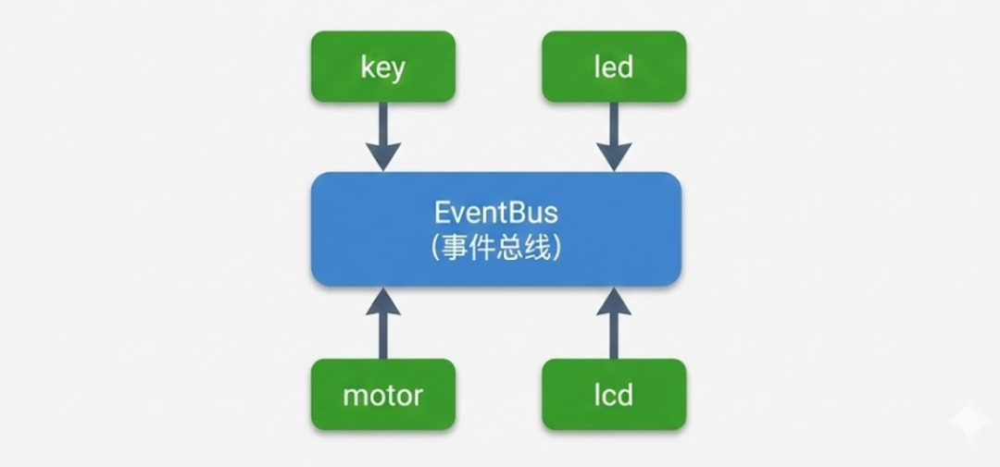
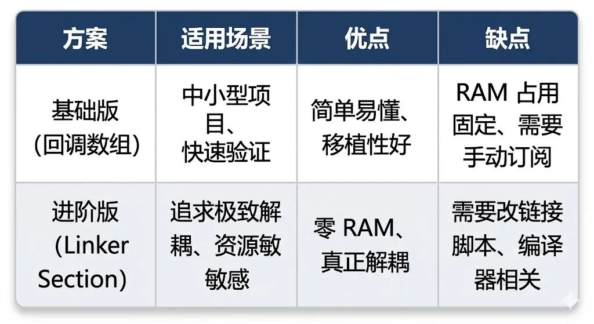

# 告别耦合地狱：如何用发布-订阅模式重构你的嵌入式代码？已付费

原创 一枚嵌入式码农 

[一枚嵌入式码农](javascript:void(0);)

 *2026年1月4日 07:31* *广东* 1人

# 写嵌入式代码这么多年，我见过太多"屎山"了。

不是说写这些代码的人水平不行，恰恰相反，很多都是经验丰富的老工程师。问题在于，大家从学校里学的那套"面向过程"的思维，在项目越来越复杂的今天，已经有点力不从心了。

今天这篇文章，我想跟大家聊一个在软件工程领域已经非常成熟，但在嵌入式圈子里还没被广泛重视的设计模式——**发布-订阅模式（Publish-Subscribe Pattern）**。

别被这个洋气的名字吓到。说白了，就是教你怎么用"广播"的思路来组织代码，让你的模块之间不再"牵一发而动全身"。

------

## 一、你是否也写过这样的"上帝函数"？

我先不讲道理，直接上代码。

看看下面这段，是不是有种似曾相识的感觉？

```c
// main.c —— 一个"典型"的嵌入式主循环

#include "key.h"
#include "led.h"
#include "motor.h"
#include "lcd.h"
#include "buzzer.h"
#include "uart.h"
#include "adc.h"
#include "temp_sensor.h"
// ... 省略另外 20 个 #include ...

void main(void)
{
    System_Init();

    while(1)
    {
        // 按键处理
        if (Key_IsPressed(KEY_1)) {
            LED_Toggle(LED_RED);      // 点亮红灯
            Motor_Start();             // 启动电机
            LCD_ShowString("Motor ON"); // 屏幕显示
            Buzzer_Beep(100);          // 蜂鸣器响一声
            UART_SendString("Key1 pressed\r\n");  // 串口打印
        }

        // 温度监控
        float temp = TempSensor_Read();
        if (temp > 50.0f) {
            LED_On(LED_RED);
            Motor_Stop();
            LCD_ShowString("OVERHEAT!");
            Buzzer_Beep(500);
            UART_SendString("Temperature warning!\r\n");
        }

        // ADC 采样处理
        uint16_t adc_val = ADC_Read(CH_1);
        if (adc_val > 3000) {
            // 又是一堆操作...
        }

        // ... 后面还有 500 行 ...
    }
}
```

怎么样，眼熟不？

我敢说，80% 的嵌入式项目，main.c 里面都是这个画风。刚开始写的时候，觉得挺清晰的，功能一目了然。但随着需求不断迭代，这个文件就像滚雪球一样越来越大，最后变成一个谁都不想碰的"上帝函数"。

### 这种写法有什么问题？

表面上看，逻辑很直观：按键按下了，就去调用 LED、电机、屏幕这些模块的函数。多简单啊！

但你仔细想想，问题可就大了：

**问题一：Include Hell（包含地狱）**

打开你的 main.c，数一数头部有多少个 `#include`？

我见过最夸张的项目，main.c 开头 include 了 47 个头文件。每次编译，这 47 个头文件的依赖关系都要重新解析一遍。改了任意一个 .h 文件，main.c 就要重新编译。在大型项目里，这种"全量编译"能把你等到崩溃。

**问题二：删不掉、拔不动**

老板说了，为了降成本，新版本把屏幕去掉。

行，你把 lcd.c 和 lcd.h 从工程里删了。

然后呢？main.c 编译报错了——因为你在里面调用了 `LCD_ShowString()`。

好，你把这行删了。

结果呢？按键功能正常，电机还能转，但总感觉哪里不对劲……你得把整个 main.c 从头到尾翻一遍，确保所有跟 LCD 相关的调用都删干净了。

这还只是删一个模块。如果要删三个呢？如果要把电机模块换成步进电机呢？如果要加一个新的蓝牙模块呢？

每一次改动，你都得像做手术一样，小心翼翼地在 main.c 这个"上帝函数"里动刀子。稍有不慎，就是一堆编译错误，甚至更可怕的——编译通过了，但运行时出了玄学 bug。

**问题三：测试是奢望**

你怎么单独测试按键模块？

你不能。因为按键模块的代码散落在 main.c 的各个角落，它依赖 LED、电机、屏幕、蜂鸣器……你想测按键，得把整个系统都跑起来。

这就叫**强耦合**。

所有模块都被一根看不见的线串在一起，剪不断，理还乱。

------

## 二、救星登场：发布-订阅模式

别被"设计模式"这四个字吓跑。

我不打算给你讲那些学院派的定义，什么"观察者模式的变体"、"事件驱动架构的核心"之类的。咱们做嵌入式的，讲究的是实用。

你就记住一个词：**广播**。

### 2.1 从"敲门"到"广播"

以前的代码是什么逻辑？

按键模块检测到按键按下，然后**主动去敲 LED 的门**说"你亮一下"，再去**敲电机的门**说"你转一下"，再去**敲屏幕的门**说"你显示一下"……

按键模块得认识 LED、电机、屏幕这些模块，得知道它们的函数怎么调用。这就产生了依赖关系。

而发布-订阅模式是怎么做的呢？

按键模块检测到按键按下，**拿起大喇叭**朝天喊一嗓子："各位注意了！1 号按键被按下啦！"

完事。

至于谁会听到这一嗓子？听到之后会干嘛？按键模块完全不关心。

可能是 LED 模块听到了，心想"哦，该我干活了"，于是自己去亮灯。可能是电机模块听到了，自己去启动。也可能谁都没听到——那也无所谓，反正按键模块的任务已经完成了。

这就是发布-订阅模式的核心思想：

- • **发布者（Publisher）**：只管喊，不管谁听
- • **订阅者（Subscriber）**：自己关注感兴趣的"频道"，有消息就处理
- • **事件总线（EventBus）**：负责把发布者的消息广播出去

### 2.2 一个接地气的比喻

想象一下村里的大喇叭广播。

以前（直接调用）：村长想通知老王、老李、老张来开会，得分别打电话——"喂，老王啊，来村委会开会"、"喂，老李啊……"。村长得记住每个人的电话号码（依赖），还得一个一个打（效率低）。如果老王家电话坏了（模块删除），村长打电话就会报错。

现在（发布-订阅）：村长直接用大喇叭广播——"全体村民注意，今天下午 3 点村委会开会！"村长不需要知道谁会来，老王、老李、老张自己听到广播后各自决定要不要去。如果老王搬走了（模块删除），广播照常进行，其他人该来还是会来。

这就是**解耦**的威力。

### 2.3 代码长什么样？

用发布-订阅模式重构后的 main.c：

```c
// main.c —— 重构后的主循环

#include "event_bus.h"  // 只需要 include 事件总线！
#include "key.h"        // 按键模块只负责检测和发布事件

void main(void)
{
    System_Init();
    EventBus_Init();  // 初始化事件总线

    while(1)
    {
        Key_Scan();  // 按键扫描，内部会发布事件
        // 就这么简单，没了
    }
}
```

按键模块：

```c
// key.c —— 按键模块

#include "key.h"
#include "event_bus.h"  // 只依赖事件总线

void Key_Scan(void)
{
    if (Key_IsPressed(KEY_1)) {
        // 只管发布事件，不管谁会处理
        EventBus_Publish(EVENT_KEY_PRESSED, (void*)KEY_1);
    }
}
```

LED 模块：

```c
// led.c —— LED 模块

#include "led.h"
#include "event_bus.h"

// LED 自己订阅按键事件
void LED_Init(void)
{
    EventBus_Subscribe(EVENT_KEY_PRESSED, LED_OnKeyPressed);
}

// 收到事件后的处理函数
static void LED_OnKeyPressed(void *arg)
{
    uint8_t key_id = (uint8_t)(uint32_t)arg;
    if (key_id == KEY_1) {
        LED_Toggle(LED_RED);
    }
}
```

看出区别了吗？

- • main.c 清爽了，不再 include 一堆东西
- • 按键模块只知道事件总线，不知道 LED、电机这些模块的存在
- • LED 模块自己决定要关注哪些事件，自己处理
- • 模块之间**没有直接依赖**

------

## 三、架构的蜕变：从蜘蛛网到星型

我画两张图，你一看就懂。

### 3.1 重构前：蜘蛛网架构


每个模块都可能依赖其他模块，连线密密麻麻。你想删掉一个模块？先把所有的连线理清楚再说吧。

### 3.2 重构后：星型架构



###  

所有模块只跟中间的 EventBus 打交道，模块之间**没有直接连线**。

想删掉 LCD 模块？直接删，其他模块纹丝不动。想加一个蓝牙模块？加上就行，让它订阅感兴趣的事件即可。

这就是架构层面的进步。

------

## 四、但是……真这么简单吗？

讲到这里，你可能觉得"发布-订阅嘛，不就是回调函数吗？这谁不会？"

道理是这个道理，但在**资源受限的单片机上**用 C 语言实现，可没那么容易。

有几个坑，你不踩一遍可能想不到：

### 坑一：类型安全

发布事件的时候，参数通常是 `void *`。

这意味着什么？意味着**编译器不会帮你做任何类型检查**。

```c
// 发布一个温度值
EventBus_Publish(EVENT_TEMP, (void*)&temp_value);  // temp_value 是 float

// 某个订阅者收到后
void OnTempEvent(void *arg)
{
    uint8_t key = (uint8_t)(uint32_t)arg;  // 糟了！把浮点数当整数用了！
    // ...
}
```

这种 bug 编译器不会报错，运行时数据就乱套了。怎么防？

### 坑二：效率问题

每次发布事件，都得遍历订阅者列表，依次调用回调函数。

如果你在中断里发布事件呢？如果订阅者有 20 个呢？中断响应时间还能保证吗？

```c
// 假设在定时器中断里发布心跳事件
void TIM_IRQHandler(void)
{
    EventBus_Publish(EVENT_HEARTBEAT, NULL);  // 这里会遍历所有订阅者
}
```

如果遍历和回调耗时太长，可能导致中断嵌套、任务阻塞，甚至系统跑飞。

### 坑三：内存碎片

网上很多教程教你这样实现订阅者列表：

```c
typedef struct SubNode {
    Callback cb;
    struct SubNode *next;
} SubNode_t;

void EventBus_Subscribe(Topic_t topic, Callback cb)
{
    SubNode_t *node = (SubNode_t*)malloc(sizeof(SubNode_t));  // 动态分配！
    node->cb = cb;
    node->next = sub_list[topic];
    sub_list[topic] = node;
}
```

在嵌入式里用 `malloc`？这是大忌。

单片机的 RAM 本来就不多，动态分配会导致内存碎片，运行时间一长，可能 `malloc` 失败，系统直接挂掉。

------

## 【付费内容预告】

原理大家都懂了，但我不教你写玩具代码。

接下来的内容，是我在多个实际项目中打磨出来的**工业级 EventBus 实现方案**。

你将学到：

**1. 静态订阅法（零内存开销）**

如何利用链接脚本（Linker Script）和 `__attribute__((section))`，在**编译期**就自动生成订阅列表。不需要 RAM，不需要 `malloc`，全部放在 Flash 里。

```c
// 只需要在订阅者函数前加一行宏
SUBSCRIBE(EVENT_KEY_PRESSED, LED_OnKeyHandler);
// 编译器和链接器会自动帮你收集所有订阅关系
```

**2. 类型安全的消息封装**

加一层薄薄的宏封装，让编译器帮你检查数据类型，把运行时 bug 提前到编译期暴露。

**3. 回调优先级管理**

当多个模块订阅同一个事件时，如何控制回调的执行顺序？如何让安全相关的模块优先响应？

**4. 调试与追踪技巧**

既然代码解耦了，调试时怎么追踪"这个事件是谁发的？谁处理了？"——教你加 Log 钩子，事件流清清楚楚。

------

> **（以下为付费内容）**

------

## 五、基础版实现：回调数组法

我们先从最简单的方案讲起。这个方案适合 80% 的项目，代码量少，逻辑清晰，五分钟就能集成到你的项目里。

### 5.1 核心数据结构

```c
// event_bus.h

#ifndef __EVENT_BUS_H
#define __EVENT_BUS_H

#include <stdint.h>

// 事件类型枚举
typedef enum {
    EVENT_KEY_PRESSED = 0,
    EVENT_KEY_RELEASED,
    EVENT_TEMP_CHANGED,
    EVENT_ADC_READY,
    EVENT_UART_RECEIVED,
    EVENT_TIMER_TICK,
    // ... 根据项目需要添加
    EVENT_MAX  // 必须放在最后，用于计算事件总数
} Event_t;

// 回调函数类型
typedef void (*EventCallback)(void *arg);

// 每个事件最多允许的订阅者数量
#define MAX_SUBSCRIBERS_PER_EVENT  8

// API 声明
void EventBus_Init(void);
int  EventBus_Subscribe(Event_t event, EventCallback callback);
void EventBus_Unsubscribe(Event_t event, EventCallback callback);
void EventBus_Publish(Event_t event, void *arg);

#endif
```

### 5.2 实现代码

```c
// event_bus.c

#include "event_bus.h"
#include <string.h>

// 订阅者表：二维数组
// 第一维是事件类型，第二维是该事件的订阅者列表
static EventCallback g_subscribers[EVENT_MAX][MAX_SUBSCRIBERS_PER_EVENT];

void EventBus_Init(void)
{
    // 清空订阅表
    memset(g_subscribers, 0, sizeof(g_subscribers));
}

int EventBus_Subscribe(Event_t event, EventCallback callback)
{
    if (event >= EVENT_MAX || callback == NULL) {
        return -1;  // 参数错误
    }

    // 找一个空位放进去
    for (int i = 0; i < MAX_SUBSCRIBERS_PER_EVENT; i++) {
        if (g_subscribers[event][i] == NULL) {
            g_subscribers[event][i] = callback;
            return 0;  // 订阅成功
        }
        // 防止重复订阅
        if (g_subscribers[event][i] == callback) {
            return 0;  // 已经订阅过了
        }
    }

    return -2;  // 订阅者已满
}

void EventBus_Unsubscribe(Event_t event, EventCallback callback)
{
    if (event >= EVENT_MAX || callback == NULL) {
        return;
    }

    for (int i = 0; i < MAX_SUBSCRIBERS_PER_EVENT; i++) {
        if (g_subscribers[event][i] == callback) {
            g_subscribers[event][i] = NULL;
            return;
        }
    }
}

void EventBus_Publish(Event_t event, void *arg)
{
    if (event >= EVENT_MAX) {
        return;
    }

    // 遍历所有订阅者，依次调用
    for (int i = 0; i < MAX_SUBSCRIBERS_PER_EVENT; i++) {
        if (g_subscribers[event][i] != NULL) {
            g_subscribers[event][i](arg);  // 调用回调函数
        }
    }
}
```

### 5.3 使用示例

先看按键模块怎么发布事件：

```c
// key.c

#include "key.h"
#include "event_bus.h"

static uint8_t last_key_state = 0;

void Key_Scan(void)
{
    uint8_t current = GPIO_ReadPin(KEY_PORT, KEY_PIN);

    // 检测到按下（下降沿）
    if (last_key_state == 1 && current == 0) {
        // 发布按键事件，参数可以是按键编号
        EventBus_Publish(EVENT_KEY_PRESSED, (void*)KEY_1);
    }

    last_key_state = current;
}
```

再看 LED 模块怎么订阅和处理：

```c
// led.c

#include "led.h"
#include "event_bus.h"

// 前向声明回调函数
static void LED_OnKeyPressed(void *arg);

void LED_Init(void)
{
    // 硬件初始化
    GPIO_Init(LED_PORT, LED_PIN, GPIO_MODE_OUTPUT);

    // 订阅按键事件
    EventBus_Subscribe(EVENT_KEY_PRESSED, LED_OnKeyPressed);
}

static void LED_OnKeyPressed(void *arg)
{
    uint8_t key_id = (uint8_t)(uintptr_t)arg;

    if (key_id == KEY_1) {
        LED_Toggle(LED_RED);
    } else if (key_id == KEY_2) {
        LED_Toggle(LED_GREEN);
    }
}
```

电机模块也可以订阅同一个事件：

```c
// motor.c

#include "motor.h"
#include "event_bus.h"

static void Motor_OnKeyPressed(void *arg);

void Motor_Init(void)
{
    // 硬件初始化...

    // 也订阅按键事件
    EventBus_Subscribe(EVENT_KEY_PRESSED, Motor_OnKeyPressed);
}

static void Motor_OnKeyPressed(void *arg)
{
    uint8_t key_id = (uint8_t)(uintptr_t)arg;

    if (key_id == KEY_1) {
        Motor_Toggle();  // 按键1控制电机启停
    }
}
```

### 5.4 这种方案的优缺点

**优点：**

- • 代码简单，容易理解
- • 不需要动态内存分配
- • 订阅/发布都是 O(n) 复杂度，在订阅者数量不多时效率可接受

**缺点：**

- • 内存占用是 `EVENT_MAX × MAX_SUBSCRIBERS_PER_EVENT × sizeof(void*)`
- • 如果事件类型多、每个事件订阅者少，会造成大量空间浪费（稀疏数组）
- • 需要在运行时调用 `Subscribe()` 进行注册，不够优雅

对于中小型项目，这个方案完全够用。但如果你追求极致的资源利用率，或者想要更优雅的解耦方式，那就要看下面的"进阶版"了。

------

## 六、进阶版实现：Linker Section 魔法

这是整篇文章**最值钱**的部分。

我要教你一个黑科技：利用编译器和链接器的特性，在**编译期**就自动收集所有订阅关系，不需要运行时调用 `Subscribe()`，不占用 RAM，全部存在 Flash 里。

### 6.1 先看效果

用了这个方案后，你的代码会变成这样：

```c
// led.c —— LED 模块

#include "led.h"
#include "event_bus.h"

// 不需要在 Init 里调用 Subscribe！
// 只需要在回调函数前加一行宏声明
static void LED_OnKeyPressed(void *arg);
SUBSCRIBE(EVENT_KEY_PRESSED, LED_OnKeyPressed);  // 这一行就够了！

void LED_Init(void)
{
    // 只做硬件初始化
    GPIO_Init(LED_PORT, LED_PIN, GPIO_MODE_OUTPUT);
    // 不需要任何订阅代码
}

static void LED_OnKeyPressed(void *arg)
{
    uint8_t key_id = (uint8_t)(uintptr_t)arg;
    if (key_id == KEY_1) {
        LED_Toggle(LED_RED);
    }
}
```

看到没有？`SUBSCRIBE` 宏写在函数外面，跟普通的变量定义一样。编译的时候，链接器会自动把所有 `SUBSCRIBE` 收集到一起。

更厉害的是：如果你把 led.c 从工程里删掉，**不需要改任何其他代码**，编译照样通过，运行照样正常——只是没人响应按键事件了而已。

这才是真正的解耦。

### 6.2 原理揭秘

这个魔法的核心是两个东西：

1. 1. **`__attribute__((section))`**：GCC 的扩展语法，可以把变量或函数放到指定的内存段
2. 2. **链接脚本（Linker Script）**：定义这些特殊段的起始地址和结束地址

我们把每个订阅关系（事件 ID + 回调函数指针）打包成一个结构体，然后用 `__attribute__((section))` 把它放到一个特殊的段里。链接器会自动把所有这样的结构体排列在一起，我们只需要知道这个段的起始和结束地址，就能遍历所有订阅关系。

### 6.3 完整实现

**头文件：**

```c
// event_bus.h

#ifndef __EVENT_BUS_H
#define __EVENT_BUS_H

#include <stdint.h>

// 事件类型枚举
typedef enum {
    EVENT_KEY_PRESSED = 0,
    EVENT_KEY_RELEASED,
    EVENT_TEMP_CHANGED,
    EVENT_ADC_READY,
    EVENT_UART_RECEIVED,
    EVENT_TIMER_TICK,
    EVENT_MAX
} Event_t;

// 回调函数类型
typedef void (*EventCallback)(void *arg);

// 订阅者描述结构体
typedef struct {
    Event_t event;          // 订阅的事件类型
    EventCallback callback; // 回调函数指针
    uint8_t priority;       // 优先级（数字小优先级高）
} EventSubscriber_t;

// ========== 核心宏定义 ==========

// 用于生成唯一的变量名
#define __CONCAT(a, b) a##b
#define _CONCAT(a, b) __CONCAT(a, b)

// 订阅宏（带优先级）
#define SUBSCRIBE_WITH_PRIORITY(evt, cb, prio)                    \
    static const EventSubscriber_t                                \
    __attribute__((used))                                         \
    __attribute__((section(".event_subscribers")))                \
    _CONCAT(__subscriber_, __LINE__) = {                          \
        .event = (evt),                                           \
        .callback = (cb),                                         \
        .priority = (prio)                                        \
    }

// 订阅宏（默认优先级）
#define SUBSCRIBE(evt, cb) SUBSCRIBE_WITH_PRIORITY(evt, cb, 128)

// API 声明
void EventBus_Init(void);
void EventBus_Publish(Event_t event, void *arg);

#endif
```

**实现代码：**

```c
// event_bus.c

#include "event_bus.h"

// 链接器会生成这两个符号，指向 .event_subscribers 段的起始和结束
extern const EventSubscriber_t __start_event_subscribers;
extern const EventSubscriber_t __stop_event_subscribers;

void EventBus_Init(void)
{
    // 静态订阅方案不需要初始化
    // 这个函数留空，或者可以用来做一些检查
}

void EventBus_Publish(Event_t event, void *arg)
{
    // 获取订阅者段的起始和结束地址
    const EventSubscriber_t *start = &__start_event_subscribers;
    const EventSubscriber_t *stop = &__stop_event_subscribers;

    // 遍历所有订阅者
    for (const EventSubscriber_t *sub = start; sub < stop; sub++) {
        if (sub->event == event && sub->callback != NULL) {
            sub->callback(arg);
        }
    }
}
```

**链接脚本修改（关键！）**

在你的 .ld 文件中，找到 `.rodata` 段，在它后面添加：

```c
/* STM32 链接脚本示例 */

SECTIONS
{
    /* ... 其他段 ... */

    .rodata :
    {
        *(.rodata)
        *(.rodata*)
    } > FLASH

    /* 添加事件订阅者段 */
    .event_subscribers :
    {
        . = ALIGN(4);
        __start_event_subscribers = .;   /* 段起始地址 */
        KEEP(*(.event_subscribers))      /* 收集所有订阅者，不被优化掉 */
        __stop_event_subscribers = .;    /* 段结束地址 */
        . = ALIGN(4);
    } > FLASH

    /* ... 其他段 ... */
}
```

如果你用的是 Keil（ARM Compiler），语法稍有不同：

```c
// Keil 版本的宏定义
#define SUBSCRIBE_WITH_PRIORITY(evt, cb, prio)                    \
    static const EventSubscriber_t                                \
    __attribute__((used))                                         \
    __attribute__((section("event_sub")))                         \
    _CONCAT(__subscriber_, __LINE__) = {                          \
        .event = (evt),                                           \
        .callback = (cb),                                         \
        .priority = (prio)                                        \
    }

// Keil 中获取段边界
extern const EventSubscriber_t event_sub$$Base;
extern const EventSubscriber_t event_sub$$Limit;
#define __start_event_subscribers event_sub$$Base
#define __stop_event_subscribers event_sub$$Limit
```

### 6.4 带优先级的发布

有时候你希望某些回调优先执行（比如安全相关的模块），可以这样改进：

```c
void EventBus_Publish(Event_t event, void *arg)
{
    const EventSubscriber_t *start = &__start_event_subscribers;
    const EventSubscriber_t *stop = &__stop_event_subscribers;

    // 先找出该事件的所有订阅者
    const EventSubscriber_t *subs[16];
    int count = 0;

    for (const EventSubscriber_t *sub = start; sub < stop; sub++) {
        if (sub->event == event && sub->callback != NULL) {
            if (count < 16) {
                subs[count++] = sub;
            }
        }
    }

    // 按优先级排序（简单冒泡，数量少时够用）
    for (int i = 0; i < count - 1; i++) {
        for (int j = 0; j < count - 1 - i; j++) {
            if (subs[j]->priority > subs[j + 1]->priority) {
                const EventSubscriber_t *tmp = subs[j];
                subs[j] = subs[j + 1];
                subs[j + 1] = tmp;
            }
        }
    }

    // 按优先级顺序调用
    for (int i = 0; i < count; i++) {
        subs[i]->callback(arg);
    }
}
```

使用时指定优先级：

```c
// 安全模块优先级最高
SUBSCRIBE_WITH_PRIORITY(EVENT_KEY_PRESSED, Safety_OnKeyPressed, 0);

// 普通模块默认优先级
SUBSCRIBE(EVENT_KEY_PRESSED, LED_OnKeyPressed);  // 默认 128

// 日志模块优先级最低
SUBSCRIBE_WITH_PRIORITY(EVENT_KEY_PRESSED, Log_OnKeyPressed, 255);
```

### 6.5 这种方案的威力

我来算一笔账：

**基础版（回调数组法）**：

- • 假设 10 种事件，每种最多 8 个订阅者
- • RAM 占用：10 × 8 × 4 = 320 字节（ARM 32 位系统）
- • 不管有没有订阅者，这 320 字节都得预留

**进阶版（Linker Section 法）**：

- • 假设实际只有 15 个订阅关系
- • Flash 占用：15 × 8 = 120 字节（每个订阅者结构体 8 字节）
- • **RAM 占用：0 字节！**

而且，进阶版还有一个杀手级优势：**真正的解耦**。

基础版里，你删掉一个模块，还得去找它的 `Init()` 函数，确保 `Subscribe()` 调用被删掉了。

进阶版里，你删掉一个 .c 文件，链接器自动调整，不需要改任何其他代码。这才是工程实践中最宝贵的特性。

------

## 七、参数传递的艺术：告别野指针

前面我们一直用 `void *arg` 来传递参数，这样灵活是灵活，但太危险了。

你传一个整数进去，收到的人把它当浮点数用；你传一个结构体指针，收到的人把它当数组用……这些 bug 编译器不会报错，全靠程序员小心。

有没有更安全的做法？

### 7.1 统一的消息信封

我的做法是定义一个"消息信封"结构体，所有事件数据都装在这个信封里：

```c
// event_types.h

#ifndef __EVENT_TYPES_H
#define __EVENT_TYPES_H

#include <stdint.h>

// 消息信封结构体
typedef struct {
    uint16_t event_id;       // 事件类型（冗余，用于校验）

    union {
        // 按键事件数据
        struct {
            uint8_t key_id;
            uint8_t action;  // 0: 释放, 1: 按下, 2: 长按
        } key;

        // 温度事件数据
        struct {
            float value;
            uint8_t sensor_id;
        } temp;

        // ADC 事件数据
        struct {
            uint16_t raw_value;
            uint8_t channel;
        } adc;

        // 串口事件数据
        struct {
            uint8_t *data;
            uint16_t length;
        } uart;

        // 通用整数（简单场景）
        uint32_t value;

        // 通用指针（灵活场景）
        void *ptr;

    } payload;

} EventData_t;

#endif
```

发布事件时这样用：

```c
// 发布按键事件
void Key_Scan(void)
{
    if (Key_IsPressed(KEY_1)) {
        EventData_t data = {
            .event_id = EVENT_KEY_PRESSED,
            .payload.key.key_id = KEY_1,
            .payload.key.action = 1  // 按下
        };
        EventBus_Publish(EVENT_KEY_PRESSED, &data);
    }
}
```

订阅者收到时这样用：

```c
static void LED_OnKeyPressed(void *arg)
{
    EventData_t *data = (EventData_t *)arg;

    // 可以做一个校验
    if (data->event_id != EVENT_KEY_PRESSED) {
        return;  // 数据不对，直接返回
    }

    if (data->payload.key.key_id == KEY_1) {
        LED_Toggle(LED_RED);
    }
}
```

这样做的好处：

1. 1. **结构清晰**：看到 `data->payload.key.key_id` 就知道是按键 ID，不会搞混
2. 2. **类型安全**：编译器会检查你访问的字段是否存在
3. 3. **可扩展**：新增事件类型只需要在 union 里加一个成员

### 7.2 更进一步：编译期类型检查

如果你想让编译器帮你检查"按键事件只能传按键数据"，可以用宏来封装：

```c
// 带类型检查的发布宏
#define PUBLISH_KEY_EVENT(key_id, action)                   \
    do {                                                     \
        EventData_t _data = {                                \
            .event_id = EVENT_KEY_PRESSED,                   \
            .payload.key.key_id = (key_id),                  \
            .payload.key.action = (action)                   \
        };                                                   \
        EventBus_Publish(EVENT_KEY_PRESSED, &_data);         \
    } while(0)

#define PUBLISH_TEMP_EVENT(sensor, temp_val)                \
    do {                                                     \
        EventData_t _data = {                                \
            .event_id = EVENT_TEMP_CHANGED,                  \
            .payload.temp.sensor_id = (sensor),              \
            .payload.temp.value = (temp_val)                 \
        };                                                   \
        EventBus_Publish(EVENT_TEMP_CHANGED, &_data);        \
    } while(0)
```

用起来更简洁：

```c
// 发布按键事件
PUBLISH_KEY_EVENT(KEY_1, 1);

// 发布温度事件
PUBLISH_TEMP_EVENT(0, 25.5f);
```

这样就不可能"用发布温度的宏去发布按键事件"了，类型对不上编译就报错。

------

## 八、避坑指南：老工程师的血泪教训

用发布-订阅模式这么多年，我踩过不少坑。这里把最常见的几个分享给大家，免得你们重蹈覆辙。

### 8.1 坑一：递归发布导致栈溢出

**场景描述：**

模块 A 订阅了事件 X，在回调里发布事件 Y；
模块 B 订阅了事件 Y，在回调里发布事件 X；
然后……

```c
void A_Handler(void *arg)
{
    // 处理事件 X
    EventBus_Publish(EVENT_Y, NULL);  // 发布事件 Y
}

void B_Handler(void *arg)
{
    // 处理事件 Y
    EventBus_Publish(EVENT_X, NULL);  // 发布事件 X，又触发 A_Handler……
}
```

恭喜你，获得了一个无限递归，栈空间耗尽，程序跑飞。

**解决方案：**

在 `Publish` 函数里加一个深度计数器：

```c
static uint8_t g_publish_depth = 0;
#define MAX_PUBLISH_DEPTH 5

void EventBus_Publish(Event_t event, void *arg)
{
    // 检查递归深度
    if (g_publish_depth >= MAX_PUBLISH_DEPTH) {
        // 超过最大深度，直接返回（可以加个日志）
        return;
    }

    g_publish_depth++;

    // ... 正常的发布逻辑 ...

    g_publish_depth--;
}
```

### 8.2 坑二：中断里发布事件

**场景描述：**

定时器中断里发布心跳事件，心跳事件的订阅者有 10 个，每个回调执行 100us……

```c
void TIM_IRQHandler(void)
{
    TIM_ClearFlag();
    EventBus_Publish(EVENT_HEARTBEAT, NULL);  // 这里会执行 1ms！
}
```

中断处理时间太长，导致其他中断响应延迟，甚至丢数据。

**解决方案：**

中断里只做"标记"，不做"处理"：

```c
// 事件标记变量
static volatile uint32_t g_pending_events = 0;

void TIM_IRQHandler(void)
{
    TIM_ClearFlag();
    g_pending_events |= (1 << EVENT_HEARTBEAT);  // 只是标记一下
}

// 主循环里处理
void main(void)
{
    while(1) {
        // 检查并处理待处理事件
        if (g_pending_events & (1 << EVENT_HEARTBEAT)) {
            g_pending_events &= ~(1 << EVENT_HEARTBEAT);
            EventBus_Publish(EVENT_HEARTBEAT, NULL);  // 在主循环里发布
        }

        // 其他任务...
    }
}
```

或者使用消息队列，在中断里只入队，主循环里出队并发布。

### 8.3 坑三：调试困难

**场景描述：**

程序跑飞了，打开调试器一看，Call Stack 里全是函数指针调用，根本看不出是哪个模块发的事件、谁处理的。

**解决方案：**

在 `Publish` 函数里加调试日志：

```c
void EventBus_Publish(Event_t event, void *arg)
{
    #ifdef DEBUG_EVENT_BUS
    printf("[EventBus] Publishing event %d\n", event);
    #endif

    const EventSubscriber_t *start = &__start_event_subscribers;
    const EventSubscriber_t *stop = &__stop_event_subscribers;

    for (const EventSubscriber_t *sub = start; sub < stop; sub++) {
        if (sub->event == event && sub->callback != NULL) {
            #ifdef DEBUG_EVENT_BUS
            printf("[EventBus] -> Dispatching to %p\n", sub->callback);
            #endif
            sub->callback(arg);
        }
    }

    #ifdef DEBUG_EVENT_BUS
    printf("[EventBus] Event %d done\n", event);
    #endif
}
```

如果你的 MCU 不方便用 printf，可以用 GPIO 脉冲或者把日志写到环形缓冲区，事后导出分析。

### 8.4 坑四：回调函数里操作共享资源

**场景描述：**

两个模块都订阅同一个事件，回调里都要操作同一个全局变量，结果数据乱了。

```c
static uint32_t g_counter = 0;

void A_Handler(void *arg)
{
    g_counter++;  // 读-改-写
}

void B_Handler(void *arg)
{
    g_counter++;  // 也是读-改-写，可能覆盖 A 的结果
}
```

**解决方案：**

- • 如果是裸机系统，确保 Publish 不会被中断打断（关中断或使用原子操作）
- • 如果用了 RTOS，给共享资源加互斥锁
- • 更好的做法：避免在回调里直接操作共享资源，而是通过消息把操作请求发给资源的"所有者"

### 8.5 坑五：参数生命周期

**场景描述：**

你在栈上创建了一个结构体，把指针传给 `Publish`：

```c
void SomeFunction(void)
{
    EventData_t data = { ... };  // 栈上变量
    EventBus_Publish(EVENT_XXX, &data);
}
```

看起来没问题，但如果 `Publish` 是异步的（比如先入队，后处理），等到真正处理的时候，`SomeFunction` 早就返回了，`data` 已经被销毁，指针指向的是垃圾数据。

**解决方案：**

- • 同步 Publish（立即处理完所有回调再返回）就没这个问题
- • 如果是异步 Publish，要用静态变量或者动态分配（但动态分配在嵌入式里要谨慎）
- • 或者把数据复制一份到消息队列里

------

## 九、总结：从"码农"到"架构师"的一小步

写到这里，我们来回顾一下这篇文章讲了什么。

### 9.1 核心观点

**发布-订阅模式**，说白了就是**广播**。

发布者只管喊，不管谁听；订阅者自己决定听什么、怎么处理。中间有个**事件总线（EventBus）**负责传话。

这种模式能帮你：

- • **斩断模块间的直接依赖**：main.c 不再需要 include 一堆头文件
- • **随时增删模块**：加新功能只需要让它订阅相关事件，删功能直接删 .c 文件
- • **让代码更好测试**：每个模块只关心自己订阅的事件，可以单独测试

### 9.2 两种实现方案



我的建议：

- • 如果你的项目不超过 20 个事件类型，用基础版完全够了
- • 如果你追求"删掉模块不用改一行代码"的极致解耦，或者 RAM 特别紧张，上进阶版

### 9.3 关于代码复杂度的思考

有人可能会说："用了发布-订阅，代码反而更难读了。以前 main.c 里一眼就能看到按键按下后干了什么，现在得一个一个去找订阅者。"

这话没错。

发布-订阅确实**牺牲了一定的代码可读性**，换来的是**架构层面的灵活性**。

你得自己权衡：

- • 如果你的项目就几百行代码，改动也不频繁，那直接调用可能更省事
- • 如果你的项目有上万行代码，需求三天两头变，模块经常加加减减，那发布-订阅能救你的命

说到底，**没有银弹**。任何设计模式都是在不同维度做取舍。关键是你得知道自己在取舍什么。

### 9.4 接下来做什么？

如果你觉得这篇文章有用，我建议你：

1. 1. **先在一个小模块上试试水**：比如把按键模块改成发布-订阅模式，看看效果
2. 2. **选择适合自己的方案**：别追求"最先进"，够用就行
3. 3. **建立自己的 EventBus 库**：把代码整理成一个独立的模块，以后项目直接复用

如果你在实践中遇到什么问题，欢迎在评论区交流。我会尽量回复每一条认真的技术问题。