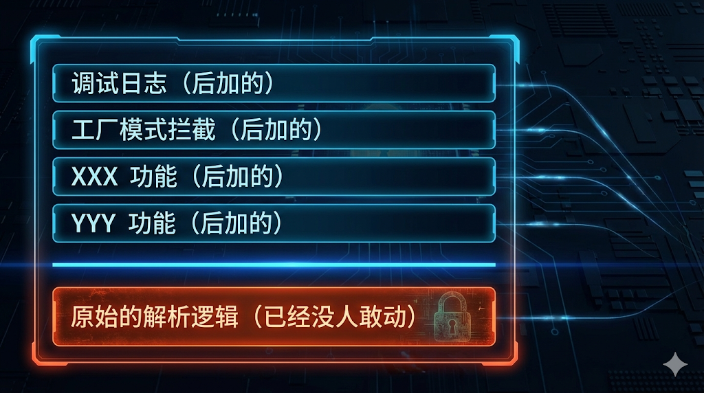
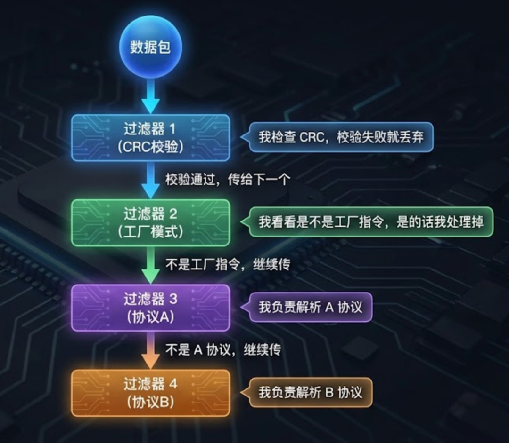
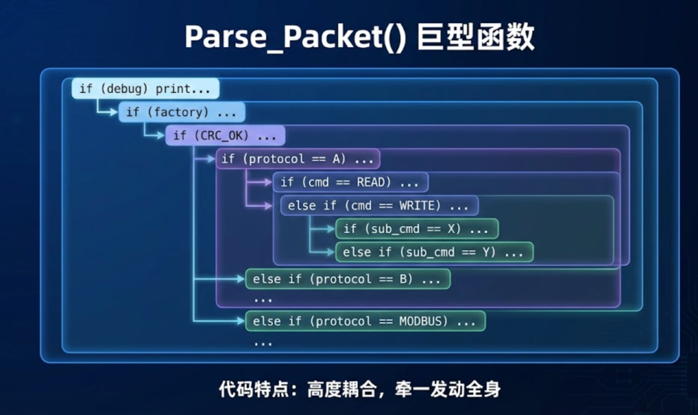
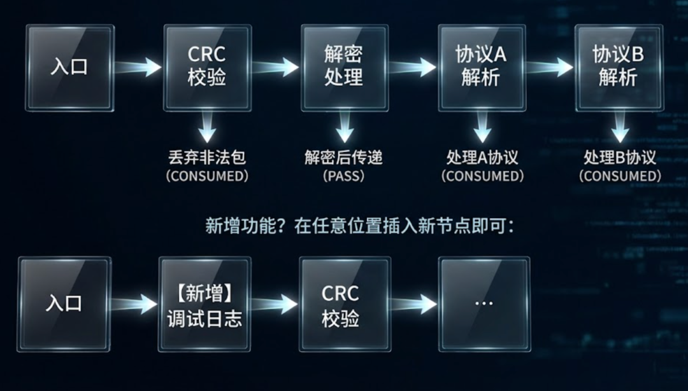

# 告别臃肿的 ProcessData()：如何用责任链模式重构你的串口协议栈？已付费


> **核心卖点：** 打造像乐高积木一样的协议栈，让数据处理流程支持"热插拔"。

------

## 前言

不知道你有没有遇到过这种情况：

项目初期，你写了一个简洁的串口数据处理函数，几十行代码，逻辑清晰。三个月后，这个函数膨胀到了 500 行，嵌套了七八层 `if-else`，你自己看着都头疼。

每次产品经理提新需求，你就得在这坨代码里小心翼翼地"埋地雷"。改完之后祈祷别炸，测试通过了长舒一口气。

这篇文章，我想跟你聊聊怎么用**责任链模式**来终结这种噩梦。

------

## 一、那个改不动的协议解析器

### 1.1 熟悉的配方，熟悉的味道

先来看一段"经典"代码，我敢打赌你一定见过类似的：

```c
void Parse_Packet(uint8_t *data, uint16_t len)
{
    // 第一步：校验 CRC
    if (!Check_CRC(data, len)) {
        return;
    }

    // 第二步：判断包头
    if (data[0] != 0xAA || data[1] != 0x55) {
        return;
    }

    // 第三步：区分协议类型
    uint8_t protocol = data[2];

    if (protocol == PROTOCOL_A) {
        // A 协议处理，100 行代码...
        if (data[3] == CMD_READ) {
            // ...
        } else if (data[3] == CMD_WRITE) {
            // ...
        } else if (data[3] == CMD_CONFIG) {
            // 又是一堆嵌套...
        }
    }
    else if (protocol == PROTOCOL_B) {
        // B 协议处理，又是 100 行...
    }
    else if (protocol == PROTOCOL_MODBUS) {
        // Modbus 处理...
    }
    else {
        // 未知协议，丢弃
    }

    // 顺便过滤一下日志杂音
    // ...
}
```

写这种代码的时候，你可能觉得"也没那么糟糕嘛"。

直到有一天，产品经理跑过来说：

> "小张啊，加一个功能，如果收到的是'工厂模式'指令，就要拦截下来，不能传给业务层。对了，这个功能要支持动态开关。"

你看着这个函数，陷入了沉思。

### 1.2 灾难是怎么发生的

最简单的做法，当然是在函数最前面加一段：

```c
void Parse_Packet(uint8_t *data, uint16_t len)
{
    // 【新增】工厂模式拦截
    if (g_factory_mode_enabled) {
        if (Is_Factory_Command(data, len)) {
            Handle_Factory_Command(data, len);
            return;  // 拦截，不往下走
        }
    }

    // 原有的 500 行代码...
}
```

改完了。测试通过。上线。

一个月后，又来需求：

> "再加一个功能，所有收到的数据都要打印出来，方便现场调试。但是只在调试模式下生效。"

继续往前面塞：

```c
void Parse_Packet(uint8_t *data, uint16_t len)
{
    // 【新增】调试日志
    if (g_debug_mode) {
        Debug_Print_Hex(data, len);
    }

    // 【新增】工厂模式拦截
    if (g_factory_mode_enabled) {
        // ...
    }

    // 原有的 500 行代码...
}
```

就这样，每次需求都往前面"打补丁"。这个函数的开头慢慢变成了这样：



这就是典型的"洋葱代码"——一层包一层，剥开全是泪。

**问题出在哪？**

• **所有逻辑都耦合在一起**：CRC 校验、协议区分、业务处理、调试功能，全塞在一个函数里
• **修改成本高**：加一个小功能，都要理解整个函数的逻辑
• **测试困难**：想单独测试"工厂模式拦截"？对不起，你得把整个协议栈都跑起来

------

## 二、救星登场：责任链模式

### 2.1 先讲个故事

想象一下公司的报销流程：

1.你提交了一张 500 块的发票
2.**组长**看了一眼：金额小于 1000，我能批。签字，完事。

再想象另一个场景：

1.你提交了一张 50000 块的采购单
2.**组长**看了一眼：超出我权限了，往上报
c**经理**看了一眼：还是超了，继续往上
4.**总监**审批通过

这就是**责任链模式**的核心思想：

> **把处理逻辑拆分成一个个独立的"处理者"，像链条一样串起来。每个处理者只关心自己能处理的事，处理不了就丢给下一个。**

用更接地气的话说：**这是一门"踢皮球"的艺术**。

### 2.2 映射到代码世界

回到我们的串口数据处理场景，责任链是这样工作的：



每个"过滤器"（也叫 Handler）都是一个独立的函数，只做一件事。

**这样改造之后：**

- • 想加"调试日志"功能？写一个新的 Handler，插到链头就行
- • 想临时禁用"工厂模式"？把那个 Handler 从链上摘掉
- • 想单独测试 CRC 校验？直接调用那个 Handler 函数

**原有的代码一行都不用改。**

------

## 三、架构对比：意大利面 vs 流水线

光说不练假把式，我画两张图让你感受一下差距。

### 3.1 改造前：意大利面条式代码



**问题一目了然**：所有逻辑纠缠在一起，改一个地方可能影响其他地方。

### 3.2 改造后：流水线式架构



**核心区别**：

| 对比项   | 意大利面代码             | 责任链模式                 |
| -------- | ------------------------ | -------------------------- |
| 耦合度   | 高，所有逻辑混在一起     | 低，每个 Handler 独立      |
| 扩展性   | 差，改一个功能要理解全部 | 好，插入新节点即可         |
| 可测试   | 难，必须集成测试         | 易，可单独测试每个 Handler |
| 代码复用 | 几乎不可能               | Handler 可在不同链中复用   |

------

## 四、让你心痒痒的几个问题

原理讲完了，你可能已经跃跃欲试了。

但是，用 C 语言在嵌入式环境下实现一套**高效、实用**的责任链，还有几个关键问题需要解决：

### 问题一：链表怎么组织？

是用**数组**（静态链）还是**指针**（动态链）？

在 RAM 只有 4KB 的 MCU 上，我更推荐用指针实现的动态链。为什么？因为数组方式需要预先分配最大长度，而且不支持运行时动态增删节点。

### 问题二：返回值怎么设计？

如果一个节点把数据"吃掉"了（比如拦截了非法包），怎么通知链条停止继续传递？

这就涉及到**处理结果枚举**的设计：是继续传递（PASS），还是消费掉（CONSUMED），还是报错（ERROR）？

### 问题三：性能会不会有问题？

那么多函数调用，会不会导致协议栈处理变慢？在中断里能用吗？

答案是：设计得当的话，性能开销可以忽略不计。但确实有一些坑需要避开。

------

**【付费内容预告】**

拒绝硬编码，拥抱流水线。

接下来的内容，我将带你从零实现一个**通用的 Pipeline 处理框架**。你将学到：

1.**节点定义**：如何设计一个标准的 Handler 接口，支持处理结果反馈（`HANDLED` / `PASS`）
2.**动态挂载**：如何在系统运行时，通过一条 `Chain_Append()` 指令，动态给串口增加一个"数据解密"功能，而无需重启
3.**实战案例**：用责任链重构一个"多协议混传"的串口驱动（同时支持 AT 指令、Modbus 和 Shell）
4.**调试神器**：如何在不修改任何代码的情况下，动态插入一个"数据窃听器"
5. 5. **避坑指南**：嵌入式环境下的栈溢出风险和性能优化技巧

**（继续阅读，让你的数据流逻辑井井有条 ↓）**

------

## 五、核心实战 A：定义 Handler 接口

好了，开始撸代码。

### 5.1 处理结果枚举

首先，我们要定义一个枚举，用来描述每个 Handler 的处理结果：

```c
/**
 * @brief 责任链处理结果
 */
typedef enum {
    CHAIN_RESULT_PASS = 0,    // 我处理不了，传给下一个节点
    CHAIN_RESULT_CONSUMED,    // 我处理完了，链条到此终止
    CHAIN_RESULT_ERROR        // 出错了，链条终止并报错
} ChainResult_t;
```

这三个返回值是整个框架的**灵魂**：

- • **PASS**：就像踢皮球，"这事不归我管，你找下家吧"
- • **CONSUMED**：数据被"吃掉"了，后面的节点不用管了
- • **ERROR**：出问题了，可能需要上报错误码

### 5.2 Handler 函数指针

接下来定义 Handler 的函数签名：

```c
/**
 * @brief Handler 函数指针类型
 * @param data  数据指针
 * @param len   数据长度
 * @return      处理结果
 */
typedef ChainResult_t (*HandlerFunc)(void *data, uint16_t len);
```

每个 Handler 都是这种形式的函数。输入数据，输出处理结果，简单明了。

### 5.3 链表节点结构体

最后是链表节点的定义：

```c
/**
 * @brief 责任链节点
 */
typedef struct ChainNode {
    HandlerFunc       handler;   // 处理函数
    struct ChainNode *next;      // 下一个节点
    const char       *name;      // 节点名称（调试用）
    uint8_t           enabled;   // 是否启用（1=启用，0=跳过）
} ChainNode_t;
```

这里有两个细节值得说一下：

1.**name 字段**：纯粹是为了调试。当链条出问题时，你可以遍历打印每个节点的名字，一眼就能看出问题在哪
2.**enabled 字段**：这是个实用的小技巧。有时候你不想真的把节点从链上摘掉（可能涉及内存管理），只是想临时禁用，这个标志位就派上用场了

### 5.4 责任链管理结构体

为了方便管理整个链条，再封装一层：

```c
/**
 * @brief 责任链管理器
 */
typedef struct {
    ChainNode_t *head;           // 链表头
    ChainNode_t *tail;           // 链表尾（方便尾插）
    uint8_t      node_count;     // 节点数量
    const char  *chain_name;     // 链条名称（调试用）
} Chain_t;
```

有了 `tail` 指针，往链尾追加节点就是 O(1) 操作，不用每次都遍历。

------

## 六、核心实战 B：链条驱动器

### 6.1 初始化函数

```c
/**
 * @brief 初始化一条责任链
 * @param chain       链条指针
 * @param chain_name  链条名称
 */
void Chain_Init(Chain_t *chain, const char *chain_name)
{
    chain->head       = NULL;
    chain->tail       = NULL;
    chain->node_count = 0;
    chain->chain_name = chain_name;
}
```

没什么花活，就是初始化。

### 6.2 追加节点

```c
/**
 * @brief 向链尾追加一个节点
 * @param chain    链条指针
 * @param node     节点指针
 * @return         0=成功，-1=失败
 */
int Chain_Append(Chain_t *chain, ChainNode_t *node)
{
    if (chain == NULL || node == NULL) {
        return -1;
    }

    node->next    = NULL;
    node->enabled = 1;  // 默认启用

    if (chain->head == NULL) {
        // 链条为空，直接作为头节点
        chain->head = node;
        chain->tail = node;
    } else {
        // 追加到尾部
        chain->tail->next = node;
        chain->tail       = node;
    }

    chain->node_count++;
    return 0;
}
```

### 6.3 头部插入节点

有时候你需要在链头插入节点（比如插入一个最高优先级的过滤器）：

```c
/**
 * @brief 向链头插入一个节点
 * @param chain    链条指针
 * @param node     节点指针
 * @return         0=成功，-1=失败
 */
int Chain_Prepend(Chain_t *chain, ChainNode_t *node)
{
    if (chain == NULL || node == NULL) {
        return -1;
    }

    node->enabled = 1;

    if (chain->head == NULL) {
        node->next    = NULL;
        chain->head   = node;
        chain->tail   = node;
    } else {
        node->next    = chain->head;
        chain->head   = node;
    }

    chain->node_count++;
    return 0;
}
```

### 6.4 核心：链条执行器

这是整个框架最核心的函数：

```c
/**
 * @brief 执行责任链处理
 * @param chain    链条指针
 * @param data     数据指针
 * @param len      数据长度
 * @return         最终处理结果
 */
ChainResult_t Chain_Process(Chain_t *chain, void *data, uint16_t len)
{
    if (chain == NULL || chain->head == NULL) {
        return CHAIN_RESULT_ERROR;
    }

    ChainNode_t  *current = chain->head;
    ChainResult_t result  = CHAIN_RESULT_PASS;

    // 遍历链表，依次调用每个 Handler
    while (current != NULL) {
        // 检查节点是否启用
        if (current->enabled && current->handler != NULL) {
            result = current->handler(data, len);

            // 如果不是 PASS，终止链条
            if (result != CHAIN_RESULT_PASS) {
                break;
            }
        }

        current = current->next;
    }

    return result;
}
```

**几个关键点：**

1.**用 while 循环，不用递归**：这点很重要。递归写法虽然优雅，但在嵌入式环境下容易爆栈。假设你的链条有 10 个节点，递归就是 10 层函数调用，栈空间直接翻倍
2.**检查 enabled 标志**：跳过被禁用的节点
3.**遇到非 PASS 就 break**：这就是"消费"语义的实现。一旦某个节点说"我处理完了"，后面的节点就不再执行

### 6.5 调试辅助函数

开发阶段，能打印出整个链条的结构非常有用：

```c
/**
 * @brief 打印链条结构（调试用）
 * @param chain    链条指针
 */
void Chain_Dump(Chain_t *chain)
{
    if (chain == NULL) {
        printf("[Chain] NULL\n");
        return;
    }

    printf("[Chain] %s (nodes: %d)\n",
           chain->chain_name ? chain->chain_name : "unnamed",
           chain->node_count);

    ChainNode_t *current = chain->head;
    int index = 0;

    while (current != NULL) {
        printf("  [%d] %s %s\n",
               index++,
               current->name ? current->name : "unnamed",
               current->enabled ? "(enabled)" : "(disabled)");
        current = current->next;
    }
}
```

输出大概长这样：

```c
[Chain] UART1_RX_Chain (nodes: 4)
  [0] CRC_Filter (enabled)
  [1] Factory_Handler (disabled)
  [2] AT_Handler (enabled)
  [3] Business_Handler (enabled)
```

一目了然。

------

## 七、场景实战：串口多协议混传

理论讲完了，来个真实案例。

### 7.1 场景描述

这是物联网设备上特别常见的需求：

**一个串口要同时承载多种协议：**

- • **调试 Shell**：人类敲的文本命令，以回车结尾
- • **AT 指令**：和无线模组通信，以 `AT` 开头
- • **业务数据**：二进制协议，有特定的帧头帧尾

三种协议混在一起，你怎么区分？

传统做法是在一个大函数里写一堆 `if-else`。用责任链，我们可以把它拆成独立的 Handler。

### 7.2 定义各个 Handler

**Handler 1：噪声过滤器**

```c
/**
 * @brief 过滤掉太短的垃圾数据
 */
ChainResult_t Filter_Noise(void *data, uint16_t len)
{
    // 长度小于 3 的一律丢弃
    if (len < 3) {
        // 可以在这里记录一下，方便排查问题
        // LOG_DEBUG("Noise filtered: len=%d", len);
        return CHAIN_RESULT_CONSUMED;  // 吃掉，不往下传
    }

    return CHAIN_RESULT_PASS;  // 长度合法，继续传
}
```

**Handler 2：AT 指令处理器**

```c
/**
 * @brief 处理 AT 指令
 */
ChainResult_t Handle_AT(void *data, uint16_t len)
{
    uint8_t *buf = (uint8_t *)data;

    // 判断是否以 "AT" 开头
    if (len >= 2 && buf[0] == 'A' && buf[1] == 'T') {
        // 是 AT 指令，交给 AT 解析器处理
        AT_Parser_Process(buf, len);
        return CHAIN_RESULT_CONSUMED;  // 处理完毕
    }

    return CHAIN_RESULT_PASS;  // 不是 AT 指令，交给下一个
}
```

**Handler 3：Shell 命令处理器**

```c
/**
 * @brief 处理 Shell 命令（以回车结尾的文本）
 */
ChainResult_t Handle_Shell(void *data, uint16_t len)
{
    uint8_t *buf = (uint8_t *)data;

    // 判断是否以回车结尾（简化判断）
    if (buf[len - 1] == '\r' || buf[len - 1] == '\n') {
        // 检查是否是可打印字符（简单判断是不是文本）
        int is_text = 1;
        for (uint16_t i = 0; i < len - 1; i++) {
            if (buf[i] < 0x20 || buf[i] > 0x7E) {
                is_text = 0;
                break;
            }
        }

        if (is_text) {
            Shell_Execute((char *)buf, len);
            return CHAIN_RESULT_CONSUMED;
        }
    }

    return CHAIN_RESULT_PASS;
}
```

**Handler 4：业务数据处理器**

```c
/**
 * @brief 处理二进制业务数据
 */
ChainResult_t Handle_Business(void *data, uint16_t len)
{
    uint8_t *buf = (uint8_t *)data;

    // 检查帧头 0xAA 0x55
    if (len >= 4 && buf[0] == 0xAA && buf[1] == 0x55) {
        // CRC 校验
        if (!Verify_CRC(buf, len)) {
            return CHAIN_RESULT_ERROR;  // CRC 错误
        }

        // 解析业务数据
        Business_Protocol_Parse(buf, len);
        return CHAIN_RESULT_CONSUMED;
    }

    // 到这里说明不是任何已知协议
    // 可以选择丢弃，或者记录日志
    LOG_WARN("Unknown protocol, dropped");
    return CHAIN_RESULT_CONSUMED;
}
```

### 7.3 组装链条

```c
// 定义节点（静态分配，嵌入式推荐）
static ChainNode_t node_noise = {
    .handler = Filter_Noise,
    .name    = "Noise_Filter"
};

static ChainNode_t node_at = {
    .handler = Handle_AT,
    .name    = "AT_Handler"
};

static ChainNode_t node_shell = {
    .handler = Handle_Shell,
    .name    = "Shell_Handler"
};

static ChainNode_t node_biz = {
    .handler = Handle_Business,
    .name    = "Business_Handler"
};

// 责任链实例
static Chain_t g_uart_chain;

/**
 * @brief 初始化串口处理链
 */
void UART_Chain_Init(void)
{
    Chain_Init(&g_uart_chain, "UART1_RX");

    // 按优先级顺序追加节点
    Chain_Append(&g_uart_chain, &node_noise);   // 先过滤噪声
    Chain_Append(&g_uart_chain, &node_at);      // 再判断 AT
    Chain_Append(&g_uart_chain, &node_shell);   // 再判断 Shell
    Chain_Append(&g_uart_chain, &node_biz);     // 最后处理业务

    // 打印链条结构，确认配置正确
    Chain_Dump(&g_uart_chain);
}
```

### 7.4 在串口中断中使用

```c
/**
 * @brief 串口接收完成回调（假设已经组好完整的一帧）
 */
void UART1_RX_Complete_Callback(uint8_t *data, uint16_t len)
{
    // 一行代码搞定！
    ChainResult_t result = Chain_Process(&g_uart_chain, data, len);

    if (result == CHAIN_RESULT_ERROR) {
        // 处理出错，可以上报或记录
        Error_Report(ERR_UART_PARSE);
    }
}
```

对比一下改造前后：

**改造前**：一个 300 行的 `Parse_Packet()` 函数，里面各种 `if-else` 嵌套

**改造后**：一行 `Chain_Process()` 调用，逻辑分散在 4 个独立的 Handler 中

**清爽。**

------

## 八、进阶玩法：动态拦截（调试神器）

讲完基础用法，再来个高级技巧。

### 8.1 场景：现场设备调试

你的设备部署在客户现场，突然报了个诡异的 Bug。你怀疑是串口收到了异常数据，但设备上没有日志功能。

怎么办？让客户把设备寄回来？太慢了。

如果你用了责任链模式，就有一个骚操作：**动态插入一个"窃听器"**。

### 8.2 实现思路

写一个 `Spy_Handler`，它的唯一职责就是把数据打印出来，然后返回 `PASS`：

```c
/**
 * @brief 数据窃听器（调试用）
 */
ChainResult_t Spy_Handler(void *data, uint16_t len)
{
    uint8_t *buf = (uint8_t *)data;

    printf("[SPY] len=%d, data: ", len);
    for (uint16_t i = 0; i < len && i < 32; i++) {  // 最多打印 32 字节
        printf("%02X ", buf[i]);
    }
    printf("\n");

    return CHAIN_RESULT_PASS;  // 永远返回 PASS，不影响后续处理
}
```

### 8.3 动态挂载

通过调试串口发送一条命令，动态把这个节点插到链头：

```c
// 窃听器节点（静态定义）
static ChainNode_t node_spy = {
    .handler = Spy_Handler,
    .name    = "Spy_Handler"
};

/**
 * @brief 调试命令：开启数据监听
 */
void Debug_EnableSpy(void)
{
    // 插入到链头，确保最先执行
    Chain_Prepend(&g_uart_chain, &node_spy);
    printf("Spy enabled!\n");
}

/**
 * @brief 调试命令：关闭数据监听
 */
void Debug_DisableSpy(void)
{
    // 简单做法：禁用节点
    node_spy.enabled = 0;
    printf("Spy disabled!\n");
}
```

### 8.4 效果

启用窃听器后，所有经过串口的数据都会被打印出来：

```c
[SPY] len=12, data: AA 55 03 01 00 00 00 00 12 34 AB CD
[SPY] len=8,  data: 41 54 2B 52 53 54 0D 0A
[SPY] len=5,  data: 68 65 6C 70 0A
```

而且**完全不影响原有的业务逻辑**——因为 `Spy_Handler` 只是"看一眼"就传给下一个节点了。

这就是责任链的威力：**即插即用，热插拔**。

------

## 九、避坑指南

用责任链虽然爽，但在嵌入式环境下有几个坑要注意。

### 9.1 坑一：栈溢出风险

**错误写法（递归版本）：**

```c
// ⚠️ 危险！不推荐！
ChainResult_t Chain_Process_Recursive(ChainNode_t *node, void *data, uint16_t len)
{
    if (node == NULL) {
        return CHAIN_RESULT_PASS;
    }

    ChainResult_t result = node->handler(data, len);

    if (result == CHAIN_RESULT_PASS) {
        // 递归调用下一个节点
        return Chain_Process_Recursive(node->next, data, len);
    }

    return result;
}
```

这个写法在 PC 上没问题，但在 MCU 上很危险。

假设你的链有 10 个节点，每个节点的 Handler 函数占用 50 字节栈空间，递归调用就是 10 层 × 50 字节 = 500 字节额外栈开销。

如果你的任务栈只有 1KB，这就是灾难。

**正确写法（迭代版本）：**

```c
// ✅ 推荐：用 while 循环
ChainResult_t Chain_Process(Chain_t *chain, void *data, uint16_t len)
{
    ChainNode_t *current = chain->head;

    while (current != NULL) {
        if (current->enabled && current->handler != NULL) {
            ChainResult_t result = current->handler(data, len);
            if (result != CHAIN_RESULT_PASS) {
                return result;
            }
        }
        current = current->next;
    }

    return CHAIN_RESULT_PASS;
}
```

### 9.2 坑二：节点顺序至关重要

责任链的节点顺序不是随便排的。

**错误示例：**

```c
解密节点 → CRC校验节点 → 业务处理节点
     ↑
     └── 问题：CRC 校验的是加密后的数据，永远通不过！
```

**正确顺序：**

```c
CRC校验节点 → 解密节点 → 业务处理节点
```

**经验法则：**

1.最先执行的应该是"门卫"类节点：长度检查、CRC 校验
2.数据变换类节点（解密、解压）放中间
3.业务处理节点放最后

### 9.3 坑三：中断安全

如果你的链条会在中断中被修改（比如动态插入节点），要注意线程安全。

**简单做法：禁用中断**

```c
int Chain_Append_Safe(Chain_t *chain, ChainNode_t *node)
{
    uint32_t primask = __get_PRIMASK();
    __disable_irq();  // 关中断

    int ret = Chain_Append(chain, node);

    __set_PRIMASK(primask);  // 恢复中断
    return ret;
}
```

**更优雅的做法：用 enabled 标志**

不真的增删节点，只是切换 `enabled` 标志。这样就不用关中断了。

### 9.4 坑四：内存管理

在 RAM 紧张的 MCU 上，我建议：

1.**静态分配所有节点**：在编译时就确定好节点数量
2.**避免动态 malloc**：`malloc` 在嵌入式环境下容易造成内存碎片

```c
// ✅ 推荐：静态分配
static ChainNode_t nodes[MAX_CHAIN_NODES];
static uint8_t node_used[MAX_CHAIN_NODES];

ChainNode_t* Chain_AllocNode(void)
{
    for (int i = 0; i < MAX_CHAIN_NODES; i++) {
        if (!node_used[i]) {
            node_used[i] = 1;
            return &nodes[i];
        }
    }
    return NULL;  // 没有空闲节点了
}
```

------

## 十、性能分析

你可能会担心：这么多函数调用，会不会拖慢系统？

### 10.1 实测数据

我在 STM32F103（72MHz）上测试了一下：

| 链条长度  | 单次 Chain_Process 耗时 |
| --------- | ----------------------- |
| 4 个节点  | 约 2.5 μs               |
| 8 个节点  | 约 4.8 μs               |
| 16 个节点 | 约 9.2 μs               |

对于大多数应用场景（串口波特率 115200，一帧数据传输时间约 1ms），几微秒的处理时间完全可以忽略。

### 10.2 优化技巧

如果你对性能有极致要求，可以考虑：

1.**把高命中率的节点放前面**：如果 90% 的数据都是业务协议，就把业务 Handler 往前放
2.**合并简单的检查**：比如长度检查和帧头检查可以合并到一个节点
3.**使用内联函数**：对于特别简单的 Handler，可以用 `__inline` 修饰

------

## 十一、总结

最后总结一下责任链模式在嵌入式场景的核心价值：

### 它解决了什么问题？

| 问题               | 责任链的解法                           |
| ------------------ | -------------------------------------- |
| 巨型函数难以维护   | 拆分成独立的 Handler，每个不超过 50 行 |
| 新需求导致大量修改 | 插入新节点，原有代码零修改             |
| 难以单独测试       | 每个 Handler 可以独立测试              |
| 逻辑耦合严重       | 每个 Handler 只关心自己的事            |

### 适用场景

- • 串口协议解析（本文重点讲的）
- • 按键事件处理（多级菜单）
- • 状态机的状态转换
- • 日志系统的过滤器
- • 任何需要"流水线处理"的场景

### 核心代码回顾

整个框架的核心就这几样东西：

```c
// 1. 处理结果枚举
typedef enum {
    CHAIN_RESULT_PASS,
    CHAIN_RESULT_CONSUMED,
    CHAIN_RESULT_ERROR
} ChainResult_t;

// 2. Handler 函数签名
typedef ChainResult_t (*HandlerFunc)(void *data, uint16_t len);

// 3. 链条执行器（while 循环版本）
ChainResult_t Chain_Process(Chain_t *chain, void *data, uint16_t len);
```

代码量加起来不到 200 行，但能让你的协议栈代码从"意大利面条"变成"流水线"。

------

## 写在最后

设计模式这东西，很多人觉得是"屠龙之术"——学了也用不上。

但责任链模式不一样。它特别适合嵌入式场景，因为嵌入式软件天然就有大量的"数据流处理"需求。

如果你手头正好有一个"改不动"的协议解析函数，不妨试试用责任链重构一下。相信我，重构完之后，你会有一种"打开新世界大门"的感觉。

**代码是写给人看的，顺便让机器执行。**

希望这篇文章对你有帮助。如果有问题，欢迎在评论区交流。