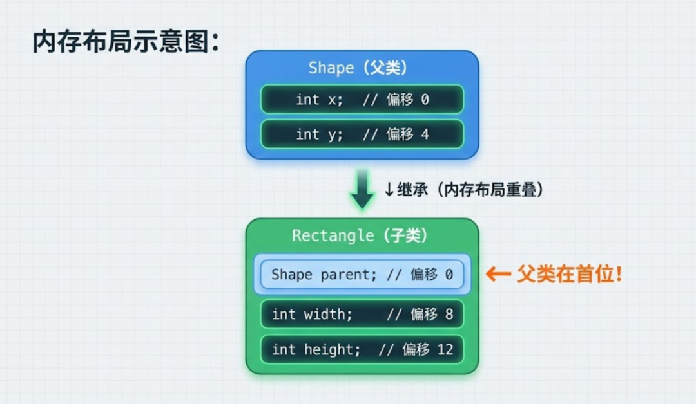
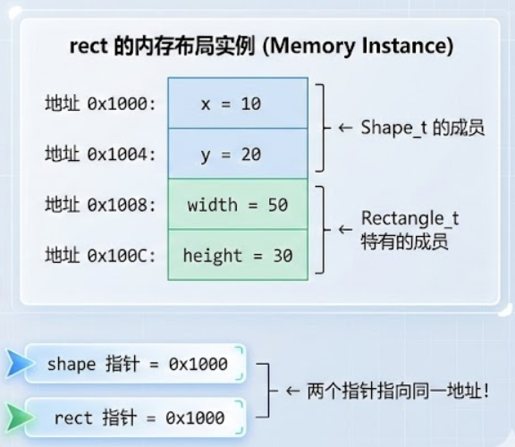
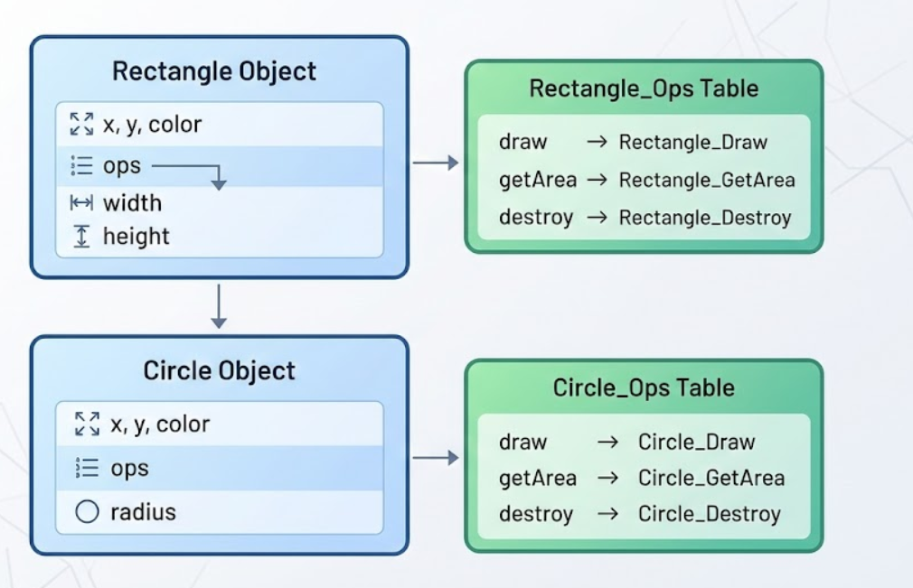
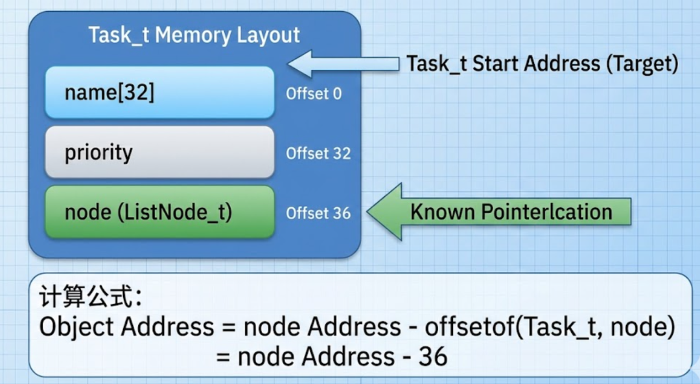
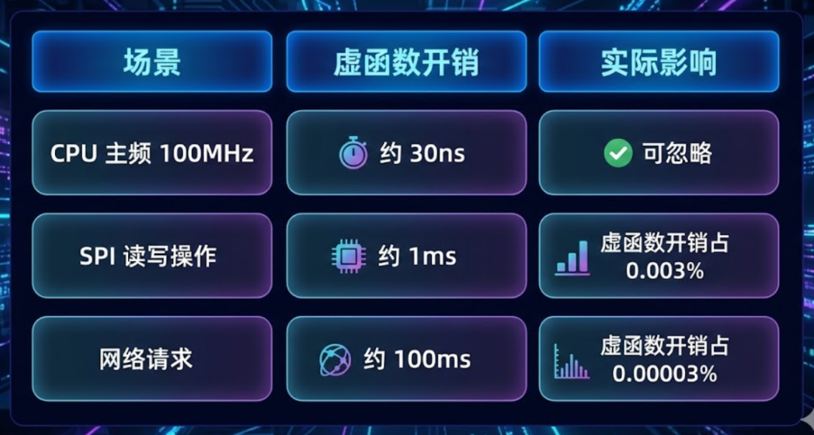

# 嵌入式架构师必修：用 struct 和 void* 构建可扩展的对象系统已付费

原创 一枚嵌入式码农 

[一枚嵌入式码农](javascript:void(0);)

 *2026年1月23日 07:01* *日本* 听全文

你是否曾经疑惑：为什么 Linux 内核用纯 C 语言写成，却能管理如此复杂的设备驱动体系？为什么那些大型嵌入式项目的代码，看起来明明是 C 语言，却有着面向对象的影子？

今天，我们就来揭开这层神秘面纱——用 C 语言实现真正的面向对象编程。

------

## 第一部分：当代码量突破 10 万行

### 场景：一个真实的痛点

刚入行时，我的导师跟我说过一句话："小伙子，你觉得自己会 C 语言了？去看看 Linux 源码，你会发现自己连门都没入。"

当时我不以为然。直到我接手了一个显示屏驱动的项目。

**最初的版本很简单：**

```c
void LCD_Init(void);
void LCD_DrawPoint(int x, int y, uint16_t color);
void LCD_Clear(uint16_t color);
```

一切都很美好，直到产品经理说："我们要支持 OLED 屏和墨水屏。"

**于是代码变成了这样：**

```c
void LCD_DrawPoint(int x, int y, uint16_t color);
void OLED_DrawPoint(int x, int y, uint16_t color);
void EINK_DrawPoint(int x, int y, uint16_t color);

// 业务层代码
void DrawUI(void) {
    if (screen_type == LCD) {
        LCD_DrawPoint(10, 10, RED);
    } else if (screen_type == OLED) {
        OLED_DrawPoint(10, 10, RED);
    } else if (screen_type == EINK) {
        EINK_DrawPoint(10, 10, RED);
    }
}
```

看到问题了吗？**业务逻辑和硬件驱动强耦合了。**

每次换个屏幕，不仅要改驱动层，还要改业务层。如果有 10 个地方调用了绘图函数，你就要改 10 处。这违反了软件设计的基本原则——**依赖倒置原则**。

更可怕的是，当项目代码突破 10 万行，这种耦合会让维护成本呈指数级增长。

------

## 概念重塑：OOP 不属于 C++

很多人以为面向对象编程（OOP）是 C++ 的专利。**这是一个巨大的误解。**

**核心观点：** 面向对象是一种**设计思想**，不是语法糖。

C++ 只是在编译器层面帮你自动处理了继承、多态这些机制。而 C 语言，需要我们手动管理内存布局和函数指针。

### OOP 三大支柱在 C 语言中的映射


听起来很抽象？别急，我们用一张图来说明。

------

## 继承的内存布局

假设我们有一个"形状"基类和一个"矩形"子类：




> **图示说明：** 上图展示了 C 语言继承的核心原理。Rectangle 结构体的前 8 个字节与 Shape 完全一致，这使得我们可以安全地将 Rectangle* 转换为 Shape*，而不需要任何运行时开销。这种"零成本抽象"是 C 语言 OOP 的精髓所在。

**关键点：** `Rectangle` 的前 8 个字节，和 `Shape` 的内存布局**完全一致**。

这意味着什么？

```
Rectangle_t rect;
Shape_t *shape_ptr = (Shape_t*)&rect;  // 安全的向上转型
```

这个强制类型转换**不需要任何 CPU 指令**，因为两个指针指向的是同一块内存。这就是继承的本质。

------

## 你可能不知道的 C 语言黑魔法

看到这里，你可能会想："这也太简单了吧，不就是结构体嵌套吗？"

别急，真正的挑战在后面：

1. **如何实现多态？** 让 `Shape_Draw()` 自动识别是画圆还是画方？
2. **如何定义接口？** 让串口、SPI、I2C 都遵循同一套 `Read/Write` 标准？
3. **最黑的魔法：** `container_of` 宏。如何在回调函数里，通过一个成员变量的地址，逆向推导出整个对象的首地址？

这些技术，是 Linux 内核链表、设备驱动模型的基石。

------

## 【付费内容预告】

掌握了这一篇，你就拥有了阅读 Linux 内核源码的钥匙。

接下来的付费内容，我们将从零构建一个 **Shape（图形）驱动库**。你将学到：

1. **继承的实现：** 利用"结构体首地址重合"特性，实现 `Shape -> Rectangle -> Square` 的三层继承。
2. **多态的实现：** 手写 `vtable`（虚函数表），让 `Shape_Draw()` 自动识别是画圆还是画方。
3. **接口的定义：** 如何定义一个纯虚接口 `IStream`，让 UART 和 TCP 都能像文件一样被读写。

**（点击阅读，掌握 C 语言的"满级"玩法 ↓）**

------

## 第二部分：核心实战——从零构建对象系统

### 实战 A：继承（Inheritance）—— 子承父业

现在，让我们动手实现一个真实的图形库。

#### 第一步：定义父类 Shape

```c
// shape.h
typedef struct Shape Shape_t;

struct Shape {
    int x;      // 位置坐标
    int y;
    int color;  // 颜色
};

// 父类的方法
void Shape_Init(Shape_t *self, int x, int y, int color);
void Shape_Move(Shape_t *self, int dx, int dy);
// shape.c
#include "shape.h"

void Shape_Init(Shape_t *self, int x, int y, int color) {
    self->x = x;
    self->y = y;
    self->color = color;
}

void Shape_Move(Shape_t *self, int dx, int dy) {
    self->x += dx;
    self->y += dy;
}
```

这就是一个标准的 C 语言"类"。注意我们用 `self` 指针模拟了 C++ 的 `this`。

#### 第二步：定义子类 Rectangle

**关键点来了：** 子类的第一个成员**必须是父类**。

```c
// rectangle.h
#include "shape.h"

typedef struct Rectangle Rectangle_t;

struct Rectangle {
    Shape_t parent;  // 必须放在第一个位置！
    int width;
    int height;
};

// 子类的构造函数
void Rectangle_Init(Rectangle_t *self, int x, int y, int color, int w, int h);
int Rectangle_GetArea(Rectangle_t *self);
// rectangle.c
#include "rectangle.h"

void Rectangle_Init(Rectangle_t *self, int x, int y, int color, int w, int h) {
    // 先调用父类的构造函数
    Shape_Init((Shape_t*)self, x, y, color);

    // 再初始化子类特有的成员
    self->width = w;
    self->height = h;
}

int Rectangle_GetArea(Rectangle_t *self) {
    return self->width * self->height;
}
```

#### 第三步：向上转型（Upcasting）

这是继承的核心价值：**子类可以当作父类使用**。

```c
// main.c
#include "rectangle.h"

int main(void) {
    Rectangle_t rect;
    Rectangle_Init(&rect, 10, 20, 0xFF0000, 50, 30);

    // 向上转型：把子类指针转换为父类指针
    Shape_t *shape = (Shape_t*)&rect;

    // 调用父类的方法
    Shape_Move(shape, 5, 5);

    // 现在 rect 的坐标变成了 (15, 25)
    printf("新位置: (%d, %d)\n", rect.parent.x, rect.parent.y);

    return 0;
}
```

**内存布局分析：**




> **图示说明：** 这张内存地址图清晰地展示了为什么向上转型是安全的。无论你用 Shape* 还是 Rectangle* 访问对象，它们都指向同一块内存的起始位置。这就是 C 语言实现继承的底层机制——通过精心设计的内存布局，而非编译器魔法。

这就是为什么向上转型是安全的：**父类和子类的起始地址完全相同**。

------

### 实战 B：多态（Polymorphism）—— 虚函数表

继承解决了代码复用的问题，但还不够。我们需要**多态**：让同一个函数调用，根据对象的实际类型，执行不同的代码。

#### 问题场景

假设我们有圆形（Circle）和矩形（Rectangle）两种图形，都需要实现 `Draw()` 方法。

**笨办法：**

```c
void DrawShape(Shape_t *shape, int type) {
    if (type == TYPE_CIRCLE) {
        Circle_Draw((Circle_t*)shape);
    } else if (type == TYPE_RECTANGLE) {
        Rectangle_Draw((Rectangle_t*)shape);
    }
}
```

这又回到了最初的问题：业务层需要知道具体类型。

**正确做法：** 使用虚函数表（V-Table）。

#### 第一步：定义函数指针表

```c
// shape.h
typedef struct Shape Shape_t;
typedef struct ShapeOps ShapeOps_t;

// 虚函数表（类似 C++ 的 vtable）
struct ShapeOps {
    void (*draw)(Shape_t *self);           // 绘制方法
    int  (*getArea)(Shape_t *self);        // 计算面积
    void (*destroy)(Shape_t *self);        // 析构函数
};

struct Shape {
    int x, y, color;
    const ShapeOps_t *ops;  // 指向虚函数表的指针
};
```

**关键设计：** 每个对象都持有一个 `ops` 指针，指向它的"方法表"。

#### 第二步：为 Rectangle 实现虚函数表

```c
// rectangle.c
#include <stdio.h>

// 实现具体的方法
static void Rectangle_Draw(Shape_t *self) {
    Rectangle_t *rect = (Rectangle_t*)self;
    printf("绘制矩形: 位置(%d,%d), 大小(%dx%d)\n",
           self->x, self->y, rect->width, rect->height);
}

static int Rectangle_GetArea(Shape_t *self) {
    Rectangle_t *rect = (Rectangle_t*)self;
    return rect->width * rect->height;
}

static void Rectangle_Destroy(Shape_t *self) {
    printf("销毁矩形对象\n");
    // 这里可以释放资源
}

// 定义虚函数表（全局常量）
static const ShapeOps_t Rectangle_Ops = {
    .draw = Rectangle_Draw,
    .getArea = Rectangle_GetArea,
    .destroy = Rectangle_Destroy,
};

// 构造函数中绑定虚函数表
void Rectangle_Init(Rectangle_t *self, int x, int y, int color, int w, int h) {
    Shape_Init((Shape_t*)self, x, y, color);
    self->parent.ops = &Rectangle_Ops;  // 关键：绑定方法表
    self->width = w;
    self->height = h;
}
```

#### 第三步：为 Circle 实现虚函数表

```c
// circle.c
typedef struct Circle {
    Shape_t parent;
    int radius;
} Circle_t;

static void Circle_Draw(Shape_t *self) {
    Circle_t *circle = (Circle_t*)self;
    printf("绘制圆形: 圆心(%d,%d), 半径%d\n",
           self->x, self->y, circle->radius);
}

static int Circle_GetArea(Shape_t *self) {
    Circle_t *circle = (Circle_t*)self;
    return 3.14 * circle->radius * circle->radius;
}

static void Circle_Destroy(Shape_t *self) {
    printf("销毁圆形对象\n");
}

static const ShapeOps_t Circle_Ops = {
    .draw = Circle_Draw,
    .getArea = Circle_GetArea,
    .destroy = Circle_Destroy,
};

void Circle_Init(Circle_t *self, int x, int y, int color, int r) {
    Shape_Init((Shape_t*)self, x, y, color);
    self->parent.ops = &Circle_Ops;  // 绑定圆形的方法表
    self->radius = r;
}
```

#### 第四步：业务层调用（多态的魔法时刻）

```c
// main.c
void DrawAllShapes(Shape_t *shapes[], int count) {
    for (int i = 0; i < count; i++) {
        // 多态调用：根据对象的实际类型，自动调用对应的 Draw 方法
        shapes[i]->ops->draw(shapes[i]);
    }
}

int main(void) {
    Rectangle_t rect;
    Circle_t circle;

    Rectangle_Init(&rect, 10, 20, 0xFF0000, 50, 30);
    Circle_Init(&circle, 100, 100, 0x00FF00, 25);

    // 统一用父类指针管理
    Shape_t *shapes[] = {
        (Shape_t*)&rect,
        (Shape_t*)&circle
    };

    DrawAllShapes(shapes, 2);

    return 0;
}
```

**输出：**

```
绘制矩形: 位置(10,20), 大小(50x30)
绘制圆形: 圆心(100,100), 半径25
```

**多态的本质：** 通过函数指针的间接调用，实现了"同一接口，不同实现"。

**内存布局示意图：**




> **图示说明：** 这就是 C++ 虚函数表（vtable）的 C 语言实现。每个对象通过 `ops` 指针指向自己的方法表。当调用 `shape->ops->draw(shape)` 时，程序会：
>
> 1. 读取对象的 `ops` 指针
> 2. 从方法表中找到 `draw` 函数指针
> 3. 调用对应的函数
>
> 这个过程虽然多了两次内存访问，但换来了代码的灵活性和可扩展性。

------

### 实战 C：接口（Interface）—— 统一标准

接口是一种"纯虚"的抽象，它只定义方法签名，不包含任何数据成员。

#### 场景：统一的日志接口

假设我们的系统需要支持多种日志输出方式：

- 串口输出（UART）
- Flash 存储
- 网络上传

**传统做法：**

```c
void Log_UART(const char *msg);
void Log_Flash(const char *msg);
void Log_Network(const char *msg);

// 业务层
if (log_type == UART) {
    Log_UART("错误信息");
} else if (log_type == FLASH) {
    Log_Flash("错误信息");
}
```

又是强耦合。

#### 正确做法：定义 ILogger 接口

```c
// ilogger.h
typedef struct ILogger ILogger_t;

// 接口：只有方法，没有数据
struct ILogger {
    void (*write)(ILogger_t *self, const char *msg);
    void (*flush)(ILogger_t *self);
};
```

#### 实现 UART Logger

```c
// uart_logger.c
typedef struct {
    ILogger_t interface;  // 接口在首位
    int baud_rate;        // UART 特有的配置
} UARTLogger_t;

static void UART_Write(ILogger_t *self, const char *msg) {
    UARTLogger_t *uart = (UARTLogger_t*)self;
    printf("[UART %d] %s\n", uart->baud_rate, msg);
    // 实际项目中这里会调用硬件驱动
}

static void UART_Flush(ILogger_t *self) {
    printf("[UART] 刷新缓冲区\n");
}

void UARTLogger_Init(UARTLogger_t *self, int baud) {
    self->interface.write = UART_Write;
    self->interface.flush = UART_Flush;
    self->baud_rate = baud;
}
```

#### 实现 Flash Logger

```c
// flash_logger.c
typedef struct {
    ILogger_t interface;
    uint32_t flash_addr;  // Flash 特有的配置
} FlashLogger_t;

static void Flash_Write(ILogger_t *self, const char *msg) {
    FlashLogger_t *flash = (FlashLogger_t*)self;
    printf("[Flash 0x%X] %s\n", flash->flash_addr, msg);
}

static void Flash_Flush(ILogger_t *self) {
    printf("[Flash] 写入 Flash\n");
}

void FlashLogger_Init(FlashLogger_t *self, uint32_t addr) {
    self->interface.write = Flash_Write;
    self->interface.flush = Flash_Flush;
    self->flash_addr = addr;
}
```

#### 业务层：完全解耦

```c
// main.c
void SystemLog(ILogger_t *logger, const char *msg) {
    logger->write(logger, msg);
    logger->flush(logger);
}

int main(void) {
    UARTLogger_t uart_log;
    FlashLogger_t flash_log;

    UARTLogger_Init(&uart_log, 115200);
    FlashLogger_Init(&flash_log, 0x08000000);

    // 业务层不关心具体实现
    SystemLog((ILogger_t*)&uart_log, "系统启动");
    SystemLog((ILogger_t*)&flash_log, "系统启动");

    return 0;
}
```

**输出：**

```c
[UART 115200] 系统启动
[UART] 刷新缓冲区
[Flash 0x8000000] 系统启动
[Flash] 写入 Flash
```

**接口的价值：** 业务层只依赖抽象（ILogger），不依赖具体实现。这就是**依赖倒置原则**的完美体现。

------

## 第三部分：进阶黑魔法与避坑指南

### 进阶技巧：`container_of` 宏——从成员找到整体

这是 Linux 内核中最精妙的宏之一。它解决了一个看似不可能的问题：

**场景：** 你有一个链表节点的指针，如何找到包含这个节点的完整对象？

#### 问题演示

假设我们有一个任务结构体：

```c
typedef struct {
    char name[32];
    int priority;
    ListNode_t node;  // 链表节点（注意：不在首位）
} Task_t;
```

当我们遍历链表时，只能拿到 `ListNode_t*` 指针：

```c
void TraverseList(ListNode_t *head) {
    ListNode_t *current = head->next;
    while (current != head) {
        // 问题：如何从 current 指针，找到包含它的 Task_t 对象？
        current = current->next;
    }
}
```

#### 解决方案：`container_of` 宏

```c
#define container_of(ptr, type, member) \
    ((type *)((char *)(ptr) - offsetof(type, member)))
```

**原理解析：**




> **图示说明：** `container_of` 宏的原理是"指针算术"。既然我们知道 `node` 成员在 Task_t 中的偏移量是 36 字节，那么用 node 的地址减去 36，就能得到 Task_t 对象的起始地址。这个技巧在 Linux 内核中无处不在，是实现侵入式数据结构（如链表、红黑树）的基础。

#### 实战代码

```c
#include <stddef.h>  // 提供 offsetof 宏

typedef struct ListNode {
    struct ListNode *prev;
    struct ListNode *next;
} ListNode_t;

typedef struct {
    char name[32];
    int priority;
    ListNode_t node;
} Task_t;

#define container_of(ptr, type, member) \
    ((type *)((char *)(ptr) - offsetof(type, member)))

void PrintAllTasks(ListNode_t *head) {
    ListNode_t *current = head->next;
    while (current != head) {
        // 魔法时刻：从节点指针反推出 Task_t 对象
        Task_t *task = container_of(current, Task_t, node);
        printf("任务: %s, 优先级: %d\n", task->name, task->priority);
        current = current->next;
    }
}
```

**为什么这么重要？**

这个技巧让 C 语言实现了类似"Mixin"的能力：你可以在任意结构体中嵌入通用组件（如链表节点、定时器节点），而不需要继承。

------

### 避坑指南

#### 坑点 1：性能焦虑——虚函数调用会慢吗？

**疑问：** 虚函数调用多了一次内存寻址（查表），会影响性能吗？

**真相：**

```c
// 直接调用
Rectangle_Draw(&rect);  // 1 条指令：call 0x12345678

// 虚函数调用
rect.parent.ops->draw(&rect);  // 3 条指令：
                                // 1. 读取 ops 指针
                                // 2. 读取 draw 函数指针
                                // 3. call 函数地址
```

**性能对比：**



**结论：** 在 99% 的嵌入式场景下，虚函数的开销相对于 IO 操作（几毫秒到几百毫秒）完全可以忽略不计。

**何时需要担心？**

- 实时性要求极高的中断处理函数（微秒级）
- 高频调用的数学运算（每秒百万次）

对于这些场景，可以用宏或内联函数优化。

------

#### 坑点 2：类型安全——强制转换是危险的

**问题：** C 语言的强制类型转换不做任何检查，容易出错。

```c
Circle_t circle;
Rectangle_t *rect = (Rectangle_t*)&circle;  // 编译通过，但运行时崩溃
```

**解决方案：** 在 Debug 模式下加入类型检查。

```c
typedef enum {
    SHAPE_TYPE_CIRCLE,
    SHAPE_TYPE_RECTANGLE,
} ShapeType_t;

struct Shape {
    ShapeType_t type;  // 类型标识（类似 C++ 的 RTTI）
    int x, y, color;
    const ShapeOps_t *ops;
};

// 安全的向下转型
Rectangle_t* Shape_ToRectangle(Shape_t *shape) {
    #ifdef DEBUG
    if (shape->type != SHAPE_TYPE_RECTANGLE) {
        printf("错误：类型转换失败！\n");
        return NULL;
    }
    #endif
    return (Rectangle_t*)shape;
}
```

**进阶技巧：** 使用 Magic Number（魔数）。

```c
#define SHAPE_MAGIC 0x53485045  // "SHPE" 的 ASCII 码

struct Shape {
    uint32_t magic;  // 魔数，用于检测内存损坏
    ShapeType_t type;
    // ...
};

void Shape_Init(Shape_t *self, int x, int y, int color) {
    self->magic = SHAPE_MAGIC;
    // ...
}

bool Shape_IsValid(Shape_t *self) {
    return (self != NULL && self->magic == SHAPE_MAGIC);
}
```

------

#### 坑点 3：内存对齐问题

**问题：** 结构体成员的顺序会影响内存大小。

```c
// 不好的设计（占用 16 字节）
struct BadShape {
    char flag;      // 1 字节
    int x;          // 4 字节（需要对齐到 4 字节边界，浪费 3 字节）
    char type;      // 1 字节
    int y;          // 4 字节（需要对齐，浪费 3 字节）
};

// 好的设计（占用 12 字节）
struct GoodShape {
    int x;          // 4 字节
    int y;          // 4 字节
    char flag;      // 1 字节
    char type;      // 1 字节
    char padding[2]; // 显式填充，便于理解
};
```

**最佳实践：**

1. 把大尺寸成员（指针、int）放在前面
2. 把小尺寸成员（char、bool）放在后面
3. 使用 `sizeof()` 检查实际大小

------

#### 坑点 4：函数指针的 NULL 检查

**问题：** 如果虚函数表没有正确初始化，会导致空指针崩溃。

```c
Shape_t shape;
// 忘记调用 Shape_Init()
shape.ops->draw(&shape);  // 崩溃！ops 是野指针
```

**解决方案：** 在调用前检查。

```c
void Shape_Draw(Shape_t *self) {
    if (self == NULL || self->ops == NULL || self->ops->draw == NULL) {
        printf("错误：对象未初始化\n");
        return;
    }
    self->ops->draw(self);
}
```

**更优雅的方案：** 提供默认实现。

```c
static void Shape_DefaultDraw(Shape_t *self) {
    printf("警告：未实现 Draw 方法\n");
}

static const ShapeOps_t Shape_DefaultOps = {
    .draw = Shape_DefaultDraw,
    .getArea = NULL,
    .destroy = NULL,
};

void Shape_Init(Shape_t *self, int x, int y, int color) {
    self->x = x;
    self->y = y;
    self->color = color;
    self->ops = &Shape_DefaultOps;  // 默认指向安全的实现
}
```

------

### 实战建议

#### 1. 何时使用 OOP？

**适合的场景：**

- 设备驱动层（多种硬件，统一接口）
- 协议栈（TCP/IP、Modbus、CAN）
- 状态机（多种状态，统一处理）
- 插件系统（动态加载模块）

**不适合的场景：**

- 简单的工具函数（如 `strlen`、`memcpy`）
- 性能关键路径（如 DSP 算法）
- 资源极度受限的场景（如 8051 单片机）

#### 2. 渐进式重构

不要一次性重写整个项目。推荐步骤：

1. **第一步：** 先用接口（Interface）解耦业务层和驱动层
2. **第二步：** 在驱动层内部使用继承复用代码
3. **第三步：** 引入多态，消除 `if-else` 分支

#### 3. 代码审查清单

- 子类的第一个成员是否是父类？
- 虚函数表是否用 `const` 修饰？
- 构造函数是否正确绑定了虚函数表？
- 是否在 Debug 模式下加入了类型检查？
- 结构体成员是否考虑了内存对齐？

------

## 第四部分：总结与展望

### 核心要点回顾

1. **OOP 是思想，不是语法**

    - C++ 把机关藏在编译器里，C 把机关摆在明面上
    - 学会 C OOP，不是为了炫技，而是为了在大型系统中获得**可维护性**

2. **三大支柱的 C 实现**

    - **封装：** `struct` + `static` + 不透明指针
    - **继承：** 结构体嵌套（父类在首位）
    - **多态：** 函数指针表（V-Table）

3. **关键技术**

    - 向上转型：利用内存布局重叠
    - 虚函数表：每个对象持有方法指针
    - `container_of`：从成员反推整体

4. **避坑要点**

    - 性能焦虑：虚函数开销在 IO 密集场景下可忽略
    - 类型安全：Debug 模式下加入检查
    - 内存对齐：大成员在前，小成员在后

------

### 从这里开始

如果你是嵌入式工程师，建议你：

1. **阅读 Linux 内核源码**

    - `include/linux/list.h`：链表实现（用到 `container_of`）
    - `drivers/base/driver.c`：设备驱动模型（用到继承和多态）
    - `net/core/dev.c`：网络协议栈（用到接口）

2. **重构你的项目**

    - 找一个有多个硬件变体的模块（如显示屏、传感器）
    - 尝试用接口解耦业务层和驱动层
    - 观察代码的可维护性提升

3. **深入学习设计模式**

    - 策略模式（Strategy）：对应虚函数表
    - 工厂模式（Factory）：对应构造函数
    - 观察者模式（Observer）：对应回调函数

------

### 最后的话

很多人觉得 C 语言"过时"了，应该用 C++ 或 Rust。但事实是：

- Linux 内核：1500 万行 C 代码
- Git：10 万行 C 代码
- Redis：5 万行 C 代码
- SQLite：15 万行 C 代码

这些项目不是因为"历史包袱"才用 C，而是因为 C 语言在**可控性**和**可移植性**上无可替代。

当你掌握了 C 语言的 OOP 技巧，你会发现：

- 你能读懂 Linux 内核的设备驱动模型
- 你能设计出优雅的嵌入式架构
- 你能在面试中脱颖而出

**C 语言不是低级语言，而是一门"可以写得很高级"的语言。**

------

> **💬** ***\*讨论话题\****
>
> **你在项目中遇到过哪些"强耦合"的痛点？欢迎在评论区分享你的经验。**
>
> **如果你对 C 语言 OOP 有任何疑问，也欢迎留言讨论。**