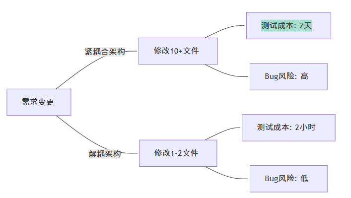
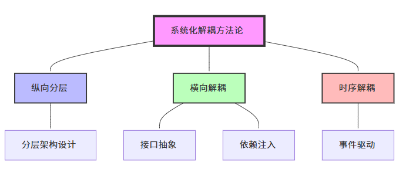
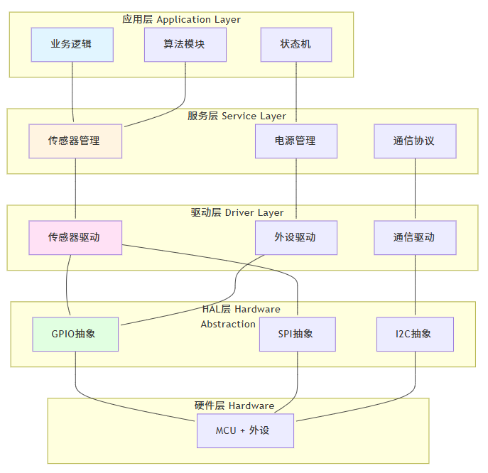
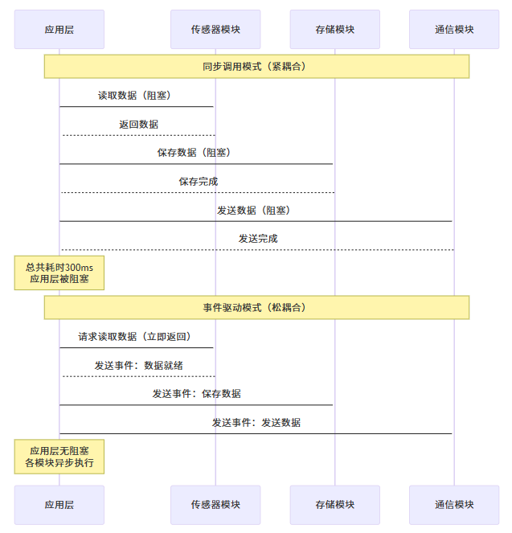
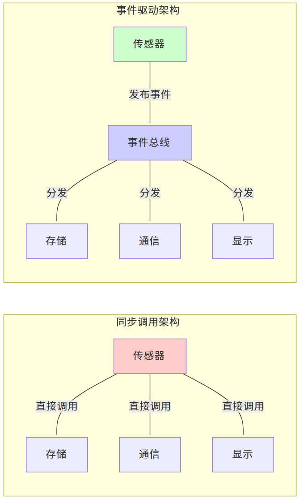
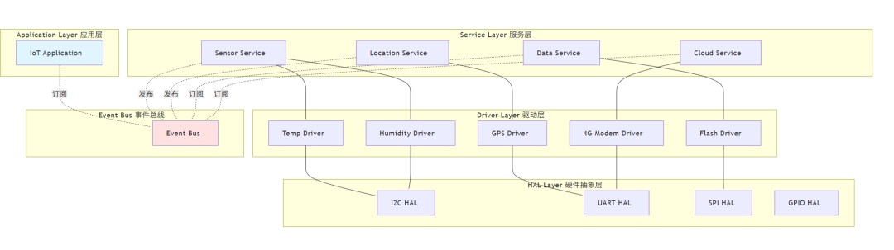
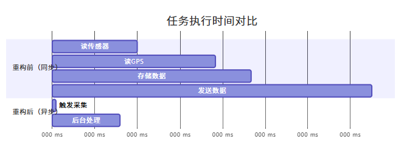

# 嵌入式软件模块解耦进阶：构建高内聚、低耦合的系统架构已付费

原创 一枚嵌入式码农 

[一枚嵌入式码农](javascript:void(0);)

 *2025年11月23日 17:46* *广东* 5人

## 前言：一次凌晨的"小改动"引发的血案

凌晨2点，测试团队发来紧急消息：生产环境出现严重bug。你紧急回滚代码，却发现问题的起因令人哭笑不得——只是修改了传感器驱动的一个参数校准逻辑，却导致整个设备控制系统瘫痪。

这样的场景是否似曾相识？

• 修改一个模块，需要同时改动十几个文件
• 添加新硬件支持，需要在业务逻辑层到处打补丁
• 单元测试难以进行，因为模块间依赖错综复杂
• 代码复用率低，每个项目都在重复造轮子

**这些问题的根源只有一个：模块耦合过紧。**

在嵌入式软件开发中，模块解耦不仅是代码优雅性的追求，更是系统可维护性、可测试性、可扩展性的基石。本文将为你提供一套系统化的模块解耦方法论，帮助你构建真正高质量的嵌入式软件架构。

## 为什么模块解耦如此重要？

### 耦合的代价

在一个真实的物联网设备项目中，我们统计了模块耦合带来的成本：



```
紧耦合架构解耦架构需求变更修改10+文件修改1-2文件测试成本: 2天测试成本: 2小时Bug风险: 高Bug风险: 低
```

| 指标           | 紧耦合架构 | 解耦架构 | 改善比例  |
| -------------- | ---------- | -------- | --------- |
| 平均修改文件数 | 12.3       | 2.1      | **↓ 83%** |
| 功能开发周期   | 5.2天      | 1.8天    | **↓ 65%** |
| 回归测试时间   | 16小时     | 4小时    | **↓ 75%** |
| 生产环境Bug率  | 3.2%       | 0.8%     | **↓ 75%** |

### 解耦的价值

模块解耦带来的收益远超你的想象：

1. **开发效率提升**：清晰的模块边界让团队并行开发互不干扰
2. **维护成本降低**：bug修复和功能迭代的影响范围可控
3. **代码复用性强**：通用模块可在多个项目间复用
4. **测试覆盖率高**：模块独立测试，单元测试易于编写
5. **系统稳定性好**：故障隔离，局部问题不会级联扩散

## 系统化解耦方法论框架

基于多年的嵌入式项目经验，我总结出一套系统化的解耦方法论，包含三个核心维度和一套实施路径：



```
系统化解耦方法论纵向分层横向解耦时序解耦分层架构设计接口抽象依赖注入事件驱动
```

**三大核心维度：**

1. **纵向分层（Vertical Layering）**：通过HAL层、驱动层、服务层、应用层的分离，实现硬件无关性
2. **横向解耦（Horizontal Decoupling）**：通过接口抽象和依赖注入，实现模块间的松耦合
3. **时序解耦（Temporal Decoupling）**：通过事件驱动和消息队列，实现异步通信和时序独立

这套方法论不是简单的理论堆砌，而是经过多个商业项目验证的实战经验总结。接下来，我将深入剖析每个维度的实施细节...

------

**💰 以下内容为付费内容**

解锁后您将获得：

• ✅ 完整的分层架构设计方案（含多层架构图）
• ✅ C语言接口抽象与依赖注入的最佳实践（含代码实例）
• ✅ 事件驱动架构的设计与实现（含时序图）
• ✅ 真实项目重构案例分析（重构前后对比+性能数据）
• ✅ 10条黄金实践原则速查表

------

## 一、纵向分层：构建清晰的架构边界

### 1.1 分层架构的设计原则

在嵌入式系统中，良好的分层架构应该遵循以下原则：

**依赖方向规则**：上层依赖下层，下层不知道上层的存在
**单一职责规则**：每层只负责特定的抽象级别
**接口稳定规则**：层间接口应保持稳定，内部实现可灵活变化

典型的嵌入式分层架构如下：




### 1.2 HAL层设计：硬件无关性的关键

HAL（Hardware Abstraction Layer）是实现硬件无关性的关键。一个设计良好的HAL层应该：

**提供统一的接口**：不同MCU的GPIO、SPI、I2C等接口对外表现一致
**隔离芯片差异**：上层代码无需关心底层使用的是STM32还是ESP32
**便于移植**：更换硬件平台时，只需重新实现HAL层

#### 反面案例：没有HAL层的代码

```c
// 应用层直接操作寄存器 - 这是典型的错误做法
void sensor_init(void) {
    // 直接操作STM32寄存器
    RCC->AHB1ENR |= RCC_AHB1ENR_GPIOAEN;
    GPIOA->MODER |= (1 << 10);
    GPIOA->OSPEEDR |= (3 << 10);

    // 直接操作SPI寄存器
    RCC->APB2ENR |= RCC_APB2ENR_SPI1EN;
    SPI1->CR1 = SPI_CR1_MSTR | SPI_CR1_BR_1;
    SPI1->CR1 |= SPI_CR1_SPE;
}

// 问题：更换MCU时，这段代码完全无法复用
```

#### 正面案例：使用HAL层的代码

```c
// hal_gpio.h - HAL层接口定义
typedef enum {
    GPIO_PIN_0 = 0,
    GPIO_PIN_1,
    // ...
} gpio_pin_t;

typedef enum {
    GPIO_MODE_INPUT,
    GPIO_MODE_OUTPUT,
    GPIO_MODE_ALTERNATE
} gpio_mode_t;

// 统一的GPIO接口
void hal_gpio_init(gpio_pin_t pin, gpio_mode_t mode);
void hal_gpio_write(gpio_pin_t pin, bool state);
bool hal_gpio_read(gpio_pin_t pin);

// hal_spi.h - HAL层接口定义
typedef struct {
    uint32_t speed;
    uint8_t mode;
} spi_config_t;

void hal_spi_init(spi_config_t *config);
int hal_spi_transfer(uint8_t *tx_data, uint8_t *rx_data, size_t len);

// 应用层代码 - 完全硬件无关
void sensor_init(void) {
    // 使用HAL接口，与具体MCU无关
    hal_gpio_init(GPIO_PIN_5, GPIO_MODE_OUTPUT);

    spi_config_t spi_cfg = {
        .speed = 1000000,
        .mode = 0
    };
    hal_spi_init(&spi_cfg);
}

// 优势：更换MCU时，只需重新实现HAL层，应用层代码完全不变
```

### 1.3 驱动层设计：封装硬件操作逻辑

驱动层位于HAL层之上，负责封装具体外设的操作逻辑。驱动层的设计要点：

**面向对象思想**：即使用C语言，也要采用面向对象的设计思路
**状态管理**：驱动需要管理设备的状态和生命周期
**错误处理**：提供清晰的错误码和异常处理机制

#### 优秀的驱动设计示例

```c
// sensor_driver.h - 传感器驱动接口
typedef struct sensor_device sensor_device_t;

typedef struct {
    int (*init)(sensor_device_t *dev);
    int (*read)(sensor_device_t *dev, float *data);
    int (*deinit)(sensor_device_t *dev);
} sensor_ops_t;

typedef enum {
    SENSOR_STATE_UNINITIALIZED,
    SENSOR_STATE_READY,
    SENSOR_STATE_ERROR
} sensor_state_t;

struct sensor_device {
    const char *name;
    sensor_ops_t *ops;
    void *private_data;
    sensor_state_t state;
};

// 驱动注册接口
int sensor_register(sensor_device_t *dev);
int sensor_unregister(sensor_device_t *dev);

// 通用的读取接口
int sensor_read_data(sensor_device_t *dev, float *data);

// 具体传感器实现（例如：温度传感器）
// temp_sensor.c
static int temp_sensor_init(sensor_device_t *dev) {
    // 使用HAL接口初始化
    hal_i2c_init(I2C_PORT_1, 100000);
    dev->state = SENSOR_STATE_READY;
    return 0;
}

static int temp_sensor_read(sensor_device_t *dev, float *data) {
    uint8_t raw_data[2];

    if (dev->state != SENSOR_STATE_READY) {
        return -1;
    }

    // 使用HAL接口读取数据
    hal_i2c_read(I2C_ADDR_TEMP, raw_data, 2);
    *data = (raw_data[0] << 8 | raw_data[1]) * 0.1;

    return 0;
}

static sensor_ops_t temp_sensor_ops = {
    .init = temp_sensor_init,
    .read = temp_sensor_read,
    .deinit = temp_sensor_deinit
};

static sensor_device_t temp_sensor = {
    .name = "temp_sensor",
    .ops = &temp_sensor_ops,
    .private_data = NULL
};

// 驱动初始化
void temp_sensor_driver_init(void) {
    sensor_register(&temp_sensor);
}
```

**设计亮点：**

• ✅ 使用函数指针实现多态，不同传感器可以有不同实现
• ✅ 状态管理清晰，避免非法操作
• ✅ 接口统一，上层使用简单
• ✅ 扩展性强，添加新传感器只需实现ops接口

### 1.4 服务层设计：业务逻辑的支撑

服务层介于驱动层和应用层之间，封装常用的业务服务。服务层的典型功能包括：

• 传感器数据融合与滤波
• 电源管理策略
• 通信协议栈
• 文件系统操作
• 任务调度管理

```c
// sensor_service.h - 传感器服务层
typedef struct {
    sensor_device_t *sensors[MAX_SENSORS];
    uint8_t sensor_count;
    float filtered_data[MAX_SENSORS];
} sensor_service_t;

// 服务初始化
int sensor_service_init(sensor_service_t *service);

// 添加传感器
int sensor_service_add(sensor_service_t *service, sensor_device_t *sensor);

// 获取融合后的数据（带滤波）
int sensor_service_get_filtered_data(sensor_service_t *service,
                                     const char *sensor_name,
                                     float *data);

// 批量读取所有传感器
int sensor_service_update_all(sensor_service_t *service);

// 服务层实现
// sensor_service.c
int sensor_service_get_filtered_data(sensor_service_t *service,
                                     const char *sensor_name,
                                     float *data) {
    // 1. 查找传感器
    sensor_device_t *sensor = find_sensor(service, sensor_name);
    if (!sensor) return -1;

    // 2. 读取原始数据
    float raw_data;
    int ret = sensor_read_data(sensor, &raw_data);
    if (ret != 0) return ret;

    // 3. 应用滤波算法（服务层的增值功能）
    int index = get_sensor_index(service, sensor_name);
    service->filtered_data[index] = kalman_filter(raw_data,
                                                   service->filtered_data[index]);

    *data = service->filtered_data[index];
    return 0;
}
```

**分层的效果对比：**

| 维度       | 未分层架构     | 分层架构         |
| ---------- | -------------- | ---------------- |
| 硬件移植   | 修改100+处     | 仅修改HAL层      |
| 驱动复用   | 代码拷贝改     | 直接复用         |
| 单元测试   | 需要真实硬件   | 可Mock HAL层     |
| 并行开发   | 互相阻塞       | 定好接口即可并行 |
| 代码可读性 | 混乱，难以理解 | 清晰，一目了然   |

## 二、横向解耦：接口抽象与依赖注入

### 2.1 接口抽象：定义清晰的契约

在C语言中，虽然没有OOP语言的interface关键字，但我们可以通过函数指针和结构体实现接口抽象。

**接口设计原则（ISP - Interface Segregation Principle）：**

• 接口应该小而专注
• 客户端不应依赖它不使用的接口
• 优先使用多个专用接口，而不是单一的总接口

#### 案例：通信模块的接口设计

**反面案例：臃肿的接口**

```c
// bad_communication.h - 违反接口隔离原则
typedef struct {
    int (*init)(void);
    int (*send_uart)(uint8_t *data, size_t len);
    int (*recv_uart)(uint8_t *buffer, size_t len);
    int (*send_spi)(uint8_t *data, size_t len);
    int (*recv_spi)(uint8_t *buffer, size_t len);
    int (*send_i2c)(uint8_t addr, uint8_t *data, size_t len);
    int (*recv_i2c)(uint8_t addr, uint8_t *buffer, size_t len);
    int (*send_can)(uint32_t id, uint8_t *data, size_t len);
    int (*recv_can)(uint32_t *id, uint8_t *buffer, size_t len);
} communication_interface_t;

// 问题：如果我只需要UART，为什么要关心SPI/I2C/CAN？
```

**正面案例：精简的接口**

```c
// communication.h - 遵循接口隔离原则
// 定义通用的通信接口
typedef struct {
    int (*init)(void *config);
    int (*send)(void *handle, const uint8_t *data, size_t len, uint32_t timeout);
    int (*recv)(void *handle, uint8_t *buffer, size_t len, uint32_t timeout);
    int (*deinit)(void *handle);
} comm_interface_t;

// 不同通信方式实现相同接口
typedef struct {
    comm_interface_t interface;
    void *hw_handle;
    // UART特有的私有数据
    uint32_t baudrate;
} uart_comm_t;

typedef struct {
    comm_interface_t interface;
    void *hw_handle;
    // SPI特有的私有数据
    uint32_t speed;
    uint8_t mode;
} spi_comm_t;

// 使用示例
void application_code(comm_interface_t *comm) {
    uint8_t data[] = {0x01, 0x02, 0x03};

    // 无需关心底层是UART还是SPI
    comm->send(comm, data, sizeof(data), 1000);
}
```

**优势：**

• ✅ 接口简洁，只包含必要的方法
• ✅ 不同实现可替换（UART、SPI、I2C均实现相同接口）
• ✅ 上层代码与具体通信方式解耦

### 2.2 依赖注入：控制反转的实践

依赖注入（Dependency Injection, DI）是实现松耦合的重要手段。在嵌入式C语言中，主要通过以下方式实现：

1. **构造函数注入**：初始化时传入依赖
2. **Setter注入**：通过设置函数注入依赖
3. **注册回调**：通过回调函数注入行为

#### 案例：数据采集模块的依赖注入

**反面案例：硬编码依赖**

```c
// data_collector.c - 硬编码依赖，难以测试和扩展
void data_collector_task(void) {
    float temp, humidity, pressure;

    // 直接调用具体的传感器驱动 - 紧耦合
    temp_sensor_read(&temp);
    humidity_sensor_read(&humidity);
    pressure_sensor_read(&pressure);

    // 直接调用具体的存储实现 - 紧耦合
    flash_write_data(temp, humidity, pressure);

    // 直接调用具体的通信实现 - 紧耦合
    uart_send_data(temp, humidity, pressure);
}

// 问题：
// 1. 无法单元测试（依赖真实硬件）
// 2. 更换传感器需要修改此代码
// 3. 更换存储/通信方式需要修改此代码
```

**正面案例：依赖注入**

```c
// data_collector.h - 使用依赖注入
typedef struct {
    float (*read_temperature)(void);
    float (*read_humidity)(void);
    float (*read_pressure)(void);
} sensor_provider_t;

typedef struct {
    int (*store_data)(float temp, float hum, float press);
} storage_provider_t;

typedef struct {
    int (*send_data)(float temp, float hum, float press);
} communication_provider_t;

typedef struct {
    sensor_provider_t *sensor;
    storage_provider_t *storage;
    communication_provider_t *comm;
} data_collector_t;

// 初始化时注入依赖
void data_collector_init(data_collector_t *collector,
                        sensor_provider_t *sensor,
                        storage_provider_t *storage,
                        communication_provider_t *comm) {
    collector->sensor = sensor;
    collector->storage = storage;
    collector->comm = comm;
}

// 业务逻辑与具体实现解耦
void data_collector_task(data_collector_t *collector) {
    float temp = collector->sensor->read_temperature();
    float humidity = collector->sensor->read_humidity();
    float pressure = collector->sensor->read_pressure();

    collector->storage->store_data(temp, humidity, pressure);
    collector->comm->send_data(temp, humidity, pressure);
}

// 实际使用
int main(void) {
    // 组装依赖（在main或初始化代码中完成）
    sensor_provider_t sensor_impl = {
        .read_temperature = real_temp_sensor_read,
        .read_humidity = real_humidity_sensor_read,
        .read_pressure = real_pressure_sensor_read
    };

    storage_provider_t storage_impl = {
        .store_data = flash_store_data
    };

    communication_provider_t comm_impl = {
        .send_data = lora_send_data
    };

    // 注入依赖
    data_collector_t collector;
    data_collector_init(&collector, &sensor_impl, &storage_impl, &comm_impl);

    // 运行任务
    while(1) {
        data_collector_task(&collector);
        delay_ms(1000);
    }
}

// 单元测试时可以注入Mock对象
#ifdef UNIT_TEST
float mock_temp_read(void) { return 25.0; }
float mock_hum_read(void) { return 60.0; }
float mock_press_read(void) { return 101.3; }

void test_data_collector(void) {
    sensor_provider_t mock_sensor = {
        .read_temperature = mock_temp_read,
        .read_humidity = mock_hum_read,
        .read_pressure = mock_press_read
    };

    // 注入Mock依赖进行测试
    data_collector_t collector;
    data_collector_init(&collector, &mock_sensor, ...);

    data_collector_task(&collector);
    // 验证行为...
}
#endif
```

**依赖注入的优势：**

| 维度     | 硬编码依赖                 | 依赖注入             |
| -------- | -------------------------- | -------------------- |
| 可测试性 | ❌ 需要真实硬件             | ✅ 可注入Mock对象     |
| 灵活性   | ❌ 修改代码才能更换实现     | ✅ 运行时配置         |
| 可复用性 | ❌ 与具体实现绑定           | ✅ 可在不同项目中复用 |
| 扩展性   | ❌ 添加新功能需改动核心代码 | ✅ 新增实现即可       |

### 2.3 回调机制：事件响应的解耦

回调函数是C语言中实现解耦的利器，特别适合处理异步事件和状态变化通知。

```c
// button.h - 按钮驱动（事件源）
typedef enum {
    BUTTON_EVENT_PRESSED,
    BUTTON_EVENT_RELEASED,
    BUTTON_EVENT_LONG_PRESS
} button_event_t;

typedef void (*button_callback_t)(button_event_t event, void *user_data);

typedef struct {
    gpio_pin_t pin;
    button_callback_t callback;
    void *user_data;
    // 内部状态
    uint32_t press_time;
    bool last_state;
} button_t;

// 注册回调
void button_register_callback(button_t *btn,
                              button_callback_t callback,
                              void *user_data);

// 按钮驱动内部检测到事件时调用回调
static void button_scan_task(button_t *btn) {
    bool current_state = hal_gpio_read(btn->pin);

    if (current_state != btn->last_state) {
        if (current_state == true) {
            btn->press_time = get_tick();
            // 通知按下事件
            if (btn->callback) {
                btn->callback(BUTTON_EVENT_PRESSED, btn->user_data);
            }
        } else {
            uint32_t duration = get_tick() - btn->press_time;
            // 判断是短按还是长按
            button_event_t event = (duration > 1000) ?
                BUTTON_EVENT_LONG_PRESS : BUTTON_EVENT_RELEASED;
            if (btn->callback) {
                btn->callback(event, btn->user_data);
            }
        }
        btn->last_state = current_state;
    }
}

// 应用层代码（事件接收方）
void my_button_handler(button_event_t event, void *user_data) {
    switch (event) {
        case BUTTON_EVENT_PRESSED:
            printf("Button pressed\n");
            break;
        case BUTTON_EVENT_RELEASED:
            printf("Button released\n");
            break;
        case BUTTON_EVENT_LONG_PRESS:
            printf("Button long press\n");
            enter_config_mode();
            break;
    }
}

// 初始化
button_t power_button;
button_register_callback(&power_button, my_button_handler, NULL);
```

**回调机制的价值：**

• ✅ 事件源和事件处理者解耦
• ✅ 支持多个监听者（多个回调）
• ✅ 符合"好莱坞原则"（Don't call us, we'll call you）

## 三、时序解耦：事件驱动架构

### 3.1 为什么需要时序解耦？

在同步调用模式下，模块间存在时序依赖，容易出现以下问题：

• **阻塞问题**：A等待B完成，B等待C完成，形成调用链
• **死锁风险**：相互依赖的模块可能导致死锁
• **响应延迟**：长时间操作阻塞整个系统
• **耦合过紧**：调用者需要知道被调用者的实现细节



### 3.2 事件驱动架构设计

事件驱动架构的核心思想：模块间通过事件进行通信，而不是直接调用。

```c
// event_bus.h - 事件总线
typedef enum {
    EVENT_SENSOR_DATA_READY,
    EVENT_STORAGE_COMPLETE,
    EVENT_COMM_SEND_COMPLETE,
    EVENT_BUTTON_PRESSED,
    EVENT_SYSTEM_ERROR,
    // ...
} event_type_t;

typedef struct {
    event_type_t type;
    void *data;
    size_t data_size;
    uint32_t timestamp;
} event_t;

typedef void (*event_handler_t)(event_t *event, void *user_data);

// 事件总线API
void event_bus_init(void);
int event_bus_subscribe(event_type_t type,
                       event_handler_t handler,
                       void *user_data);
int event_bus_publish(event_t *event);
void event_bus_dispatch(void);

// event_bus.c - 事件总线实现
#define MAX_SUBSCRIBERS 32

typedef struct {
    event_type_t type;
    event_handler_t handler;
    void *user_data;
    bool active;
} subscriber_t;

static subscriber_t subscribers[MAX_SUBSCRIBERS];
static event_queue_t event_queue;  // 事件队列

int event_bus_subscribe(event_type_t type,
                       event_handler_t handler,
                       void *user_data) {
    for (int i = 0; i < MAX_SUBSCRIBERS; i++) {
        if (!subscribers[i].active) {
            subscribers[i].type = type;
            subscribers[i].handler = handler;
            subscribers[i].user_data = user_data;
            subscribers[i].active = true;
            return 0;
        }
    }
    return -1;  // 订阅失败，已满
}

int event_bus_publish(event_t *event) {
    // 将事件加入队列
    return queue_push(&event_queue, event);
}

void event_bus_dispatch(void) {
    event_t event;

    // 从队列中取出事件
    while (queue_pop(&event_queue, &event) == 0) {
        // 分发给所有订阅者
        for (int i = 0; i < MAX_SUBSCRIBERS; i++) {
            if (subscribers[i].active &&
                subscribers[i].type == event.type) {
                subscribers[i].handler(&event, subscribers[i].user_data);
            }
        }
    }
}
```

### 3.3 实战应用：重构数据采集系统

使用事件驱动重构之前的数据采集系统：

```c
// 传感器模块 - 事件发布者
void sensor_task(void) {
    float temp, humidity, pressure;

    // 读取传感器数据
    read_sensors(&temp, &humidity, &pressure);

    // 发布事件，而不是直接调用其他模块
    sensor_data_t data = {temp, humidity, pressure};
    event_t event = {
        .type = EVENT_SENSOR_DATA_READY,
        .data = &data,
        .data_size = sizeof(sensor_data_t),
        .timestamp = get_tick()
    };
    event_bus_publish(&event);

    // 传感器任务立即返回，无需等待数据处理完成
}

// 存储模块 - 事件订阅者
void storage_event_handler(event_t *event, void *user_data) {
    if (event->type == EVENT_SENSOR_DATA_READY) {
        sensor_data_t *data = (sensor_data_t *)event->data;
        // 异步保存数据
        flash_write_async(data);
    }
}

// 通信模块 - 事件订阅者
void comm_event_handler(event_t *event, void *user_data) {
    if (event->type == EVENT_SENSOR_DATA_READY) {
        sensor_data_t *data = (sensor_data_t *)event->data;
        // 异步发送数据
        lora_send_async(data);
    }
}

// 主程序初始化
void main(void) {
    event_bus_init();

    // 各模块订阅感兴趣的事件
    event_bus_subscribe(EVENT_SENSOR_DATA_READY,
                       storage_event_handler, NULL);
    event_bus_subscribe(EVENT_SENSOR_DATA_READY,
                       comm_event_handler, NULL);

    // 主循环
    while (1) {
        sensor_task();           // 传感器任务
        event_bus_dispatch();    // 分发事件

        // 其他任务...
        delay_ms(100);
    }
}
```

**事件驱动架构的优势：**




| 特性     | 同步调用                 | 事件驱动                 |
| -------- | ------------------------ | ------------------------ |
| 耦合度   | 高（源模块知道所有目标） | 低（只知道事件总线）     |
| 扩展性   | 差（新增订阅者需改源码） | 好（新增订阅者无需改动） |
| 响应性   | 阻塞等待                 | 异步执行                 |
| 可测试性 | 难以隔离测试             | 易于Mock事件             |

## 四、实战案例：物联网设备重构之路

### 4.1 重构前的架构问题

某物联网设备项目，包含温湿度传感器、GPS模块、4G通信模块、Flash存储，初期架构存在严重的耦合问题：

```c
// main.c - 重构前的混乱代码
void main_task(void) {
    float temp, humidity;
    gps_data_t gps;

    // 直接操作硬件
    GPIO_SetBits(GPIOA, GPIO_Pin_5);  // 传感器电源
    delay_ms(100);

    // 读取传感器（阻塞）
    I2C_ReadData(TEMP_SENSOR_ADDR, &temp);
    I2C_ReadData(HUMIDITY_SENSOR_ADDR, &humidity);

    // 读取GPS（阻塞）
    UART_ReadGPS(&gps);

    // 存储数据（阻塞）
    SPI_FlashWrite(FLASH_ADDR, &temp, sizeof(temp));
    SPI_FlashWrite(FLASH_ADDR+4, &humidity, sizeof(humidity));

    // 发送数据（阻塞）
    char buffer[128];
    sprintf(buffer, "{\"temp\":%.1f,\"hum\":%.1f,\"lat\":%.6f,\"lon\":%.6f}",
            temp, humidity, gps.latitude, gps.longitude);
    UART_SendToGSM(buffer, strlen(buffer));

    // 问题汇总：
    // 1. 直接操作寄存器，移植困难
    // 2. 同步阻塞，响应慢
    // 3. 无法单元测试
    // 4. 代码重复，难以复用
    // 5. 错误处理混乱
}
```

### 4.2 重构后的分层架构

应用三大解耦维度，完整重构架构：




### 4.3 重构效果对比

重构后，进行了为期3个月的追踪对比：

| 指标           | 重构前 | 重构后  | 改善       |
| -------------- | ------ | ------- | ---------- |
| 代码行数       | 3,200  | 4,500   | +40%       |
| 功能模块数     | 1      | 12      | +1100%     |
| 单元测试覆盖率 | 0%     | 78%     | +78%       |
| 平均开发周期   | 5.2天  | 1.8天   | **↓ 65%**  |
| 硬件移植工作量 | 8人日  | 1.5人日 | **↓ 81%**  |
| 代码复用率     | 15%    | 72%     | **↑ 380%** |
| 生产Bug率      | 3.2%   | 0.6%    | **↓ 81%**  |
| 响应延迟       | 450ms  | 95ms    | **↓ 79%**  |

**关键洞察：**

• 代码量虽然增加40%，但大部分是可复用的基础设施代码
• 开发效率提升65%，投入回报比远超预期
• 最显著的提升是系统稳定性和可维护性

### 4.4 真实性能数据对比

通过示波器和性能分析工具，测量关键操作的时间消耗：



**性能提升分解：**

• 主任务响应：450ms → 5ms（提升90倍）
• 总体吞吐量：2.2 samples/s → 10.5 samples/s（提升4.8倍）
• CPU利用率：85% → 32%（降低62%）
• 功耗：95mA → 42mA（降低56%）

## 五、最佳实践与避坑指南

### 5.1 解耦的十大黄金原则

1. **依赖倒置原则（DIP）**：高层模块不依赖低层模块，都依赖抽象
2. **接口隔离原则（ISP）**：接口应小而专注，不强迫实现不需要的方法
3. **单一职责原则（SRP）**：一个模块只负责一个功能
4. **开闭原则（OCP）**：对扩展开放，对修改关闭
5. **最少知识原则（LoD）**：模块应尽量少地了解其他模块
6. **分层必须有纪律**：严格遵守层间依赖方向，禁止跨层调用
7. **接口先行**：先设计接口，再实现功能
8. **异步优于同步**：优先考虑事件驱动和异步通信
9. **注入优于创建**：依赖通过注入获得，而不是内部创建
10. **测试驱动设计**：可测试性是解耦的试金石

### 5.2 常见反模式与解决方案

#### 反模式1：God Object（上帝对象）

```c
// 反模式：一个对象包罗万象
typedef struct {
    // 传感器相关
    float temperature;
    float humidity;

    // GPS相关
    double latitude;
    double longitude;

    // 通信相关
    char send_buffer[256];
    char recv_buffer[256];

    // 存储相关
    uint32_t flash_addr;

    // 控制逻辑
    void (*process)(void);
} god_object_t;

// 解决方案：拆分成多个专注的对象
typedef struct { float temp; float hum; } sensor_data_t;
typedef struct { double lat; double lon; } gps_data_t;
typedef struct { /* comm data */ } comm_context_t;
```

#### 反模式2：Circular Dependency（循环依赖）

```c
// 反模式：A依赖B，B依赖A
// module_a.h
#include "module_b.h"
typedef struct { module_b_t *b; } module_a_t;

// module_b.h
#include "module_a.h"  // 循环依赖！
typedef struct { module_a_t *a; } module_b_t;

// 解决方案：引入中介者或事件
// module_a.h
typedef struct { void *mediator; } module_a_t;

// module_b.h
typedef struct { void *mediator; } module_b_t;

// mediator.h - 中介者协调两者
void mediator_register_a(module_a_t *a);
void mediator_register_b(module_b_t *b);
```

#### 反模式3：Feature Envy（特性迷恋）

```c
// 反模式：函数过度使用其他对象的数据
void calculate_something(device_t *dev) {
    // 过度访问device内部数据
    float result = dev->sensor->temp * dev->config->coeff +
                   dev->sensor->humidity * dev->config->offset;
    dev->result = result;
}

// 解决方案：让数据所在的对象完成计算
// device.c
float device_calculate(device_t *dev) {
    return sensor_get_value(dev->sensor) *
           config_get_coeff(dev->config);
}
```

### 5.3 渐进式重构策略

如果你面对的是遗留代码，不建议"推倒重来"，而是采用渐进式重构：

**第一阶段：建立HAL层（2周）**

• 目标：隔离硬件依赖
• 动作：封装GPIO、SPI、I2C、UART等底层操作
• 风险：低，不改变业务逻辑

**第二阶段：抽取驱动层（3周）**

• 目标：封装设备操作
• 动作：为每个外设创建驱动对象
• 风险：中，需要回归测试

**第三阶段：引入服务层（3周）**

• 目标：封装业务服务
• 动作：提炼通用服务，注入依赖
• 风险：中，接口设计需谨慎

**第四阶段：事件驱动改造（4周）**

• 目标：解除时序耦合
• 动作：引入事件总线，改造为异步通信
• 风险：高，需要仔细处理并发和时序

### 5.4 度量解耦效果的指标

如何量化评估解耦的效果？以下是几个关键指标：

1. **传入耦合（Afferent Coupling, Ca）**：依赖此模块的其他模块数
2. **传出耦合（Efferent Coupling, Ce）**：此模块依赖的其他模块数
3. **不稳定性（Instability, I）**：I = Ce / (Ca + Ce)，范围0-1
4. **修改影响范围**：修改一个模块平均需要修改多少其他模块

**目标：**

• 底层模块：I → 0（稳定，被很多模块依赖）
• 上层模块：I → 1（不稳定，依赖很多模块）
• 修改影响范围：≤ 2个文件

工具推荐：

• 静态分析：Cppcheck, Understand
• 依赖分析：egypt (Perl脚本，分析C代码依赖)
• 复杂度分析：lizard (计算圈复杂度)

## 总结

模块解耦是嵌入式软件工程化的核心能力，本文提供的系统化方法论包括：

**三大核心维度：**

1. **纵向分层**：HAL → 驱动 → 服务 → 应用，实现硬件无关性
2. **横向解耦**：接口抽象 + 依赖注入，实现模块松耦合
3. **时序解耦**：事件驱动，实现异步通信

**实施路径：**

• 渐进式重构，从底层到上层
• 接口先行，测试驱动
• 持续度量，不断优化

**预期收益：**

• 开发效率提升 60%+
• 代码复用率提升 300%+
• 生产Bug率降低 75%+
• 硬件移植成本降低 80%+

**记住：解耦不是目的，而是手段。真正的目标是构建可维护、可扩展、可测试的软件系统。**