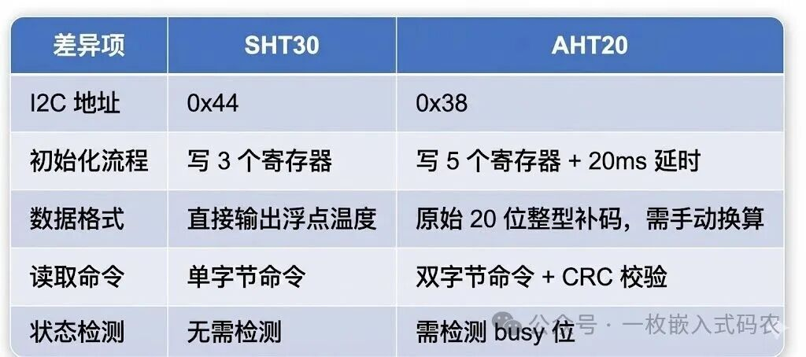
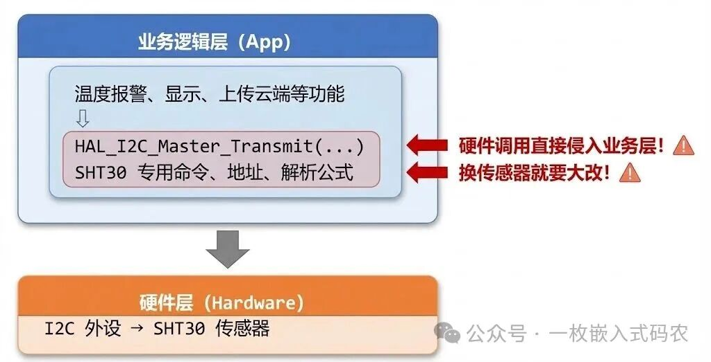
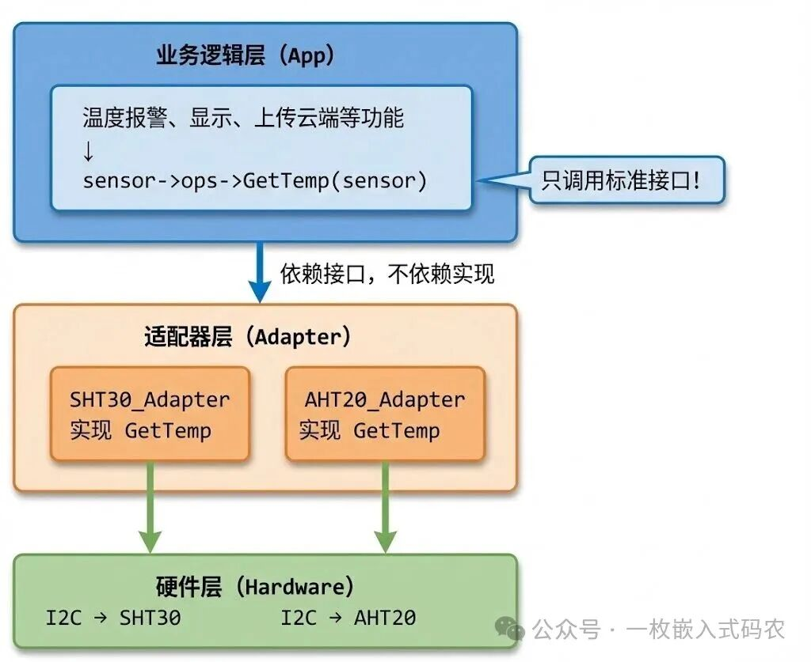
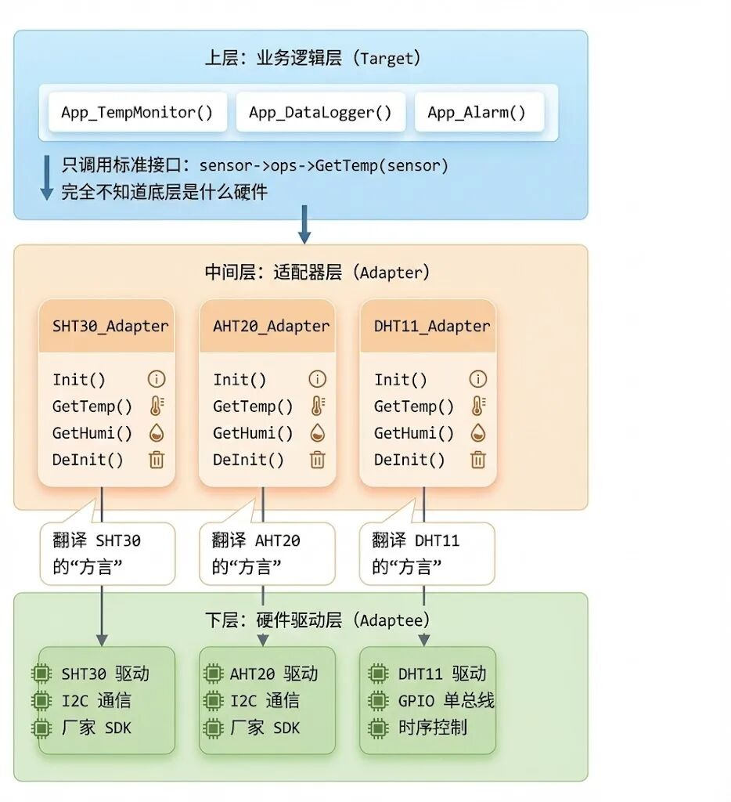
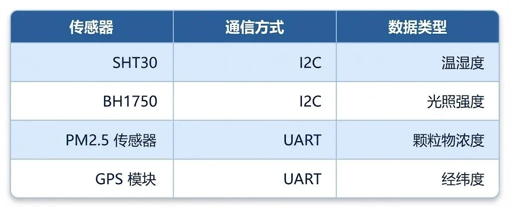
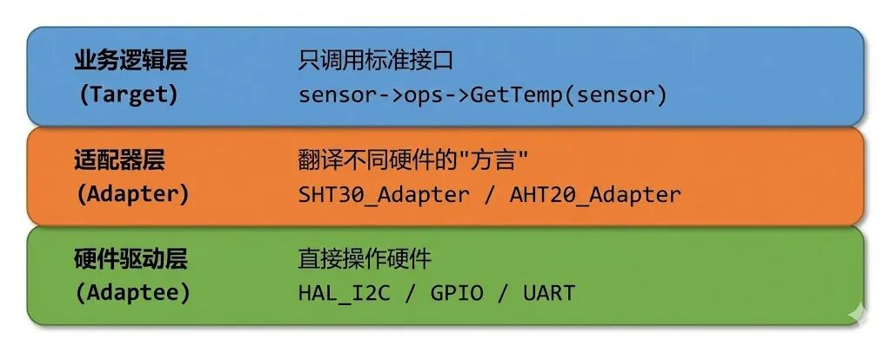

# 适配器模式：老板突然要换芯片？教你用 C 语言构建"防弹"级 HAL 层已付费

  

> **核心卖点**：解决"硬件依赖"，实现"一套业务代码，随意切换底层硬件"。

------

## <span style="color:#FF6600;">**写在前面</span>

嵌入式开发最让人头疼的事情是什么？

不是调 Bug，不是看示波器，也不是啃芯片手册——而是<span style="color:#FF6600;">****换硬件**</span>。

当你熬了三个月，终于把产品做稳定了，准备庆功的时候，采购突然跑过来说："那个传感器停产了，得换一个。"

或者老板拍脑袋决定："咱们换个芯片吧，成本能省两块钱。"

这时候你的内心是崩溃的。因为你知道，接下来等待你的，是无尽的代码修改、调试、联调......

今天，我要教你一招"防弹"级的架构设计——<span style="color:#FF6600;">****适配器模式（Adapter Pattern）**</span>。学会它，下次再遇到换硬件的需求，你可以微微一笑，改两行代码，下班回家。

------

## <span style="color:#FF6600;">**第一部分：免费试读区</span>

### 一、场景导入：猝不及防的"硬件变更"

#### <span style="color:#FF6600;">**1.1 一个真实的噩梦</span>

让我给你讲个故事，这是很多嵌入式工程师的真实经历：

<span style="color:#FF6600;">****背景**：某智能家居项目，开发周期 6 个月，核心功能是温湿度监测。团队选用了某厂的温湿度传感器 **SHT30**</span>，通信方式是 I2C。

<span style="color:#FF6600;">**转折点**：</span> **项目开发到第 5 个月，一切顺利，眼看就要量产了。这时候采购部门传来噩耗——**SHT30 全球缺货，交期 6 个月以上。

<span style="color:#FF6600;">**紧急替代方案**：</span>**采 购找到了另一款传感器 **AHT20**，价格更便宜，货源充足。老板一拍板："换！"

<span style="color:#FF6600;">**程序员的噩梦开始了**</span>：

表面上看，两颗传感器都是 I2C 接口，应该很容易换吧？

实际上呢？



看到这张表，你应该明白了：<span style="color:#FF6600;">****虽然都是 I2C，但底层实现完全不同**</span>。

#### <span style="color:#FF6600;">**1.2 "面向搜索引擎编程"的代价</span>

如果你之前的代码是这样写的（相信我，90% 的嵌入式工程师都这样写）：

```c
// app_task.c - 业务逻辑层
void App_TempMonitor_Task(void)
{
    uint8_t data[6];
    float temperature, humidity;

    // 直接调用 ST 的 HAL 库，死死绑定 SHT30
    HAL_I2C_Master_Transmit(&hi2c1, SHT30_ADDR << 1, cmd_measure, 2, 100);
    HAL_Delay(20);
    HAL_I2C_Master_Receive(&hi2c1, SHT30_ADDR << 1, data, 6, 100);

    // SHT30 特定的数据解析
    uint16_t raw_temp = (data[0] << 8) | data[1];
    temperature = -45.0f + 175.0f * (float)raw_temp / 65535.0f;

    uint16_t raw_humi = (data[3] << 8) | data[4];
    humidity = 100.0f * (float)raw_humi / 65535.0f;

    // 业务逻辑：温度报警
    if (temperature > 30.0f) {
        Alarm_Trigger();
    }

    // 业务逻辑：上传云端
    Cloud_Upload(temperature, humidity);

    // 业务逻辑：本地显示
    LCD_Display(temperature, humidity);
}
```

这段代码有什么问题？

<span style="color:#FF6600;">**问题一：硬件细节暴露在业务层**</span>

`SHT30_ADDR`、`HAL_I2C_Master_Transmit`、特定的数据解析公式——这些统统是硬件细节，却直接写在了业务逻辑里。

<span style="color:#FF6600;">**问题二：改一处需要改 N 处**</span>

假设你的项目里有 10 个地方读取温湿度（监控任务、报警任务、显示任务、存储任务......），那你就得改 10 处代码。而且每改一处，都有引入 Bug 的风险。

<span style="color:#FF6600;">**问题三：无法做单元测试**</span>

想测试报警逻辑是否正确？对不起，你得接上真实的传感器。想模拟一个 35 度的高温场景？只能拿热风枪吹。

#### 1.3 修改的代价

于是，你开始了痛苦的代码迁移：

1. **全局搜索**`SHT30` 关键字，找到 47 处引用
2. 每一处都要改成 AHT20 的逻辑
3. 改完之后，编译通过，一运行——数据全是 0
4. Debug 发现，有两处漏改了
5. 改完再测，数据有了，但经常读到 -40 度的异常值
6. 又是一通排查，发现是 CRC 校验没做
7. 加上 CRC 校验，数据正常了
8. 老板说：要不我们同时支持两种传感器？万一 AHT20 也缺货呢......
9. 你：？？？

**真实数据**：根据我的经验，一次"简单"的传感器更换，在强耦合代码架构下，平均需要 3-5 天的工作量，还不算引入新 Bug 的调试时间。

而如果你用了适配器模式，这个时间可以缩短到 **2 小时**——写一个新的适配器，改一行初始化代码，完事。

### 二、代码对比：从"直连"到"转接"

#### 2.1 什么是适配器？先看生活中的例子

在讲代码之前，我想先问你一个问题：

**你出国旅游的时候，最怕什么？**

语言不通？路不熟？都不是。最怕的是——**插座不一样**！

你带着国标两脚插头的充电器，到了英国发现是三孔方插，到了德国发现是两孔圆插。手机没电，相机没电，什么都干不了。

怎么办？买一个**转换插头**。

这个转换插头，就是现实世界中的**适配器**：

• **你的需求**（Target）：给手机充电，需要国标插头
• **现实情况**（Adaptee）：酒店只有英标插座
 • **解决方案**（Adapter）：转换插头，一头是国标，一头是英标

适配器不改变你的充电器，也不改变酒店的插座，它只是在中间做了一层**转换**。

**编程中的适配器模式，原理完全一样。**

#### 2.2 烂代码 vs 好代码

让我们用代码来对比"直连"和"转接"两种方式的差异。

**烂代码（强耦合 - Bad Smell）**：

```c
// ========== 业务层直接调用硬件 ==========
// 文件：app_task.c

void App_TempMonitor_Task(void)
{
    // 问题 1：业务代码和硬件细节混在一起
    uint8_t cmd[] = {0x2C, 0x06};  // SHT30 专用命令
    uint8_t data[6];

    // 问题 2：直接依赖 ST HAL 库和具体 I2C 句柄
    HAL_I2C_Master_Transmit(&hi2c1, 0x44 << 1, cmd, 2, 100);
    HAL_Delay(15);
    HAL_I2C_Master_Receive(&hi2c1, 0x44 << 1, data, 6, 100);

    // 问题 3：SHT30 专用的数据解析逻辑
    float temp = -45.0f + 175.0f * ((data[0] << 8) | data[1]) / 65535.0f;

    // 下面才是真正的业务逻辑
    if (temp > TEMP_THRESHOLD) {
        Alarm_Trigger();
    }
    Display_Update(temp);
}

// 如果要换成 AHT20，上面这段代码几乎要全部重写！
```

这段代码的问题用一张图就能说明：



**好代码（适配器模式 - Adapter Pattern）**：

```c
// ========== 业务层只依赖抽象接口 ==========
// 文件：app_task.c
void App_TempMonitor_Task(TempSensor_t *sensor)
{
    // 业务层不知道底下是什么传感器
    // 不知道是 I2C 还是 SPI
    // 不知道是 SHT30 还是 AHT20
    // 它只知道：调用 GetTemp() 就能拿到温度

    float temp = sensor->ops->GetTemp(sensor);

    // 下面是纯粹的业务逻辑，和硬件完全解耦
    if (temp > TEMP_THRESHOLD) {
        Alarm_Trigger();
    }
    Display_Update(temp);
}
// 换传感器？业务层代码一行都不用改！
```

用适配器模式后的架构：



**关键变化**：

1. **业务层**只依赖一个抽象的 `TempSensor_t` 接口
2. **适配器层**负责把不同传感器的"方言"翻译成统一的"普通话"
3. **换硬件时**，只需要新增一个适配器，业务层完全不用改

这就是适配器模式的核心价值：**隔离变化，保护稳定**。

#### 2.3 一个形象的比喻

如果你还是觉得抽象，我再打个比方：

想象你是一个**翻译官**，专门给领导当翻译。

• **领导**（业务层）：只说中文，只需要知道对方说了什么意思
• **外国人**（硬件层）：只说英语/日语/德语，各有各的语法和习惯
• **翻译官**（适配器）：听懂外国人说的话，翻译成标准的中文告诉领导

领导不需要学外语，外国人也不需要学中文。中间有翻译官，沟通就顺畅了。

如果换了一个德国合作伙伴（换传感器），领导不需要重新学德语，只需要换一个懂德语的翻译官就行。

**适配器模式，就是你代码里的"翻译官"。**

------

### 三、关键技术悬念

#### 3.1 概念容易，落地很难

读到这里，你可能觉得："哦，适配器模式，我懂了，不就是加一层中间层嘛。"

**但是**，当你真正动手写代码的时候，会发现好多问题：

**问题一：接口怎么定义？**

```c
typedef struct {
    int (*Init)(void *priv);
    float (*GetTemp)(void *priv);
} Sensor_Ops_t;
```

这个 `void *priv` 是什么鬼？为什么不直接传 `I2C_HandleTypeDef *hi2c`？

**问题二：不同传感器的参数不一样怎么办？**

• SHT30 需要 I2C 句柄 + I2C 地址
• DHT11 只需要一个 GPIO 引脚
 • DS18B20 需要 1-Wire 总线句柄

这三种传感器，初始化参数完全不同，怎么用同一个接口来兼容？

**问题三：如何在运行时动态切换？**

假设我的产品同时支持 SHT30 和 AHT20，出厂时根据焊接的是哪颗传感器来自动识别。代码怎么写？

**问题四：怎么做到"零拷贝"？**

适配器层势必要做数据转换，如何避免过多的内存拷贝，保证实时性？

#### 3.2 C 语言实现"多态"的黑魔法

这些问题的核心，其实是一个：

> **如何用 C 语言这种"面向过程"的语言，实现面向对象的"多态"？**

在 C++ 或 Java 里，这很简单——用虚函数、用接口、用抽象类。

但在 C 语言里，我们没有这些语法糖。我们只有**结构体**和**函数指针**。

好消息是，用好这两个工具，完全可以实现同样的效果。而且因为 C 语言更底层，代码执行效率反而更高。

接下来的内容，我会手把手教你：

1. **`void*` 私有指针的妙用**——如何用一个指针兼容所有类型的私有数据
2. **`container_of` 宏的原理**——Linux 内核都在用的"黑魔法"
3. **函数指针表的设计**——如何定义一套"接口规范"
4. **对象工厂模式**——如何优雅地创建和销毁适配器实例

------

### 【试读结束】

> **恭喜你**，读到这里，你已经理解了适配器模式的核心思想，也看到了它能解决什么问题。
>
> 但"知道"和"会做"之间，还有一段距离。
>
> 接下来的**付费内容**，是真正的 **"工程实战"**。我会带你从零开始，一步步写出一个**可直接移植到项目中的通用驱动架构**。

**付费内容包括：**

• **万能接口定义**：如何设计一个既通用又高效的 `Sensor_Ops_t` 结构体？
• **胶水代码实战**：怎么写"适配层"，把厂家杂乱的 SDK 塞进我们的标准接口里？
• **`void \*` 的妙用**：如何利用 `priv_data` 指针，解决不同外设参数各异的难题
• **依赖注入实战**：如何在 `main()` 中一行代码切换硬件
• **进阶场景**：同时支持 I2C 和 UART 的混合架构
• **避坑指南**：性能陷阱与过度设计的边界


## 第二部分：付费核心区


### 四、架构原理：三层汉堡包模型

在开始写代码之前，我们先从宏观上理解适配器模式的架构。我把它叫做**"三层汉堡包模型"**。

#### 4.1 三层架构图解



#### 4.2 每层的职责

**上层（Target）—— 业务逻辑层**

- • **职责**：实现产品功能（温度监控、数据记录、报警等）
- • **特点**：只依赖抽象接口，不依赖具体实现
- • **好处**：完全与硬件解耦，可以独立测试、独立开发

**中间层（Adapter）—— 适配器层（本篇主角）**

- • **职责**：把"方头"转成"圆头"，翻译不同硬件的"方言"
- • **特点**：每种硬件一个适配器，实现统一的接口规范
- • **好处**：隔离变化，新增硬件只需新增适配器

**下层（Adaptee）—— 硬件驱动层**

- • **职责**：直接操作硬件（寄存器读写、时序控制等）
- • **特点**：通常是厂家提供的 SDK 或自己写的底层驱动
- • **好处**：专注于硬件细节，不用考虑业务逻辑

#### 4.3 核心原则

> **业务层只依赖中间层（接口），完全切断与下层的联系。**

这条原则是适配器模式的精髓。用专业术语来说，叫做**"依赖倒置原则"（Dependency Inversion Principle）**：

- 高层模块不应该依赖低层模块，两者都应该依赖抽象
- 抽象不应该依赖细节，细节应该依赖抽象

翻译成人话就是：

**业务代码不要直接调用硬件驱动，而是通过一个"中间人"（接口）来间接调用。**

------

### 五、实战步骤一：定义"目标接口"（The Target）

现在我们开始写代码。第一步是定义**目标接口**——也就是业务层看到的那个"标准插头"。

#### 5.1 接口设计原则

在定义接口之前，我们要想清楚一个问题：

> **业务层需要什么？**

注意，是"业务层需要什么"，而不是"硬件能提供什么"。

以温湿度传感器为例，业务层需要的是：

1. 初始化传感器
2. 读取温度值
3. 读取湿度值
4. 关闭/休眠传感器

至于这个温度值是通过 I2C 读的还是 SPI 读的，是浮点数还是整型再换算的——**业务层不关心，也不应该关心**。

#### 5.2 核心代码：接口定义

```c
// ========================================
// 文件：sensor_interface.h
// 功能：定义传感器的统一接口
// ========================================

#ifndef __SENSOR_INTERFACE_H__
#define __SENSOR_INTERFACE_H__

#include <stdint.h>

// 前向声明
typedef struct TempSensor TempSensor_t;

// ========================================
// 操作函数指针表（这是适配器模式的核心！）
// ========================================
typedef struct {
    /**
     * @brief  初始化传感器
     * @param  self: 传感器对象指针
     * @return 0=成功, 负数=失败
     */
    int (*Init)(TempSensor_t *self);

    /**
     * @brief  读取温度
     * @param  self: 传感器对象指针
     * @return 温度值（摄氏度），失败返回 -999.0f
     */
    float (*GetTemp)(TempSensor_t *self);

    /**
     * @brief  读取湿度
     * @param  self: 传感器对象指针
     * @return 湿度值（%RH），失败返回 -999.0f
     */
    float (*GetHumi)(TempSensor_t *self);

    /**
     * @brief  反初始化/休眠传感器
     * @param  self: 传感器对象指针
     */
    void (*DeInit)(TempSensor_t *self);

} Sensor_Ops_t;

// ========================================
// 传感器对象结构体
// ========================================
struct TempSensor {
    const char      *name;      // 传感器名称（调试用）
    Sensor_Ops_t    *ops;       // 操作函数指针表
    void            *priv;      // 私有数据指针（关键！）
};

#endif /* __SENSOR_INTERFACE_H__ */
```

#### 5.3 代码解析

**要点一：函数指针表 `Sensor_Ops_t`**

这是一个结构体，里面全是函数指针。每个函数指针代表一种"能力"。

```c
typedef struct {
    int   (*Init)(TempSensor_t *self);
    float (*GetTemp)(TempSensor_t *self);
    float (*GetHumi)(TempSensor_t *self);
    void  (*DeInit)(TempSensor_t *self);
} Sensor_Ops_t;
```

这种设计在 C 语言里非常常见，Linux 内核里到处都是这种写法。比如文件系统的 `file_operations`、设备驱动的 `device_ops` 等等。

**要点二：传感器对象 `TempSensor_t`**

```c
struct TempSensor {
    const char   *name;   // 传感器名称
    Sensor_Ops_t *ops;    // 函数指针表
    void         *priv;   // 私有数据（核心！）
};
```

这个结构体代表一个"传感器实例"。业务层拿到这个指针后，就可以通过 `sensor->ops->GetTemp(sensor)` 来读取温度。

**要点三：`void *priv` 的妙用**

这是整个设计的**灵魂**。

不同传感器需要的私有数据完全不同：


如果我们把这些数据类型都写死在接口里，那接口就不通用了。

**解决方案**：用 `void *` 指针。

`void *` 是 C 语言的"万能指针"，可以指向任何类型的数据。在适配器内部，我们再把它强制转换回具体的类型。

```c
// SHT30 适配器内部
static float SHT30_GetTemp(TempSensor_t *self) {
    // 把 void* 转换回 SHT30 的私有数据类型
    SHT30_PrivData_t *priv = (SHT30_PrivData_t *)self->priv;

    // 现在可以使用 priv->hi2c、priv->addr 等
    HAL_I2C_Master_Transmit(priv->hi2c, priv->addr << 1, ...);
    ...
}
```

这样，接口定义是通用的，但每个适配器可以有自己独特的私有数据。

#### 5.4 接口设计的常见误区

**误区一：接口太具体**

```c
// 错误示例：接口暴露了 I2C 细节
typedef struct {
    int (*Init)(I2C_HandleTypeDef *hi2c, uint8_t addr);  // ← 不好！
    float (*GetTemp)(I2C_HandleTypeDef *hi2c);           // ← 不好！
} Sensor_Ops_t;
```

这样写的问题是：如果换成 GPIO 单总线的 DHT11，接口就不适用了。

**误区二：接口太抽象**

```c
// 错误示例：接口过于通用，失去了意义
typedef struct {
    int (*Read)(void *param1, void *param2, void *param3);  // ← 啥意思？
} Sensor_Ops_t;
```

这样写的问题是：接口没有任何语义，调用者不知道该传什么参数。

**正确做法：以业务需求为导向**

接口应该描述"业务层需要什么"，而不是"硬件能做什么"：

- `GetTemp()` —— 获取温度
- `GetHumi()` —— 获取湿度
- `Init()` —— 初始化
-  `DeInit()` —— 反初始化

至于底层怎么实现，那是适配器的事。

------

### 六、实战步骤二：实现"适配器"（The Adapter）

有了接口定义，接下来就是写**适配器**了。这是真正的"胶水代码"，负责把厂家杂乱的 SDK 塞进我们的标准接口里。

#### 6.1 SHT30 适配器完整实现

我们以 SHT30 温湿度传感器为例，完整展示适配器的写法。

**头文件：adapter_sht30.h**

```c
// ========================================
// 文件：adapter_sht30.h
// 功能：SHT30 传感器适配器
// ========================================

#ifndef __ADAPTER_SHT30_H__
#define __ADAPTER_SHT30_H__

#include "sensor_interface.h"
#include "stm32f1xx_hal.h"  // 根据你的 MCU 修改

/**
 * @brief  创建一个 SHT30 传感器实例
 * @param  hi2c: I2C 句柄指针
 * @param  addr: I2C 地址（7 位，通常是 0x44 或 0x45）
 * @return 传感器对象指针，失败返回 NULL
 */
TempSensor_t *Adapter_SHT30_Create(I2C_HandleTypeDef *hi2c, uint8_t addr);

/**
 * @brief  销毁 SHT30 传感器实例
 * @param  sensor: 传感器对象指针
 */
void Adapter_SHT30_Destroy(TempSensor_t *sensor);

#endif /* __ADAPTER_SHT30_H__ */
```

**源文件：adapter_sht30.c**

```c
// ========================================
// 文件：adapter_sht30.c
// 功能：SHT30 传感器适配器实现
// ========================================
#include "adapter_sht30.h"
#include <stdlib.h>
#include <string.h>
// ========================================
// 私有数据结构（每种传感器都不一样）
// ========================================
typedef struct {
    I2C_HandleTypeDef *hi2c;     // I2C 句柄
    uint8_t           addr;      // I2C 地址
    float             last_temp; // 缓存上次读取的温度
    float             last_humi; // 缓存上次读取的湿度
} SHT30_PrivData_t;
// ========================================
// 私有函数声明
// ========================================
static int   SHT30_Init(TempSensor_t *self);
static float SHT30_GetTemp(TempSensor_t *self);
static float SHT30_GetHumi(TempSensor_t *self);
static void  SHT30_DeInit(TempSensor_t *self);
static int   SHT30_ReadRaw(SHT30_PrivData_t *priv);
// ========================================
// 操作函数表（静态全局，所有 SHT30 实例共享）
// ========================================
static Sensor_Ops_t sht30_ops = {
    .Init    = SHT30_Init,
    .GetTemp = SHT30_GetTemp,
    .GetHumi = SHT30_GetHumi,
    .DeInit  = SHT30_DeInit,
};
// ========================================
// 公开函数：创建适配器实例
// ========================================
TempSensor_t *Adapter_SHT30_Create(I2C_HandleTypeDef *hi2c, uint8_t addr)
{
    // 1. 分配传感器对象内存
    TempSensor_t *sensor = (TempSensor_t *)malloc(sizeof(TempSensor_t));
    if (sensor == NULL) {
        return NULL;
    }

    // 2. 分配私有数据内存
    SHT30_PrivData_t *priv = (SHT30_PrivData_t *)malloc(sizeof(SHT30_PrivData_t));
    if (priv == NULL) {
        free(sensor);
        return NULL;
    }

    // 3. 初始化私有数据
    priv->hi2c      = hi2c;
    priv->addr      = addr;
    priv->last_temp = -999.0f;
    priv->last_humi = -999.0f;

    // 4. 组装传感器对象
    sensor->name = "SHT30";
    sensor->ops  = &sht30_ops;  // 指向函数指针表
    sensor->priv = priv;        // 指向私有数据

    return sensor;
}
// ========================================
// 公开函数：销毁适配器实例
// ========================================
void Adapter_SHT30_Destroy(TempSensor_t *sensor)
{
    if (sensor != NULL) {
        if (sensor->priv != NULL) {
            free(sensor->priv);
        }
        free(sensor);
    }
}
// ========================================
// 私有函数：初始化
// ========================================
static int SHT30_Init(TempSensor_t *self)
{
    SHT30_PrivData_t *priv = (SHT30_PrivData_t *)self->priv;

    // SHT30 软复位命令
    uint8_t cmd[] = {0x30, 0xA2};
    HAL_StatusTypeDef status = HAL_I2C_Master_Transmit(
        priv->hi2c,
        priv->addr << 1,
        cmd,
        sizeof(cmd),
        100
    );

    if (status != HAL_OK) {
        return -1;
    }

    HAL_Delay(10);  // 等待复位完成
    return 0;
}
// ========================================
// 私有函数：读取原始数据（内部使用）
// ========================================
static int SHT30_ReadRaw(SHT30_PrivData_t *priv)
{
    uint8_t cmd[] = {0x2C, 0x06};  // 高精度测量命令
    uint8_t data[6];

    // 发送测量命令
    if (HAL_I2C_Master_Transmit(priv->hi2c, priv->addr << 1, cmd, 2, 100) != HAL_OK) {
        return -1;
    }

    HAL_Delay(20);  // 等待测量完成

    // 读取数据
    if (HAL_I2C_Master_Receive(priv->hi2c, priv->addr << 1, data, 6, 100) != HAL_OK) {
        return -1;
    }

    // 解析温度（SHT30 特定的公式）
    uint16_t raw_temp = (data[0] << 8) | data[1];
    priv->last_temp = -45.0f + 175.0f * (float)raw_temp / 65535.0f;

    // 解析湿度
    uint16_t raw_humi = (data[3] << 8) | data[4];
    priv->last_humi = 100.0f * (float)raw_humi / 65535.0f;

    return 0;
}
// ========================================
// 私有函数：获取温度
// ========================================
static float SHT30_GetTemp(TempSensor_t *self)
{
    SHT30_PrivData_t *priv = (SHT30_PrivData_t *)self->priv;

    if (SHT30_ReadRaw(priv) != 0) {
        return -999.0f;  // 读取失败
    }

    return priv->last_temp;
}
// ========================================
// 私有函数：获取湿度
// ========================================
static float SHT30_GetHumi(TempSensor_t *self)
{
    SHT30_PrivData_t *priv = (SHT30_PrivData_t *)self->priv;

    // 复用上次读取的数据（因为 SHT30 是同时读温湿度的）
    return priv->last_humi;
}
// ========================================
// 私有函数：反初始化
// ========================================
static void SHT30_DeInit(TempSensor_t *self)
{
    // SHT30 没有特殊的休眠命令，这里留空
    (void)self;
}
```

#### 6.2 代码解析：适配器的核心技巧

**技巧一：私有数据结构**

每种传感器定义自己的私有数据结构：

```c
typedef struct {
    I2C_HandleTypeDef *hi2c;     // I2C 句柄
    uint8_t           addr;      // I2C 地址
    float             last_temp; // 缓存温度
    float             last_humi; // 缓存湿度
} SHT30_PrivData_t;
```

这个结构体只在 `.c` 文件内部使用，外部看不到。这就是**封装**。

**技巧二：静态函数指针表**

```c
static Sensor_Ops_t sht30_ops = {
    .Init    = SHT30_Init,
    .GetTemp = SHT30_GetTemp,
    .GetHumi = SHT30_GetHumi,
    .DeInit  = SHT30_DeInit,
};
```

函数指针表声明为 `static`，所有 SHT30 实例共享同一张表。这样节省内存。

**技巧三：工厂函数**

```c
TempSensor_t *Adapter_SHT30_Create(I2C_HandleTypeDef *hi2c, uint8_t addr);
```

用"工厂函数"来创建对象，而不是让调用者手动初始化结构体。这样可以：

1. 1. 隐藏内部实现细节
2. 2. 统一管理内存分配
3. 3. 方便后续扩展

**技巧四：`void *` 到具体类型的转换**

```c
static float SHT30_GetTemp(TempSensor_t *self)
{
    // 关键：把 void* 转换回具体类型
    SHT30_PrivData_t *priv = (SHT30_PrivData_t *)self->priv;

    // 现在可以正常使用 priv 了
    ...
}
```

这种转换是类型安全的，因为我们在 `Create` 函数里已经确保 `priv` 指向的是正确的类型。

#### 6.3 再写一个 AHT20 适配器

有了 SHT30 的模板，写 AHT20 适配器就很快了。主要是换一下私有数据和底层操作：

```c
// ========================================
// AHT20 私有数据（和 SHT30 不一样）
// ========================================
typedef struct {
    I2C_HandleTypeDef *hi2c;
    uint8_t           addr;       // AHT20 固定是 0x38
    uint8_t           calibrated; // 校准标志
    float             last_temp;
    float             last_humi;
} AHT20_PrivData_t;

// ========================================
// AHT20 初始化（和 SHT30 完全不同）
// ========================================
static int AHT20_Init(TempSensor_t *self)
{
    AHT20_PrivData_t *priv = (AHT20_PrivData_t *)self->priv;

    // AHT20 上电需要等待 40ms
    HAL_Delay(40);

    // 读取状态寄存器，检查校准位
    uint8_t status;
    HAL_I2C_Master_Receive(priv->hi2c, priv->addr << 1, &status, 1, 100);

    // 如果未校准，发送校准命令
    if ((status & 0x08) == 0) {
        uint8_t cmd[] = {0xBE, 0x08, 0x00};
        HAL_I2C_Master_Transmit(priv->hi2c, priv->addr << 1, cmd, 3, 100);
        HAL_Delay(10);
    }

    priv->calibrated = 1;
    return 0;
}

// ========================================
// AHT20 数据读取（和 SHT30 的公式不同）
// ========================================
static int AHT20_ReadRaw(AHT20_PrivData_t *priv)
{
    // AHT20 触发测量命令
    uint8_t cmd[] = {0xAC, 0x33, 0x00};
    HAL_I2C_Master_Transmit(priv->hi2c, priv->addr << 1, cmd, 3, 100);

    HAL_Delay(80);  // AHT20 测量需要 80ms

    // 读取 7 字节数据
    uint8_t data[7];
    HAL_I2C_Master_Receive(priv->hi2c, priv->addr << 1, data, 7, 100);

    // 检查忙标志
    if (data[0] & 0x80) {
        return -1;  // 设备忙
    }

    // AHT20 的数据解析公式（和 SHT30 完全不同！）
    uint32_t raw_humi = ((uint32_t)data[1] << 12) |
                        ((uint32_t)data[2] << 4) |
                        ((uint32_t)data[3] >> 4);
    priv->last_humi = (float)raw_humi * 100.0f / 1048576.0f;

    uint32_t raw_temp = ((uint32_t)(data[3] & 0x0F) << 16) |
                        ((uint32_t)data[4] << 8) |
                        (uint32_t)data[5];
    priv->last_temp = (float)raw_temp * 200.0f / 1048576.0f - 50.0f;

    return 0;
}
```

你看，虽然 SHT30 和 AHT20 的底层实现完全不同，但它们对外暴露的接口是一样的。

**业务层调用方式完全相同**：

```c
// 无论是 SHT30 还是 AHT20，业务层代码都是这样写
float temp = sensor->ops->GetTemp(sensor);
float humi = sensor->ops->GetHumi(sensor);
```

这就是适配器模式的魅力！

------

### 七、实战步骤三：注册与注入（Dependency Injection）

有了接口和适配器，最后一步是把它们"连起来"。这一步通常在 `main()` 函数里完成。

#### 7.1 最简单的使用方式

```c
// ========================================
// 文件：main.c
// ========================================

#include "sensor_interface.h"
#include "adapter_sht30.h"
#include "adapter_aht20.h"

// I2C 句柄（由 CubeMX 生成）
extern I2C_HandleTypeDef hi2c1;

// 全局传感器对象指针
TempSensor_t *g_sensor = NULL;

int main(void)
{
    // HAL 初始化...
    HAL_Init();
    SystemClock_Config();
    MX_I2C1_Init();

    // ========================================
    // 关键：在这里选择使用哪个传感器！
    // ========================================

    // 方案 A：使用 SHT30
    g_sensor = Adapter_SHT30_Create(&hi2c1, 0x44);

    // 方案 B：使用 AHT20（只需改这一行！）
    // g_sensor = Adapter_AHT20_Create(&hi2c1, 0x38);

    if (g_sensor == NULL) {
        Error_Handler();  // 创建失败
    }

    // 初始化传感器
    if (g_sensor->ops->Init(g_sensor) != 0) {
        Error_Handler();  // 初始化失败
    }

    // 进入主循环
    while (1) {
        App_Run(g_sensor);
        HAL_Delay(1000);
    }
}

// ========================================
// 业务逻辑（完全不知道底层是什么传感器）
// ========================================
void App_Run(TempSensor_t *sensor)
{
    float temp = sensor->ops->GetTemp(sensor);
    float humi = sensor->ops->GetHumi(sensor);

    printf("[%s] Temp: %.1f C, Humi: %.1f %%\r\n",
           sensor->name, temp, humi);

    // 业务逻辑：温度报警
    if (temp > 30.0f) {
        LED_On(LED_ALARM);
    } else {
        LED_Off(LED_ALARM);
    }
}
```

看到没？**换传感器只需要改一行代码**：

```c
// SHT30:
g_sensor = Adapter_SHT30_Create(&hi2c1, 0x44);

// 换成 AHT20:
g_sensor = Adapter_AHT20_Create(&hi2c1, 0x38);
```

`App_Run()` 里面的几百行业务代码，**一个字都不用改**！

#### 7.2 进阶：运行时自动检测

如果你的产品需要同时支持多种传感器（比如出厂时根据 BOM 不同，可能焊接不同的传感器），可以实现运行时自动检测：

```c
// ========================================
// 自动检测并创建传感器对象
// ========================================
TempSensor_t *Sensor_AutoDetect(I2C_HandleTypeDef *hi2c)
{
    TempSensor_t *sensor = NULL;

    // 1. 尝试检测 SHT30（地址 0x44）
    if (I2C_IsDeviceReady(hi2c, 0x44) == HAL_OK) {
        sensor = Adapter_SHT30_Create(hi2c, 0x44);
        printf("Detected: SHT30\r\n");
    }
    // 2. 尝试检测 AHT20（地址 0x38）
    else if (I2C_IsDeviceReady(hi2c, 0x38) == HAL_OK) {
        sensor = Adapter_AHT20_Create(hi2c, 0x38);
        printf("Detected: AHT20\r\n");
    }
    // 3. 都没检测到
    else {
        printf("No sensor detected!\r\n");
        sensor = NULL;
    }

    return sensor;
}

// main.c 中使用
int main(void)
{
    // 初始化...

    // 自动检测传感器
    g_sensor = Sensor_AutoDetect(&hi2c1);

    if (g_sensor == NULL) {
        Error_Handler();
    }

    // 后续代码完全一样...
}
```

这样做的好处是：

1.**生产灵活性**：同一套代码可以兼容多种 BOM 配置
2.**维护简单**：新增传感器支持只需要加一个适配器 + 加一行检测代码
3.**调试方便**：通过 `sensor->name` 就能知道当前用的是哪个传感器

#### 7.3 依赖注入的本质

上面这种写法，在软件工程里叫做**"依赖注入"（Dependency Injection）**。

传统的写法（硬编码）：

```c
// App 内部直接创建依赖
void App_Run(void) {
    SHT30_Read();  // 写死了，改不了
}
```

依赖注入的写法：

```c
// 依赖从外部"注入"进来
void App_Run(TempSensor_t *sensor) {
    sensor->ops->GetTemp(sensor);  // 不管是什么，用就行
}

// main() 里决定注入什么
g_sensor = Adapter_SHT30_Create(...);  // 这里决定
App_Run(g_sensor);                      // 这里注入
```

**依赖注入的好处**：

1. 1. **解耦**：`App_Run` 不依赖任何具体传感器
2. 2. **可测试**：可以注入一个"假"的传感器来做单元测试
3. 3. **可扩展**：新增传感器不用改业务代码

#### 7.4 单元测试：注入模拟传感器

有了依赖注入，单元测试变得非常简单。我们可以创建一个"假"的传感器，用来模拟各种场景：

```c
// ========================================
// 模拟传感器（用于单元测试）
// ========================================
typedef struct {
    float mock_temp;  // 模拟的温度值
    float mock_humi;  // 模拟的湿度值
} MockSensor_PrivData_t;

static float Mock_GetTemp(TempSensor_t *self) {
    MockSensor_PrivData_t *priv = (MockSensor_PrivData_t *)self->priv;
    return priv->mock_temp;  // 直接返回模拟值
}

static float Mock_GetHumi(TempSensor_t *self) {
    MockSensor_PrivData_t *priv = (MockSensor_PrivData_t *)self->priv;
    return priv->mock_humi;
}

// 创建模拟传感器
TempSensor_t *MockSensor_Create(float temp, float humi) {
    // ... 分配内存，设置 mock_temp 和 mock_humi
}

// ========================================
// 单元测试示例
// ========================================
void Test_AlarmTrigger(void)
{
    // 1. 创建模拟传感器，设置温度为 35 度
    TempSensor_t *mock = MockSensor_Create(35.0f, 60.0f);

    // 2. 运行业务逻辑
    App_Run(mock);

    // 3. 检查报警是否触发
    assert(LED_IsOn(LED_ALARM) == true);

    // 4. 销毁模拟传感器
    MockSensor_Destroy(mock);
}

void Test_NoAlarm(void)
{
    // 1. 创建模拟传感器，设置温度为 25 度
    TempSensor_t *mock = MockSensor_Create(25.0f, 60.0f);

    // 2. 运行业务逻辑
    App_Run(mock);

    // 3. 检查报警是否未触发
    assert(LED_IsOn(LED_ALARM) == false);

    // 4. 销毁模拟传感器
    MockSensor_Destroy(mock);
}
```

你看，有了模拟传感器：

- • **不需要真实硬件**就能测试业务逻辑
- • **可以模拟极端情况**（-40 度、100 度等）
- • **测试可重复**，不受环境温度影响

------

### 八、进阶场景：既有 I2C 又有 UART 怎么办？

你可能会问：如果我的项目里，有些传感器是 I2C 的，有些是通过 UART 传输数据的（比如激光测距模块），适配器模式还能用吗？

**答案是：当然可以！这正是适配器模式的威力所在。**

#### 8.1 场景描述

假设你有一个环境监测系统，需要采集以下数据：



这些传感器通信方式不同，数据类型也不同。如何统一管理？

#### 8.2 设计思路：多种接口类型

我们可以定义多种"接口类型"，每种接口对应一类传感器：

```c
// ========================================
// 温湿度传感器接口（之前已经定义）
// ========================================
typedef struct {
    int   (*Init)(void *self);
    float (*GetTemp)(void *self);
    float (*GetHumi)(void *self);
    void  (*DeInit)(void *self);
} TempSensor_Ops_t;

// ========================================
// 光照传感器接口
// ========================================
typedef struct {
    int   (*Init)(void *self);
    float (*GetLux)(void *self);  // 获取光照强度（勒克斯）
    void  (*DeInit)(void *self);
} LightSensor_Ops_t;

// ========================================
// PM2.5 传感器接口
// ========================================
typedef struct {
    int   (*Init)(void *self);
    int   (*GetPM25)(void *self);   // 获取 PM2.5 浓度（ug/m³）
    int   (*GetPM10)(void *self);   // 获取 PM10 浓度
    void  (*DeInit)(void *self);
} PMSensor_Ops_t;

// ========================================
// GPS 接口
// ========================================
typedef struct {
    int   (*Init)(void *self);
    int   (*GetPosition)(void *self, double *lat, double *lon);
    void  (*DeInit)(void *self);
} GPS_Ops_t;
```

#### 8.3 UART 传感器的适配器示例

以 PM2.5 传感器（通过 UART 通信）为例：

```c
// ========================================
// PM2.5 传感器适配器（UART 通信）
// ========================================

typedef struct {
    UART_HandleTypeDef *huart;     // UART 句柄
    uint8_t            rx_buffer[32]; // 接收缓冲区
    int                pm25_value;
    int                pm10_value;
} PMS_PrivData_t;

static int PMS_Init(void *self)
{
    PMSensor_t *sensor = (PMSensor_t *)self;
    PMS_PrivData_t *priv = (PMS_PrivData_t *)sensor->priv;

    // 开启 UART 接收中断
    HAL_UART_Receive_IT(priv->huart, priv->rx_buffer, 32);

    return 0;
}

static int PMS_GetPM25(void *self)
{
    PMSensor_t *sensor = (PMSensor_t *)self;
    PMS_PrivData_t *priv = (PMS_PrivData_t *)sensor->priv;

    // 解析 UART 接收到的数据帧（PMS 传感器专用协议）
    if (priv->rx_buffer[0] == 0x42 && priv->rx_buffer[1] == 0x4D) {
        // 校验通过，提取 PM2.5 数据
        priv->pm25_value = (priv->rx_buffer[6] << 8) | priv->rx_buffer[7];
    }

    return priv->pm25_value;
}

// 创建函数
PMSensor_t *Adapter_PMS5003_Create(UART_HandleTypeDef *huart)
{
    // ... 分配内存，初始化私有数据
}
```

#### 8.4 业务层的统一使用

```c
// ========================================
// 业务层：环境数据采集
// ========================================

void App_CollectEnvironmentData(
    TempSensor_t  *temp_sensor,
    LightSensor_t *light_sensor,
    PMSensor_t    *pm_sensor,
    GPS_t         *gps
)
{
    // 读取各种数据（业务层完全不知道底层通信方式）
    float temp = temp_sensor->ops->GetTemp(temp_sensor);
    float humi = temp_sensor->ops->GetHumi(temp_sensor);
    float lux  = light_sensor->ops->GetLux(light_sensor);
    int   pm25 = pm_sensor->ops->GetPM25(pm_sensor);

    double lat, lon;
    gps->ops->GetPosition(gps, &lat, &lon);

    // 打包上传
    Upload_Data(temp, humi, lux, pm25, lat, lon);
}

// main.c
int main(void)
{
    // 创建各种传感器（不同的通信方式，统一的使用方式）
    TempSensor_t  *temp  = Adapter_SHT30_Create(&hi2c1, 0x44);    // I2C
    LightSensor_t *light = Adapter_BH1750_Create(&hi2c1, 0x23);   // I2C
    PMSensor_t    *pm    = Adapter_PMS5003_Create(&huart2);       // UART
    GPS_t         *gps   = Adapter_ATGM336H_Create(&huart3);      // UART

    // 业务层统一调用
    App_CollectEnvironmentData(temp, light, pm, gps);
}
```

**关键点**：

- • 业务层 `App_CollectEnvironmentData` 完全不知道 I2C 和 UART 的存在
- • 想把 SHT30（I2C）换成 DHT11（GPIO）？只改 `main.c` 里的一行
- • 想把 UART GPS 换成 SPI GPS？只改 `main.c` 里的一行

这就是适配器模式的威力：**业务层只关心"做什么"，不关心"怎么做"**。

------

### 九、避坑指南

在实际使用适配器模式时，有几个坑需要注意：

#### 9.1 性能陷阱

**问题**：函数指针调用比直接函数调用多几条汇编指令。

```c
// 直接调用（编译器可能内联优化）
float temp = SHT30_GetTemp();

// 函数指针调用（无法内联，多一次间接寻址）
float temp = sensor->ops->GetTemp(sensor);
```

**影响**：对于绝大多数应用，这点开销可以忽略不计（纳秒级别）。

**但是**，如果你在做以下场景，要慎用适配器模式：

- • **高频 GPIO 翻转**（1MHz 以上的 PWM 模拟、软件 SPI 等）
- • **实时性要求极高的中断服务程序**
- • **循环次数极大的算法**（图像处理、FFT 等）

**建议**：

```c
// 对于高频操作，用宏或内联函数
#define GPIO_TOGGLE_FAST(port, pin) ((port)->BSRR = (pin))

// 对于低频操作（传感器读取、通信等），放心用适配器模式
float temp = sensor->ops->GetTemp(sensor);
```

#### 9.2 内存陷阱

**问题**：每个适配器实例都要分配内存。

```c
TempSensor_t *sensor = Adapter_SHT30_Create(&hi2c1, 0x44);
// 这里面 malloc 了两次：一次 TempSensor_t，一次 SHT30_PrivData_t
```

**影响**：

- • 在内存充裕的 MCU（STM32F4、ESP32 等）上，问题不大
- • 在内存紧张的 MCU（STM32F0、51 单片机等）上，要小心

**解决方案：静态分配**

```c
// 不用 malloc，用静态变量
static TempSensor_t g_sensor_obj;
static SHT30_PrivData_t g_sht30_priv;

TempSensor_t *Adapter_SHT30_CreateStatic(I2C_HandleTypeDef *hi2c, uint8_t addr)
{
    g_sht30_priv.hi2c = hi2c;
    g_sht30_priv.addr = addr;

    g_sensor_obj.name = "SHT30";
    g_sensor_obj.ops  = &sht30_ops;
    g_sensor_obj.priv = &g_sht30_priv;

    return &g_sensor_obj;
}
```

**代价**：静态分配后，只能创建一个实例。如果需要多个 SHT30（比如板子上焊了两颗），还是得用动态分配或者数组。

#### 9.3 过度设计陷阱

**问题**：适配器模式不是万能药，不要为了设计模式而设计模式。

**什么时候不需要适配器？**

1. **项目一次性**：只做一次，交付后再也不改，直接怼就行
2. **硬件不可能变**：已经量产 10 万台了，芯片不可能换了
3. **代码量很小**：整个项目就 500 行代码，抽象层比业务层还多
4. **时间紧迫**：老板说明天就要演示，你还在那设计架构？

**什么时候需要适配器？**

1. **长期维护的产品**：要持续迭代好几年
2. **平台化项目**：同一套代码要跑在多种硬件上
3. **团队协作**：多人开发，需要清晰的模块边界
4. **需要单元测试**：想在没有硬件的情况下测试业务逻辑

**我的建议**：

> 如果你不确定要不要用适配器模式，先不用。等哪天你被硬件变更折磨得死去活来的时候，自然就会想起它。

#### 9.4 调试陷阱

**问题**：函数指针调用增加了调试难度。

当你在调试器里单步调试时，看到：

```c
float temp = sensor->ops->GetTemp(sensor);
```
你不能直接看出 `GetTemp` 指向的是哪个函数。得在运行时查看 `sensor->ops->GetTemp` 的值。

**解决方案**：

1. **加日志**：在每个适配器函数入口打印日志
2. **用 name 字段**：`sensor->name` 可以告诉你当前用的是哪个适配器
3. **IDE 支持**：现代 IDE（如 CLion、VS Code）可以在调试时显示函数指针指向的函数名

------

## 第三部分：总结与互动

### 十、总结

恭喜你读到这里！让我们回顾一下本文的核心内容：

#### 10.1 适配器模式解决了什么问题？

**核心痛点**：硬件变更导致代码大面积修改

**解决方案**：在业务层和硬件层之间插入一个"适配器层"

**核心价值**：

- • 业务代码与硬件解耦
- • 换硬件只需改一行代码
- • 支持运行时动态切换
- • 便于单元测试

#### 10.2 三层架构速记



#### 10.3 关键代码速记

**接口定义**：

```c
typedef struct {
    int   (*Init)(TempSensor_t *self);
    float (*GetTemp)(TempSensor_t *self);
    float (*GetHumi)(TempSensor_t *self);
    void  (*DeInit)(TempSensor_t *self);
} Sensor_Ops_t;

struct TempSensor {
    const char   *name;
    Sensor_Ops_t *ops;
    void         *priv;  // 万能私有数据指针
};
```

**使用方式**：

```c
// 创建
TempSensor_t *sensor = Adapter_SHT30_Create(&hi2c1, 0x44);

// 使用（业务层）
float temp = sensor->ops->GetTemp(sensor);

// 换硬件？改这一行就行
TempSensor_t *sensor = Adapter_AHT20_Create(&hi2c1, 0x38);
```

#### 10.4 一句话总结

> **适配器模式是嵌入式软件"抗通胀（抗需求变更）"的最佳武器。它多写了一层代码，却节省了未来无数倍的维护时间。**

------

### 十一、思考题

学完本文，不妨思考以下问题：

1.**你的项目中，有哪些地方可以用适配器模式重构？**
• 是不是有一堆 `#ifdef STM32F1` / `#elif STM32F4` 的条件编译？
• 是不是换个传感器就要改好几个文件？

2.**适配器模式和策略模式有什么区别？**
• 提示：适配器模式解决的是"接口不兼容"问题，策略模式解决的是"算法可替换"问题。

3.**如果要支持"热插拔"（运行时更换传感器），代码该怎么改？**
• 提示：需要考虑线程安全、资源释放等问题。

欢迎在评论区留言讨论！

------

### 写在最后

适配器模式是我在嵌入式开发中最常用的设计模式之一。它的核心思想很简单：

> **在变化和稳定之间，插入一层抽象。**

这层抽象就像一道防火墙，把硬件的变化隔离在外，保护业务代码的稳定。

当然，任何设计模式都不是银弹。适配器模式有它的适用场景，也有它的局限性。关键是理解它的本质，在合适的时候使用它。

如果这篇文章对你有帮助，欢迎**点赞、在看、转发**三连！你的支持是我持续输出的动力。

有任何问题，欢迎在评论区留言，我会一一回复。


